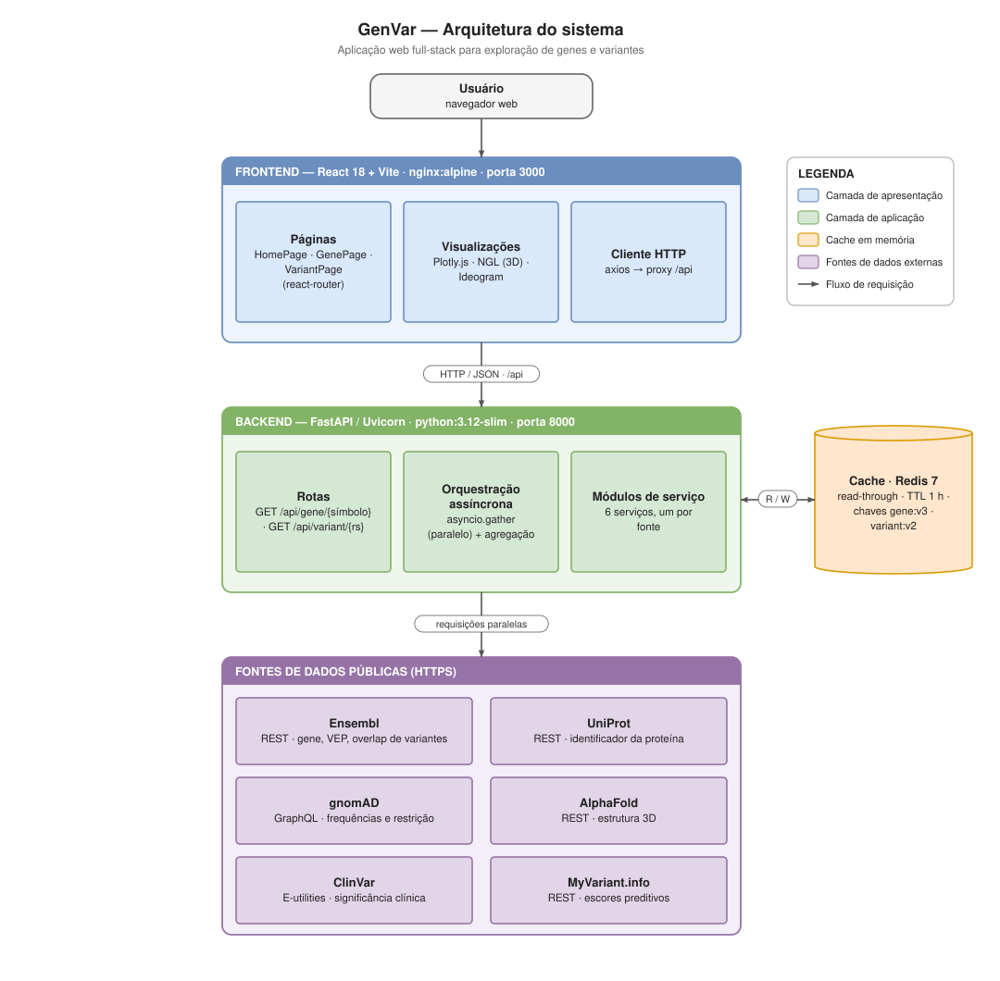
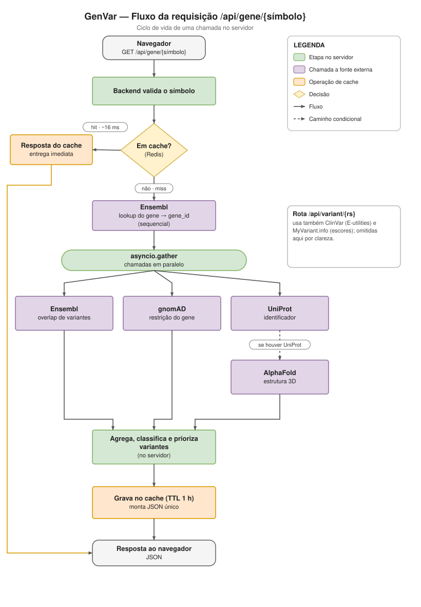

# GenVar Dashboard

| Campo | Informação |
|---|---|
| **Instituição** | Escola Superior de Agricultura Luiz de Queiroz (ESALQ), Universidade de São Paulo (USP) |
| **Curso** | MBA em Engenharia de Software |
| **Modalidade** | Trabalho de Conclusão de Curso (TCC) |
| **Autor** | Madson A. de Luna Aragão |
| **Repositório** | https://github.com/madsondeluna/genvar |
| **Aplicação ao vivo** | https://genvar.onrender.com |
| **API em produção** | https://genvar-backend.onrender.com |
| **Documentação da API** | https://genvar-backend.onrender.com/docs |
| **Versão** | 2.0.0 |
| **Idioma da interface** | Português do Brasil (PT-BR) |


## Descrição do projeto

GenVar Dashboard é uma aplicação web full-stack para exploração interativa de genes e variantes genéticas humanas. A plataforma integra cinco bases públicas primárias (Ensembl, gnomAD, ClinVar, AlphaFold e UniProt) e um agregador de escores preditivos (MyVariant.info, sobre o dbNSFP) em uma interface unificada em português do Brasil, eliminando a necessidade de consultar múltiplos portais separados para obter uma visão consolidada de uma variante ou gene de interesse.

O sistema é voltado para pesquisadores, clínicos e estudantes das áreas de bioinformática, genética médica e medicina de precisão, permitindo a exploração de anotações funcionais, frequências populacionais, significado clínico, escores de patogenicidade, conservação evolutiva, predição de splicing e estrutura proteica de forma integrada e visualmente acessível.


## Motivação e justificativa

A interpretação de variantes genéticas é um dos desafios centrais da genômica moderna. Ferramentas como gnomAD, ClinVar, Ensembl e dbNSFP são amplamente utilizadas na comunidade científica, mas cada uma oferece apenas uma perspectiva parcial. A ausência de uma interface que consolide essas fontes em um fluxo de consulta único representa um gargalo operacional em pesquisa e em contextos de diagnóstico genômico.

Este projeto aplica práticas de engenharia de software (arquitetura em camadas, APIs REST e GraphQL, testes automatizados, containerização e design de interfaces) ao domínio da bioinformática, demonstrando como técnicas de desenvolvimento moderno podem acelerar fluxos de trabalho científicos.


## Funcionalidades

### Busca por gene (símbolo HGNC)

O símbolo HGNC (HUGO Gene Nomenclature Committee) é o nome oficial do gene, como BRCA1 ou TP53. A consulta devolve, em uma única página:

- Informações básicas: ID Ensembl, cromossomo, locus genômico, fita, biotipo, montagem.
- Métricas de restrição evolutiva, que indicam o quanto o gene tolera mutações que o inativam: pLI (probabilidade de intolerância à perda de função, de 0 a 1), LOEUF (`oe_lof_upper`, limite superior da razão observado/esperado de perda de função; quanto menor, mais restrito o gene), o/e LoF e o/e Missense (razões observado/esperado para variantes de perda de função e de troca de aminoácido) e Z-score de LoF. Perda de função (LoF, loss-of-function) é a mutação que desativa o gene.
- Resumo de variantes em cinco categorias: total, patogênicas, VUS (Variant of Uncertain Significance, significado clínico incerto), benignas e sem classificação (campo `other`).
- Ideograma cromossômico interativo (ideogram.js) com bandeamento G. O locus do gene aparece destacado por halo amarelo e um triângulo marcador, com as variantes classificadas coloridas por significado clínico.
- Distribuição de variantes ao longo do gene em barras empilhadas com bins de 1 kb, incluindo variantes sem curadoria no ClinVar em cinza.
- Estrutura proteica predita pelo AlphaFold: imagem PAE (Predicted Aligned Error, confiança nas posições relativas entre partes da proteína), visualizador 3D interativo (NGL) colorido por confiança pLDDT (predicted Local Distance Difference Test, confiança por resíduo; quanto maior, melhor) e opção de baixar a estrutura em formato PDB (Protein Data Bank).
- Tabelas de variantes com ordenação, paginação, filtro por rs ID ou consequência e exportação em CSV.
- Links externos: NCBI Gene, gnomAD, UniProt, AlphaFold.
- Compartilhamento de URL com botão de copiar link.

### Busca por variante (rs ID do dbSNP)

O rs ID (Reference SNP cluster ID) é o identificador da variante no dbSNP, o banco de variantes do NCBI, como rs429358. A consulta reúne:

- Anotação funcional completa via Variant Effect Predictor (VEP) do Ensembl, com SIFT e PolyPhen-2.
- Agregado de predições via MyVariant.info / dbNSFP (database for Nonsynonymous SNPs' Functional Predictions, base que reúne dezenas de escores de predição de efeito), organizado em quatro grupos:
  - **Patogenicidade** (escores que estimam se a variante é danosa): CADD Phred (acima de cerca de 20 sugere efeito deletério) e rankscore, REVEL, AlphaMissense, MetaLR, MetaSVM, PrimateAI, FATHMM, MutPred, DANN.
  - **Conservação evolutiva**: PhyloP (100 vertebrados), PhastCons (100 vertebrados), GERP++ RS.
  - **Splicing**: SpliceAI (delta score máximo), dbscSNV ADA, dbscSNV RF.
  - **Domínios proteicos InterPro** (banco de domínios e famílias de proteínas) e referências cruzadas: ID ClinVar, IDs COSMIC (catálogo de mutações somáticas em câncer), AF (frequência alélica) no 1000 Genomes e no ExAC (Exome Aggregation Consortium, predecessor do gnomAD).
- Frequências alélicas populacionais do gnomAD (genoma, 9 populações principais).
- Mapa geográfico interativo com distribuição global das frequências.
- Gráfico de barras de frequências por população em escala logarítmica.
- Classificação clínica do ClinVar: significado, status de revisão, data, condições associadas.
- Gráfico radar com veredito agregado (SIFT, PolyPhen-2, CADD, REVEL normalizados de 0 a 1).
- Ideograma cromossômico com a posição da variante destacada.
- Histórico de buscas recentes armazenado em `localStorage`, com prefetch ao passar o mouse sobre exemplos da página inicial.


## Bancos de dados e APIs integrados

O sistema consome cinco bases públicas primárias (Ensembl, gnomAD, ClinVar, AlphaFold e UniProt), descritas nas subseções 1 a 5, e um agregador de escores preditivos, o MyVariant.info, que reúne o dbNSFP e outras fontes. A página de gene usa quatro bases (Ensembl, gnomAD, UniProt e AlphaFold); a de variante usa três (Ensembl, gnomAD e ClinVar) somadas ao MyVariant.info. No gene, a significância clínica do ClinVar chega pela resposta do Ensembl, sem chamada direta.

### 1. Ensembl REST API

- **Instituição**: European Bioinformatics Institute (EMBL-EBI) e Wellcome Sanger Institute.
- **URL**: https://rest.ensembl.org
- **Tipo**: REST (JSON).
- **Autenticação**: pública, sem chave.
- **Rate limit**: 15 requisições por segundo.

Endpoints utilizados:

| Endpoint | Descrição |
|----------|-----------|
| `GET /lookup/symbol/homo_sapiens/{symbol}` | Metadados do gene: ID Ensembl, cromossomo, locus, fita, biotipo, assembly. |
| `GET /overlap/id/{gene_id}?feature=variation` | Lista de variantes sobrepostas ao gene, com consequência e significado clínico bruto. |
| `GET /vep/human/id/{rsid}` | Variant Effect Predictor: anotação funcional completa, SIFT, PolyPhen, consequência molecular, troca de aminoácido. |

### 2. gnomAD GraphQL API

- **Instituição**: Broad Institute of MIT and Harvard.
- **URL**: https://gnomad.broadinstitute.org/api
- **Tipo**: GraphQL (linguagem de consulta de APIs em que o cliente especifica os campos que quer, alternativa ao REST).
- **Autenticação**: pública.
- **Dataset**: gnomAD r4 (genoma).

Queries utilizadas:

| Query | Descrição |
|-------|-----------|
| `variant(variantId, dataset)` | Frequências alélicas por população (AC, AN, AF calculado como AC/AN). |
| `gene(gene_symbol, reference_genome)` | Métricas de restrição evolutiva do gene. |

Populações retornadas e exibidas:

| ID (API) | População |
|----------|-----------|
| `afr` | Africana / Afro-americana |
| `amr` | Latina / Americana mista |
| `asj` | Judaica asquenaze |
| `eas` | Asiática oriental |
| `fin` | Finlandesa |
| `nfe` | Europeia não finlandesa |
| `sas` | Sul asiática |
| `mid` | Oriente Médio |
| `ami` | Amish |

**Nota técnica**: o campo `af` não existe no tipo `VariantPopulation` da API atual. A frequência é calculada no backend como `ac / an`. Os IDs de população são minúsculos (`afr`, `amr`), divergindo de alguns exemplos antigos de documentação.

### 3. ClinVar via NCBI E-utilities

- **Instituição**: National Center for Biotechnology Information (NCBI), National Library of Medicine (NLM).
- **URL**: https://eutils.ncbi.nlm.nih.gov/entrez/eutils
- **Tipo**: REST (JSON/XML).
- **Autenticação**: pública.
- **Rate limit**: 3 requisições por segundo sem chave de API.

As E-utilities (Entrez Programming Utilities) são as APIs de consulta programática do NCBI. O fluxo usa dois passos:

| Passo | Endpoint | Descrição |
|-------|----------|-----------|
| 1 | `GET /esearch.fcgi?db=clinvar&term={rsid}&retmode=json` | Recupera lista de UIDs ClinVar associados ao rs ID. |
| 2 | `GET /esummary.fcgi?db=clinvar&id={uids}&retmode=json` | Recupera sumário de múltiplos registros em lote. |

Campos utilizados do objeto retornado:

| Campo | Descrição |
|-------|-----------|
| `germline_classification.description` | Classificação clínica textual: Pathogenic, Benign, VUS, Conflicting, entre outras. |
| `germline_classification.review_status` | Nível de evidência da classificação. |
| `germline_classification.last_evaluated` | Data da última avaliação. |
| `germline_classification.trait_set[].trait_name` | Condições clínicas associadas. |
| `accession` | Identificador VCV (agregado) ou RCV (submissão individual). |

**Nota técnica**: o campo histórico `clinical_significance` foi substituído por `germline_classification` na versão atual da API. O sistema busca todos os UIDs em lote e seleciona o registro VCV mais abrangente, priorizando o de maior número de condições associadas (agregado).

### 4. AlphaFold Protein Structure Database API

- **Instituição**: DeepMind e European Bioinformatics Institute (EMBL-EBI).
- **URL**: https://alphafold.ebi.ac.uk/api
- **Tipo**: REST (JSON).
- **Autenticação**: pública.

Endpoint utilizado:

| Endpoint | Descrição |
|----------|-----------|
| `GET /prediction/{uniprot_id}` | Metadados e URLs da estrutura proteica predita. |

Campos utilizados:

| Campo | Descrição |
|-------|-----------|
| `pdbUrl` | URL para download da estrutura em formato PDB. |
| `cifUrl` | URL para download em formato mmCIF. |
| `paeImageUrl` | URL da imagem do Predicted Aligned Error (PAE). |
| `globalMetricValue` | Score global de confiança pLDDT médio. |
| `latestVersion` | Versão mais recente do modelo. |
| `entryId` | Identificador do modelo, por exemplo `AF-P38398-F1`. |

**Nota técnica**: a API retorna um array (múltiplos fragmentos para proteínas longas). O sistema utiliza sempre o primeiro elemento, que corresponde ao modelo canônico.

### 5. UniProt REST API

- **Instituição**: Universal Protein Resource Consortium (UniProt), formado por EMBL-EBI, SIB e PIR.
- **URL**: https://rest.uniprot.org
- **Tipo**: REST (JSON).
- **Autenticação**: pública.

Endpoint utilizado:

| Endpoint | Descrição |
|----------|-----------|
| `GET /uniprotkb/search?query=gene:{symbol}+AND+organism_id:9606+AND+reviewed:true` | Mapeia símbolo HGNC para accession UniProtKB Swiss-Prot. |

Campos utilizados:

| Campo | Descrição |
|-------|-----------|
| `results[0].primaryAccession` | Accession UniProt canônica, por exemplo P38398 para BRCA1. |

**Nota técnica**: o filtro `reviewed:true` garante que apenas entradas Swiss-Prot (curadas manualmente) sejam retornadas, excluindo entradas TrEMBL (preditas automaticamente). O UniProt ID obtido é utilizado para consultar o AlphaFold.

### Agregador de escores preditivos: MyVariant.info (dbNSFP e múltiplas fontes)

- **Instituição**: BioThings, The Scripps Research Institute.
- **URL**: https://myvariant.info/v1
- **Tipo**: REST (JSON).
- **Autenticação**: pública.
- **Cobertura**: dbNSFP v4.x, CADD, dbscSNV, SpliceAI, ClinVar, COSMIC, dbSNP, ExAC, 1000 Genomes, gnomAD.

Endpoints utilizados:

| Endpoint | Descrição |
|----------|-----------|
| `GET /variant/chr{chr}:g.{pos}{ref}>{alt}?assembly=hg38&fields=...` | Consulta por HGVS genômico (HGVS, Human Genome Variation Society, a notação padrão para descrever variantes, por exemplo `chr19:g.44908684T>C`; preferencial quando há coordenadas). |
| `GET /query?q=dbsnp.rsid:{rsid}&fields=...&assembly=hg38` | Consulta por rs ID (fallback). |

Campos extraídos e mapeados para o `VariantResponse`:

| Grupo | Campos |
|-------|--------|
| Patogenicidade | `cadd.phred`, `dbnsfp.cadd.raw_rankscore`, `dbnsfp.revel.score`, `dbnsfp.alphamissense.score/pred`, `dbnsfp.metalr.score/pred`, `dbnsfp.metasvm.score/pred`, `dbnsfp.primateai.score/pred`, `dbnsfp.mutpred.score`, `dbnsfp.fathmm.score/pred`, `dbnsfp.dann.score` |
| Conservação | `dbnsfp.phylop100way_vertebrate.score`, `dbnsfp.phastcons100way_vertebrate.score`, `dbnsfp.gerp++.rs` |
| Splicing | `cadd.spliceai.ds_ag/al/dg/dl` (máximo), `dbscsnv.ada_score`, `dbscsnv.rf_score` |
| Proteína | `dbnsfp.interpro_domain` |
| Frequências | `1000g.af`, `exac.af` |
| Cross-refs | `clinvar.variant_id`, `cosmic.cosmic_id` |

**Nota técnica**: a chamada é feita em paralelo com gnomAD e ClinVar via `asyncio.gather()`. Erros ou respostas 404 caem em `{}` graciosamente, sem bloquear a resposta. A API aceita tanto HGVS genômico quanto rs ID. O sistema tenta HGVS primeiro (mais preciso quando há coordenadas do VEP) e utiliza rs ID como fallback.


## Arquitetura do sistema

A aplicação adota uma arquitetura em três camadas, conteinerizada em três serviços orquestrados por Docker Compose. A Figura 1 descreve a visão estática (componentes e fontes de dados) e a Figura 2 detalha o ciclo de vida dinâmico de uma requisição de gene no servidor. Os dois diagramas reproduzem a arquitetura real do sistema.



**Figura 1. Arquitetura em camadas.** O diagrama organiza o sistema em quatro blocos, identificados por cor na legenda. A camada de apresentação (azul) é o frontend em React 18 com Vite, servido por nginx (imagem alpine) na porta 3000; reúne as três páginas roteadas por react-router (HomePage, GenePage, VariantPage), as visualizações (Plotly.js para gráficos, NGL para a estrutura tridimensional, Ideogram para o cromossomo) e o cliente HTTP (axios), que encaminha as chamadas ao backend pelo proxy `/api`. A camada de aplicação (verde) é o backend em FastAPI sobre Uvicorn, em imagem python:3.12-slim na porta 8000; expõe as rotas `GET /api/gene/{símbolo}` e `GET /api/variant/{rs}`, faz a orquestração assíncrona das fontes com `asyncio.gather` (chamadas em paralelo) seguida de agregação no servidor, e isola cada fonte em um módulo de serviço próprio. O cache em memória (laranja) é o Redis 7, acoplado ao backend em leitura e escrita (R/W), com política read-through (o backend lê do cache e, em falta, busca na fonte e grava o resultado), expiração de uma hora (TTL 1 h) e chaves versionadas por tipo (`gene:v3`, `variant:v2`). As fontes de dados externas (roxo), acessadas por HTTPS, são cinco bases públicas primárias, Ensembl (REST: gene, VEP, overlap de variantes), gnomAD (GraphQL: frequências e restrição), ClinVar (E-utilities: significância clínica), AlphaFold (REST: estrutura tridimensional) e UniProt (REST: identificador da proteína), mais o agregador MyVariant.info (REST: escores preditivos). As setas marcam o fluxo de requisição: do usuário ao frontend, do frontend ao backend por HTTP/JSON em `/api`, e do backend às fontes em requisições paralelas.



**Figura 2. Ciclo de vida da requisição `/api/gene/{símbolo}`.** O fluxograma acompanha uma chamada do início ao fim no servidor. O navegador emite `GET /api/gene/{símbolo}` e o backend valida o símbolo. A primeira decisão consulta o Redis (Em cache?): em caso de acerto (hit), a resposta sai do cache em cerca de 16 ms, com entrega imediata, encerrando o fluxo; em caso de falha (miss), a requisição prossegue. A etapa seguinte é sequencial e obrigatória antes do paralelismo: o lookup no Ensembl converte o símbolo no `gene_id`. De posse do `gene_id`, o `asyncio.gather` dispara três chamadas em paralelo, o overlap de variantes no Ensembl, a restrição (constraint) do gene no gnomAD e o identificador da proteína no UniProt. A chamada ao AlphaFold (estrutura tridimensional) é condicional e só ocorre se o UniProt devolver um identificador. Concluídas as chamadas, o servidor agrega, classifica e prioriza as variantes, grava o resultado no cache (TTL 1 h) montando um JSON único e devolve a resposta ao navegador. A rota `/api/variant/{rs}` segue o mesmo padrão, acrescentando as chamadas ao ClinVar (E-utilities) e ao MyVariant.info (escores preditivos), omitidas no diagrama por clareza.

Os passos abaixo descrevem os mesmos fluxos no nível do código.

**Fluxo de uma requisição de gene:**

1. Frontend envia `GET /api/gene/MLH1`.
2. Backend valida o símbolo via `validate_gene_symbol()` (regex HGNC).
3. Verifica cache Redis com chave versionada `gene:v3:MLH1`. Retorna imediatamente em caso de cache hit.
4. Se cache miss: `ensembl.get_gene_info()`, sequencial (necessário para obter o `gene_id`).
5. Com o `gene_id`, executa em paralelo via `asyncio.gather()`:
   - `ensembl.get_gene_variants(gene_id)`: lista de variantes com `clinical_significance`.
   - `gnomad.get_gene_constraint(symbol)`: pLI, LOEUF, oe_lof, oe_mis, lof_z.
   - `uniprot.get_uniprot_id(symbol)`: accession Swiss-Prot.
6. Com o UniProt ID: `alphafold.get_prediction(uniprot_id)` retorna `pdbUrl` e `paeImageUrl`.
7. `classify_clinical_significance()` classifica variantes em pathogenic, VUS, benign e other. Todas as quatro listas são devolvidas (truncadas em 500 por categoria).
8. `GeneResponse` (Pydantic v2) valida e serializa o resultado.
9. `cache_set(TTL 3600s)` armazena no Redis.
10. Frontend renderiza via TanStack Query, com cache client-side adicional e `staleTime` de 10 minutos.

**Fluxo de uma requisição de variante:**

1. Frontend envia `GET /api/variant/rs429358`.
2. Backend valida o rs ID via `validate_rsid()` (regex `^rs\d+$`).
3. Verifica cache Redis com chave versionada `variant:v2:rs429358`.
4. Se cache miss: `ensembl.get_vep_annotation()`, sequencial (necessário para obter chrom/pos/ref/alt).
5. Em paralelo via `asyncio.gather()`:
   - `gnomad.get_variant_frequencies(chrom, pos, ref, alt)`: frequências por população.
   - `clinvar.get_variant_clinvar(rsid)`: busca em lote e seleção do VCV mais abrangente.
   - `myvariant.get_variant_annotations(rsid, chrom, pos, ref, alt)`: dbNSFP completo.
6. `VariantResponse` com mais de 40 campos serializados.
7. `cache_set(TTL 3600s)` armazena no Redis.


## Tecnologias utilizadas

### Backend

| Tecnologia | Versão | Função |
|------------|--------|--------|
| Python | 3.12+ | Linguagem principal do backend. |
| FastAPI | 0.115 | Framework web assíncrono com OpenAPI automático. |
| Uvicorn | 0.32 | Servidor ASGI de alta performance. |
| httpx | 0.27 | Cliente HTTP assíncrono para consultas às APIs externas. |
| Pydantic v2 | 2.9 | Validação e serialização de dados (schemas de resposta). |
| pydantic-settings | 2.5 | Configurações via variáveis de ambiente. |
| redis-py | 5.0 | Cliente Python do cache; o servidor Redis 7 fica na seção de infraestrutura. |
| pytest | 8.3 | Framework de testes unitários e de integração. |
| pytest-asyncio | 0.24 | Suporte a testes de funções assíncronas. |

### Frontend

| Tecnologia | Versão | Função |
|------------|--------|--------|
| React | 18.2 | Biblioteca de interface declarativa baseada em componentes. |
| Vite | 5.0 | Build tool e dev server com HMR. |
| Tailwind CSS | 3.3 | Framework CSS utility-first, paleta cinza e cores semânticas. |
| TanStack Query | 5.17 | Estado assíncrono e cache client-side. |
| Axios | 1.6 | Cliente HTTP com interceptors de erro. |
| Plotly.js | 2.27 | Visualização interativa. |
| react-plotly.js | 2.6 | Wrapper React para Plotly.js. |
| ideogram | 1.53 | Ideograma cromossômico humano com bandeamento G (GRCh38). |
| NGL | 2.4 | Visualizador 3D de estruturas moleculares (PDB) no browser. |
| Lucide React | 0.294 | Ícones SVG. |
| react-router-dom | 6.20 | Roteamento client-side (SPA). |
| Google Fonts | Ubuntu e Ubuntu Mono | Tipografia sans-serif para prosa, mono para identificadores. |

### Infraestrutura

| Tecnologia | Versão | Função |
|------------|--------|--------|
| Docker | 24+ | Containerização de backend e frontend. |
| Docker Compose | 2.x | Orquestração local dos serviços. |
| Nginx | Alpine | Servidor de arquivos estáticos e proxy reverso (produção). |
| Redis | 7 (alpine) | Servidor de cache em memória das respostas das APIs. |


## Visualizações implementadas

| Componente | Tipo | Dados | Biblioteca |
|------------|------|-------|------------|
| `ChromosomeIdeogram` | Ideograma horizontal GRCh38 com bandeamento G | Locus do gene, variantes classificadas ou posição da variante única | ideogram.js |
| `GeographicVariantMap` | Mapa mundial (scattergeo) | Frequências alélicas por população (gnomAD) | Plotly.js |
| `FrequencyBarChart` | Barras em escala log | AC, AN e AF por população (gnomAD) | Plotly.js |
| `PredictionScoresRadar` | Radar polar | SIFT, PolyPhen-2, CADD, REVEL normalizados de 0 a 1 | Plotly.js |
| `PredictionDetails` | Grupos de cartões coloridos | CADD, REVEL, AlphaMissense, MetaLR, MetaSVM, PrimateAI, FATHMM, MutPred, DANN, PhyloP, PhastCons, GERP++, SpliceAI, dbscSNV, InterPro, COSMIC | React, sem dependência de chart |
| `GeneLocusHeatmap` | Barras empilhadas | Distribuição de variantes em bins de 1 kb (4 categorias) | Plotly.js |
| `ConstraintMetrics` | Gauges e barras de progresso | pLI, LOEUF, o/e LoF, o/e Missense (gnomAD) | CSS nativo |
| `ProteinViewer` | Visualizador 3D interativo | Estrutura AlphaFold (PDB) colorida por pLDDT, representações Cartoon, Superfície, Bola e Bastão, Fita | NGL |
| `VariantTable` | Tabela com ordenação, filtro, paginação e exportação CSV | Lista de variantes classificadas por categoria clínica | React |
| `SignificanceTag` | Badge colorido | Classificação ClinVar unificada | React |

**Normalização dos escores de patogenicidade no gráfico radar:**

| Escore | Direção original | Normalização para 0 a 1 (0 = benigno, 1 = patogênico) |
|--------|-----------------|-------------------------------------------------------|
| SIFT | Menor = mais deletério | `1 - score` |
| PolyPhen-2 | Maior = mais deletério | Sem alteração |
| CADD Phred | Maior = mais deletério | `min(1, score / 40)` |
| REVEL | Maior = mais deletério | Sem alteração |


## Estrutura do projeto

```
genvar-dashboard/
├── backend/
│   ├── app/
│   │   ├── main.py                  FastAPI app, CORS, registro de routers.
│   │   ├── config.py                Configurações via variáveis de ambiente.
│   │   ├── routers/
│   │   │   ├── gene.py              GET /api/gene/{symbol}, agregação paralela.
│   │   │   └── variant.py           GET /api/variant/{rsid}, agregação paralela.
│   │   ├── services/
│   │   │   ├── ensembl.py           Cliente Ensembl REST API.
│   │   │   ├── gnomad.py            Cliente gnomAD GraphQL API.
│   │   │   ├── clinvar.py           Cliente ClinVar E-utilities (busca em lote).
│   │   │   ├── alphafold.py         Cliente AlphaFold REST API.
│   │   │   ├── uniprot.py           Cliente UniProt REST API.
│   │   │   └── myvariant.py         Cliente MyVariant.info (dbNSFP agregado).
│   │   ├── models/
│   │   │   └── schemas.py           Modelos Pydantic v2 (GeneResponse, VariantResponse).
│   │   └── utils/
│   │       ├── cache.py             Helpers Redis, fallback gracioso.
│   │       └── validators.py        Validação de entrada e classificação clínica.
│   └── tests/
│       ├── test_apis.py             Testes de integração com APIs reais.
│       └── test_services.py         Testes unitários com mocks.
├── frontend/
│   ├── src/
│   │   ├── api/
│   │   │   └── client.js            Instância Axios e interceptors de erro.
│   │   ├── components/
│   │   │   ├── ChromosomeIdeogram.jsx
│   │   │   ├── GeographicVariantMap.jsx
│   │   │   ├── FrequencyBarChart.jsx
│   │   │   ├── PredictionScoresRadar.jsx
│   │   │   ├── PredictionDetails.jsx
│   │   │   ├── GeneLocusHeatmap.jsx
│   │   │   ├── ConstraintMetrics.jsx
│   │   │   ├── ProteinViewer.jsx
│   │   │   ├── VariantTable.jsx
│   │   │   ├── VariantChangePanel.jsx
│   │   │   ├── SignificanceTag.jsx
│   │   │   ├── ExternalLinkButton.jsx
│   │   │   ├── CopyLinkButton.jsx
│   │   │   ├── Skeleton.jsx
│   │   │   ├── ErrorBoundary.jsx
│   │   │   ├── LoadingSpinner.jsx
│   │   │   └── ErrorAlert.jsx
│   │   ├── hooks/
│   │   │   └── useSearchHistory.js  Histórico de buscas em localStorage.
│   │   ├── pages/
│   │   │   ├── HomePage.jsx         Página inicial com busca por gene e variante.
│   │   │   ├── GenePage.jsx         Dashboard completo de gene.
│   │   │   └── VariantPage.jsx      Dashboard completo de variante.
│   │   ├── utils/
│   │   │   ├── format.js            Formatadores e classificação de significância.
│   │   │   ├── conditions.js        Normalização das condições clínicas do ClinVar.
│   │   │   ├── protein.js           Formatação das mudanças moleculares (DNA e proteína).
│   │   │   ├── csv.js               Exportação de tabelas para CSV.
│   │   │   └── ideogramAnnotations.js   Montagem de anotações para o ideograma.
│   │   ├── App.jsx                  Roteamento, QueryClient, ErrorBoundary global.
│   │   └── index.css                Tailwind base e componentes customizados.
│   ├── package.json
│   ├── vite.config.js               Proxy /api para backend:8000.
│   └── tailwind.config.js           Paleta cinza e fonte Ubuntu.
├── benchmark/
│   ├── run_benchmarks.py            Orquestrador: executa todas as suítes ou uma individual.
│   ├── plot_results.py              Gera as figuras de um ambiente a partir dos CSVs.
│   ├── plot_comparison.py           Gera as figuras comparativas local vs Docker (fig_cmp_*).
│   ├── requirements.txt             Dependências do benchmark (httpx, rich, pandas, matplotlib).
│   ├── suites/
│   │   ├── _targets.py              Conjunto MVP padronizado: 10 genes e 10 variantes (GRCh38).
│   │   ├── latency.py               Suite 1: latência cold/warm com estatísticas completas.
│   │   ├── exhaustion.py            Suite 2: carga sequencial e concorrente crescente.
│   │   ├── errors.py                Suite 3: tratamento de entradas inválidas e edge cases.
│   │   ├── comparison.py            Suite 4: simulação manual sequencial vs GenVar (variante e gene).
│   │   ├── completeness.py          Suite 5: cobertura de campos por resposta.
│   │   └── payload.py               Suite 6: enriquecimento de dados vs APIs individuais.
│   ├── results/
│   │   ├── local/                   CSVs do ambiente local (execução nativa).
│   │   ├── docker/                  CSVs do ambiente conteinerizado (Docker Compose).
│   │   └── figures/                 Figuras comparativas local vs Docker (fig_cmp_*).
│   └── metrics/                     Dados, figuras, diagramas e scripts da metrificação do TCC.
├── docs/                            Diagramas de arquitetura e fluxo (SVG das Figuras 1 e 2).
├── imgs/                            Logos das fontes de dados.
├── docker-compose.yml               Orquestração: backend, frontend e Redis.
├── render.yaml                      Configuração de deploy no Render.
├── SETUP.md                         Guia de instalação detalhado.
├── API_TESTING_REPORT.md            Relatório de testes e discrepâncias das APIs.
└── README.md
```


## Endpoints da API backend

### GET /api/gene/{gene_symbol}

Retorna informações consolidadas de um gene a partir do símbolo HGNC.

**Parâmetros:**

- `gene_symbol` (path): símbolo HGNC, por exemplo `BRCA1`, `TP53`, `APOE`.

**Resposta (resumo):**

```json
{
  "gene_symbol": "BRCA1",
  "gene_id": "ENSG00000012048",
  "chromosome": "17",
  "start": 43044292,
  "end": 43170245,
  "strand": -1,
  "total_variants": 500,
  "pathogenic_count": 0,
  "vus_count": 27,
  "benign_count": 9,
  "other_count": 464,
  "pli_score": 1.54e-34,
  "lof_z_score": 2.617,
  "oe_lof": 0.766,
  "uniprot_id": "P38398",
  "alphafold_pdb_url": "https://alphafold.ebi.ac.uk/files/AF-P38398-F1-model_v6.pdb",
  "pathogenic_variants": [],
  "vus_variants": [],
  "benign_variants": [],
  "other_variants": []
}
```

### GET /api/variant/{variant_id}

Retorna anotação completa de uma variante a partir do rs ID do dbSNP.

**Parâmetros:**

- `variant_id` (path): rs ID, por exemplo `rs429358`, `rs7412`.

**Resposta (resumo):**

```json
{
  "variant_id": "rs429358",
  "gene_symbol": "APOE",
  "chromosome": "19",
  "position": 44908684,
  "ref_allele": "T",
  "alt_allele": "C",
  "consequence": "missense_variant",
  "gnomad_global_af": 0.1574,
  "gnomad_frequencies": [
    {"population": "AFR", "allele_frequency": 0.2157, "allele_count": 8954, "allele_number": 41512}
  ],
  "clinvar_significance": "Conflicting classifications of pathogenicity; other; risk factor",
  "clinvar_review_status": "criteria provided, conflicting classifications",
  "clinvar_conditions": ["Alzheimer disease", "Familial hypercholesterolemia"],
  "sift_score": 1.0,
  "sift_prediction": "tolerated",
  "polyphen_score": null,
  "cadd_phred": 16.6,
  "cadd_rankscore": 0.39,
  "revel_score": 0.229,
  "alphamissense_score": 0.0365,
  "alphamissense_pred": "B",
  "metalr_score": 0.0,
  "metasvm_score": -1.0126,
  "primateai_score": 0.549,
  "fathmm_score": -0.24,
  "dann_score": 0.217,
  "phylop_score": null,
  "phastcons_score": null,
  "gerp_rs": null,
  "spliceai_max": null,
  "interpro_domains": [],
  "clinvar_variation_id": "441269",
  "cosmic_ids": []
}
```

### GET / e GET /health

| Endpoint | Resposta |
|---|---|
| `GET /` | `{"status": "ok", "service": "GenVar Dashboard API", "version": "2.0.0"}`, identificação do serviço. |
| `GET /health` | `{"status": "ok"}`, usado como health check pelo Render (`healthCheckPath` no `render.yaml`) e pela suíte de benchmark (`run_benchmarks.py`). |

### Respostas de erro

A API usa códigos HTTP semânticos e não retorna 5xx para entradas previsíveis:

- **422 Unprocessable Entity**: entrada fora do formato esperado (símbolo HGNC ou rs ID inválido). Corpo `{"detail": "..."}` com a mensagem do validador.
- **404 Not Found**: formato válido, mas o recurso não existe nas fontes (gene ausente no Ensembl ou rs ID ausente no dbSNP).

Documentação interativa Swagger UI disponível em `http://localhost:8000/docs`.


## Instalação e execução

### Opção 1. Execução local (recomendada para desenvolvimento)

Forma mais rápida de rodar a aplicação localmente sem Docker.

#### Passo 1. Clonar o repositório

```bash
git clone https://github.com/madsondeluna/genvar.git
cd genvar
```

#### Passo 2. Verificar pré-requisitos

```bash
python3 --version    # 3.12 ou superior
node --version       # 20 ou superior
npm --version        # 9 ou superior
```

Se não tiver Python 3.12:

- macOS: `brew install python@3.12`.
- Ubuntu ou Debian: `sudo apt install python3.12 python3.12-venv`.
- Windows: baixar em https://www.python.org/downloads/.

Se não tiver Node.js 20:

- macOS: `brew install node`.
- Ubuntu ou Debian: `sudo apt install nodejs npm`.
- Windows: baixar em https://nodejs.org/.

#### Passo 3. Subir o backend (FastAPI)

Em um terminal:

```bash
cd backend
python3 -m venv .venv
source .venv/bin/activate          # Linux ou macOS
# .venv\Scripts\activate           # Windows (PowerShell ou CMD)
pip install -r requirements.txt
uvicorn app.main:app --reload --port 8000
```

Saída esperada:

```
INFO:     Application startup complete.
INFO:     Uvicorn running on http://127.0.0.1:8000 (Press CTRL+C to quit)
```

Swagger UI: http://localhost:8000/docs. Mantenha esse terminal aberto.

#### Passo 4. Subir o frontend (React)

Em outro terminal:

```bash
cd frontend
npm install
npm run dev
```

Saída esperada:

```
  VITE v5.x.x  ready in XXX ms
  Local:   http://localhost:3000/
```

Acesse http://localhost:3000.

#### Passo 5. Usar a aplicação

Na página inicial, você pode buscar por:

- Gene (símbolo HGNC): `MLH1`, `HBB`, `MSH2`, `VHL`, `LDLR`, `RB1`.
- Variante (rs ID do dbSNP): `rs334`, `rs1800562`, `rs6025`, `rs1799853`.

A primeira busca pode levar alguns segundos enquanto as APIs externas são consultadas em tempo real. Buscas subsequentes do mesmo gene ou variante são instantâneas (cache).

### Opção 2. Execução com Docker Compose

É necessário ter Docker Desktop instalado (https://www.docker.com/products/docker-desktop/).

```bash
git clone https://github.com/madsondeluna/genvar.git
cd genvar
docker compose up --build
```

Aguarde o build (pode levar alguns minutos na primeira execução). Depois:

- Frontend: http://localhost:3000.
- Backend API: http://localhost:8000.
- Swagger UI: http://localhost:8000/docs.

Para parar: `Ctrl+C` e depois `docker compose down`.

### Opção 3. Deploy no Render (produção)

A aplicação está publicada em https://genvar.onrender.com, com a API em https://genvar-backend.onrender.com e a documentação interativa em https://genvar-backend.onrender.com/docs.

O repositório contém um Blueprint (`render.yaml`) que provisiona três serviços no Render:

- `genvar-cache` (Key Value/Redis free, cache de respostas das APIs externas).
- `genvar-backend` (Web Service, Docker, Python 3.12 + FastAPI + uvicorn, `https://genvar-backend.onrender.com`).
- `genvar` (Static Site, build Vite, CDN global, `https://genvar.onrender.com`).

Passos para reproduzir o deploy em outra conta:

1. Faça push do repositório para o GitHub.
2. Em https://dashboard.render.com, clique em **New**, depois **Blueprint**, e conecte o repositório.
3. Render detecta o `render.yaml` e propõe os três serviços; confirme a criação.
4. Aguarde o build (cerca de 5 a 8 minutos na primeira vez).
5. Após o deploy, acesse o frontend em `https://genvar.onrender.com` (ou no nome que você tiver escolhido, caso `genvar` já esteja em uso).

Notas importantes:

- Os nomes de serviço no `render.yaml` (`genvar`, `genvar-backend`, `genvar-cache`) precisam ser únicos dentro do Render. Caso já existam, ajuste os nomes e atualize `ALLOWED_ORIGINS` (no backend) e `VITE_API_URL` (no frontend) antes do deploy.
- O plano free do Render põe o backend em modo dormente após 15 minutos sem requisições. A primeira chamada depois desse intervalo leva 30 a 60 segundos para acordar; chamadas subsequentes são instantâneas.
- O Redis free tem 25 MB de memória com política `allkeys-lru`; é suficiente para o cache, dado que as respostas são pequenas e expiram em 1 hora.
- A variável `VITE_API_URL` é injetada em tempo de build; qualquer mudança no URL do backend exige redeploy do frontend.
- O backend valida a origem via `ALLOWED_ORIGINS` (lista separada por vírgulas). Aceite múltiplas URLs se usar domínio custom: `https://app.seudominio.com,https://genvar-frontend.onrender.com`.

Para fazer deploy em outra plataforma (Railway, Fly.io, AWS), use o mesmo Dockerfile do backend (respeita `$PORT`) e sirva o `frontend/dist` em qualquer CDN estático, passando `VITE_API_URL` no build.

### Variáveis de ambiente (opcionais)

Crie `backend/.env` para personalizar o comportamento:

```env
REDIS_URL=redis://localhost:6379
CACHE_TTL_SECONDS=3600
ENSEMBL_MAX_VARIANTS=500
GNOMAD_DATASET=gnomad_r4
LOG_LEVEL=INFO
ALLOWED_ORIGINS=http://localhost:3000,http://localhost:5173
```

`GNOMAD_DATASET` define a versão do dataset gnomAD usada em todas as consultas de frequência e restrição (padrão `gnomad_r4`).

Se o arquivo `.env` não existir, os valores padrão acima são usados.

No frontend, o `VITE_API_URL` pode ser definido em `frontend/.env` para apontar para um backend remoto durante o desenvolvimento local:

```env
VITE_API_URL=https://genvar-backend.onrender.com/api
```

Sem essa variável, o frontend usa o caminho `/api` relativo, que é redirecionado pelo proxy configurado em `vite.config.js`.

**Nota sobre Redis**: o Redis é opcional. Sem ele, o sistema funciona normalmente, apenas sem cache server-side. Instalação local:

- macOS: `brew install redis && brew services start redis`.
- Ubuntu: `sudo apt install redis-server && sudo systemctl start redis`.


## Testes

Testes unitários (com mocks, sem rede):

```bash
cd backend
pytest tests/test_services.py -v
```

Testes de integração (chamam APIs reais):

```bash
pytest tests/test_apis.py -v
```


## Validação quantitativa (suite de benchmark)

Esta seção descreve o plano de metrificação do GenVar Dashboard desenvolvido para o TCC. O objetivo é produzir evidências quantitativas reprodutíveis sobre o desempenho, a confiabilidade e o valor de agregação da ferramenta, organizadas em seis suítes automatizadas que geram arquivos CSV e figuras PNG prontos para uso no trabalho escrito e na apresentação para a banca.

Todas as suítes usam um conjunto de teste padronizado para o MVP (produto mínimo viável) definido em `suites/_targets.py`: 10 genes (MLH1, HBB, MSH2, VHL, LDLR, RB1, BRCA1, TP53, CFTR, PAH) e 10 variantes (rs334, rs1800562, rs6025, rs1799853, rs429358, rs1801133, rs1042522, rs5030858, rs28929474, rs121913529), escolhidos por cobertura das fontes e diversidade clínica. As coordenadas das variantes são GRCh38 (a correção de uma versão anterior em GRCh37, que fazia as chamadas manuais ao gnomAD retornarem vazio).

O mesmo conjunto é medido em dois ambientes para quantificar o custo da containerização: execução local nativa (`results/local/`) e conteinerizada via Docker Compose (`results/docker/`). O script `plot_comparison.py` confronta os dois e gera as figuras comparativas `fig_cmp_*`.

Todos os scripts estão no diretório `benchmark/`.


### Pré-requisitos

```bash
python3 --version     # 3.12 ou superior
redis-cli ping        # deve retornar PONG (Redis opcional, ver nota abaixo)
```

Instalar dependências do benchmark em um ambiente isolado:

```bash
cd benchmark
python3 -m venv .venv
source .venv/bin/activate
pip install -r requirements.txt
```

O backend deve estar rodando antes de qualquer suíte:

```bash
cd backend
source .venv/bin/activate
uvicorn app.main:app --reload --port 8000
```

**Nota sobre Redis**: as suítes de latência, exaustão e comparativo fazem flush do Redis para garantir runs a frio controlados. Sem Redis, as métricas de speedup de cache não são coletadas, mas as demais métricas funcionam normalmente.


### Execução

```bash
cd benchmark
python run_benchmarks.py                           # todas as suítes (grava em results/local)
python run_benchmarks.py --suite latency           # suíte individual
python run_benchmarks.py --suite exhaustion
python run_benchmarks.py --suite errors
python run_benchmarks.py --suite comparison
python run_benchmarks.py --suite completeness
python run_benchmarks.py --suite payload
```

Para a comparação entre ambientes, rodar a suite duas vezes, uma com os serviços nativos e outra com `docker compose up`, gravando em diretórios separados:

```bash
python run_benchmarks.py --out results/local       # serviços nativos
python run_benchmarks.py --out results/docker      # serviços conteinerizados
```

Ao final, gerar as figuras. As de um ambiente (`results/local` por padrão) e as comparativas local vs Docker:

```bash
python plot_results.py                             # figuras de um ambiente -> results/local/figures
python plot_comparison.py                          # figuras comparativas   -> results/figures (fig_cmp_*)
```

Nas tabelas de saída das suítes abaixo, `results/` refere-se ao diretório do ambiente medido (`results/local/` por padrão; `results/docker/` na execução conteinerizada).


### Suíte 1: Latência (`suites/latency.py`)

**O que valida**: o tempo de resposta dos dois endpoints principais (`/api/gene/{symbol}` e `/api/variant/{rsid}`) em condições sem cache (cold) e com cache Redis aquecido (warm).

**Metodologia**:

- Conjunto de teste: os 10 genes e as 10 variantes de `suites/_targets.py`.
- Fase cold: N=12 chamadas por alvo, Redis zerado via `FLUSHDB` antes de cada série, intervalo de 2 s entre chamadas para respeitar o rate limit do Ensembl (15 req/s).
- Fase warm: N=20 chamadas por alvo com cache populado, intervalo de 0,3 s.
- O backend retorna o header `X-Response-Time-Ms` (server-side), que é comparado com o tempo medido pelo cliente para isolar overhead de rede.

**Métricas calculadas**: média, mediana, p95, p99, mínimo, máximo, desvio padrão (todos em ms) e speedup de cache (cold_mean / warm_mean).

**Arquivos de saída**:

| Arquivo | Conteúdo |
|---|---|
| `results/latency_raw.csv` | Uma linha por chamada individual: phase, endpoint, target, run, elapsed_ms, server_ms, status, ok. |
| `results/latency_stats.csv` | Estatísticas agregadas por combinação phase × endpoint × target: n, mean, median, p95, p99, min, max, std. |

**Figuras geradas**:

- `fig_latency_gene.png`: barras agrupadas (cold vs warm) para cada gene, com barra de erro representando o desvio padrão e triângulo marcando o p95. Mostra o impacto do cache no tempo de resposta para consultas de gene.
- `fig_latency_variant.png`: mesmo formato para variantes.
- `fig_cache_speedup.png`: barras horizontais com o fator de speedup por endpoint. Verde indica speedup acima de 10x, azul acima de 3x, âmbar abaixo de 3x.

**Como interpretar**: valores de cold entre 2 s e 8 s são esperados, pois envolvem até cinco chamadas externas, das quais até três em paralelo. Valores de warm abaixo de 50 ms confirmam que o Redis está ativo. Um speedup de 50x ou mais é normal para queries com cache.


### Suíte 2: Exaustão (`suites/exhaustion.py`)

**O que valida**: o comportamento do sistema sob carga crescente, tanto em requisições sequenciais a taxas controladas quanto em rajadas concorrentes.

**Metodologia**:

- Fase 1 (sequential cold): três níveis de taxa, 0,5 req/s, 1 req/s e 2 req/s, com Redis zerado entre batches. Um batch completa uma passagem pelos seis alvos (três genes e três variantes). Mede degradação de latência e contagem de erros à medida que a taxa aumenta.
- Fase 2 (concurrent warm): cache pré-aquecido com todos os alvos, depois rajadas de 5, 10 e 20 requisições simultâneas via `asyncio.gather`. Mede tempo total da rajada, latência média por requisição e erros.

**Arquivos de saída**:

| Arquivo | Conteúdo |
|---|---|
| `results/exhaustion.csv` | Uma linha por requisição: phase, rate, concurrency, endpoint, target, elapsed_ms, status, ok. |

**Figuras geradas**:

- `fig_exhaustion_concurrent.png`: gráfico de linha com latência média e máxima por nível de concorrência (eixo esquerdo), com barras de erro sobrepostas ao eixo direito. Mostra o ponto em que o sistema começa a degradar.
- `fig_exhaustion_sequential.png`: barras com latência média por taxa de requisição na fase sequencial.

**Como interpretar**: na fase concorrente com cache, o sistema deve responder em menos de 100 ms mesmo com 20 requisições simultâneas, pois o Redis absorve a carga sem acionar APIs externas. Na fase sequencial a frio, o gargalo é o rate limit das APIs externas; erros a 2 req/s indicam que o sistema está no limite do Ensembl sem chave de API.


### Suíte 3: Tratamento de erros (`suites/errors.py`)

Esta suíte não procura defeitos no GenVar; ela confirma o contrário. O objetivo é mostrar que a plataforma reage de forma correta quando recebe uma entrada errada (um nome de gene impossível, um rs ID mal formado), recusando-a com uma resposta clara em vez de quebrar. Por isso, os códigos 404 e 422 que aparecem nas tabelas abaixo são o resultado esperado e desejado: a API informando que a entrada não é válida. O que seria um problema de fato é um erro 500 (servidor quebrado), e a suíte verifica justamente que isso nunca ocorre. Entradas válidas escritas de formas diferentes (maiúsculas ou minúsculas) são normalizadas e retornam 200.

**O que valida**: a robustez do sistema diante de entradas malformadas ou inválidas. Garante que a API retorna códigos HTTP semânticos corretos (404 para recurso inexistente, 422 para entrada inválida) e nunca retorna 500 para entradas antecipáveis. Em outras palavras, recusar bem uma entrada ruim é o comportamento certo, não uma falha.

**Casos de teste**:

Para `/api/gene/*`:

| Caso | Entrada | Esperado |
|---|---|---|
| Nome inválido | `FAKEGENE123` | 404 |
| Caracteres especiais | `!@#$%^` | 422 |
| Nome muito longo (60 chars) | `AAAAAA...` | 422 |
| Apenas dígitos | `123456` | 422 |
| Símbolo minúsculo válido | `mlh1` | 200 (normaliza) |
| Capitalização mista válida | `mLh1` | 200 (normaliza) |
| Caminho vazio | `_` | 422 |
| Caractere inválido (underscore) | `ACTB_MOUSE` | 422 |

Para `/api/variant/*`:

| Caso | Entrada | Esperado |
|---|---|---|
| rs0 | `rs0` | 404 |
| Sem prefixo rs | `1234567` | 422 |
| Letras no ID | `rsABC` | 422 |
| Prefixo maiúsculo | `RS334` | 200 (normaliza) |
| rs ID muito longo | `rs99999999999999999999` | 422 |
| Variante conhecida | `rs334` | 200 (sanity check) |

**Arquivos de saída**:

| Arquivo | Conteúdo |
|---|---|
| `results/errors.csv` | Uma linha por caso: endpoint, label, input, expected_status, actual_status, pass, elapsed_ms, detail. |

**Figura**: aposentada. A matriz de erros (`fig_errors_matrix.png`) era a única tabela entre as figuras e destoava do padrão gráfico das demais; a robustez passou a ser reportada apenas em texto, a partir de `errors.csv`. A função `fig_errors` segue no `plot_results.py` para referência, fora do `main()`.

**Como interpretar**: todos os 14 casos devem passar (100% de acerto). Aqui, passar significa que a API respondeu com o código certo para cada entrada, ou seja, recusou as inválidas e aceitou as válidas, não que ela tenha apresentado erros. Um FAIL indicaria um problema de validação ou normalização de entrada. A ausência de linhas com status 5xx é o resultado mais importante: demonstra que a API é tolerante a entradas adversariais e não quebra diante delas.


### Suíte 4: Comparativo manual vs GenVar (`suites/comparison.py`)

**O que valida**: o ganho de tempo que a ferramenta oferece em relação ao fluxo de consulta manual, em que o pesquisador acessa cada banco de dados separadamente.

**Metodologia**: o script simula o fluxo manual chamando cada API externa em sequência, sem paralelismo e sem cache, para as 10 variantes e os 10 genes de `suites/_targets.py`. As chamadas são as mesmas que o backend GenVar faz internamente, mas executadas uma após a outra.

Para variantes (`comparison.csv`):

1. Ensembl VEP: `GET /vep/human/id/{rsid}`.
2. gnomAD: `POST /api` com query GraphQL para frequências.
3. ClinVar: `GET /esearch.fcgi` + `GET /esummary.fcgi`.
4. MyVariant.info: `GET /query?q={rsid}`.

Para genes (`comparison_gene.csv`, via `_manual_gene`):

1. Ensembl lookup: `GET /lookup/symbol/...` para o gene_id.
2. Ensembl overlap: `GET /overlap/...` para as variantes do gene.
3. gnomAD: restrição (constraint) do gene.
4. UniProt: identificador da proteína.
5. AlphaFold: estrutura predita.

O tempo total sequencial (`sequential_api_ms`) é comparado com o tempo do endpoint GenVar sem cache (`genvar_uncached_ms`) e com cache (`genvar_cached_ms`).

O speedup total inclui uma estimativa de 900 s (15 minutos) de processamento humano por variante, baseada em estudos de curadoria manual do ClinGen (Byers et al. 2022, *J Med Genet*; Landrum et al. 2018, *Nucleic Acids Res*). Esse valor representa o tempo que um pesquisador levaria para abrir cada portal, localizar os dados, interpretar a interface e registrar as informações em uma tabela.

**Métricas calculadas**:

| Métrica | Fórmula | Significado |
|---|---|---|
| `api_speedup` | `sequential_api_ms / genvar_uncached_ms` | Ganho obtido pelo paralelismo interno do GenVar. |
| `manual_total_s` | `sequential_api_ms / 1000 + 900` | Tempo total estimado do fluxo manual (APIs + processamento humano). |
| `total_speedup` | `manual_total_s / (genvar_uncached_ms / 1000)` | Ganho total incluindo o tempo humano. |

**Arquivos de saída**:

| Arquivo | Conteúdo |
|---|---|
| `results/comparison.csv` | Uma linha por variante: tempos individuais de cada API, sequential_api_ms, genvar_uncached_ms, genvar_cached_ms, api_speedup, manual_total_s, total_speedup. |
| `results/comparison_gene.csv` | Uma linha por gene: tempos das etapas do fluxo manual (lookup, overlap, gnomAD, UniProt, AlphaFold) e os tempos do GenVar. |

**Figuras geradas**:

- `fig_comparison_speedup.png`: barras agrupadas por variante mostrando `api_speedup` (ganho de paralelismo) e `total_speedup` (ganho total com estimativa humana). A diferença entre as duas barras evidencia o impacto do processamento humano.
- `fig_comparison_breakdown.png`: barras empilhadas com o tempo de cada chamada manual (Ensembl, gnomAD, ClinVar search, ClinVar fetch, MyVariant.info), com um ponto preto sobreposto marcando o tempo total do GenVar. Permite ver visualmente o que o paralelismo elimina.
- `fig_comparison_breakdown_gene.png`: leitura análoga por gene, com o fluxo decomposto em lookup e overlap no Ensembl, restrição no gnomAD, UniProt e AlphaFold. O ponto do GenVar fica próximo ou acima do topo da barra porque, além das mesmas chamadas, o backend agrega no servidor todas as variantes do gene para a distribuição posicional.

**Como interpretar**: o `api_speedup` reflete o ganho da execução paralela. Na variante, três chamadas correm em paralelo (gnomAD, ClinVar e MyVariant.info), enquanto o VEP do Ensembl é sequencial e obrigatório antes delas e costuma ser a etapa mais lenta, o que limita o ganho a algo próximo de 1 a 2 vezes. O `total_speedup` é muito maior (centenas de vezes) porque o denominador é o tempo do GenVar em segundos, enquanto o numerador inclui 15 minutos de processamento humano.


### Suíte 5: Completude de dados (`suites/completeness.py`)

**O que valida**: a fração de campos do schema de resposta que são preenchidos para cada alvo de teste. Identifica quais campos são sistematicamente nulos em todos os alvos, o que caracteriza limitações das APIs externas (não da ferramenta).

**Metodologia**: para cada resposta JSON, todos os campos de primeiro nível e um nível aninhado são contados. Um campo é considerado preenchido se não for `null`, não for uma lista vazia e não for uma string vazia. O score de completude é `filled / total * 100`.

Alvos testados: os 10 genes e as 10 variantes de `suites/_targets.py`.

**Arquivos de saída**:

| Arquivo | Conteúdo |
|---|---|
| `results/completeness.csv` | Uma linha por alvo: total_fields, filled_fields, null_fields, completeness_pct. |
| `results/completeness_null_fields.csv` | Uma linha por campo, ordenada por fill_rate_pct crescente. Campos com fill_rate_pct = 0 são limitações das APIs. |

**Figuras geradas**:

- `fig_completeness.png`: barras horizontais por alvo coloridas por faixa de completude (verde acima de 80%, azul-petróleo acima de 60%, âmbar abaixo). Cada barra exibe o percentual e a contagem `filled/total`.

**Como interpretar**: completude abaixo de 80% para um dado alvo indica que alguma API não retornou dados para aquela consulta específica. O arquivo `completeness_null_fields.csv` separado permite distinguir campos que são nulos por limitação da API (fill_rate 0% em todos os alvos) de campos que são nulos apenas para alvos específicos (limitação de cobertura do banco de dados para aquele gene ou variante).


### Suíte 6: Enriquecimento de payload (`suites/payload.py`)

**O que valida**: a vantagem de agregação da ferramenta, medida pelo número de campos estruturados que o GenVar retorna em uma única chamada comparado ao que cada API individual retorna separadamente.

**Metodologia**: para cada alvo, o script realiza:

1. Uma chamada ao endpoint GenVar e conta os campos do JSON de resposta.
2. Chamadas individuais a cada API externa, também contando os campos retornados.

O **enrichment ratio** é calculado como `genvar_fields / max(individual_api_fields)`, onde o denominador é o maior número de campos retornado por qualquer API isolada.

Para variantes: Ensembl VEP, gnomAD, ClinVar e MyVariant.info.
Para genes: Ensembl lookup, UniProt e gnomAD constraint.

**Métricas calculadas**:

| Métrica | Significado |
|---|---|
| `genvar_fields` | Campos preenchidos na resposta do GenVar. |
| `max_single_api_fields` | Máximo de campos entre todas as APIs individuais. |
| `total_raw_api_fields` | Soma de todos os campos de todas as APIs (sem deduplicação). |
| `enrichment_ratio` | genvar_fields / max_single_api_fields. |
| `num_apis_aggregated` | Número de APIs consultadas por consulta. |

**Arquivos de saída**:

| Arquivo | Conteúdo |
|---|---|
| `results/payload.csv` | Uma linha por alvo com todas as métricas acima. |
| `results/payload_per_api.csv` | Uma linha por combinação alvo × API: fields, bytes. |

**Figuras**: aposentadas. As figuras de enriquecimento (`fig_enrichment_variant.png`, `fig_enrichment_gene.png`, `fig_enrichment_ratio.png`) foram retiradas porque a contagem bruta de campos por fonte não traduz valor informacional e induz leitura equivocada (sem o MyVariant.info, a contagem da GenVar para variantes fica abaixo da do ClinVar). A consolidação de fontes passou a ser reportada apenas em texto, a partir de `payload.csv`. A função `fig_enrichment` segue no `plot_results.py` para referência, fora do `main()`.

**Como interpretar**: o `enrichment_ratio` mede quantas vezes a resposta do GenVar tem mais campos do que a API individual mais rica. O dado continua em `payload.csv`, mas é interpretado com cautela: a contagem de campos varia muito com o que cada fonte devolve no momento e não corresponde linearmente ao valor para o usuário.


### Outputs completos da suite

| Arquivo CSV | Suite | Descrição |
|---|---|---|
| `latency_raw.csv` | Latência | Uma linha por chamada individual (cold e warm). |
| `latency_stats.csv` | Latência | Estatísticas por endpoint/alvo/fase. |
| `exhaustion.csv` | Exaustão | Uma linha por chamada, com fase, taxa e concorrência. |
| `errors.csv` | Erros | Um caso por linha com resultado esperado vs obtido. |
| `comparison.csv` | Comparativo | Tempo manual vs GenVar e speedups por variante. |
| `comparison_gene.csv` | Comparativo | Tempo manual vs GenVar por gene (etapas do fluxo manual). |
| `completeness.csv` | Completude | Score de completude por alvo. |
| `completeness_null_fields.csv` | Completude | Taxa de preenchimento por campo, ordenada crescente. |
| `payload.csv` | Enriquecimento | Campos GenVar vs APIs individuais, enrichment ratio. |
| `payload_per_api.csv` | Enriquecimento | Campos e bytes por API e alvo. |

Figuras de um ambiente (`plot_results.py`, salvas em `results/local/figures/`):

| Figura PNG | Suite | O que mostra |
|---|---|---|
| `fig_latency_gene.png` | Latência | Cold vs warm para genes, com p95 marcado. |
| `fig_latency_variant.png` | Latência | Cold vs warm para variantes. |
| `fig_cache_speedup.png` | Latência | Fator de speedup do cache por endpoint. |
| `fig_comparison_speedup.png` | Comparativo | API speedup e total speedup por variante. |
| `fig_comparison_breakdown.png` | Comparativo | Tempo empilhado por API vs ponto GenVar (variante). |
| `fig_comparison_breakdown_gene.png` | Comparativo | Tempo empilhado por etapa vs ponto GenVar (gene). |
| `fig_exhaustion_concurrent.png` | Exaustão | Latência e erros vs nível de concorrência. |
| `fig_exhaustion_sequential.png` | Exaustão | Latência média por taxa sequencial. |
| `fig_completeness.png` | Completude | Completude percentual por alvo. |

As figuras de enriquecimento (`fig_enrichment_*`) e a matriz de erros (`fig_errors_matrix.png`) foram aposentadas; as funções correspondentes seguem no `plot_results.py` fora do `main()`.

Figuras comparativas local vs Docker (`plot_comparison.py`, salvas em `results/figures/`):

| Figura PNG | O que mostra |
|---|---|
| `fig_cmp_latencia_gene.png` | Latência de gene (sem cache e com cache), local vs Docker. |
| `fig_cmp_latencia_variante.png` | Latência de variante (sem cache e com cache), local vs Docker. |
| `fig_cmp_cache.png` | Aceleração por cache por consulta, local vs Docker. |
| `fig_cmp_concorrencia.png` | Latência sob rajadas concorrentes, local vs Docker. |
| `fig_cmp_sequencial.png` | Latência por taxa sequencial (gene e variante), local vs Docker. |
| `fig_cmp_speedup_variante.png` | Aceleração da paralelização por variante, local vs Docker. |
| `fig_cmp_breakdown_variante.png` | Fluxo manual (host) e GenVar local vs Docker, por variante. |
| `fig_cmp_breakdown_gene.png` | Fluxo manual (host) e GenVar local vs Docker, por gene (* genes de alto volume). |
| `fig_cmp_completude.png` | Completude por consulta, local vs Docker (* sem resposta no Docker). |


## Notas técnicas sobre as APIs

Discrepâncias identificadas durante os testes e documentadas em `API_TESTING_REPORT.md`:

1. **gnomAD**: o campo `af` não existe no tipo `VariantPopulation`. A frequência é calculada no backend como `ac / an`.
2. **gnomAD**: o campo de restrição é `oe_lof_upper` (LOEUF), não `loeuf` como aparece em alguns exemplos antigos.
3. **gnomAD**: IDs de população são minúsculos (`afr`, `amr`) e incluem subconjuntos com separador `:` (por exemplo `hgdp:japanese`) que são filtrados pelo sistema.
4. **ClinVar**: o campo `clinical_significance` foi substituído por `germline_classification` na API atual.
5. **ClinVar**: a busca retorna múltiplos UIDs (VCV e RCV). O sistema faz batch fetch e seleciona o registro com maior número de condições associadas (VCV agregado).
6. **AlphaFold**: o endpoint retorna array. `[0]` corresponde ao modelo canônico.
7. **MyVariant.info**: preferir HGVS genômico (`chr{chr}:g.{pos}{ref}>{alt}`) quando há coordenadas do VEP. Em caso de falha, o sistema recorre à busca por `dbsnp.rsid`.

As chaves de cache são versionadas (`gene:v3:`, `variant:v2:`) para invalidar respostas antigas após mudanças no schema.


## Licença

MIT License. Os dados científicos provêm de bases públicas com uso livre para fins de pesquisa e educação.
