# GenVar

| Campo | Informação |
|---|---|
| **Instituição** | Escola Superior de Agricultura Luiz de Queiroz (ESALQ), Universidade de São Paulo (USP) |
| **Curso** | MBA em Engenharia de Software |
| **Modalidade** | Trabalho de Conclusão de Curso (TCC) |
| **Autor** | Madson A. de Luna Aragão |
| **Repositório** | https://github.com/madsondeluna/genvar |
| **Aplicação ao vivo** | https://genvar.delunalab.dev |
| **API em produção** | https://genvar-backend.onrender.com |
| **Documentação da API** | https://genvar-backend.onrender.com/docs |
| **Versão** | 3.0.0 |
| **Idioma da interface** | Português do Brasil (PT-BR) |


## Descrição do projeto

GenVar é uma aplicação web full-stack para exploração interativa de genes e variantes genéticas humanas. A plataforma integra oito bases públicas em uma interface unificada em português do Brasil, eliminando a necessidade de consultar múltiplos portais separados para obter uma visão consolidada de uma variante, gene ou doença de interesse.

As fontes se dividem em duas naturezas, e a distinção determina a idade do dado exibido:

| Natureza | Fontes | Idade do dado |
|---|---|---|
| Catálogo (ETL versionado) | Orphanet, Genomics England PanelApp, PGS Catalog | data da extração |
| Consulta ao vivo | Ensembl, gnomAD, ClinVar, AlphaFold, UniProt | data da requisição |

Volumes atuais dos catálogos:

| Catálogo | Total | Curado em PT-BR | Da fonte pública |
|---|---|---|---|
| Doenças raras | 3.739 | 26 | 3.713 |
| Painéis de genes | 434 | 9 | 425 |
| Escores poligênicos | 6.982 | 8 | 6.974 |

Genes distintos: 4.146 em doenças, 4.309 em painéis. Categorias: 17 em doenças, 17 em painéis, vocabulário compartilhado entre os dois.

A proveniência de cada fonte, com licença, uso e citação formal, está em `GET /api/sources` e na rota `/fontes` da aplicação.

O sistema é voltado para pesquisadores, clínicos e estudantes das áreas de bioinformática, genética médica e medicina de precisão, permitindo a exploração de anotações funcionais, frequências populacionais, significado clínico, escores de patogenicidade, conservação evolutiva, predição de splicing e estrutura proteica de forma integrada e visualmente acessível.


## Motivação e justificativa

A interpretação de variantes genéticas é um dos desafios centrais da genômica moderna. Ferramentas como gnomAD, ClinVar, Ensembl e dbNSFP são amplamente utilizadas na comunidade científica, mas cada uma oferece apenas uma perspectiva parcial. A ausência de uma interface que consolide essas fontes em um fluxo de consulta único representa um gargalo operacional em pesquisa e em contextos de diagnóstico genômico.

Este projeto aplica práticas de engenharia de software (arquitetura em camadas, APIs REST e GraphQL, testes automatizados, containerização e design de interfaces) ao domínio da bioinformática, demonstrando como técnicas de desenvolvimento moderno podem acelerar fluxos de trabalho científicos.


## Funcionalidades

### Busca por gene (símbolo HGNC)

O símbolo HGNC (HUGO Gene Nomenclature Committee) é o nome oficial do gene, como BRCA1 ou TP53. A consulta devolve, em uma única página:

- Informações básicas: ID Ensembl, cromossomo, locus genômico, fita, biotipo, montagem.
- Métricas de restrição evolutiva, que indicam o quanto o gene tolera mutações que o inativam: LOEUF (`oe_lof_upper`, limite superior da razão observado/esperado de perda de função; quanto menor, mais restrito o gene), o/e LoF e o/e Missense (razões observado/esperado para variantes de perda de função e de troca de aminoácido) e Z-score de LoF. As barras seguem uma orientação única: vazia e verde para tolerante, cheia e vermelha para restrito. Perda de função (LoF, loss-of-function) é a mutação que desativa o gene. O pLI ainda é calculado no backend, mas a leitura principal é apresentada pelo LOEUF, mais estável para genes curtos.
- Resumo de variantes em cinco categorias: total, patogênicas, VUS (Variant of Uncertain Significance, significado clínico incerto), benignas e sem classificação (campo `other`).
- Ideograma cromossômico interativo (ideogram.js) com bandeamento G. O locus do gene aparece destacado por halo amarelo e um triângulo marcador, com as variantes classificadas coloridas por significado clínico.
- Distribuição de variantes ao longo do gene em barras empilhadas com bins de 1 kb, incluindo variantes sem curadoria no ClinVar em cinza.
- Estrutura proteica predita pelo AlphaFold: imagem PAE (Predicted Aligned Error, confiança nas posições relativas entre partes da proteína), visualizador 3D interativo (NGL) colorido por confiança pLDDT (predicted Local Distance Difference Test, confiança por resíduo; quanto maior, melhor) e opção de baixar a estrutura em formato PDB (Protein Data Bank).
- Tabelas de variantes com ordenação, paginação, filtro por rs ID ou consequência e exportação em CSV.
- Links externos: NCBI Gene, gnomAD, UniProt, AlphaFold.
- Compartilhamento de URL com botão de copiar link.

### Busca por variante (rs ID do dbSNP)

O rs ID (Reference SNP cluster ID) é o identificador da variante no dbSNP, o banco de variantes do NCBI, como rs429358. A consulta reúne:

- Anotação funcional completa via Variant Effect Predictor (VEP) do Ensembl, com SIFT e PolyPhen-2.
- Agregado de predições via MyVariant.info / dbNSFP (database for Nonsynonymous SNPs' Functional Predictions, base que reúne dezenas de escores de predição de efeito), organizado em quatro grupos:
  - **Patogenicidade** (escores que estimam se a variante é danosa): CADD Phred (acima de cerca de 20 sugere efeito deletério) e rankscore, REVEL, AlphaMissense, MetaLR, MetaSVM, PrimateAI, FATHMM, MutPred, DANN.
  - **Conservação evolutiva**: PhyloP (100 vertebrados), PhastCons (100 vertebrados), GERP++ RS.
  - **Splicing**: SpliceAI (delta score máximo), dbscSNV ADA, dbscSNV RF.
  - **Domínios proteicos InterPro** (banco de domínios e famílias de proteínas) e referências cruzadas: ID ClinVar, IDs COSMIC (catálogo de mutações somáticas em câncer), AF (frequência alélica) no 1000 Genomes e no ExAC (Exome Aggregation Consortium, predecessor do gnomAD).
- Frequências alélicas populacionais do gnomAD (frequência joint, exoma e genoma combinados, 9 populações principais).
- Mapa geográfico interativo com distribuição global das frequências.
- Gráfico de barras de frequências por população em escala logarítmica.
- Classificação clínica do ClinVar: significado, status de revisão, data, condições associadas.
- Barras de patogenicidade por preditor (SIFT, PolyPhen-2, CADD, REVEL normalizados de 0 a 1), com veredito agregado e a contagem de preditores que indicam dano.
- Ideograma cromossômico com a posição da variante destacada.
- Histórico de buscas recentes armazenado em `localStorage`, com prefetch ao passar o mouse sobre exemplos da página inicial.

### Plataforma beta: da doença rara ao poligênico

Além da busca por gene e por variante, a plataforma reúne um conjunto de módulos que cobrem a genética do monogênico ao poligênico, servidos sob rotas próprias e por uma navegação compartilhada. O plano de evolução está em `ROADMAP.md`. Todos os módulos seguem a mesma disciplina de design (tokens e ícones da linguagem Pure) e um aviso médico global.

#### Doenças raras (monogênico)

- Hub `/doencas`: 3.739 doenças monogênicas, com busca por doença, categoria ou gene (com sugestões ao digitar) e seletor de padrão de herança. Um painel de panorama mostra a distribuição por herança e por categoria.
- Padrões de herança: AD, AR, XLR, XLD, XL, MF (multifatorial), MT (mitocondrial), SD (semidominante), OL (oligogênica) e YL (ligada ao Y). Cada padrão tem uma marca colorida de slot categórico, estável entre listagem e detalhe.
- Detalhe `/doenca/:id`: metadados curados (herança, prevalência, referências Orphanet, OMIM, MONDO, sinais clínicos), um painel de genes causais com a restrição gênica (LOEUF, pLI) obtida ao vivo da gnomAD e link para a página de gene, uma seção de variantes patogênicas por gene (via overlap do Ensembl com o ClinVar) e o contexto Brasil (cobertura SUS/PCDT, triagem neonatal, prevalência nacional e link para a raras.org).
- Fonte de dados: Orphanet, via `backend/etl/orphanet.py`, que produz `backend/app/data/orphanet_diseases.json`. O runtime mescla com a curadoria PT-BR de `rare_diseases.py`, que tem prioridade por código Orphanet. Sem o JSON, roda a semente curada. Genes causais enriquecidos ao vivo pela gnomAD.
- Só entram associações de mutação germinativa causadora. Fator de suscetibilidade e gene candidato ficam em campo separado (`genes_susceptibility`), e entidades marcadas como históricas pelo Orphanet são excluídas.
- Nomes em português oficial do Orphanet (`pt_product1`): 94% das 3.733 doenças. As demais mantêm o nome em inglês, que é como a fonte o publica.
- Fenótipos: anotação HPO do Orphanet, restrita ao que é obrigatório ou frequente. Termos em português pela tradução oficial do HPO (7.213 termos, status `OFFICIAL`), complementada por `backend/etl/traducoes/hpo_pt_br.tsv` para os termos que o HPO ainda não traduziu (340 termos). Cobertura atual das aparições: 96,2%. Os 617 termos que restam em inglês aparecem 857 vezes, quase todos uma ou duas: é cauda longa, e cada tradução nova rende cada vez menos.

Para gerar o catálogo:

```
cd backend && python -m etl.orphanet
```

| Campo | Cobertura |
|---|---|
| Gene causal | 3.733 de 3.733 |
| Categoria | 3.678 (99%) |
| Padrão de herança | 3.640 |
| Prevalência | 3.239 |
| Fenótipos HPO | 2.204 |

#### Chamada de variantes (VCF)

Módulo de anotação de VCF que roda **inteiro no navegador**. O arquivo não é transmitido a servidor nenhum, e isso não é escolha de arquitetura: VCF é dado genético de pessoa identificável, e o que não sobe dispensa base legal sob a LGPD. Só coordenada e identificador de variante chegam às bases públicas, e nenhum dos dois identifica alguém.

Rota `/vcf`. Aceita `.vcf`, `.vcf.gz` e `.zip` com um VCF dentro. Teto de leitura em 400.000 variantes, aplicado antes de qualquer chamada de rede.

**Anotação clínica.** ClinVar embarcado, 4,2 milhões de variantes em três camadas (aviso, incerta, benigna), em JSON colunar comprimido, um arquivo por cromossomo. A página carrega apenas os cromossomos presentes no arquivo do usuário, e a camada de significado incerto (2,3 milhões de registros) só a pedido.

O cruzamento usa **duas chaves, e a segunda é o que salva arquivo antigo**. A chave primária é `rsID + REF + ALT`; a coordenada entra como secundária e apenas em GRCh38. A razão está medida: o GIAB/NIST de teste é GRCh37, e cruzar coordenada GRCh38 contra ele troca o gene inteiro, porque o deslocamento entre os dois builds chega a 1.847.983 bases só no BRCA1. Mas 96% das variantes dele têm rsID, e rsID independe de build.

REF e ALT entram nas duas chaves de propósito. Um rsID nomeia um **sítio**, não uma troca: casar só pelo número imprimiria "patogênica" para quem carrega o alelo benigno do mesmo rs. Quando o número casa e o alelo não, o resultado sai marcado como "rsID conhecido, alelo não confere" em vez de virar achado.

**Controle de qualidade**, tudo derivado do próprio arquivo, sem rede:

| Métrica | O que pega |
|---|---|
| Balanço alélico | Heterozigoto verdadeiro fica perto de 0,5. Fora de 0,25 a 0,75 indica artefato de alinhamento, contaminação ou perda do alelo de referência |
| Ti/Tv separado | A razão global esconde o ruído. Variante já no dbSNP tem Ti/Tv bom por construção; o ruído se concentra nas novas |
| Verificação de sexo | Heterozigose no X fora das regiões pseudoautossômicas mais presença de Y. Pega troca de amostra |
| Espectro de substituição | As seis classes, contadas pela pirimidina. Excesso de C>T é desaminação; excesso de C>A costuma ser oxidação no preparo da biblioteca |
| Profundidade e qualidade | Histogramas com mediana, e o que cada faixa limita na interpretação |

**Herança.** O que só aparece olhando as variantes em conjunto:

- **Heterozigoto composto**: duas variantes em heterozigose no mesmo gene. Sai como **candidato**, não achado, porque sem fase não há como saber se estão em cromossomos opostos.
- **Trio** (VCF com criança, mãe e pai): variante de novo, recessiva homozigota herdada dos dois lados, e composto em **trans** confirmado pela origem parental, que é a única forma de afirmar composto sem fasamento por leitura.
- A regra ingênua de de novo é uma fábrica de falso positivo: um pai com três leituras no sítio sai como referência homozigota porque nenhuma das três trouxe o alelo. Exige-se `DP >= 10` nos dois pais e zero leitura do alelo alternativo, e o número de sítios **excluídos por cobertura parental insuficiente** sai junto do resultado. Sem ele, "12 de novo" e "12 de novo com 400 sítios não avaliáveis" leem igual.

**Filtro por painel.** 424 painéis do PanelApp (genes verdes, que é o nível de evidência para uso diagnóstico) mais o ACMG SF v3.2. É como um laboratório clínico lê um exoma: contra o painel da suspeita, não inteiro.

A resolução de símbolo usa `prev_symbol` e `alias_symbol` do HGNC, e a medição justifica o trabalho: cruzar os 4.308 genes verdes direto contra o conjunto de coordenadas casa 96,2%, e os 162 perdidos são genes de doença de verdade que só mudaram de nome (AARS, ADPRHL2, ATP5A1, C12orf65). Com o mapa a taxa vai a 98,6%. Os 61 restantes são RNA não codificante, imunoglobulina e gene mitocondrial, ausentes do conjunto codificante por construção, e saem listados na tela.

**Critérios ACMG/AMP.** Sete critérios que saem mecanicamente do que está carregado (BA1, BS1, PM2, PVS1, PP5, BP6, BP7), cada um com a fonte declarada. **Não é uma classificação ACMG**: a regra completa combina 28 critérios, e a maioria exige literatura, segregação familiar ou ensaio funcional que nenhum arquivo carrega. Os doze não avaliáveis saem listados com o motivo, na tela e no PDF, porque mostrar três critérios sem dizer que existem vinte e cinco sugere uma conclusão que ninguém tirou.

`PM2` só dispara com o gnomAD consultado ao vivo: a frequência embarcada vem do que o ClinVar publica, e ausência ali significa "o ClinVar não publicou frequência", não "ausente das bases populacionais".

**Escore de evidência.** Os critérios que dispararam são somados pelo sistema de pontos bayesiano de Tavtigian et al. (2018, 2020), adotado pelo ClinGen SVI, em que cada degrau de força dobra o peso: muito forte 8, forte 4, moderado 2, apoio 1, com sinal negativo para os benignos. Ele existe porque rótulo solto não se ordena: PVS1 numa variante e BA1 noutra não se comparam como sigla, e se comparam como +8 contra −8. O escore ordena a fila de revisão.

**O escore não nomeia a faixa em que cai, e a ausência é a decisão de desenho.** Somar sete critérios de 28 e imprimir o nome da janela produziria uma classificação ACMG a partir de uma fração da evidência, e a mais fácil de produzir por acidente: PM2 sozinho, que é uma consulta de frequência, pontua +2 e cai na janela do significado incerto. Num laudo de laboratório, "VUS" significa que a evidência foi avaliada e ficou inconclusiva, e não que sete de 28 critérios foram olhados. Então o que sai é o número, o lado para onde ele aponta e quantos critérios ficaram de fora, na tela, no PDF, no CSV e no VCF anotado. Um teste percorre o retorno da função e o texto do PDF e reprova se o nome de qualquer faixa aparecer.

Critério que dispara com ressalva registrada entra com os pontos cheios e marca o escore. São dois: `PVS1`, que sai da validade gene-doença do ClinGen sem o mecanismo de perda de função verificado gene a gene, e `BP7`, que sai da consequência sinônima sem a predição de splicing. A marca viaja com o número, inclusive na coluna `acmg_criterios_nao_verificados` do CSV, porque `PVS1` vale 8 dos 10 pontos da faixa patogênica e um escore silencioso sobre isso seria pior que nenhum.

A página de variante mostra o mesmo escore, calculado das mesmas entradas pelo adaptador `criteriosDaApi`. `PVS1` não entra por esse caminho: ele exige a validade gene-doença do ClinGen, que a página não carrega.

**Saídas.** Laudo em PDF (identificação, achados patogênicos, fármaco e risco, frequência por população, tabela completa das variantes anotadas, genes, impacto na proteína, controle de qualidade, metodologia, o que o relatório não responde e fontes) e exportação em VCF anotado, CSV, TSV, XLSX e JSON. Todas respeitam os filtros ativos, e os botões ficam ao lado do PDF: estavam só dentro da aba de variantes, e quem queria o dado tinha de descobrir a aba antes.

O CSV usa ponto e vírgula e traz BOM. Não é preciosismo: o Excel em configuração brasileira usa a vírgula como separador decimal e abre um CSV separado por vírgula tudo numa coluna só, e sem o BOM ele lê UTF-8 como Latin-1, transformando "patogênica" em "patogênica" em toda linha.

O XLSX ganha uma aba **Populações** quando o gnomAD foi consultado, com uma linha por variante e por população. É o recorte mais pedido depois do laudo, e reconstruí-lo a partir da tabela larga é trabalhoso.

O documento inteiro é em retrato. Uma única página em paisagem no mesmo `Document` derruba a geração inteira com `unsupported number: -3.8e+21` na geometria da borda, e o número é sempre o mesmo, o que denuncia leitura de medida não inicializada. Não é a largura das colunas: o erro persiste com elas somando 498 pt, que cabe em retrato. O preço é coluna estreita, e foi pago encurtando rótulo e cortando o que já aparece em outra página, não espremendo tudo.

O PDF e o VCF carregam o **SHA-256 do arquivo de entrada** e a versão da compilação do ClinVar. Sem isso, dois laudos do mesmo paciente em meses diferentes não são comparáveis e ninguém prova de qual arquivo cada um saiu.

O XLSX é escrito em SpreadsheetML sobre o JSZip que já era dependência (é ele que abre o `.zip` de entrada). SheetJS custaria cerca de 400 KB de bundle para escrever quatro tabelas planas.

**Ressalva de uso.** O laudo tem a forma de um relatório clínico e a natureza de um documento de pesquisa. A ressalva aparece na capa, no rodapé de **toda** página e no fim, porque PDF circula por folha solta: uso em pesquisa e ensino, não é laudo diagnóstico, não foi emitido por laboratório clínico habilitado, e todo achado exige confirmação por método independente e aconselhamento genético.

**Arquivos de exemplo.** Quatro VCF sintéticos, gerados com semente fixa por `scripts/gera_vcf_exemplo.py` e `scripts/gera_vcf_teste.py`, carregáveis por um clique na própria página: um exoma com variantes reais do ClinVar, um trio com de novo e compostos plantados, um arquivo com defeitos de rotina, e um perfil XY. Nenhum vem de sequenciamento de pessoa alguma.

#### Triagem de coorte (lote)

Rota `/lote`. O módulo de VCF lia um arquivo por vez, e um laboratório processa dezenas por dia: a diferença entre demonstração e ferramenta de rotina está aqui. Aceita até 200 arquivos numa passada, com o mesmo pipeline de anotação, qualidade e painel de um arquivo isolado.

**O que faz isso escalar é o que se descarta.** Cinquenta exomas de 30 mil variantes são 1,5 milhão de objetos, e o navegador não segura todos: o pico de memória derruba a aba antes do décimo arquivo. Cada arquivo é lido, anotado, resumido e **descartado**, sobrando apenas as métricas e os achados, algumas centenas de linhas por amostra. É a mesma razão pela qual um pipeline de produção não carrega a coorte inteira em memória, e está medido: a memória retida não acompanha o tamanho da coorte.

O processamento é serial e não paralelo, também de propósito. A leitura já satura um núcleo, e abrir cinco em paralelo troca tempo total por risco de estourar a memória da aba.

Um índice do ClinVar para o lote inteiro, e não um por arquivo. A chave do cache é o conjunto de cromossomos pedido; deixar cada arquivo pedir o seu remontava o índice a cada arquivo de conjunto diferente, expandindo meio milhão de linhas de novo a cada vez.

Um arquivo defeituoso não derruba o lote: entra na lista com o motivo, que é o que permite reprocessar só o que falhou.

**Sinais de atenção.** A triagem ordena a fila de revisão humana, e a regra é grosseira de propósito: ela não classifica nada.

| Nível | Dispara com |
|---|---|
| Crítico | Ti/Tv de variante nova abaixo de 1,5; mais de 10% dos heterozigotos com balanço alélico fora da faixa (com ao menos 50 heterozigotos) |
| Aviso | Sexo cromossômico não inferido; mais de 20% reprovadas no filtro do chamador; arquivo acima do teto de leitura; build de referência presumido; cruzamento com genes desligado |
| Achado | Presença de variante patogênica, provavelmente patogênica ou conflitante |

**Consolidado da coorte.** Genes recorrentes (em quantas amostras o mesmo gene traz achado), variantes recorrentes (presentes em duas ou mais amostras) e o resumo por classificação. Numa coorte, gene que aparece em muitas amostras é candidato a causa comum ou a artefato da região, e as duas leituras pedem o mesmo primeiro passo, que é olhar.

Saídas em CSV: uma linha por amostra (`CABECALHO_LOTE`) e uma linha por achado (`CABECALHO_ACHADOS`).

#### Idioma da interface

Tudo o que aparece na tela está em português, e o que vem em inglês da fonte é traduzido no ETL, não em tempo de renderização.

| Conteúdo | Cobertura em PT-BR | Como |
|---|---|---|
| Nomes de doença (Orphanet) | 100% | Nomenclatura oficial `pt_product1` para 95%; os 204 restantes numa tabela curada em `backend/etl/traducoes/nomes_doenca_pt_br.tsv` |
| Fenótipos HPO | 96,2% | Tradução oficial do HPO (7.213 termos) mais 340 termos em `hpo_pt_br.tsv` |
| Traços do PGS Catalog | 80% | Os 200 mais frequentes, em `pgs_traits_pt_br.tsv` |
| Métodos do PGS Catalog | 98% | Glossário de métodos estatísticos no próprio ETL |

**O nome original fica sempre**, nos campos `name_original`, `trait_original` e `method_original`, e a busca varre os dois. Sem isso, traduzir os nomes quebraria a procura por "myasthenic" e "night blindness", que é como a literatura nomeia essas doenças: seria trocar um problema de idioma por um pior. Medido: "night blindness" acha 3 doenças e "cegueira noturna" acha 4, e a primeira é a mesma nas duas.

Para os nomes de doença, a tradução é uma tabela curada e **não** uma regra. Um tradutor por regra foi escrito, medido e descartado: alcançava 80% dos casos e produzia "Alazami-Yuan sindrome" e "Spastic paraplegia hereditaria relacionada a ADAR1". Nome de doença pela metade cria uma entidade que não existe em lugar nenhum, o que é pior que o inglês.


#### Painéis de genes (multigênico)

- Hub `/paineis`: 434 painéis de genes, com busca por painel, categoria ou gene (com sugestões ao digitar) e facetas por categoria. Cada painel agrupa os genes que, juntos, respondem por uma condição ou por condições relacionadas.
- Detalhe `/painel/:id`: a restrição (LOEUF, pLI) de cada gene do painel obtida ao vivo da gnomAD, com a faixa do que é restrito ou tolerante e uma contagem de genes restritos a perda de função; a visão digênica ou oligogênica em destaque quando pertinente (por exemplo, herança digênica GJB2/GJB6 na surdez, ou PRPH2/ROM1 na retinose pigmentar); e as condições relacionadas com link para a doença.
- Fonte de dados: Genomics England PanelApp, via `backend/etl/panelapp.py`, que produz `backend/app/data/panelapp_panels.json`, mesclado com os 9 painéis curados em PT-BR de `gene_panels.py`. Enriquecido ao vivo pela gnomAD.
- Só entram os genes de nível 3 (verde) do PanelApp, de evidência suficiente para uso diagnóstico. Âmbar e vermelho ficam em `genes_amber`. Dos 433 painéis publicados, 425 têm ao menos um gene verde.
- O PanelApp acumula nomes de grupo de gerações diferentes de curadoria (41 rótulos para 17 assuntos). A normalização acontece no ETL, em `CATEGORIA`, e não no runtime.

Para gerar o catálogo:

```
cd backend && python -m etl.panelapp
```

#### Poligênico e escores PGS

- Página `/poligenico`: escores poligênicos (PGS) e, sobretudo, a relação entre o raro e o poligênico. Um escore poligênico soma o efeito de muitas variantes comuns de pequeno efeito para estimar a predisposição a um traço ou doença.
- Seção "Raro x poligênico": como o fundo poligênico modula a penetrância de uma variante rara monogênica, com exemplos documentados (LDL e hipercolesterolemia familiar, BRCA e câncer de mama, doença arterial coronariana, MODY frente ao diabetes tipo 2). Cada exemplo liga os genes à página de gene e a condição à página de doença.
- Escores: 6.982 escores do PGS Catalog, via `backend/etl/pgscatalog.py`, que produz `backend/app/data/pgs_catalog.json`, mesclado com os 8 curados em PT-BR de `polygenic.py`. Cada card abre a página canônica do escore no PGS Catalog.
- Categoria: taxonomia oficial do próprio PGS Catalog (`/rest/trait_category/all`), mapeada por trait EFO. Não há classificação por palavra-chave.
- Composição de ancestria do conjunto de desenvolvimento de cada escore, com o marcador `eur_only`. Dos 6.982, 2.147 (31%) foram desenvolvidos exclusivamente em população europeia, o que determina se o escore se aplica fora dela.

Para gerar o catálogo:

```
cd backend && python -m etl.pgscatalog
```

#### Associação por burden

- Página `/associacao`: reproduz e organiza a análise de burden de variantes raras por gene, meta-analisada por ancestria (inclusive a ancestria latina e miscigenada das Américas, AMR, e mundial).
- Manhattan plot em canvas com filtros de fenótipo, ancestria, máscara funcional, limite de MAF e teste estatístico (Burden, SKAT, SKAT-O), com linhas de limiar (Bonferroni, Cauchy, sugestivo) e uma tabela de maiores sinais exportável em CSV.
- Forest plot cross-ancestry por gene, com o efeito (beta) e o intervalo de confiança de 95% por ancestria, o losango da meta-análise e a heterogeneidade entre ancestrias (I quadrado, com a escala do que é consistente ou divergente).
- Mapa mundial dos biobancos por coordenada real, com a cobertura por ancestria e o destaque da camada latina (AMR).
- Dados: JSON colunar servido em `frontend/public/data/burden`, gerado pelo ETL `backend/scripts/build_burden.py` a partir de sumários gene-based públicos (formato SAIGE-GENE e Meta-SAIGE). A fonte é configurável por `VITE_BURDEN_DATA_URL` para apontar ao dataset completo hospedado em produção. Detalhes em `DATA_BURDEN.md`.

#### Produtos, fontes e status

- Aba `/produtos`: quatro trabalhos, não quatro camadas de genética. Cada bloco começa por uma necessidade concreta ("tenho um arquivo de variantes e preciso saber o que há nele") e declara o que entra, o que sai e o diferencial. A ordem é deliberada: a análise de VCF vem primeiro e em destaque, por ser o único módulo com fluxo completo, entrada de arquivo e artefato de saída.

  A página nasceu descrevendo catálogos (monogênico, multigênico, poligênico), que é como um bioinformata organiza o assunto e não como alguém chega com uma necessidade. Os números seguiram o mesmo caminho: "3.739 doenças" mede o esforço de quem carregou o dado, e quem chega não tem como saber se é muito ou pouco. No lugar dele há uma busca que responde a única pergunta que importa, se a doença, o gene ou a variante procurada está no catálogo.

  O selo de maturidade separa **Pronto para uso**, **Beta** e **Exploratório**, com o que cada um significa escrito na própria página. Antes os três módulos diziam "Beta disponível", e um rótulo que não distingue nada não informa nada.
- Página `/status`: saúde em tempo real das fontes externas (`GET /api/health/sources`) e dos próprios endpoints da API (`GET /api/health/endpoints`), com selo de interno ou externo e latência por sonda. O teto da sonda é 8 s para rota local e 30 s para rota que consulta fonte externa, e acima de 5 s a rota sai como lenta com a explicação, não como falha: `/api/gene/BRCA1` leva de 10 a 12 s a frio, porque encadeia quatro chamadas externas e o overlap de variantes do Ensembl leva 7,5 s sozinho. Com um teto único de 8 s, a página acusava `ReadTimeout` numa rota que responde 200.
- Página `/fontes`: as quatorze fontes de dados com licença, uso, citação formal e data de extração dos catálogos, com a origem da data declarada.

#### Modo de leitura e aviso médico

- Modo paciente ou profissional (alternado na navegação): o modo paciente prioriza a linguagem simples e o profissional expõe o detalhe técnico completo.
- Aviso médico global e persistente: a aplicação é para fins de informação e pesquisa e não substitui avaliação, diagnóstico ou aconselhamento médico.


## A aplicação

As imagens abaixo mostram a interface em uso, capturadas da versão em produção. Cada legenda traz o endereço da tela.


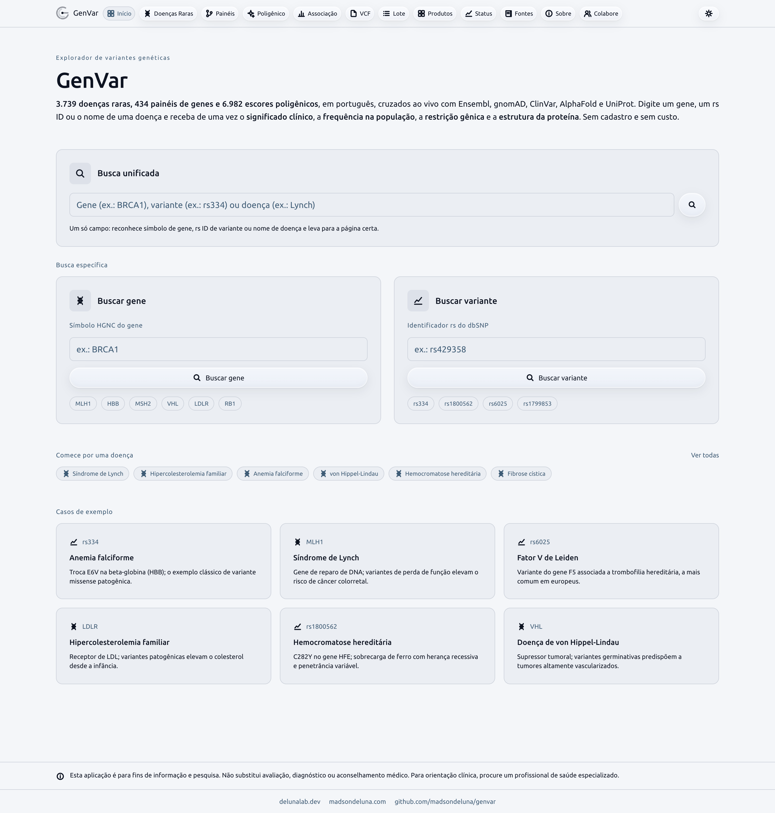

**Página inicial.** Ponto de entrada único. A busca unificada reconhece símbolo de gene, rs ID de variante ou nome de doença num campo só e leva para a página certa; abaixo dela ficam os campos específicos, as doenças de acesso rápido e os casos de exemplo.  
`/` · [https://genvar.delunalab.dev/](https://genvar.delunalab.dev/)


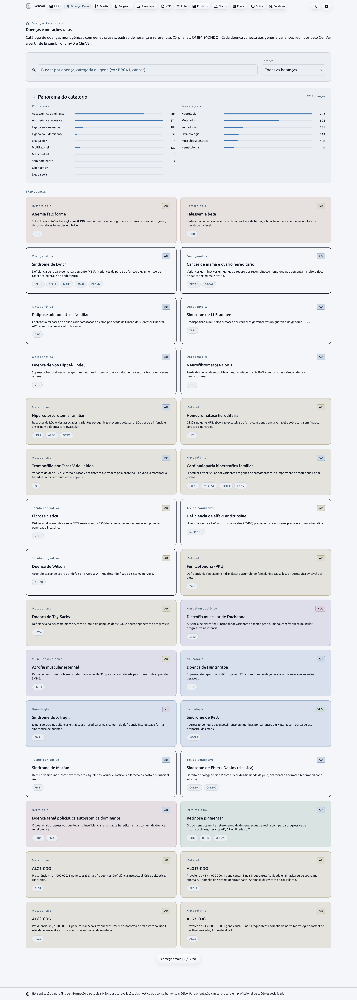

**Catálogo de doenças raras.** 3.739 doenças monogênicas com busca por doença, categoria ou gene, e seletor de padrão de herança. O painel de panorama mostra a distribuição por herança e por categoria, com a contagem de cada uma.  
`/doencas` · [https://genvar.delunalab.dev/doencas](https://genvar.delunalab.dev/doencas)


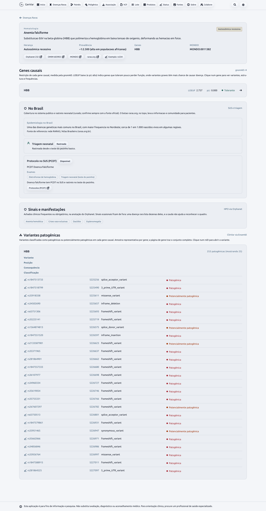

**Detalhe de doença.** Metadados curados do Orphanet (herança, prevalência, referências OMIM e MONDO, sinais clínicos), os genes causais com a restrição gênica obtida ao vivo da gnomAD, as variantes patogênicas por gene e o contexto brasileiro de cobertura no SUS.  
`/doenca/anemia-falciforme` · [https://genvar.delunalab.dev/doenca/anemia-falciforme](https://genvar.delunalab.dev/doenca/anemia-falciforme)


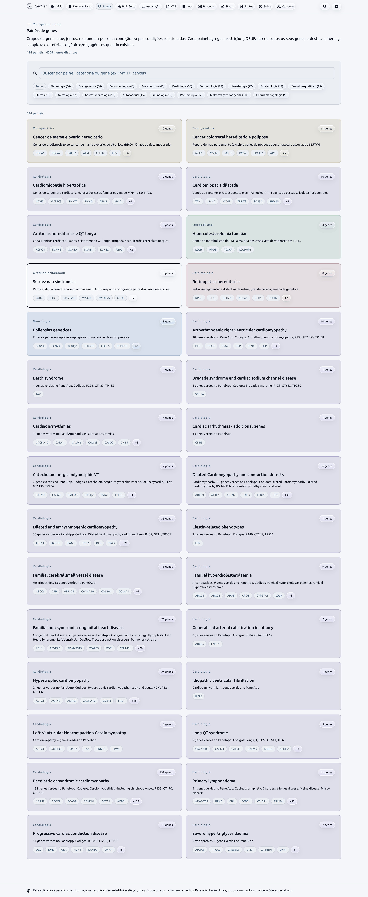

**Catálogo de painéis de genes.** 434 painéis do Genomics England PanelApp, com busca e facetas por categoria. Só entram genes de nível verde, que é o de evidência suficiente para uso diagnóstico.  
`/paineis` · [https://genvar.delunalab.dev/paineis](https://genvar.delunalab.dev/paineis)


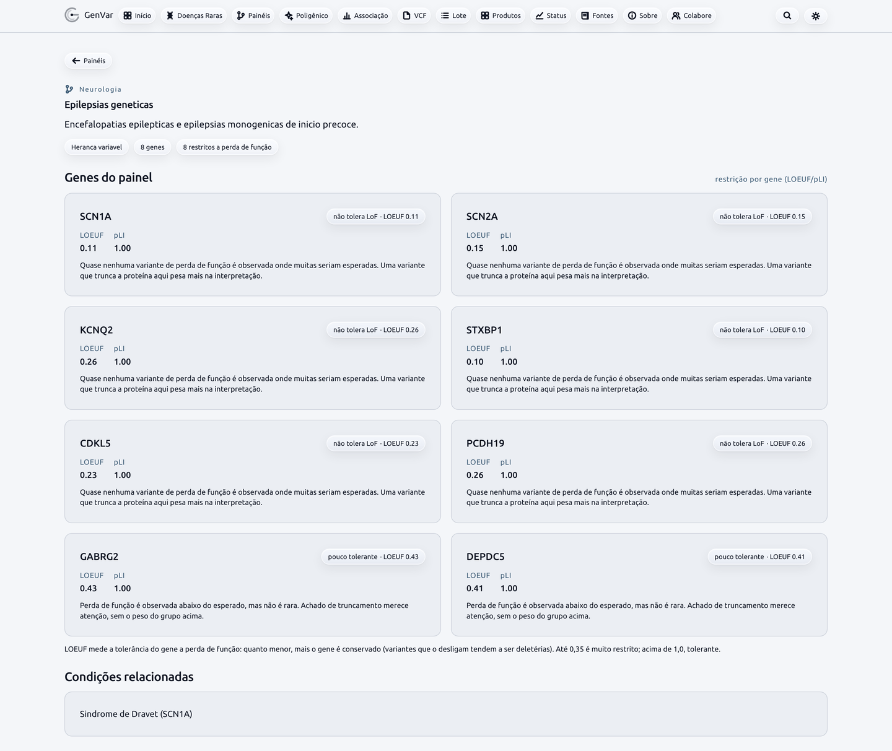

**Detalhe de painel.** A restrição de cada gene do painel obtida ao vivo da gnomAD, com a etiqueta dizendo o que o valor de LOEUF significa para a leitura de uma variante naquele gene, e não apenas o nome da faixa.  
`/painel/epilepsias-geneticas` · [https://genvar.delunalab.dev/painel/epilepsias-geneticas](https://genvar.delunalab.dev/painel/epilepsias-geneticas)


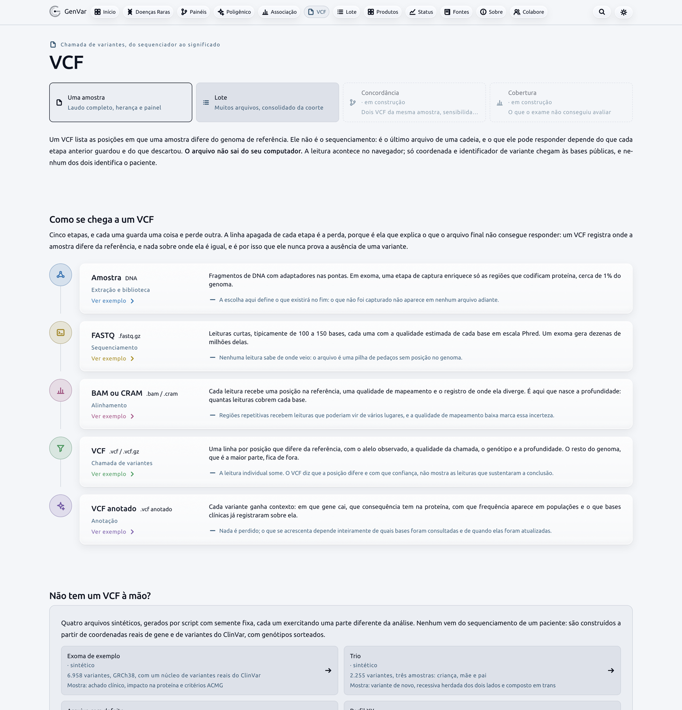

**Análise de VCF.** O módulo roda inteiro no navegador: o arquivo não é transmitido a servidor nenhum. A página abre explicando o que cada etapa da cadeia até o VCF guarda e o que perde, e oferece quatro arquivos sintéticos de exemplo, cada um exercitando uma parte diferente da análise.  
`/vcf` · [https://genvar.delunalab.dev/vcf](https://genvar.delunalab.dev/vcf)


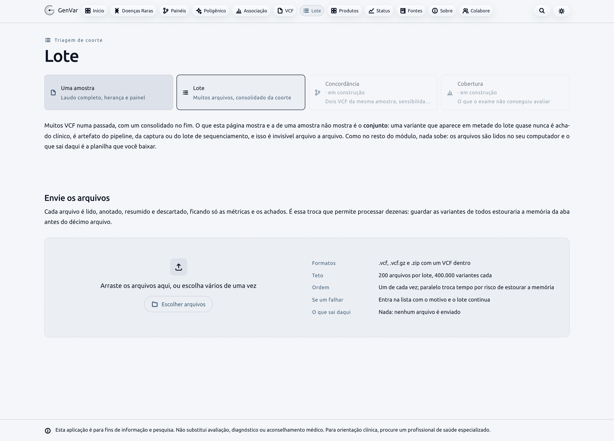

**Triagem de coorte.** Até 200 arquivos numa passada, com consolidado da coorte. Cada arquivo é lido, anotado, resumido e descartado: é essa troca que permite processar dezenas sem estourar a memória da aba, e está medida no benchmark em 54 MB retidos contra 1.766 MB do caminho arquivo a arquivo, em cem exomas.  
`/lote` · [https://genvar.delunalab.dev/lote](https://genvar.delunalab.dev/lote)


**Consulta de gene.** Metadados do Ensembl, métricas de restrição da gnomAD, ideograma cromossômico, estrutura proteica predita pelo AlphaFold e as tabelas de variantes por classificação clínica. A leitura das variantes vem em consulta separada, para a página aparecer antes de a parte lenta terminar.  
`/gene/BRCA1` · [https://genvar.delunalab.dev/gene/BRCA1](https://genvar.delunalab.dev/gene/BRCA1)


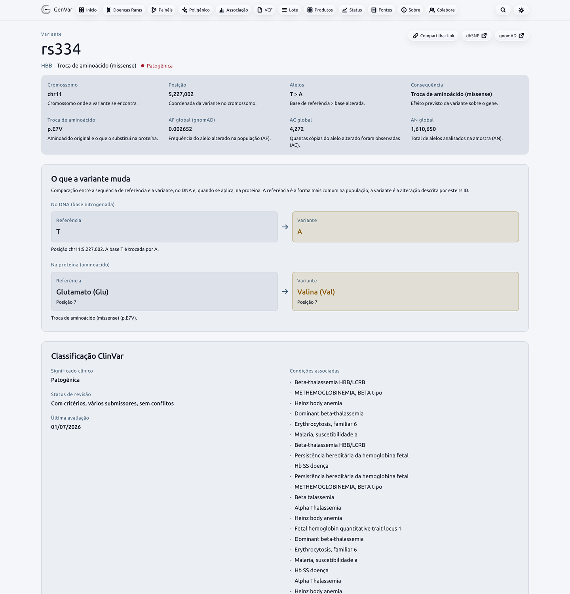

**Consulta de variante.** Anotação funcional pelo VEP do Ensembl, frequências por população da gnomAD, classificação do ClinVar, escores preditivos agregados pelo MyVariant e o escore de evidência ACMG pelo sistema de pontos de Tavtigian, que mostra os pontos e o lado para onde apontam sem nomear a faixa.  
`/variant/rs334` · [https://genvar.delunalab.dev/variant/rs334](https://genvar.delunalab.dev/variant/rs334)


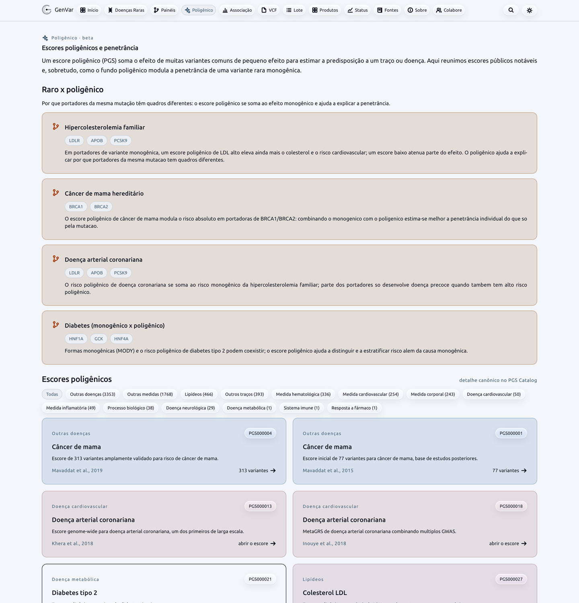

**Escores poligênicos.** 6.982 escores do PGS Catalog com facetas por categoria, e a seção que liga o raro ao poligênico: como o fundo poligênico modula a penetrância de uma variante rara monogênica, com exemplos documentados.  
`/poligenico` · [https://genvar.delunalab.dev/poligenico](https://genvar.delunalab.dev/poligenico)


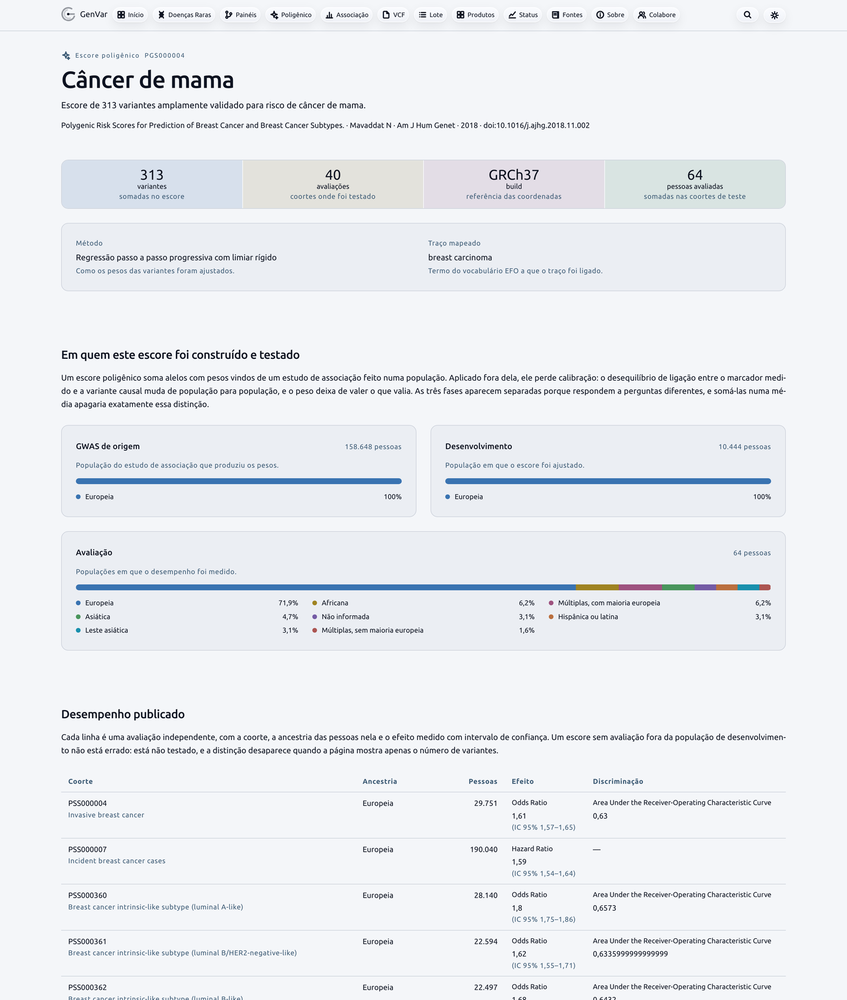

**Detalhe de escore poligênico.** Servido pela plataforma em vez de levar o usuário ao PGS Catalog. Traz o método, o build, a ancestria nas três fases da vida do escore (GWAS de origem, desenvolvimento e avaliação) e o desempenho publicado por coorte, com efeito e intervalo de confiança.  
`/escore/PGS000004` · [https://genvar.delunalab.dev/escore/PGS000004](https://genvar.delunalab.dev/escore/PGS000004)


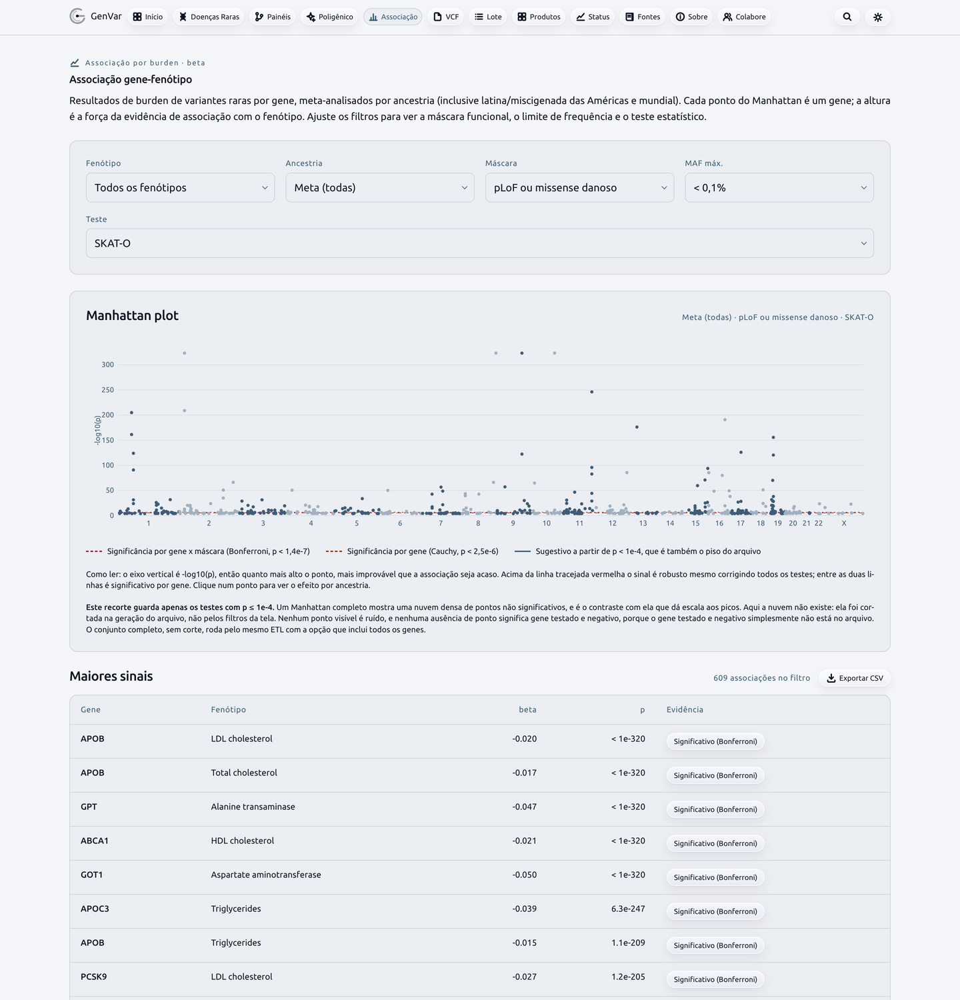

**Associação por burden.** Manhattan plot em canvas com filtros de fenótipo, ancestria, máscara funcional e teste estatístico, com as linhas de limiar; forest plot cross-ancestry por gene; e o mapa dos biobancos por coordenada real.  
`/associacao` · [https://genvar.delunalab.dev/associacao](https://genvar.delunalab.dev/associacao)


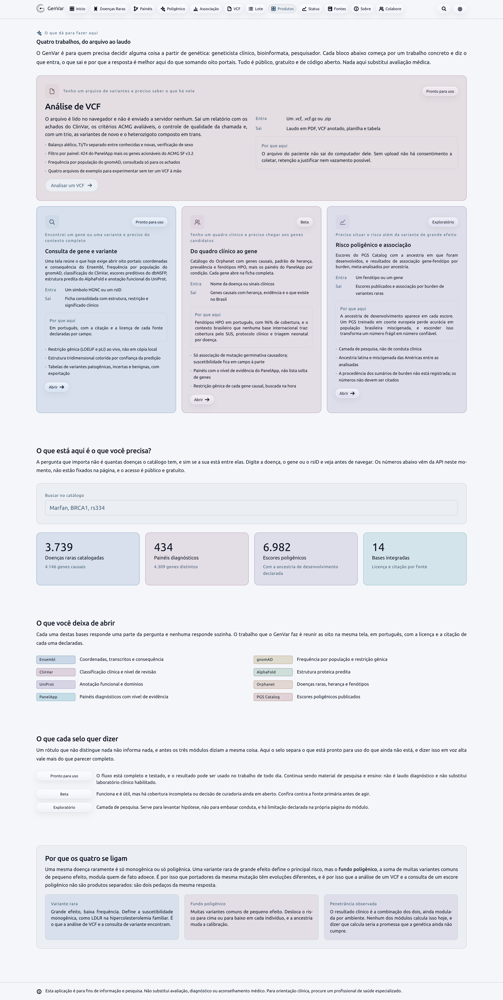

**Produtos.** Os quatro trabalhos que a plataforma entrega, organizados por necessidade concreta e não por camada de genética. Cada bloco declara o que entra, o que sai e o selo de maturidade.  
`/produtos` · [https://genvar.delunalab.dev/produtos](https://genvar.delunalab.dev/produtos)


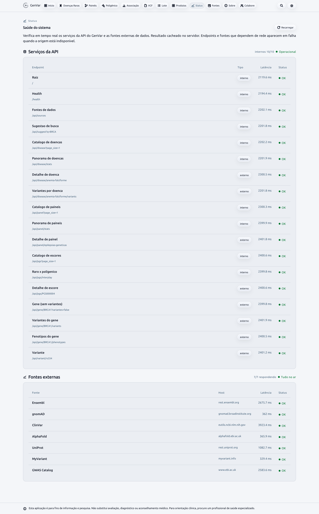

**Status das fontes e da API.** Saúde em tempo real das fontes externas e das dezoito rotas da própria API, com latência por sonda. O teto do cronômetro é diferente para rota local e para rota que consulta fonte externa, e acima de cinco segundos a rota sai como lenta e não como falha.  
`/status` · [https://genvar.delunalab.dev/status](https://genvar.delunalab.dev/status)


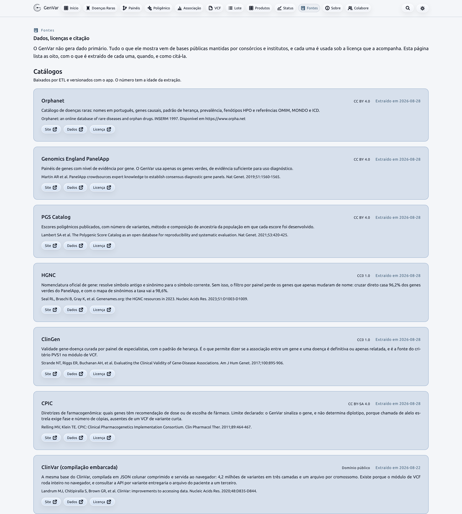

**Procedência dos dados.** As quatorze fontes com licença, uso, citação formal e data de extração de cada catálogo. A data diz de onde saiu: declarada pelo próprio arquivo do ETL ou, na falta dela, a data de modificação, porque as duas não valem o mesmo.  
`/fontes` · [https://genvar.delunalab.dev/fontes](https://genvar.delunalab.dev/fontes)


## Bancos de dados e APIs integrados

O sistema consome cinco bases públicas primárias (Ensembl, gnomAD, ClinVar, AlphaFold e UniProt), descritas nas subseções 1 a 5, e um agregador de escores preditivos, o MyVariant.info, que reúne o dbNSFP e outras fontes. A página de gene usa quatro bases (Ensembl, gnomAD, UniProt e AlphaFold); a de variante usa três (Ensembl, gnomAD e ClinVar) somadas ao MyVariant.info. No gene, a significância clínica do ClinVar chega pela resposta do Ensembl, sem chamada direta. Os módulos beta acrescentam mais duas fontes públicas, descritas na subseção 6 e na nota seguinte: o GWAS Catalog (associações comuns por gene) e o PGS Catalog (escores poligênicos), além do release estático de sumários de burden que alimenta a página de associação.

### 1. Ensembl REST API

- **Instituição**: European Bioinformatics Institute (EMBL-EBI) e Wellcome Sanger Institute.
- **URL**: https://rest.ensembl.org
- **Tipo**: REST (JSON).
- **Autenticação**: pública, sem chave.
- **Rate limit**: 15 requisições por segundo.

Endpoints utilizados:

| Endpoint | Descrição |
|----------|-----------|
| `GET /lookup/symbol/homo_sapiens/{symbol}` | Metadados do gene: ID Ensembl, cromossomo, locus, fita, biotipo, assembly. |
| `GET /overlap/id/{gene_id}?feature=variation` | Lista de variantes sobrepostas ao gene, com consequência e significado clínico bruto. |
| `GET /vep/human/id/{rsid}` | Variant Effect Predictor: anotação funcional completa, SIFT, PolyPhen, consequência molecular, troca de aminoácido. A query inclui `canonical=1&mane=1` para a seleção priorizar o transcrito MANE Select / canônico. |

**Nota técnica (rsID multialélico)**: o VEP devolve um bloco de consequência por alelo alternativo. Para um rsID multialélico (por exemplo rs334 = T/A/C/G), o sistema mantém o bloco de SIFT/PolyPhen por alelo e resolve qual alternativo exibir consultando o gnomAD: prefere o alelo cujo registro contém o rsID consultado, com desempate pela maior frequência global. O mesmo alelo é usado nas frequências, nas predições e na troca de aminoácido, evitando misturar o dado de um alelo com o de outro. As chamadas ao Ensembl ainda têm retentativa com backoff para os erros transitórios 429 e 5xx.

### 2. gnomAD GraphQL API

- **Instituição**: Broad Institute of MIT and Harvard.
- **URL**: https://gnomad.broadinstitute.org/api
- **Tipo**: GraphQL (linguagem de consulta de APIs em que o cliente especifica os campos que quer, alternativa ao REST).
- **Autenticação**: pública.
- **Dataset**: gnomAD r4. As frequências usam o campo `joint` (exoma e genoma combinados, o mesmo que o navegador do gnomAD exibe), com queda para `genome` e depois `exome` quando o `joint` não existe.

Queries utilizadas:

| Query | Descrição |
|-------|-----------|
| `variant(variantId, dataset)` | Frequências alélicas combinadas por população (`joint.ac`, `joint.an`, AF calculado como AC/AN) e `rsids` da variante. |
| `gene(gene_symbol, reference_genome)` | Métricas de restrição evolutiva do gene (anotadas a partir do constraint v4.1.1 no índice GRCh38). |

Populações retornadas e exibidas:

| ID (API) | População |
|----------|-----------|
| `afr` | Africana / Afro-americana |
| `amr` | Latina / Americana mista |
| `asj` | Judaica asquenaze |
| `eas` | Asiática oriental |
| `fin` | Finlandesa |
| `nfe` | Europeia não finlandesa |
| `sas` | Sul asiática |
| `mid` | Oriente Médio |
| `ami` | Amish |

**Nota técnica**: o campo `af` não existe no tipo `VariantPopulation` da API atual. A frequência é calculada no backend como `ac / an`. Os IDs de população são minúsculos (`afr`, `amr`), divergindo de alguns exemplos antigos de documentação.

### 3. ClinVar via NCBI E-utilities

- **Instituição**: National Center for Biotechnology Information (NCBI), National Library of Medicine (NLM).
- **URL**: https://eutils.ncbi.nlm.nih.gov/entrez/eutils
- **Tipo**: REST (JSON/XML).
- **Autenticação**: pública.
- **Rate limit**: 3 requisições por segundo sem chave de API.

As E-utilities (Entrez Programming Utilities) são as APIs de consulta programática do NCBI. O fluxo usa dois passos:

| Passo | Endpoint | Descrição |
|-------|----------|-----------|
| 1 | `GET /esearch.fcgi?db=clinvar&term={rsid}&retmode=json` | Recupera lista de UIDs ClinVar associados ao rs ID. |
| 2 | `GET /esummary.fcgi?db=clinvar&id={uids}&retmode=json` | Recupera sumário de múltiplos registros em lote. |

Campos utilizados do objeto retornado:

| Campo | Descrição |
|-------|-----------|
| `germline_classification.description` | Classificação clínica textual: Pathogenic, Benign, VUS, Conflicting, entre outras. |
| `germline_classification.review_status` | Nível de evidência da classificação. |
| `germline_classification.last_evaluated` | Data da última avaliação. |
| `germline_classification.trait_set[].trait_name` | Condições clínicas associadas. |
| `accession` | Identificador VCV (agregado) ou RCV (submissão individual). |

**Nota técnica**: o campo histórico `clinical_significance` foi substituído por `germline_classification` na versão atual da API. O sistema busca todos os UIDs em lote e seleciona o registro VCV mais abrangente, priorizando o de maior número de condições associadas (agregado).

### 4. AlphaFold Protein Structure Database API

- **Instituição**: DeepMind e European Bioinformatics Institute (EMBL-EBI).
- **URL**: https://alphafold.ebi.ac.uk/api
- **Tipo**: REST (JSON).
- **Autenticação**: pública.

Endpoint utilizado:

| Endpoint | Descrição |
|----------|-----------|
| `GET /prediction/{uniprot_id}` | Metadados e URLs da estrutura proteica predita. |

Campos utilizados:

| Campo | Descrição |
|-------|-----------|
| `pdbUrl` | URL para download da estrutura em formato PDB. |
| `cifUrl` | URL para download em formato mmCIF. |
| `paeImageUrl` | URL da imagem do Predicted Aligned Error (PAE). |
| `globalMetricValue` | Score global de confiança pLDDT médio. |
| `latestVersion` | Versão mais recente do modelo. |
| `entryId` | Identificador do modelo, por exemplo `AF-P38398-F1`. |

**Nota técnica**: a API retorna um array (múltiplos fragmentos para proteínas longas). O sistema utiliza sempre o primeiro elemento, que corresponde ao modelo canônico.

### 5. UniProt REST API

- **Instituição**: Universal Protein Resource Consortium (UniProt), formado por EMBL-EBI, SIB e PIR.
- **URL**: https://rest.uniprot.org
- **Tipo**: REST (JSON).
- **Autenticação**: pública.

Endpoint utilizado:

| Endpoint | Descrição |
|----------|-----------|
| `GET /uniprotkb/search?query=gene:{symbol}+AND+organism_id:9606+AND+reviewed:true` | Mapeia símbolo HGNC para accession UniProtKB Swiss-Prot. |

Campos utilizados:

| Campo | Descrição |
|-------|-----------|
| `results[0].primaryAccession` | Accession UniProt canônica, por exemplo P38398 para BRCA1. |

**Nota técnica**: o filtro `reviewed:true` garante que apenas entradas Swiss-Prot (curadas manualmente) sejam retornadas, excluindo entradas TrEMBL (preditas automaticamente). O UniProt ID obtido é utilizado para consultar o AlphaFold.

### Agregador de escores preditivos: MyVariant.info (dbNSFP e múltiplas fontes)

- **Instituição**: BioThings, The Scripps Research Institute.
- **URL**: https://myvariant.info/v1
- **Tipo**: REST (JSON).
- **Autenticação**: pública.
- **Cobertura**: dbNSFP v4.x, CADD, dbscSNV, SpliceAI, ClinVar, COSMIC, dbSNP, ExAC, 1000 Genomes, gnomAD.

Endpoints utilizados:

| Endpoint | Descrição |
|----------|-----------|
| `GET /variant/chr{chr}:g.{pos}{ref}>{alt}?assembly=hg38&fields=...` | Consulta por HGVS genômico (HGVS, Human Genome Variation Society, a notação padrão para descrever variantes, por exemplo `chr19:g.44908684T>C`; preferencial quando há coordenadas). |
| `GET /query?q=dbsnp.rsid:{rsid}&fields=...&assembly=hg38` | Consulta por rs ID (fallback). |

Campos extraídos e mapeados para o `VariantResponse`:

| Grupo | Campos |
|-------|--------|
| Patogenicidade | `cadd.phred`, `dbnsfp.cadd.raw_rankscore`, `dbnsfp.revel.score`, `dbnsfp.alphamissense.score/pred`, `dbnsfp.metalr.score/pred`, `dbnsfp.metasvm.score/pred`, `dbnsfp.primateai.score/pred`, `dbnsfp.mutpred.score`, `dbnsfp.fathmm.score/pred`, `dbnsfp.dann.score` |
| Conservação | `dbnsfp.phylop100way_vertebrate.score`, `dbnsfp.phastcons100way_vertebrate.score`, `dbnsfp.gerp++.rs` |
| Splicing | `cadd.spliceai.ds_ag/al/dg/dl` (máximo), `dbscsnv.ada_score`, `dbscsnv.rf_score` |
| Proteína | `dbnsfp.interpro_domain` |
| Frequências | `1000g.af`, `exac.af` |
| Cross-refs | `clinvar.variant_id`, `cosmic.cosmic_id` |

**Nota técnica**: a chamada é feita em paralelo com gnomAD e ClinVar via `asyncio.gather()`. Erros ou respostas 404 caem em `{}` graciosamente, sem bloquear a resposta. A API aceita tanto HGVS genômico quanto rs ID. O sistema tenta HGVS primeiro (mais preciso quando há coordenadas do VEP) e utiliza rs ID como fallback.

### 6. PGS Catalog API

- **O que é**: catálogo público de escores poligênicos (Polygenic Score Catalog, do EBI), com metadados de cada escore: número de variantes, publicação de origem e ancestrias das amostras de desenvolvimento e avaliação.
- **Uso no GenVar**: o módulo poligênico (`/poligenico`) parte de uma semente curada de escores notáveis e enriquece cada escore ao vivo pela API do PGS Catalog (`backend/app/services/pgs_catalog.py`). O detalhe canônico de cada escore fica na página do PGS Catalog.
- **Endpoint base**: `https://www.pgscatalog.org/rest`.

### Dados embarcados do módulo de VCF

Diferente das APIs acima, quatro fontes entram como release estático compilado por ETL, porque o módulo de VCF roda sem rede por decisão de privacidade.

| Fonte | Conteúdo | Licença | ETL |
|---|---|---|---|
| ClinVar (NCBI) | 4,2 milhões de variantes com classificação, nível de revisão, condição, consequência molecular e frequência herdada de ExAC, 1000 Genomes e ESP | Domínio público | `backend/etl/clinvar.py` |
| ClinGen Gene-Disease Validity | 3.029 genes com curadoria de validade (Definitive a Refuted) e modo de herança | CC0 | `backend/etl/clingen_cpic.py` |
| CPIC | 992 rsID que participam da definição de alelos estrela, com os fármacos que têm diretriz publicada | CC BY-SA 4.0 | `backend/etl/clingen_cpic.py` |
| PanelApp e HGNC | 424 painéis de genes verdes mais ACMG SF v3.2, com símbolos resolvidos por `prev_symbol` e `alias_symbol` | CC BY-SA 4.0 e CC0 | `backend/etl/simbolos_e_paineis.py` |

O gnomAD entra ao vivo neste módulo, por consulta GraphQL variante a variante e apenas a pedido, para as variantes que já têm achado. O conjunto segue o build do arquivo: `gnomad_r2_1` para GRCh37 e `gnomad_r4` para GRCh38.

**Sobre a chamada de alelo estrela.** A camada de CPIC **não determina diplótipo**. Dizer "*1/*4" exige fase e número de cópias, e um VCF de variante curta não carrega nenhum dos dois. O que a camada afirma é que aquele rsID participa da definição dos alelos estrela de um gene com diretriz publicada, e para quais fármacos ela existe.

Os arquivos são gravados em gzip e o navegador os desfaz com `DecompressionStream`. Não é economia de disco: 157 MB de JSON cru entrariam no repositório e no artefato publicado, 27 MB comprimidos não.

Para gerar:

```bash
cd backend
curl -sSL -o etl/.cache/clinvar/clinvar.vcf.gz https://ftp.ncbi.nlm.nih.gov/pub/clinvar/vcf_GRCh38/clinvar.vcf.gz
curl -sSL -o etl/.cache/hgnc/hgnc_complete_set.txt https://storage.googleapis.com/public-download-files/hgnc/tsv/tsv/hgnc_complete_set.txt
curl -sSL -o etl/.cache/clingen/gene-validity.csv https://search.clinicalgenome.org/kb/gene-validity/download
python etl/clinvar.py
python etl/simbolos_e_paineis.py
python etl/clingen_cpic.py
```


### Dados de burden (release estático público)

Diferente das bases acima, os sumários de associação por burden de variantes raras (formato SAIGE-GENE e Meta-SAIGE) são publicados como um release estático de estatísticas-resumo, não como uma API ao vivo. O ETL `backend/scripts/build_burden.py` converte esse release nos JSON colunares que o módulo `/associacao` consome, incluindo o erro-padrão do efeito Burden para os intervalos de confiança do forest plot. Manter atualizado significa rerodar o ETL quando sai uma versão nova. Detalhes de formato e execução em `DATA_BURDEN.md`.


## Arquitetura do sistema

A aplicação tem duas trilhas de dados independentes. A primeira passa pelo servidor: o navegador chama a API, o backend consulta as fontes públicas e devolve um JSON. A segunda não passa: a análise de VCF roda inteiramente no navegador, contra catálogos servidos como assets estáticos, e nenhum byte do arquivo do usuário sai da máquina dele. A Figura 1 mostra as duas trilhas lado a lado, a Figura 2 detalha o ciclo de vida de uma requisição de gene no servidor e a Figura 3 detalha a trilha que não usa o servidor. Os três diagramas são gerados por `scripts/gera_diagramas.py` e reproduzem a arquitetura da versão 3.0.0.


**Figura 1. Arquitetura em camadas.** O diagrama organiza o sistema em seis blocos, identificados por cor na legenda. A camada de apresentação (azul) é o frontend em React 18 com Vite, servido como build estático; reúne dezessete rotas do react-router, agrupadas em exploração (gene, variante, doenças raras), painéis e escores (painéis, poligênico, associação), análise de VCF (`/vcf` e `/lote`) e meta (início, produtos, status, fontes, sobre, colabore); as visualizações (Plotly.js, NGL para estrutura tridimensional, Ideogram, Manhattan em canvas, réguas ACMG e `@react-pdf/renderer` para o laudo); e o cliente HTTP (axios sobre `/api`, com TanStack Query). O bloco amarelo dentro do navegador é a trilha local: treze módulos de VCF (`parse`, `metricas`, `clinvar`, `interpretacao`, `acmg`, `lote`, `saidas`, `exportar`, `pdf` e testes) e 41 MB de catálogos embarcados, entre eles o ClinVar GRCh38 de 2026-08-22 com 4.207.945 variantes em 76 fatias `.json.gz` por cromossomo e camada de significado. A camada de aplicação (verde) é o backend em FastAPI sobre Uvicorn, em imagem python:3.12-slim na porta 8000: oito roteadores (gene, variante, doença, painel, escore poligênico, sugestão, fontes e saúde) expondo dezoito rotas sob `/api`, middleware de tempo de resposta, limite de taxa, CORS e compressão, orquestração assíncrona com `asyncio.gather` e oito módulos de serviço, um por fonte ao vivo. O cache (laranja) é o Redis 7 em política read-through com expiração de uma hora e chaves versionadas por tipo: `gene:v6:{símbolo}:{com|sem}`, `genevars:v1`, `genephen:v2`, `variant:v3`, `disease:v1`, `diseasevars:v1`, `panel:v1` e `pgs:v3`. As fontes externas (roxo) são as oito consultadas dentro do tempo da requisição: Ensembl, gnomAD, ClinVar, MyVariant.info, UniProt, AlphaFold, GWAS Catalog e PGS Catalog. O bloco cinza no rodapé é a compilação prévia: seis scripts de ETL que rodam fora do tempo da requisição e geram os dois conjuntos de catálogos, os do navegador e os que o processo do servidor carrega em memória. As setas cheias marcam o fluxo de requisição; as tracejadas, o que o ETL alimenta.


**Figura 2. Ciclo de vida da requisição `/api/gene/{símbolo}`.** O fluxograma acompanha uma chamada do início ao fim no servidor. O navegador emite `GET /api/gene/{símbolo}` e o backend valida o símbolo. A primeira decisão consulta o Redis (Em cache?): em caso de acerto (hit), a resposta sai do cache em cerca de 16 ms, com entrega imediata, encerrando o fluxo; em caso de falha (miss), a requisição prossegue. A etapa seguinte é sequencial e obrigatória antes do paralelismo: o lookup no Ensembl converte o símbolo no `gene_id`. De posse do `gene_id`, o `asyncio.gather` dispara três chamadas em paralelo, o overlap de variantes no Ensembl, a restrição (constraint) do gene no gnomAD e o identificador da proteína no UniProt. A chamada ao AlphaFold (estrutura tridimensional) é condicional e só ocorre se o UniProt devolver um identificador. Concluídas as chamadas, o servidor agrega, classifica e prioriza as variantes, grava o resultado no cache (TTL 1 h, exceto quando a busca de variantes no Ensembl falhou, para não fixar um resultado vazio durante uma instabilidade) montando um JSON único e devolve a resposta ao navegador. A rota `/api/variant/{rs}` segue o mesmo padrão, acrescentando as chamadas ao ClinVar (E-utilities) e ao MyVariant.info (escores preditivos), omitidas no diagrama por clareza.

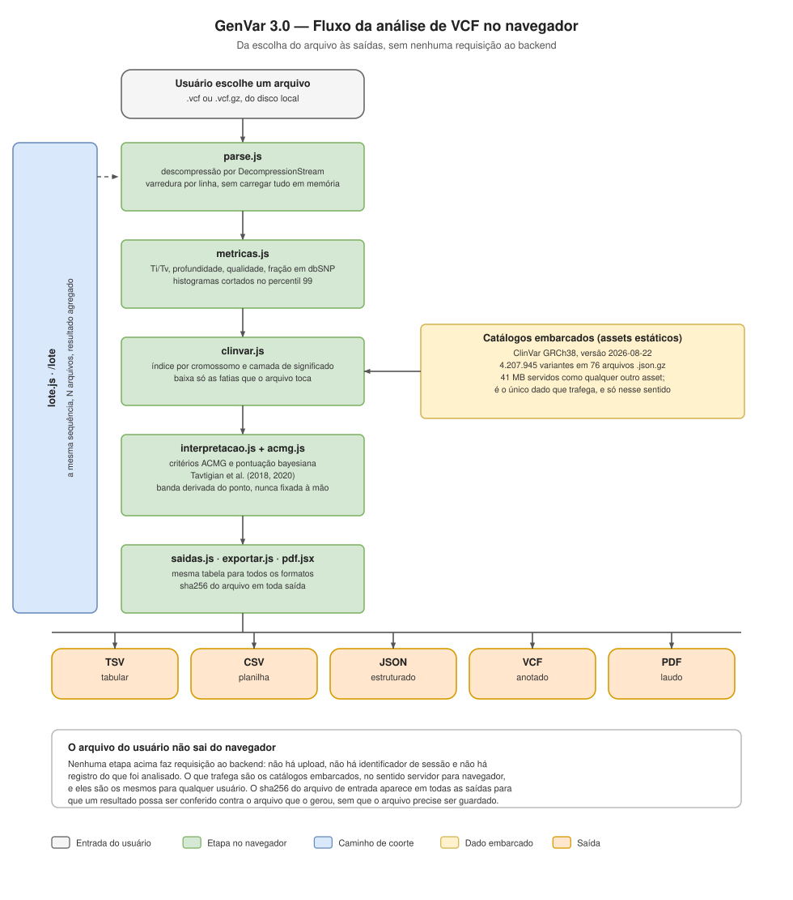

**Figura 3. Fluxo da análise de VCF no navegador.** O fluxograma acompanha um arquivo da escolha às saídas, e nenhuma das etapas faz requisição ao backend. O usuário escolhe um `.vcf` ou `.vcf.gz` do disco. O `parse.js` descomprime por `DecompressionStream` e varre linha a linha, sem carregar o arquivo inteiro em memória. O `metricas.js` calcula a razão Ti/Tv, profundidade, qualidade e a fração já presente no dbSNP, com histogramas cortados no percentil 99. O `clinvar.js` consulta o índice embarcado por cromossomo e camada de significado e baixa apenas as fatias que aquele arquivo toca, o que evita transferir os 41 MB inteiros. O `interpretacao.js` com o `acmg.js` aplica os critérios ACMG/AMP e a pontuação bayesiana de Tavtigian, adotada pelo ClinGen, sempre derivando a banda do ponto e nunca fixando o rótulo à mão. O `saidas.js`, o `exportar.js` e o `pdf.jsx` escrevem a mesma tabela em TSV, CSV, JSON, VCF anotado e PDF, todos carimbados com o sha256 do arquivo de entrada. A faixa azul à esquerda é o `lote.js`, que repete a mesma sequência para N arquivos e agrega o resultado da coorte em `/lote`. O único dado que trafega são os catálogos embarcados, e só no sentido servidor para navegador: são iguais para qualquer usuário e não dependem do que foi analisado.

Os passos abaixo descrevem os mesmos fluxos no nível do código.

**Fluxo de uma requisição de gene:**

1. Frontend envia `GET /api/gene/MLH1`.
2. Backend valida o símbolo via `validate_gene_symbol()` (regex HGNC).
3. Verifica cache Redis com chave versionada `gene:v6:MLH1:com`. O recorte com ou sem variantes faz parte da chave, porque `/api/gene/{símbolo}` aceita `variantes=false` e a tabela pesada tem rota própria em `/api/gene/{símbolo}/variants`, sob a chave `genevars:v1`. Retorna imediatamente em caso de cache hit.
4. Se cache miss: `ensembl.get_gene_info()`, sequencial (necessário para obter o `gene_id`).
5. Com o `gene_id`, executa em paralelo via `asyncio.gather()`:
   - `ensembl.get_gene_variants(gene_id)`: lista de variantes com `clinical_significance`.
   - `gnomad.get_gene_constraint(symbol)`: pLI, LOEUF, oe_lof, oe_mis, lof_z.
   - `uniprot.get_uniprot_id(symbol)`: accession Swiss-Prot.
6. Com o UniProt ID: `alphafold.get_prediction(uniprot_id)` retorna `pdbUrl` e `paeImageUrl`.
7. `classify_clinical_significance()` classifica variantes em pathogenic, VUS, benign e other. Todas as quatro listas são devolvidas (truncadas em 500 por categoria).
8. `GeneResponse` (Pydantic v2) valida e serializa o resultado.
9. `cache_set(TTL 3600s)` armazena no Redis, exceto quando a busca de variantes falhou (não cacheia resultado degradado).
10. Frontend renderiza via TanStack Query, com cache client-side adicional e `staleTime` de 10 minutos.

**Fluxo de uma requisição de variante:**

1. Frontend envia `GET /api/variant/rs429358`.
2. Backend valida o rs ID via `validate_rsid()` (regex `^rs\d+$`).
3. Verifica cache Redis com chave versionada `variant:v3:rs429358`.
4. Se cache miss: `ensembl.get_vep_annotation()`, sequencial (necessário para obter chrom/pos, o alelo de referência e a lista de alelos alternativos candidatos, mais a consequência por alelo).
5. Resolve o alelo alternativo a exibir consultando o gnomAD para cada candidato e escolhendo o que casa com o rsID (desempate por frequência global).
6. Em paralelo via `asyncio.gather()`:
   - `clinvar.get_variant_clinvar(rsid)`: busca em lote e seleção do VCV mais abrangente.
   - `myvariant.get_variant_annotations(rsid, chrom, pos, ref, alt)`: dbNSFP completo para o alelo resolvido.
7. `VariantResponse` com mais de 40 campos serializados, com SIFT/PolyPhen e troca de aminoácido do mesmo alelo resolvido.
8. `cache_set(TTL 3600s)` armazena no Redis.


## Tecnologias utilizadas

### Backend

| Tecnologia | Versão | Função |
|------------|--------|--------|
| Python | 3.12+ | Linguagem principal do backend. |
| FastAPI | 0.115 | Framework web assíncrono com OpenAPI automático. |
| Uvicorn | 0.32 | Servidor ASGI de alta performance. |
| httpx | 0.27 | Cliente HTTP assíncrono para consultas às APIs externas. |
| Pydantic v2 | 2.9 | Validação e serialização de dados (schemas de resposta). |
| pydantic-settings | 2.5 | Configurações via variáveis de ambiente. |
| redis-py | 5.0 | Cliente Python do cache; o servidor Redis 7 fica na seção de infraestrutura. |
| pytest | 8.3 | Framework de testes unitários e de integração. |
| pytest-asyncio | 0.24 | Suporte a testes de funções assíncronas. |

### Frontend

| Tecnologia | Versão | Função |
|------------|--------|--------|
| React | 18.2 | Biblioteca de interface declarativa baseada em componentes. |
| Vite | 5.0 | Build tool e dev server com HMR. |
| Tailwind CSS | 3.3 | Framework CSS utility-first, paleta cinza e cores semânticas. |
| TanStack Query | 5.17 | Estado assíncrono e cache client-side. |
| Axios | 1.6 | Cliente HTTP com interceptors de erro. |
| Plotly.js | 2.27 | Visualização interativa. |
| react-plotly.js | 2.6 | Wrapper React para Plotly.js. |
| ideogram | 1.53 | Ideograma cromossômico humano com bandeamento G (GRCh38). |
| NGL | 2.4 | Visualizador 3D de estruturas moleculares (PDB) no browser. |
| Ícones Pure | sprite | Biblioteca de ícones da linguagem de design (sprite SVG em `public/pure/icons.svg`, 65 ícones, currentColor, espessura pelo token da linguagem), consumida pelo componente `Icon`. |
| react-router-dom | 6.20 | Roteamento client-side (SPA). |
| Google Fonts | Ubuntu e Ubuntu Mono | Tipografia sans-serif para prosa, mono para identificadores. |

### Infraestrutura

| Tecnologia | Versão | Função |
|------------|--------|--------|
| Docker | 24+ | Containerização de backend e frontend. |
| Docker Compose | 2.x | Orquestração local dos serviços. |
| Nginx | Alpine | Servidor de arquivos estáticos e proxy reverso (produção). |
| Redis | 7 (alpine) | Servidor de cache em memória das respostas das APIs. |


## Visualizações implementadas

| Componente | Tipo | Dados | Biblioteca |
|------------|------|-------|------------|
| `ChromosomeIdeogram` | Ideograma horizontal GRCh38 com bandeamento G | Locus do gene, variantes classificadas ou posição da variante única | ideogram.js |
| `GeographicVariantMap` | Mapa mundial (scattergeo) | Frequências alélicas por população (gnomAD) | Plotly.js |
| `FrequencyBarChart` | Barras em escala log | AC, AN e AF por população (gnomAD) | Plotly.js |
| `PredictionScoresRadar` | Barras horizontais por preditor | SIFT, PolyPhen-2, CADD, REVEL normalizados de 0 a 1, com veredito e contagem de dano | CSS nativo |
| `PredictionDetails` | Grupos de cartões coloridos | CADD, REVEL, AlphaMissense, MetaLR, MetaSVM, PrimateAI, FATHMM, MutPred, DANN, PhyloP, PhastCons, GERP++, SpliceAI, dbscSNV, InterPro, COSMIC | React, sem dependência de chart |
| `GeneLocusHeatmap` | Barras empilhadas | Distribuição de variantes em bins de 1 kb (4 categorias) | Plotly.js |
| `ConstraintMetrics` | Gauge do LOEUF e barras unificadas de restrição | LOEUF, Z-score de LoF, o/e LoF, o/e Missense (gnomAD) | CSS nativo |
| `ProteinViewer` | Visualizador 3D interativo | Estrutura AlphaFold (PDB) colorida por pLDDT, representações Cartoon, Superfície, Bola e Bastão, Fita | NGL |
| `VariantTable` | Tabela com ordenação, filtro, paginação e exportação CSV | Lista de variantes classificadas por categoria clínica | React |
| `SignificanceTag` | Badge colorido | Classificação ClinVar unificada | React |
| `ManhattanPlot` | Manhattan em canvas | Associação gene-fenótipo por burden (-log10 p por posição genômica), com linhas de limiar | Canvas nativo |
| `ForestPlot` | Forest plot cross-ancestry | Efeito Burden por ancestria com intervalo de confiança de 95% e losango da meta-análise | SVG nativo |
| `BiobankMap` | Mapa mundial equiretangular | Biobancos por coordenada real, dimensionados pela amostra e coloridos pela ancestria predominante | SVG nativo |
| `CatalogOverview` | Barras horizontais | Distribuição do catálogo de doenças por herança e por categoria | CSS nativo |

**Normalização dos escores de patogenicidade nas barras:**

| Escore | Direção original | Normalização para 0 a 1 (0 = benigno, 1 = patogênico) |
|--------|-----------------|-------------------------------------------------------|
| SIFT | Menor = mais deletério | `1 - score` |
| PolyPhen-2 | Maior = mais deletério | Sem alteração |
| CADD Phred | Maior = mais deletério | `min(1, score / 40)` |
| REVEL | Maior = mais deletério | Sem alteração |


## Estrutura do projeto

```
genvar-dashboard/
├── backend/
│   ├── app/
│   │   ├── main.py                  FastAPI app, CORS, registro de routers.
│   │   ├── config.py                Configurações via variáveis de ambiente.
│   │   ├── routers/
│   │   │   ├── gene.py              GET /api/gene/{symbol}, agregação paralela.
│   │   │   ├── variant.py           GET /api/variant/{rsid}, agregação paralela.
│   │   │   ├── disease.py           /api/disease: catálogo, detalhe e variantes por doença.
│   │   │   ├── panel.py             /api/panel: painéis de genes (multigênico).
│   │   │   ├── pgs.py               /api/pgs: escores poligênicos e relação raro x poligênico.
│   │   │   ├── suggest.py           /api/suggest: sugestões ao digitar, do índice local.
│   │   │   ├── sources.py           /api/sources: fontes, licenças e data de extração.
│   │   │   └── health.py            /api/health/sources e /api/health/endpoints.
│   │   ├── services/
│   │   │   ├── ensembl.py           Cliente Ensembl REST API.
│   │   │   ├── gnomad.py            Cliente gnomAD GraphQL API.
│   │   │   ├── clinvar.py           Cliente ClinVar E-utilities (busca em lote).
│   │   │   ├── alphafold.py         Cliente AlphaFold REST API.
│   │   │   ├── uniprot.py           Cliente UniProt REST API.
│   │   │   ├── myvariant.py         Cliente MyVariant.info (dbNSFP agregado).
│   │   │   ├── gwas_catalog.py      Cliente GWAS Catalog (associações por gene).
│   │   │   └── pgs_catalog.py       Cliente PGS Catalog (detalhe de escore poligênico).
│   │   ├── data/
│   │   │   ├── rare_diseases.py     Catálogo curado de doenças raras e loader do JSON do Orphanet.
│   │   │   ├── gene_panels.py       Catálogo curado de painéis de genes (multigênico).
│   │   │   ├── polygenic.py         Semente de escores PGS e loader do JSON do PGS Catalog.
│   │   │   ├── br_context.py        Contexto Brasil: SUS/PCDT e triagem neonatal.
│   │   │   ├── br_frequencies.py    Frequência alélica brasileira (ABraOM).
│   │   │   ├── orphanet_diseases.json   Catálogo gerado (3.733 doenças, 2,7 MB).
│   │   │   ├── panelapp_panels.json     Catálogo gerado (425 painéis, 12 MB).
│   │   │   └── pgs_catalog.json         Catálogo gerado (6.982 escores, 3,4 MB).
│   │   ├── scripts/
│   │   │   ├── build_catalog.py     ETL antigo do Orphanet, superado por etl/orphanet.py.
│   │   │   └── build_burden.py      ETL dos sumários de burden para JSON colunar.
│   │   ├── models/
│   │   │   └── schemas.py           Modelos Pydantic v2 (gene, variante, doença, painel, PGS, saúde).
│   │   └── utils/
│   │       ├── cache.py             Helpers Redis, fallback gracioso.
│   │       └── validators.py        Validação de entrada e classificação clínica.
│   ├── etl/
│   │   ├── orphanet.py              ETL do Orphanet: doenças, genes, herança, HPO.
│   │   ├── panelapp.py              ETL do PanelApp: painéis e nível de evidência.
│   │   ├── pgscatalog.py            ETL do PGS Catalog: escores e ancestria.
│   │   ├── clinvar.py               ETL do ClinVar: 4,2 M de variantes em colunas, por cromossomo.
│   │   ├── simbolos_e_paineis.py    Painéis para o VCF e mapa de sinônimos do HGNC.
│   │   ├── clingen_cpic.py          Validade gene-doença e farmacogenômica.
│   │   ├── traducoes/hpo_pt_br.tsv  Tradução dos fenótipos sem versão oficial do HPO.
│   │   └── .cache/                  Páginas cruas por fonte, fora do git. Torna o ETL retomável.
│   ├── pytest.ini                   Marcadores e exclusão dos testes de integração.
│   └── tests/
│       ├── conftest.py              Marca test_apis.py como integração, por caminho.
│       ├── test_apis.py             Contrato das APIs externas (marcado como integração).
│       ├── test_services.py         Testes unitários com mocks.
│       ├── test_disease.py          Testes do módulo de doenças (mocks).
│       ├── test_etl.py              Regras de curadoria dos três ETLs.
│       ├── test_catalogos.py        Merge dos catálogos, sugestão e fontes.
│       └── test_build_catalog.py    Testes do parser do ETL antigo.
├── frontend/
│   ├── public/
│   │   ├── pure/icons.svg           Sprite de ícones da linguagem Pure.
│   │   └── data/burden/             JSON colunar de burden (genes, fenótipos, biobancos, resultados).
│   ├── src/
│   │   ├── api/
│   │   │   └── client.js            Axios e fetchers (gene, variante, doença, painel, PGS, saúde).
│   │   ├── components/
│   │   │   ├── Icon.jsx             Componente de ícone que consome o sprite do Pure.
│   │   │   ├── AppMenu.jsx          Navegação de seções compartilhada e modo de leitura.
│   │   │   ├── PageNav.jsx, BrandMorphNav.jsx
│   │   │   ├── UnifiedSearch.jsx    Busca unificada (gene, variante ou doença).
│   │   │   ├── CatalogOverview.jsx  Panorama do catálogo de doenças.
│   │   │   ├── MedicalDisclaimer.jsx  Aviso médico global.
│   │   │   ├── ChromosomeIdeogram.jsx, GeographicVariantMap.jsx, FrequencyBarChart.jsx
│   │   │   ├── PredictionScoresRadar.jsx, PredictionDetails.jsx, GeneLocusHeatmap.jsx
│   │   │   ├── ConstraintMetrics.jsx, ProteinViewer.jsx, ExonVariantMap.jsx
│   │   │   ├── VariantTable.jsx, VariantChangePanel.jsx, SignificanceTag.jsx
│   │   │   ├── ExternalLinkButton.jsx, CopyLinkButton.jsx, Skeleton.jsx
│   │   │   └── ErrorBoundary.jsx, LoadingSpinner.jsx, ErrorAlert.jsx
│   │   ├── burden/
│   │   │   ├── constants.js         Arrays canônicos (ancestrias, máscaras, MAFs, testes) e limiares.
│   │   │   ├── data.js              Carregadores dos JSON colunares e layout do genoma.
│   │   │   ├── stats.js             Erro-padrão, IC de 95% e heterogeneidade (I quadrado).
│   │   │   ├── ManhattanPlot.jsx    Manhattan em canvas.
│   │   │   ├── ForestPlot.jsx       Forest plot cross-ancestry em SVG.
│   │   │   ├── FilterBar.jsx        Filtros de ancestria, máscara, MAF e teste.
│   │   │   └── BiobankMap.jsx       Mapa mundial dos biobancos.
│   │   ├── vcf/
│   │   │   ├── parse.js             Leitura em fluxo, multi-amostra, balanço alélico, build.
│   │   │   ├── metricas.js          Qualidade, espectro, sexo, composto e trio.
│   │   │   ├── clinvar.js           Cruzamento por rsID mais alelo e por coordenada.
│   │   │   ├── interpretacao.js     Painel, ClinGen, CPIC, gnomAD ao vivo e critérios ACMG.
│   │   │   ├── exportar.js          VCF anotado, TSV, XLSX sem biblioteca, JSON e SHA-256.
│   │   │   ├── pdf.jsx              Laudo de oito páginas, com a ressalva em toda página.
│   │   │   └── vcf.test.js          Dezoito testes contra os números plantados nas fixtures.
│   │   ├── hooks/
│   │   │   ├── useSearchHistory.js  Histórico de buscas em localStorage.
│   │   │   └── useViewMode.js       Modo de leitura global (paciente ou profissional).
│   │   ├── pages/
│   │   │   ├── HomePage.jsx, GenePage.jsx, VariantPage.jsx
│   │   │   ├── DiseasesPage.jsx, DiseasePage.jsx    Doenças raras (hub e detalhe).
│   │   │   ├── PanelsPage.jsx, PanelPage.jsx        Painéis de genes (hub e detalhe).
│   │   │   ├── PolygenicPage.jsx                    Poligênico e relação raro x poligênico.
│   │   │   ├── AssociationPage.jsx                  Associação por burden.
│   │   │   ├── ProductsPage.jsx      As três linhas do produto e o que já está no ar.
│   │   │   ├── VcfPage.jsx           Anotação de VCF no navegador, com os exemplos sintéticos.
│   │   │   └── StatusPage.jsx                       Saúde das fontes e endpoints.
│   │   ├── pure/
│   │   │   ├── theme.css, patterns.css              Tokens e padrões da linguagem Pure.
│   │   │   └── glass.css                            Camada liquid glass aditiva.
│   │   ├── utils/
│   │   │   ├── format.js, conditions.js, protein.js
│   │   │   ├── csv.js               Exportação de tabelas para CSV.
│   │   │   ├── inheritance.js       Rótulos de padrão de herança.
│   │   │   ├── pureTokens.js        Resolve tokens Pure para libs de canvas/SVG.
│   │   │   └── ideogramAnnotations.js
│   │   ├── App.jsx                  Roteamento (base-path aware), QueryClient, aviso médico global.
│   │   └── index.css               Camadas Pure (theme, patterns, glass) e a classe de ícone.
│   ├── package.json
│   ├── vite.config.js               base de VITE_BASE_PATH; proxy /api para backend:8000.
│   └── tailwind.config.js           Paleta cinza e fonte Ubuntu.
├── benchmark/
│   ├── run_benchmarks.py            Orquestrador: executa todas as suítes ou uma individual.
│   ├── plot_results.py              Gera as figuras de um ambiente a partir dos CSVs.
│   ├── plot_comparison.py           Gera as figuras comparativas local vs Docker (fig_cmp_*).
│   ├── requirements.txt             Dependências do benchmark (httpx, rich, pandas, matplotlib).
│   ├── suites/
│   │   ├── _targets.py              Conjunto MVP padronizado: 10 genes e 10 variantes (GRCh38).
│   │   ├── latency.py               Suite 1: latência cold/warm com estatísticas completas.
│   │   ├── exhaustion.py            Suite 2: carga sequencial e concorrente crescente.
│   │   ├── errors.py                Suite 3: tratamento de entradas inválidas e edge cases.
│   │   ├── comparison.py            Suite 4: simulação manual sequencial vs GenVar (variante e gene).
│   │   ├── completeness.py          Suite 5: cobertura de campos por resposta.
│   │   └── payload.py               Suite 6: enriquecimento de dados vs APIs individuais.
│   ├── results/
│   │   ├── local/                   CSVs do ambiente local (execução nativa).
│   │   ├── docker/                  CSVs do ambiente conteinerizado (Docker Compose).
│   │   └── figures/                 Figuras comparativas local vs Docker (fig_cmp_*).
│   └── metrics/                     Dados, figuras, diagramas e scripts da metrificação do TCC.
├── benchmark-v2/                    Benchmark da plataforma: o pipeline de VCF, não a API.
│   ├── executar.mjs                 Toda função do pipeline, sobre todo arquivo do corpus.
│   ├── reprodutibilidade.mjs        Mesma entrada, mesmo laudo: seis critérios binários.
│   ├── lote.mjs                     Lote contra arquivo a arquivo: tempo, pico e memória retida.
│   ├── cache.py                     Consulta de gene e variante, com cache e sem cache.
│   ├── ganho.py                     Anotar a mão contra anotar na plataforma.
│   ├── infra.py                     Catálogos, limitador de taxa e pacote entregue.
│   ├── figuras.py                   Figuras no guia da Nature, com teste de recorte.
│   ├── gerar_relatorio.py           Monta o RELATORIO.md a partir dos CSVs.
│   ├── corpus/gerar.py              Doze VCF determinísticos, 8% vindos do ClinVar embarcado.
│   ├── suites/                      dados.py, limite.py e build.py, chamadas pelo infra.py.
│   ├── resultados/                  CSVs de cada suíte, versionados.
│   ├── figuras/                     PNGs no tamanho final de publicação.
│   └── RELATORIO.md                 Relatório gerado, com todas as tabelas e figuras.
├── deploy/                          Blueprint Render e worker Cloudflare para o /beta.
├── docs/                            Diagramas (Figuras 1 a 3) e capturas de tela do README.
├── mock-results-vcf-test/           Saídas de uma análise real: GIAB/NIST HG001 pelo pipeline inteiro.
├── scripts/
│   ├── gera_diagramas.py            Gera os SVG das Figuras 1 e 3.
│   ├── gera_saidas_exemplo.mjs      Roda o pipeline de VCF fora do navegador e grava mock-results-vcf-test/.
│   ├── gera_vcf_teste.py            Gera as fixtures sintéticas de VCF.
│   └── verifica_dados.mjs           Confere que nenhum dado chegou como ponteiro de LFS.
├── imgs/                            Logos das fontes de dados.
├── docker-compose.yml               Orquestração: backend, frontend e Redis.
├── render.yaml                      Configuração de deploy no Render (produção).
├── SETUP.md                         Guia de instalação detalhado.
├── ROADMAP.md                       Plano de evolução por fases (monogênico a poligênico).
├── DATA_BURDEN.md                   Fontes públicas e ETL da camada de burden.
├── DEPLOY_BETA.md                   Passo a passo do deploy isolado em genvar.delunalab.dev/beta.
├── API_TESTING_REPORT.md            Relatório de testes e discrepâncias das APIs.
└── README.md
```


## Endpoints da API backend

### GET /api/gene/{gene_symbol}

Retorna informações consolidadas de um gene a partir do símbolo HGNC.

**Parâmetros:**

- `gene_symbol` (path): símbolo HGNC, por exemplo `BRCA1`, `TP53`, `APOE`.

**Resposta (resumo):**

```json
{
  "gene_symbol": "BRCA1",
  "gene_id": "ENSG00000012048",
  "chromosome": "17",
  "start": 43044292,
  "end": 43170245,
  "strand": -1,
  "total_variants": 500,
  "pathogenic_count": 0,
  "vus_count": 27,
  "benign_count": 9,
  "other_count": 464,
  "pli_score": 1.54e-34,
  "lof_z_score": 2.617,
  "oe_lof": 0.766,
  "uniprot_id": "P38398",
  "alphafold_pdb_url": "https://alphafold.ebi.ac.uk/files/AF-P38398-F1-model_v6.pdb",
  "pathogenic_variants": [],
  "vus_variants": [],
  "benign_variants": [],
  "other_variants": []
}
```

### GET /api/variant/{variant_id}

Retorna anotação completa de uma variante a partir do rs ID do dbSNP.

**Parâmetros:**

- `variant_id` (path): rs ID, por exemplo `rs429358`, `rs7412`.

**Resposta (resumo):**

```json
{
  "variant_id": "rs429358",
  "gene_symbol": "APOE",
  "chromosome": "19",
  "position": 44908684,
  "ref_allele": "T",
  "alt_allele": "C",
  "consequence": "missense_variant",
  "gnomad_global_af": 0.1574,
  "gnomad_frequencies": [
    {"population": "AFR", "allele_frequency": 0.2157, "allele_count": 8954, "allele_number": 41512}
  ],
  "clinvar_significance": "Conflicting classifications of pathogenicity; other; risk factor",
  "clinvar_review_status": "criteria provided, conflicting classifications",
  "clinvar_conditions": ["Alzheimer disease", "Familial hypercholesterolemia"],
  "sift_score": 1.0,
  "sift_prediction": "tolerated",
  "polyphen_score": null,
  "cadd_phred": 16.6,
  "cadd_rankscore": 0.39,
  "revel_score": 0.229,
  "alphamissense_score": 0.0365,
  "alphamissense_pred": "B",
  "metalr_score": 0.0,
  "metasvm_score": -1.0126,
  "primateai_score": 0.549,
  "fathmm_score": -0.24,
  "dann_score": 0.217,
  "phylop_score": null,
  "phastcons_score": null,
  "gerp_rs": null,
  "spliceai_max": null,
  "interpro_domains": [],
  "clinvar_variation_id": "441269",
  "cosmic_ids": []
}
```

### GET /api/disease e GET /api/disease/{id}

Endpoints do módulo de Doenças Raras (beta).

| Endpoint | Resposta |
|---|---|
| `GET /api/disease` | Catálogo paginado (`DiseaseListResponse`: `items`, `total`, `page`, `page_size`), com busca e faceta no servidor via `q`, `inheritance`, `page`, `page_size`. Aguenta o catálogo completo do Orphanet. |
| `GET /api/disease/stats` | Panorama do catálogo (`DiseaseStatsResponse`): total de doenças, total de genes causais distintos e contagem por padrão de herança e por categoria. |
| `GET /api/disease/{id}` | Detalhe (`DiseaseDetail`): metadados curados mais `causal_genes` com a restrição da gnomAD (LOEUF, pLI) obtida ao vivo. Retorna 404 para id fora do catálogo. Resultado degradado (constraint indisponível) não é fixado no cache. |
| `GET /api/disease/{id}/variants` | Variantes patogênicas por gene causal (`DiseaseVariantsResponse`): para cada gene, contagem e amostra de variantes classificadas como patogênicas pelo ClinVar (via overlap do Ensembl). Carregado em separado do detalhe. Retorna 404 para id fora do catálogo. |

Exemplo (`GET /api/disease/hipercolesterolemia-familiar`):

```json
{
  "id": "hipercolesterolemia-familiar",
  "name": "Hipercolesterolemia familiar",
  "category": "Cardiometabolico",
  "inheritance": "AD",
  "prevalence": "~1:250",
  "genes": ["LDLR", "APOB", "PCSK9"],
  "causal_genes": [
    { "symbol": "LDLR", "pli": 0.0, "loeuf": 0.71, "constraint_available": true }
  ],
  "orphanet": "391665",
  "omim": "143890",
  "mondo": "MONDO:0007750"
}
```

### GET /api/panel e GET /api/panel/{id}

Endpoints do módulo de Painéis de genes (multigênico).

| Endpoint | Resposta |
|---|---|
| `GET /api/panel` | Lista de painéis (`PanelListResponse`) com busca e faceta por categoria via `q`, `category`, `page`, `page_size`. |
| `GET /api/panel/stats` | Estatísticas do catálogo (`PanelStatsResponse`): total de painéis, total de genes distintos e contagem por categoria. |
| `GET /api/panel/{id}` | Detalhe (`PanelDetail`): genes do painel com a restrição da gnomAD (LOEUF, pLI) agregada ao vivo, a contagem de genes restritos, a nota digênica e as condições relacionadas. Retorna 404 para id fora do catálogo. Resultado degradado não é fixado no cache. |

### GET /api/pgs e GET /api/pgs/{id}

Endpoints do módulo Poligênico (escores PGS).

| Endpoint | Resposta |
|---|---|
| `GET /api/pgs` | Lista de escores poligênicos curados (`PgsListResponse`) com busca e faceta por categoria, mais a contagem por categoria. |
| `GET /api/pgs/interplay` | Relação raro x poligênico (`InterplayResponse`): condições em que o fundo poligênico modula a penetrância de uma variante rara monogênica. |
| `GET /api/pgs/{id}` | Detalhe do escore (`PgsScoreDetail`): metadados curados enriquecidos ao vivo pelo PGS Catalog (número de variantes, publicação, ancestrias das amostras) e a URL canônica no PGS Catalog. Retorna 404 para id fora do catálogo. |

### GET /api/suggest

Sugestões ao digitar, servindo todos os campos de busca da aplicação.

| Endpoint | Resposta |
|---|---|
| `GET /api/suggest?q=&limit=` | `SuggestResponse` com itens tipados por `kind` (`disease`, `panel`, `gene`, `variant`), cada um com `id`, `label`, `hint` e `extra`. Consulta com menos de dois caracteres devolve lista vazia. `limit` vai de 1 a 20, padrão 8. |

O índice é montado uma vez, na primeira chamada, a partir dos catálogos locais. Não há ida a fonte externa: a rota responde a cada tecla. Ordenação por prefixo antes de subcadeia e, no empate, pelo rótulo mais curto. Latência medida: 2 a 36 ms.

### GET /api/sources

Proveniência das fontes de dados.

| Endpoint | Resposta |
|---|---|
| `GET /api/sources` | `SourcesResponse` com as quatorze fontes: nome, URL do site e dos dados, licença e URL da licença, natureza (`catalogo` ou `ao vivo`), uso na aplicação, citação formal e, nos catálogos, a data de extração. |

A data de extração é lida do arquivo gerado pelo ETL, não de uma constante. Orphanet, PanelApp e PGS Catalog são publicados sob CC BY 4.0, que exige atribuição de quem redistribui os dados: a rota `/fontes` cumpre isso e está na barra de navegação de todas as páginas.

### GET /api/health/sources e GET /api/health/endpoints

`GET /api/health/sources` valida as fontes externas: pinga cada upstream
(Ensembl, gnomAD, ClinVar, AlphaFold, UniProt, MyVariant, GWAS Catalog) com uma
consulta conhecida e reporta `ok`, código HTTP e latência por fonte
(`HealthSourcesResponse`). Resultado cacheado por 60 s.

`GET /api/health/endpoints` autossonda os próprios endpoints da API contra o
próprio servidor, em paralelo, e reporta por endpoint o método, o caminho, o
`ok`, o código HTTP, a latência e se depende de fonte externa
(`EndpointsHealthResponse`). Alimenta a seção de serviços da página `/status`.
Útil para checar em produção se todas as APIs estão respondendo (ex.:
`curl https://genvar-backend.onrender.com/api/health/sources`).

### GET / e GET /health

| Endpoint | Resposta |
|---|---|
| `GET /` | `{"status": "ok", "service": "GenVar API", "version": "3.0.0"}`, identificação do serviço. |
| `GET /health` | `{"status": "ok"}`, usado como health check pelo Render (`healthCheckPath` no `render.yaml`) e pela suíte de benchmark (`run_benchmarks.py`). |

### Respostas de erro

A API usa códigos HTTP semânticos e não retorna 5xx para entradas previsíveis:

- **422 Unprocessable Entity**: entrada fora do formato esperado (símbolo HGNC ou rs ID inválido). Corpo `{"detail": "..."}` com a mensagem do validador.
- **404 Not Found**: formato válido, mas o recurso não existe nas fontes (gene ausente no Ensembl ou rs ID ausente no dbSNP).

Documentação interativa Swagger UI disponível em `http://localhost:8000/docs`.


## Instalação e execução

### Opção 1. Execução local (recomendada para desenvolvimento)

Forma mais rápida de rodar a aplicação localmente sem Docker.

#### Publicação

O deploy é do Render, os dois serviços com `autoDeploy`, configurados em `render.yaml`. **A branch de publicação é `beta`**; `main` está congelada como o retrato do TCC entregue e não recebe merge.

O ponto que decide se a publicação presta é o Git LFS. Os 93 arquivos de catálogo são versionados com LFS, e um ambiente de build que clona sem ele recebe ponteiros de 130 bytes no lugar de cada arquivo. O build compila limpo, o site sobe, e a aplicação responde **"nenhum achado" para todo VCF**, que é indistinguível de um resultado de verdade. É a pior classe de falha: a que parece resposta.

Três coisas impedem isso:

| Onde | O quê |
|---|---|
| `render.yaml` | O `buildCommand` do frontend roda `git lfs install && git lfs pull` antes do `npm ci` |
| `scripts/verifica_dados.mjs` | Roda como `prebuild` e **recusa o build** se algum arquivo de dado for ponteiro ou tiver menos de 200 bytes |
| `backend/Dockerfile` | Recusa a imagem se os catálogos de `app/data` forem ponteiros |

Rodar o verificador na mão, a partir da raiz:

```bash
node scripts/verifica_dados.mjs
```


#### Passo 0. Instalar o git-lfs

Os dados compilados pelos ETL (ClinVar, painéis, ClinGen, CPIC e os catálogos do backend) são versionados com Git LFS. **Sem `git-lfs` instalado, esses arquivos chegam como ponteiro de texto de 130 bytes e a aplicação não encontra os dados.**

```bash
brew install git-lfs     # macOS; no Linux, o gerenciador da distribuição
git lfs install
```

O LFS foi adotado apenas a partir de um ponto do histórico, sem reescrever commits anteriores. A razão é o crescimento: cada versão nova do ClinVar acrescentaria cerca de 27 MB ao histórico para sempre, porque o git guarda cada versão inteira de um binário.


#### Passo 1. Clonar o repositório

```bash
git clone https://github.com/madsondeluna/genvar.git
cd genvar
```

#### Passo 2. Verificar pré-requisitos

```bash
python3 --version    # 3.12 ou superior
node --version       # 20 ou superior
npm --version        # 9 ou superior
```

Se não tiver Python 3.12:

- macOS: `brew install python@3.12`.
- Ubuntu ou Debian: `sudo apt install python3.12 python3.12-venv`.
- Windows: baixar em https://www.python.org/downloads/.

Se não tiver Node.js 20:

- macOS: `brew install node`.
- Ubuntu ou Debian: `sudo apt install nodejs npm`.
- Windows: baixar em https://nodejs.org/.

#### Passo 3. Subir o backend (FastAPI)

Em um terminal:

```bash
cd backend
python3 -m venv .venv
source .venv/bin/activate          # Linux ou macOS
# .venv\Scripts\activate           # Windows (PowerShell ou CMD)
pip install -r requirements.txt
uvicorn app.main:app --reload --port 8000
```

Saída esperada:

```
INFO:     Application startup complete.
INFO:     Uvicorn running on http://127.0.0.1:8000 (Press CTRL+C to quit)
```

Swagger UI: http://localhost:8000/docs. Mantenha esse terminal aberto.

#### Passo 4. Subir o frontend (React)

Em outro terminal:

```bash
cd frontend
npm install
npm run dev
```

Saída esperada:

```
  VITE v5.x.x  ready in XXX ms
  Local:   http://localhost:3000/
```

Acesse http://localhost:3000.

#### Passo 5. Usar a aplicação

Na página inicial, você pode buscar por:

- Gene (símbolo HGNC): `MLH1`, `HBB`, `MSH2`, `VHL`, `LDLR`, `RB1`.
- Variante (rs ID do dbSNP): `rs334`, `rs1800562`, `rs6025`, `rs1799853`.

A primeira busca pode levar alguns segundos enquanto as APIs externas são consultadas em tempo real. Buscas subsequentes do mesmo gene ou variante são instantâneas (cache).

### Opção 2. Execução com Docker Compose

É necessário ter Docker Desktop instalado (https://www.docker.com/products/docker-desktop/).

```bash
git clone https://github.com/madsondeluna/genvar.git
cd genvar
docker compose up --build
```

Aguarde o build (pode levar alguns minutos na primeira execução). Depois:

- Frontend: http://localhost:3000.
- Backend API: http://localhost:8000.
- Swagger UI: http://localhost:8000/docs.

Para parar: `Ctrl+C` e depois `docker compose down`.

### Opção 3. Deploy no Render (produção)

A aplicação está publicada em https://genvar.delunalab.dev (domínio próprio, com https://genvar.onrender.com redirecionando para ele), com a API em https://genvar-backend.onrender.com e a documentação interativa em https://genvar-backend.onrender.com/docs.

O repositório contém um Blueprint (`render.yaml`) que provisiona três serviços no Render:

- `genvar-cache` (Key Value/Redis free, cache de respostas das APIs externas).
- `genvar-backend` (Web Service, Docker, Python 3.12 + FastAPI + uvicorn, `https://genvar-backend.onrender.com`).
- `genvar` (Static Site, build Vite, CDN global, `https://genvar.delunalab.dev`; domínio custom via CNAME `genvar -> genvar.onrender.com` no Cloudflare, TLS emitido pelo Render).

Passos para reproduzir o deploy em outra conta:

1. Faça push do repositório para o GitHub.
2. Em https://dashboard.render.com, clique em **New**, depois **Blueprint**, e conecte o repositório.
3. Render detecta o `render.yaml` e propõe os três serviços; confirme a criação.
4. Aguarde o build (cerca de 5 a 8 minutos na primeira vez).
5. Após o deploy, acesse o frontend em `https://genvar.onrender.com` (ou no nome que você tiver escolhido, caso `genvar` já esteja em uso).

Notas importantes:

- Os nomes de serviço no `render.yaml` (`genvar`, `genvar-backend`, `genvar-cache`) precisam ser únicos dentro do Render. Caso já existam, ajuste os nomes e atualize `ALLOWED_ORIGINS` (no backend) e `VITE_API_URL` (no frontend) antes do deploy.
- O plano free do Render põe o backend em modo dormente após 15 minutos sem requisições. A primeira chamada depois desse intervalo leva 30 a 60 segundos para acordar; chamadas subsequentes são instantâneas.
- O Redis free tem 25 MB de memória com política `allkeys-lru`; é suficiente para o cache, dado que as respostas são pequenas e expiram em 1 hora.
- A variável `VITE_API_URL` é injetada em tempo de build; qualquer mudança no URL do backend exige redeploy do frontend.
- O backend valida a origem via `ALLOWED_ORIGINS` (lista separada por vírgulas). Aceite múltiplas URLs se usar domínio custom: `https://app.seudominio.com,https://genvar-frontend.onrender.com`.

Para fazer deploy em outra plataforma (Railway, Fly.io, AWS), use o mesmo Dockerfile do backend (respeita `$PORT`) e sirva o `frontend/dist` em qualquer CDN estático, passando `VITE_API_URL` no build.

### Variáveis de ambiente (opcionais)

Crie `backend/.env` para personalizar o comportamento:

```env
REDIS_URL=redis://localhost:6379
CACHE_TTL_SECONDS=3600
ENSEMBL_MAX_VARIANTS=500
GNOMAD_DATASET=gnomad_r4
LOG_LEVEL=INFO
ALLOWED_ORIGINS=http://localhost:3000,http://localhost:5173
```

`GNOMAD_DATASET` define a versão do dataset gnomAD usada em todas as consultas de frequência e restrição (padrão `gnomad_r4`).

Se o arquivo `.env` não existir, os valores padrão acima são usados.

No frontend, o `VITE_API_URL` pode ser definido em `frontend/.env` para apontar para um backend remoto durante o desenvolvimento local:

```env
VITE_API_URL=https://genvar-backend.onrender.com/api
```

Sem essa variável, o frontend usa o caminho `/api` relativo, que é redirecionado pelo proxy configurado em `vite.config.js`.

**Nota sobre Redis**: o Redis é opcional. Sem ele, o sistema funciona normalmente, apenas sem cache server-side. Instalação local:

- macOS: `brew install redis && brew services start redis`.
- Ubuntu: `sudo apt install redis-server && sudo systemctl start redis`.


## Proteção do acesso às fontes

A API pública repassa consultas para Ensembl, gnomAD e NCBI, todas com política de uso justo **por IP de origem**. O risco não é sobrecarga do servidor: é o bloqueio da origem, que derruba a aplicação para todo mundo de uma vez. Três camadas cuidam disso, e cada uma cobre o que as outras não cobrem.

**Cache.** É a que mais reduz tráfego, e já existia: gene, variante, doença, painel e escore respondem de Redis quando a chave está quente. Medido em produção, `GET /api/gene/TP53` leva 15,9 s frio e 0,37 s quente, ou seja, a segunda consulta não toca fonte externa nenhuma.

**Identificação nas chamadas de saída.** O NCBI exige `tool` e `email` em toda chamada ao E-utilities: não é autenticação, é o contato que eles usam para avisar antes de bloquear. Sem ele, o bloqueio vem sem aviso. `NCBI_API_KEY` é opcional e sobe o teto de 3 para 10 requisições por segundo. gnomAD, PGS Catalog, GWAS Catalog e UniProt recebem `User-Agent` identificando o projeto, porque tráfego anônimo é o primeiro que um mantenedor corta.

**Limitação de taxa na entrada.** 60 requisições por minuto e 10 por segundo por IP, em janela deslizante, com sondas de saúde isentas para o serviço não parecer fora do ar justamente quando alguém confere se ele está no ar. Configurável por `RATE_LIMIT_PER_MINUTE` (zero desliga).

O IP de origem sai do `X-Forwarded-For` contado **a partir do fim**, e a distinção é o que separa um limite real de um limite decorativo. O cabeçalho é uma lista em que cada proxy acrescenta ao final quem falou com ele; o cliente pode mandar a própria lista, que chega inteira na frente. Ler o primeiro elemento lê exatamente o que o atacante escolheu, e está medido em `tests/test_rate_limit.py`: com essa leitura, 60 de 60 requisições passavam trocando o cabeçalho a cada uma. `TRUSTED_PROXY_HOPS` diz quantos proxies existem no caminho (um no Render, zero rodando local, quando o cabeçalho passa a ser ignorado por inteiro).


## Dado genômico no repositório

Nenhum VCF de pessoa entra aqui. Os cinco arquivos `.vcf` versionados são sintéticos e declaram `##source=genvar-` no cabeçalho.

Duas barreiras sustentam isso. O `.gitignore` bloqueia `.vcf`, `.bam`, `.cram` e `.fastq`, abrindo exceção apenas para as fixtures. E um hook de pre-commit em `.githooks/pre-commit` verifica o **conteúdo** de todo arquivo novo ou alterado: se ele começa com `##fileformat=VCF` e não declara `##source=genvar-`, o commit é recusado. O hook pega o caso que o `.gitignore` não pega, que é o arquivo renomeado ou adicionado com `git add -f`.

Ativar depois de clonar:

```bash
git config core.hooksPath .githooks
```


## Exemplo de análise completa (`mock-results-vcf-test/`)

A entrada é o **GIAB/NIST HG001**, a linhagem NA12878 do Genome in a Bottle Consortium, distribuída publicamente pelo NIST e pelo Coriell com consentimento para uso aberto. Não é dado de paciente: nenhum arquivo genético de pessoa identificável entra neste repositório, e a barreira que garante isso está em [Dado genômico no repositório](#dado-genômico-no-repositório). É sequenciamento humano real, não sintético, e é por isso que serve para mostrar o que a análise devolve num arquivo de verdade, com os defeitos que um arquivo de verdade tem.

A pasta guarda a saída de uma execução do pipeline sobre esse arquivo, produzida por `scripts/gera_saidas_exemplo.mjs`, que importa os mesmos módulos que a página `/vcf` carrega no navegador e os chama na mesma ordem. O que muda é só o ambiente: Node em vez de aba.

| Item | Valor |
|---|---|
| Arquivo | `NIST-HG001.vcf.gz`, 1,39 MB comprimido, 7,30 MB expandido |
| sha256 da entrada | `8926b10552e1229e1c295cbe396eb60e83fa8c21ee3df971c8641fc69b71a0a8` |
| Amostra | `NIST-hg001-7001` |
| Referência | GRCh37, declarada no cabeçalho |
| Chamador | GATK SelectVariants 2.8, chamada de 2014 |
| Variantes | 30.009, das quais 26.218 (87,4%) passaram no filtro |
| Razão Ti/Tv | 2,73 |
| Já no dbSNP | 96,0%, 28.819 com rsID |
| Casadas no ClinVar | 131, com 86 de alelo divergente |
| Com critério ACMG | 97 variantes |
| Maior evidência | TPP1 · rs56144125, escore +9 (PVS1 +8, PP5 +1) |

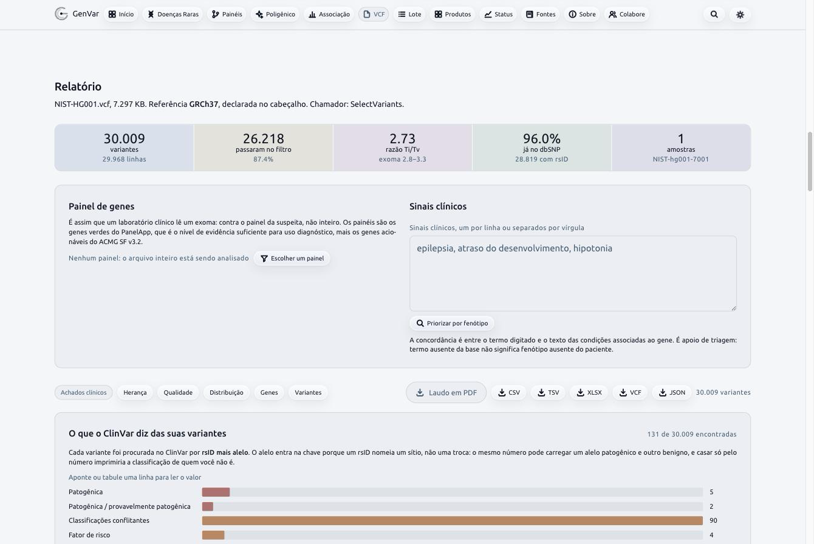

**Cabeçalho do relatório em `/vcf`.** As cinco métricas do arquivo, o painel de genes e o campo de sinais clínicos, com o nome, o tamanho e a referência lidos do próprio cabeçalho do VCF.

Três números da tabela pedem explicação, e nenhum dos três é defeito.

**A referência é GRCh37 e o ClinVar embarcado é GRCh38.** Isso não é um cruzamento entre builds porque o cruzamento não usa coordenada: cada variante é procurada por rsID mais alelo. O rsID nomeia um sítio e é estável entre montagens, e o alelo entra na chave porque o mesmo rsID pode carregar um alelo patogênico e outro benigno. Casar só pelo número imprimiria a classificação de quem o arquivo não tem.

**86 das 131 casadas têm alelo divergente.** É o resultado esperado desse critério, não uma falha: a posição está no ClinVar, o rsID casa, e o alelo que a amostra carrega não é o que a submissão classificou. A anotação registra a divergência em vez de silenciá-la, e é justamente aí que casar só pelo rsID daria uma resposta errada com aparência de certeza.

**A razão Ti/Tv é 2,73, abaixo da faixa de 2,8 a 3,3 que a página imprime ao lado.** A faixa é a esperada para exoma capturado com pipelines atuais, e este é um recorte de 2014 chamado pelo GATK 2.8, anterior à recalibração que empurrou esse número para cima. O valor está onde se espera de um conjunto daquela época, e mantê-lo à vista é o ponto: a página compara o arquivo com a referência em vez de aceitar qualquer número em silêncio.

Conteúdo da pasta:

| Arquivo | O que traz |
|---|---|
| `NIST-HG001-genvar.tsv` | Uma linha por variante, 28 colunas, sete delas de ACMG (critérios, pontos, direção, avaliados, não avaliados, não verificados, pontos por critério) |
| `NIST-HG001-genvar.csv` | O mesmo conteúdo em vírgula, para planilha |
| `NIST-HG001-genvar.json.gz` | Estrutura completa: cabeçalho, métricas, achados, farmacogenômica e cobertura da anotação |
| `NIST-HG001-genvar.pdf` | Laudo em 72 KB, o mesmo que o botão "Laudo em PDF" produz |
| `resumo.json` | Os números da tabela acima, legíveis por máquina |
| `tela-1-resumo.png` | Cabeçalho do relatório e as cinco métricas do arquivo |
| `tela-2-patogenicas.png` | Distribuição das classificações do ClinVar e a tabela das sete patogênicas |
| `tela-3-acmg.png` | Régua do escore ACMG, os sete critérios que dispararam e os vinte e um que este módulo não avalia |

O VCF anotado não está versionado. O hook de pre-commit aceita apenas VCF que declare `##source=genvar-`, marca escrita só pelo gerador de fixtures sintéticas, e o exportador declara `##source=GenVar`. Abrir a regra para o produtor faria o hook aceitar também a exportação de um arquivo de paciente, que é o caso que ele existe para barrar. Os quatro formatos acima carregam o mesmo conteúdo, e o VCF se refaz rodando o script sobre a entrada citada.


## Testes

A suíte separa dois tipos de teste, e a separação é a razão de o build ser confiável: testes de contrato externo reprovam quando um serviço de terceiro muda, fica fora do ar ou limita a taxa, e isso não diz nada sobre o código do projeto.

| Comando | O que roda | Rede |
|---|---|---|
| `pytest` | 64 unitários | não |
| `pytest -m integration` | 12 de contrato externo | sim |
| `pytest -m ""` | os 76 | sim |

```bash
cd backend
pytest
```

Os unitários rodam em cerca de 1,5 s. A marca de integração é aplicada por caminho de arquivo em `tests/conftest.py`, então vale para `test_apis.py` inteiro e continua valendo para o que entrar nele depois.

O `conftest.py` também desliga **o limitador de taxa e o cache**, e as duas coisas por defeito medido, não por comodidade. Todos os testes saem do mesmo IP do `TestClient` e estourariam o teto de requisições juntos, fazendo um teste de doença reprovar por 429 e apontar para o lugar errado. E com o Redis populado por outra execução, `test_detail_degrades_when_constraint_unavailable` reprovava: a rota devolvia o registro cacheado antes de chegar na chamada que o teste havia substituído. Um teste cujo resultado depende de o Redis estar vazio não está testando o código.

Cobertura por arquivo:

| Arquivo | Cobre |
|---|---|
| `test_services.py` | serviços de Ensembl, gnomAD, ClinVar, AlphaFold, UniProt e MyVariant, com mocks |
| `test_disease.py` | busca, paginação e facetas do catálogo de doenças |
| `test_etl.py` | regras de curadoria dos três ETLs: nível de evidência do PanelApp, ancestria e categoria do PGS, prioridade de classificação e tipos causais do Orphanet |
| `test_catalogos.py` | merge dos três catálogos, precedência do curado, unicidade de id, vocabulário de categorias, endpoints de sugestão e de fontes |
| `test_build_catalog.py` | parser do ETL antigo do Orphanet |
| `test_apis.py` | contrato das APIs externas, marcado como integração |
| `test_rate_limit.py` | janela deslizante, isenção da sonda de saúde e leitura do `X-Forwarded-For` a partir do fim |

### Frontend (vitest)

```bash
cd frontend
npm test
```

Cento e cinquenta e três testes em seis arquivos:

| Arquivo | Testes | Cobre |
|---|---|---|
| `vcf/vcf.test.js` | 18 | parser multi-amostra, balanço alélico, Ti/Tv separado, verificação de sexo, heterozigoto composto, análise de trio, espectro de substituição e exportação tabular |
| `vcf/acmg.test.js` | 20 | pontuação de evidência: a tabela de pesos, as fronteiras de faixa, o escore marcado quando um critério entra com ressalva, e a garantia de que nenhum campo do retorno traz o nome de uma faixa |
| `vcf/lote.test.js` | 11 | triagem de coorte: sinais de atenção, genes e variantes recorrentes, arquivo defeituoso sem derrubar o lote, índice do ClinVar indisponível degradando em vez de lançar |
| `vcf/pdf.test.js` | 10 | geração do laudo, tabela longa o bastante para atravessar páginas, largura das colunas dentro da página e ausência de símbolo fora da fonte base do PDF |
| `rotas.test.js` | 5 | toda rota publicada em link existe no roteador |
| `paginas.test.js` | 89 | todo módulo de interface compila e resolve suas importações |

`rotas.test.js` existe por um defeito concreto: a tira de ferramentas publicava links para `/concordancia` e `/cobertura`, que nunca foram construídas. Ferramenta ainda não construída guarda o caminho em `rotaPrevista`, e não em `to`, e o teste tranca isso.

**Os testes leem o resultado esperado do próprio arquivo de teste.** As fixtures em `frontend/public/fixtures/` trazem linhas `##genvar_esperado=` no cabeçalho, escritas por `scripts/gera_vcf_teste.py`, com os números plantados: 12 de novo verdadeiros, 8 sítios sem cobertura parental, 6 compostos em trans, 4 em cis, 5 recessivas homozigotas. O teste compara contra elas em vez de repetir o número no código, então mudar o gerador não faz o teste passar por acidente, e um número que não bate é defeito do código.

O gerador também produz um arquivo deliberadamente ruim, com balanço alélico torto e Ti/Tv de variante nova em 0,89. Sem ele, os controles de qualidade só teriam sido exercitados contra arquivos limpos, que é onde eles não têm o que encontrar.


## Validação quantitativa (suite de benchmark)

Esta seção descreve a metrificação do GenVar desenvolvida para o TCC. O objetivo é produzir evidências quantitativas reprodutíveis sobre desempenho, confiabilidade e reprodutibilidade da ferramenta, em arquivos CSV e figuras PNG prontos para o trabalho escrito e para a apresentação à banca.

São **duas suítes, em duas pastas**, e a divisão é por objeto de medida:

| Pasta | Mede | Escopo |
|---|---|---|
| `benchmark/` | A API: latência, exaustão, tratamento de erro, completude e enriquecimento de payload | Seis suítes, executadas contra o backend |
| `benchmark-v2/` | A plataforma: cada função do pipeline de VCF, sobre um corpus de doze arquivos sintéticos e quatro arquivos reais, mais reprodutibilidade, lote contra individual, cache e catálogos | Sete suítes, a maioria executada no próprio pipeline do navegador |

A primeira nasceu com a versão 2.0 e continua válida: ela cobre o que a API faz. A segunda existe porque a primeira não alcança nada do módulo de VCF, que é onde está o trabalho pesado desta versão, e que até então não tinha um único número medido.

### Benchmark da plataforma (`benchmark-v2/`)

Relatório completo, com todas as tabelas e figuras, em [`benchmark-v2/RELATORIO.md`](benchmark-v2/RELATORIO.md). Metodologia e como reproduzir em [`benchmark-v2/README.md`](benchmark-v2/README.md).

**Corpus.** Doze arquivos sintéticos determinísticos, cada um existente para exercitar um caminho que os outros não alcançam: escala de mil a 600 mil variantes, entrada em `.gz` e em `.zip`, GRCh37, build não declarado, trio com os números de herança plantados no cabeçalho, arquivo com defeitos de rotina e arquivo com cinco amostras. **8% de cada um vem das próprias tabelas do ClinVar embarcado**, e a razão é uma correção de método: a primeira versão usava posição e rsID sorteados, casou 16 variantes em 400.000 e divergiu em 58, ou seja, exercitava o ramo "rsID conhecido, alelo não confere" e deixava resumo clínico, critérios ACMG, filtro por painel e a largura das linhas exportadas medindo o caso vazio.

Mais quatro arquivos reais, de fontes públicas, nunca versionados: o benchmark GIAB HG002 v4.2.1 em GRCh38 (149 MB), um recorte de exoma do GIAB/NIST HG001 (NA12878) em GRCh37, o cromossomo Y do 1000 Genomes com 1.233 amostras, e o arquivo de casos de borda do htslib. O corpus sintético controla a variável; os reais provam que o controle não inventou um mundo mais fácil que o real.

**Reprodutibilidade.** Seis critérios binários por arquivo: TSV, CSV e VCF anotado byte a byte idênticos entre duas execuções; métricas invariantes à ordem das linhas da entrada, verificada com embaralhamento determinístico; e o artefato carregando o SHA-256 da entrada e a versão da compilação do ClinVar. Nove de nove arquivos satisfazem os seis. É a metade da promessa que tempo nenhum mede: um fluxo com oito portais abertos e cópia e cola não tem como sustentá-la.

**Lote contra individual.** Cem arquivos de 25.000 variantes, 2,5 milhões de variantes ao todo: o caminho individual retém **1.766 MB** ao fim e o lote retém **54 MB**, um fator de 33. A memória retida do individual cresce linearmente com a coorte e a do lote não, porque cada arquivo é lido, anotado, resumido e descartado. É esse o número que decide se roda no navegador.

O tempo é a medida frágil das duas e vem com ressalva: o lote termina a mesma coorte entre 1,5 e 1,8 vezes mais rápido, mas o valor absoluto oscilou entre 19 s e 56 s em rodadas diferentes conforme a carga da máquina, enquanto a memória repetiu 1.766 e 54 MB em todas. O ganho de tempo também **depende do cenário**: numa coorte em que todos os arquivos cobrem os mesmos cromossomos, o índice do ClinVar é montado uma vez nos dois caminhos; numa coorte de painéis dirigidos, cada arquivo pagaria a própria montagem, e a união de cromossomos do lote vira ganho. Os dois cenários estão medidos.

As linhas acima de 25 arquivos exigem heap maior que o padrão do Node: com os 2 GB de fábrica, o caminho individual morre antes de terminar a coorte de 50. O teto vigente vai na coluna `teto_heap_mb` de cada linha do CSV, porque é ele que separa "medindo o algoritmo" de "medindo o limite da máquina", e um navegador está bem mais perto do segundo.

**Cache.** Medido por `cache.py` sobre os alvos do conjunto padrão, que é um recorte diferente do da tabela de latência abaixo: busca por gene 4,92 s sem cache contra 5 ms com, fator 1.036; busca por variante 2,52 s contra 2 ms, fator 1.174. Sem cache a resposta é montada encadeando Ensembl, gnomAD, ClinVar e MyVariant; com cache é uma leitura do Redis.

**Limites encontrados.** Medir até quebrar é parte do método, e três limites apareceram:

- **O teto de leitura conta variantes, não genótipos.** A aplicação corta em 400.000 variantes e ignora o número de amostras. O cromossomo Y do 1000 Genomes tem 1.233 amostras: 400.000 variantes dele seriam 493 milhões de genótipos, e o processo morre antes de terminar de ler. O teto correto seria em variantes vezes amostras.
- **`Math.max(...vetor)` estoura a pilha a 400 mil elementos.** Encontrado pelo próprio benchmark, dentro do cálculo de um histograma: espalhar um vetor num argumento gasta uma posição de pilha por item. Corrigido por laço, e o mesmo padrão foi corrigido no Manhattan plot da página de associação.
- **Cinquenta exomas não cabem no caminho individual** com o limite de memória padrão do Node.

**Resultados medidos.** Réplicas e teto de heap declarados em cada tabela, porque são condições que mudam o número.


| Arquivo | Variantes | Leitura | p95 | Anotação ClinVar | Casadas |
|---|---|---|---|---|---|
| `01-pequeno.vcf` | 1.000 | 12 ms | 77 ms | 4.084 ms | 80 |
| `02-medio.vcf` | 25.000 | 596 ms | 697 ms | 208 ms | 2.001 |
| `03-exoma.vcf` | 100.000 | 1.169 ms | 1.696 ms | 519 ms | 8.004 |
| `04-grande.vcf` | 400.000 | 6.902 ms | 13.767 ms | 2.050 ms | 32.012 |

Três réplicas por medida, teto de heap de 12.480 MB. A montagem do índice do ClinVar é medida em separado e custa 3.948 ms, uma vez por sessão e não por arquivo.


**Coorte processada pelos dois caminhos**, cenário de exoma completo, três réplicas:

| Arquivos | Individual | Lote | Retido individual | Retido lote | Fator |
|---|---|---|---|---|---|
| 1 | 0,39 s | 0,24 s | 18 MB | 1 MB | 17,9x |
| 5 | 0,74 s | 0,83 s | 88 MB | 3 MB | 32,4x |
| 10 | 1,50 s | 2,21 s | 177 MB | 5 MB | 33,7x |
| 25 | 8,32 s | 5,16 s | 444 MB | 13 MB | 34,2x |
| 50 | 13,98 s | 8,95 s | 883 MB | 27 MB | 33,2x |
| 100 | 102,01 s | 56,33 s | 1.766 MB | 54 MB | 33,0x |

A memória retida do caminho individual cresce com a coorte e a do lote não. É esse número, e não o tempo, que decide se roda no navegador.


**Latência da API**, mediana de dez réplicas por rota, cache zerado antes de cada medida a frio:

| Rota | Tipo | Sem cache | Com cache | Ganho |
|---|---|---|---|---|
| Fenotipos do gene | externa | 88,20 s | 1.308,7 ms | 67,4x |
| Variantes do gene | externa | 16,05 s | 18,0 ms | 891,8x |
| Detalhe de escore | externa | 8,30 s | 17,3 ms | 479,6x |
| Gene (sem variantes) | externa | 7,70 s | 8,2 ms | 938,8x |
| Variante | externa | 4,05 s | 28,9 ms | 140,2x |
| Variantes por doenca | externa | 3,28 s | 14,4 ms | 227,5x |
| Fontes de dados | interna | 0,66 s | 746,2 ms | 0,9x |
| Detalhe de painel | externa | 0,59 s | 17,4 ms | 33,7x |

**Reprodutibilidade**: 9 de 9 arquivos satisfazem os seis critérios binários (TSV, CSV e VCF idênticos entre execuções; métricas invariantes à ordem das linhas; SHA-256 da entrada e versão da compilação do ClinVar no artefato).


**Corpus**: 12 arquivos sintéticos determinísticos somando 85,8 MB, mais quatro reais de fontes públicas não versionados. Oito por cento de cada arquivo vem das próprias tabelas do ClinVar embarcado.

**Figuras.** No guia da Nature Portfolio: coluna simples 89 mm, coluna dupla 183 mm, sans-serif de 5 a 7 pt, paleta NPG. A figura é desenhada no tamanho final, em milímetros, porque desenhar grande e encolher derruba o corpo do texto junto. `figuras.py` grava cada figura duas vezes, uma no tamanho declarado e outra em `bbox_inches='tight'`, e falha o build se a segunda for maior: `bbox_inches=None` é obrigatório para o tamanho final sair certo, e o preço é que qualquer elemento fora da caixa some cortado, sem aviso. Barra empilhada em eixo logarítmico não existe aqui, porque o comprimento aparente de cada segmento dependeria de onde ele começa.

### Benchmark da API (`benchmark/`)

O que segue descreve a suíte da versão 2.0, ainda válida para os endpoints.

Todas as suítes usam um conjunto de teste padronizado para o MVP (produto mínimo viável) definido em `suites/_targets.py`: 10 genes (MLH1, HBB, MSH2, VHL, LDLR, RB1, BRCA1, TP53, CFTR, PAH) e 10 variantes (rs334, rs1800562, rs6025, rs1799853, rs429358, rs1801133, rs1042522, rs5030858, rs28929474, rs121913529), escolhidos por cobertura das fontes e diversidade clínica. As coordenadas das variantes são GRCh38 (a correção de uma versão anterior em GRCh37, que fazia as chamadas manuais ao gnomAD retornarem vazio).

O mesmo conjunto é medido em dois ambientes para quantificar o custo da containerização: execução local nativa (`results/local/`) e conteinerizada via Docker Compose (`results/docker/`). O script `plot_comparison.py` confronta os dois e gera as figuras comparativas `fig_cmp_*`.

Todos os scripts estão no diretório `benchmark/`.


#### Pré-requisitos

```bash
python3 --version     # 3.12 ou superior
redis-cli ping        # deve retornar PONG (Redis opcional, ver nota abaixo)
```

Instalar dependências do benchmark em um ambiente isolado:

```bash
cd benchmark
python3 -m venv .venv
source .venv/bin/activate
pip install -r requirements.txt
```

O backend deve estar rodando antes de qualquer suíte:

```bash
cd backend
source .venv/bin/activate
uvicorn app.main:app --reload --port 8000
```

**Nota sobre Redis**: as suítes de latência, exaustão e comparativo fazem flush do Redis para garantir runs a frio controlados. Sem Redis, as métricas de speedup de cache não são coletadas, mas as demais métricas funcionam normalmente.


#### Execução

```bash
cd benchmark
python run_benchmarks.py                           # todas as suítes (grava em results/local)
python run_benchmarks.py --suite latency           # suíte individual
python run_benchmarks.py --suite exhaustion
python run_benchmarks.py --suite errors
python run_benchmarks.py --suite comparison
python run_benchmarks.py --suite completeness
python run_benchmarks.py --suite payload
```

Para a comparação entre ambientes, rodar a suite duas vezes, uma com os serviços nativos e outra com `docker compose up`, gravando em diretórios separados:

```bash
python run_benchmarks.py --out results/local       # serviços nativos
python run_benchmarks.py --out results/docker      # serviços conteinerizados
```

Ao final, gerar as figuras. As de um ambiente (`results/local` por padrão) e as comparativas local vs Docker:

```bash
python plot_results.py                             # figuras de um ambiente -> results/local/figures
python plot_comparison.py                          # figuras comparativas   -> results/figures (fig_cmp_*)
```

Nas tabelas de saída das suítes abaixo, `results/` refere-se ao diretório do ambiente medido (`results/local/` por padrão; `results/docker/` na execução conteinerizada).


#### Suíte 1: Latência (`suites/latency.py`)

**O que valida**: o tempo de resposta dos dois endpoints principais (`/api/gene/{symbol}` e `/api/variant/{rsid}`) em condições sem cache (cold) e com cache Redis aquecido (warm).

**Metodologia**:

- Conjunto de teste: os 10 genes e as 10 variantes de `suites/_targets.py`.
- Fase cold: N=12 chamadas por alvo, Redis zerado via `FLUSHDB` antes de cada série, intervalo de 2 s entre chamadas para respeitar o rate limit do Ensembl (15 req/s).
- Fase warm: N=20 chamadas por alvo com cache populado, intervalo de 0,3 s.
- O backend retorna o header `X-Response-Time-Ms` (server-side), que é comparado com o tempo medido pelo cliente para isolar overhead de rede.

**Métricas calculadas**: média, mediana, p95, p99, mínimo, máximo, desvio padrão (todos em ms) e speedup de cache (cold_mean / warm_mean).

**Arquivos de saída**:

| Arquivo | Conteúdo |
|---|---|
| `results/latency_raw.csv` | Uma linha por chamada individual: phase, endpoint, target, run, elapsed_ms, server_ms, status, ok. |
| `results/latency_stats.csv` | Estatísticas agregadas por combinação phase × endpoint × target: n, mean, median, p95, p99, min, max, std. |

**Figuras geradas**:

- `fig_latency_gene.png`: barras agrupadas (cold vs warm) para cada gene, com barra de erro representando o desvio padrão e triângulo marcando o p95. Mostra o impacto do cache no tempo de resposta para consultas de gene.
- `fig_latency_variant.png`: mesmo formato para variantes.
- `fig_cache_speedup.png`: barras horizontais com o fator de speedup por endpoint. Verde indica speedup acima de 10x, azul acima de 3x, âmbar abaixo de 3x.

**Como interpretar**: valores de cold entre 2 s e 8 s são esperados, pois envolvem até cinco chamadas externas, das quais até três em paralelo. Valores de warm abaixo de 50 ms confirmam que o Redis está ativo. Um speedup de 50x ou mais é normal para queries com cache.


#### Suíte 2: Exaustão (`suites/exhaustion.py`)

**O que valida**: o comportamento do sistema sob carga crescente, tanto em requisições sequenciais a taxas controladas quanto em rajadas concorrentes.

**Metodologia**:

- Fase 1 (sequential cold): três níveis de taxa, 0,5 req/s, 1 req/s e 2 req/s, com Redis zerado entre batches. Um batch completa uma passagem pelos seis alvos (três genes e três variantes). Mede degradação de latência e contagem de erros à medida que a taxa aumenta.
- Fase 2 (concurrent warm): cache pré-aquecido com todos os alvos, depois rajadas de 5, 10 e 20 requisições simultâneas via `asyncio.gather`. Mede tempo total da rajada, latência média por requisição e erros.

**Arquivos de saída**:

| Arquivo | Conteúdo |
|---|---|
| `results/exhaustion.csv` | Uma linha por requisição: phase, rate, concurrency, endpoint, target, elapsed_ms, status, ok. |

**Figuras geradas**:

- `fig_exhaustion_concurrent.png`: gráfico de linha com latência média e máxima por nível de concorrência (eixo esquerdo), com barras de erro sobrepostas ao eixo direito. Mostra o ponto em que o sistema começa a degradar.
- `fig_exhaustion_sequential.png`: barras com latência média por taxa de requisição na fase sequencial.

**Como interpretar**: na fase concorrente com cache, o sistema deve responder em menos de 100 ms mesmo com 20 requisições simultâneas, pois o Redis absorve a carga sem acionar APIs externas. Na fase sequencial a frio, o gargalo é o rate limit das APIs externas; erros a 2 req/s indicam que o sistema está no limite do Ensembl sem chave de API.


#### Suíte 3: Tratamento de erros (`suites/errors.py`)

Esta suíte não procura defeitos no GenVar; ela confirma o contrário. O objetivo é mostrar que a plataforma reage de forma correta quando recebe uma entrada errada (um nome de gene impossível, um rs ID mal formado), recusando-a com uma resposta clara em vez de quebrar. Por isso, os códigos 404 e 422 que aparecem nas tabelas abaixo são o resultado esperado e desejado: a API informando que a entrada não é válida. O que seria um problema de fato é um erro 500 (servidor quebrado), e a suíte verifica justamente que isso nunca ocorre. Entradas válidas escritas de formas diferentes (maiúsculas ou minúsculas) são normalizadas e retornam 200.

**O que valida**: a robustez do sistema diante de entradas malformadas ou inválidas. Garante que a API retorna códigos HTTP semânticos corretos (404 para recurso inexistente, 422 para entrada inválida) e nunca retorna 500 para entradas antecipáveis. Em outras palavras, recusar bem uma entrada ruim é o comportamento certo, não uma falha.

**Casos de teste**:

Para `/api/gene/*`:

| Caso | Entrada | Esperado |
|---|---|---|
| Nome inválido | `FAKEGENE123` | 404 |
| Caracteres especiais | `!@#$%^` | 422 |
| Nome muito longo (60 chars) | `AAAAAA...` | 422 |
| Apenas dígitos | `123456` | 422 |
| Símbolo minúsculo válido | `mlh1` | 200 (normaliza) |
| Capitalização mista válida | `mLh1` | 200 (normaliza) |
| Caminho vazio | `_` | 422 |
| Caractere inválido (underscore) | `ACTB_MOUSE` | 422 |

Para `/api/variant/*`:

| Caso | Entrada | Esperado |
|---|---|---|
| rs0 | `rs0` | 404 |
| Sem prefixo rs | `1234567` | 422 |
| Letras no ID | `rsABC` | 422 |
| Prefixo maiúsculo | `RS334` | 200 (normaliza) |
| rs ID muito longo | `rs99999999999999999999` | 422 |
| Variante conhecida | `rs334` | 200 (sanity check) |

**Arquivos de saída**:

| Arquivo | Conteúdo |
|---|---|
| `results/errors.csv` | Uma linha por caso: endpoint, label, input, expected_status, actual_status, pass, elapsed_ms, detail. |

**Figura**: aposentada. A matriz de erros (`fig_errors_matrix.png`) era a única tabela entre as figuras e destoava do padrão gráfico das demais; a robustez passou a ser reportada apenas em texto, a partir de `errors.csv`. A função `fig_errors` segue no `plot_results.py` para referência, fora do `main()`.

**Como interpretar**: todos os 14 casos devem passar (100% de acerto). Aqui, passar significa que a API respondeu com o código certo para cada entrada, ou seja, recusou as inválidas e aceitou as válidas, não que ela tenha apresentado erros. Um FAIL indicaria um problema de validação ou normalização de entrada. A ausência de linhas com status 5xx é o resultado mais importante: demonstra que a API é tolerante a entradas adversariais e não quebra diante delas.


#### Suíte 4: Comparativo manual vs GenVar (`suites/comparison.py`)

**O que valida**: o ganho de tempo que a ferramenta oferece em relação ao fluxo de consulta manual, em que o pesquisador acessa cada banco de dados separadamente.

**Metodologia**: o script simula o fluxo manual chamando cada API externa em sequência, sem paralelismo e sem cache, para as 10 variantes e os 10 genes de `suites/_targets.py`. As chamadas são as mesmas que o backend GenVar faz internamente, mas executadas uma após a outra.

Para variantes (`comparison.csv`):

1. Ensembl VEP: `GET /vep/human/id/{rsid}`.
2. gnomAD: `POST /api` com query GraphQL para frequências.
3. ClinVar: `GET /esearch.fcgi` + `GET /esummary.fcgi`.
4. MyVariant.info: `GET /query?q={rsid}`.

Para genes (`comparison_gene.csv`, via `_manual_gene`):

1. Ensembl lookup: `GET /lookup/symbol/...` para o gene_id.
2. Ensembl overlap: `GET /overlap/...` para as variantes do gene.
3. gnomAD: restrição (constraint) do gene.
4. UniProt: identificador da proteína.
5. AlphaFold: estrutura predita.

O tempo total sequencial (`sequential_api_ms`) é comparado com o tempo do endpoint GenVar sem cache (`genvar_uncached_ms`) e com cache (`genvar_cached_ms`).

O speedup total inclui uma estimativa de 900 s (15 minutos) de processamento humano por variante, baseada em estudos de curadoria manual do ClinGen (Byers et al. 2022, *J Med Genet*; Landrum et al. 2018, *Nucleic Acids Res*). Esse valor representa o tempo que um pesquisador levaria para abrir cada portal, localizar os dados, interpretar a interface e registrar as informações em uma tabela.

**Métricas calculadas**:

| Métrica | Fórmula | Significado |
|---|---|---|
| `api_speedup` | `sequential_api_ms / genvar_uncached_ms` | Ganho obtido pelo paralelismo interno do GenVar. |
| `manual_total_s` | `sequential_api_ms / 1000 + 900` | Tempo total estimado do fluxo manual (APIs + processamento humano). |
| `total_speedup` | `manual_total_s / (genvar_uncached_ms / 1000)` | Ganho total incluindo o tempo humano. |

**Arquivos de saída**:

| Arquivo | Conteúdo |
|---|---|
| `results/comparison.csv` | Uma linha por variante: tempos individuais de cada API, sequential_api_ms, genvar_uncached_ms, genvar_cached_ms, api_speedup, manual_total_s, total_speedup. |
| `results/comparison_gene.csv` | Uma linha por gene: tempos das etapas do fluxo manual (lookup, overlap, gnomAD, UniProt, AlphaFold) e os tempos do GenVar. |

**Figuras geradas**:

- `fig_comparison_speedup.png`: barras agrupadas por variante mostrando `api_speedup` (ganho de paralelismo) e `total_speedup` (ganho total com estimativa humana). A diferença entre as duas barras evidencia o impacto do processamento humano.
- `fig_comparison_breakdown.png`: barras empilhadas com o tempo de cada chamada manual (Ensembl, gnomAD, ClinVar search, ClinVar fetch, MyVariant.info), com um ponto preto sobreposto marcando o tempo total do GenVar. Permite ver visualmente o que o paralelismo elimina.
- `fig_comparison_breakdown_gene.png`: leitura análoga por gene, com o fluxo decomposto em lookup e overlap no Ensembl, restrição no gnomAD, UniProt e AlphaFold. O ponto do GenVar fica próximo ou acima do topo da barra porque, além das mesmas chamadas, o backend agrega no servidor todas as variantes do gene para a distribuição posicional.

**Como interpretar**: o `api_speedup` reflete o ganho da execução paralela. Na variante, três chamadas correm em paralelo (gnomAD, ClinVar e MyVariant.info), enquanto o VEP do Ensembl é sequencial e obrigatório antes delas e costuma ser a etapa mais lenta, o que limita o ganho a algo próximo de 1 a 2 vezes. O `total_speedup` é muito maior (centenas de vezes) porque o denominador é o tempo do GenVar em segundos, enquanto o numerador inclui 15 minutos de processamento humano.


#### Suíte 5: Completude de dados (`suites/completeness.py`)

**O que valida**: a fração de campos do schema de resposta que são preenchidos para cada alvo de teste. Identifica quais campos são sistematicamente nulos em todos os alvos, o que caracteriza limitações das APIs externas (não da ferramenta).

**Metodologia**: para cada resposta JSON, todos os campos de primeiro nível e um nível aninhado são contados. Um campo é considerado preenchido se não for `null`, não for uma lista vazia e não for uma string vazia. O score de completude é `filled / total * 100`.

Alvos testados: os 10 genes e as 10 variantes de `suites/_targets.py`.

**Arquivos de saída**:

| Arquivo | Conteúdo |
|---|---|
| `results/completeness.csv` | Uma linha por alvo: total_fields, filled_fields, null_fields, completeness_pct. |
| `results/completeness_null_fields.csv` | Uma linha por campo, ordenada por fill_rate_pct crescente. Campos com fill_rate_pct = 0 são limitações das APIs. |

**Figuras geradas**:

- `fig_completeness.png`: barras horizontais por alvo coloridas por faixa de completude (verde acima de 80%, azul-petróleo acima de 60%, âmbar abaixo). Cada barra exibe o percentual e a contagem `filled/total`.

**Como interpretar**: completude abaixo de 80% para um dado alvo indica que alguma API não retornou dados para aquela consulta específica. O arquivo `completeness_null_fields.csv` separado permite distinguir campos que são nulos por limitação da API (fill_rate 0% em todos os alvos) de campos que são nulos apenas para alvos específicos (limitação de cobertura do banco de dados para aquele gene ou variante).


#### Suíte 6: Enriquecimento de payload (`suites/payload.py`)

**O que valida**: a vantagem de agregação da ferramenta, medida pelo número de campos estruturados que o GenVar retorna em uma única chamada comparado ao que cada API individual retorna separadamente.

**Metodologia**: para cada alvo, o script realiza:

1. Uma chamada ao endpoint GenVar e conta os campos do JSON de resposta.
2. Chamadas individuais a cada API externa, também contando os campos retornados.

O **enrichment ratio** é calculado como `genvar_fields / max(individual_api_fields)`, onde o denominador é o maior número de campos retornado por qualquer API isolada.

Para variantes: Ensembl VEP, gnomAD, ClinVar e MyVariant.info.
Para genes: Ensembl lookup, UniProt e gnomAD constraint.

**Métricas calculadas**:

| Métrica | Significado |
|---|---|
| `genvar_fields` | Campos preenchidos na resposta do GenVar. |
| `max_single_api_fields` | Máximo de campos entre todas as APIs individuais. |
| `total_raw_api_fields` | Soma de todos os campos de todas as APIs (sem deduplicação). |
| `enrichment_ratio` | genvar_fields / max_single_api_fields. |
| `num_apis_aggregated` | Número de APIs consultadas por consulta. |

**Arquivos de saída**:

| Arquivo | Conteúdo |
|---|---|
| `results/payload.csv` | Uma linha por alvo com todas as métricas acima. |
| `results/payload_per_api.csv` | Uma linha por combinação alvo × API: fields, bytes. |

**Figuras**: aposentadas. As figuras de enriquecimento (`fig_enrichment_variant.png`, `fig_enrichment_gene.png`, `fig_enrichment_ratio.png`) foram retiradas porque a contagem bruta de campos por fonte não traduz valor informacional e induz leitura equivocada (sem o MyVariant.info, a contagem da GenVar para variantes fica abaixo da do ClinVar). A consolidação de fontes passou a ser reportada apenas em texto, a partir de `payload.csv`. A função `fig_enrichment` segue no `plot_results.py` para referência, fora do `main()`.

**Como interpretar**: o `enrichment_ratio` mede quantas vezes a resposta do GenVar tem mais campos do que a API individual mais rica. O dado continua em `payload.csv`, mas é interpretado com cautela: a contagem de campos varia muito com o que cada fonte devolve no momento e não corresponde linearmente ao valor para o usuário.


#### Outputs completos da suite

| Arquivo CSV | Suite | Descrição |
|---|---|---|
| `latency_raw.csv` | Latência | Uma linha por chamada individual (cold e warm). |
| `latency_stats.csv` | Latência | Estatísticas por endpoint/alvo/fase. |
| `exhaustion.csv` | Exaustão | Uma linha por chamada, com fase, taxa e concorrência. |
| `errors.csv` | Erros | Um caso por linha com resultado esperado vs obtido. |
| `comparison.csv` | Comparativo | Tempo manual vs GenVar e speedups por variante. |
| `comparison_gene.csv` | Comparativo | Tempo manual vs GenVar por gene (etapas do fluxo manual). |
| `completeness.csv` | Completude | Score de completude por alvo. |
| `completeness_null_fields.csv` | Completude | Taxa de preenchimento por campo, ordenada crescente. |
| `payload.csv` | Enriquecimento | Campos GenVar vs APIs individuais, enrichment ratio. |
| `payload_per_api.csv` | Enriquecimento | Campos e bytes por API e alvo. |

Figuras de um ambiente (`plot_results.py`, salvas em `results/local/figures/`):

| Figura PNG | Suite | O que mostra |
|---|---|---|
| `fig_latency_gene.png` | Latência | Cold vs warm para genes, com p95 marcado. |
| `fig_latency_variant.png` | Latência | Cold vs warm para variantes. |
| `fig_cache_speedup.png` | Latência | Fator de speedup do cache por endpoint. |
| `fig_comparison_speedup.png` | Comparativo | API speedup e total speedup por variante. |
| `fig_comparison_breakdown.png` | Comparativo | Tempo empilhado por API vs ponto GenVar (variante). |
| `fig_comparison_breakdown_gene.png` | Comparativo | Tempo empilhado por etapa vs ponto GenVar (gene). |
| `fig_exhaustion_concurrent.png` | Exaustão | Latência e erros vs nível de concorrência. |
| `fig_exhaustion_sequential.png` | Exaustão | Latência média por taxa sequencial. |
| `fig_completeness.png` | Completude | Completude percentual por alvo. |

As figuras de enriquecimento (`fig_enrichment_*`) e a matriz de erros (`fig_errors_matrix.png`) foram aposentadas; as funções correspondentes seguem no `plot_results.py` fora do `main()`.

Figuras comparativas local vs Docker (`plot_comparison.py`, salvas em `results/figures/`):

| Figura PNG | O que mostra |
|---|---|
| `fig_cmp_latencia_gene.png` | Latência de gene (sem cache e com cache), local vs Docker. |
| `fig_cmp_latencia_variante.png` | Latência de variante (sem cache e com cache), local vs Docker. |
| `fig_cmp_cache.png` | Aceleração por cache por consulta, local vs Docker. |
| `fig_cmp_concorrencia.png` | Latência sob rajadas concorrentes, local vs Docker. |
| `fig_cmp_sequencial.png` | Latência por taxa sequencial (gene e variante), local vs Docker. |
| `fig_cmp_speedup_variante.png` | Aceleração da paralelização por variante, local vs Docker. |
| `fig_cmp_breakdown_variante.png` | Fluxo manual (host) e GenVar local vs Docker, por variante. |
| `fig_cmp_breakdown_gene.png` | Fluxo manual (host) e GenVar local vs Docker, por gene (* genes de alto volume). |
| `fig_cmp_completude.png` | Completude por consulta, local vs Docker (* sem resposta no Docker). |


## Notas técnicas sobre as APIs

Discrepâncias identificadas durante os testes e documentadas em `API_TESTING_REPORT.md`:

1. **gnomAD**: o campo `af` não existe no tipo `VariantPopulation`. A frequência é calculada no backend como `ac / an`.
2. **gnomAD**: o campo de restrição é `oe_lof_upper` (LOEUF), não `loeuf` como aparece em alguns exemplos antigos.
3. **gnomAD**: IDs de população são minúsculos (`afr`, `amr`) e incluem subconjuntos com separador `:` (por exemplo `hgdp:japanese`) que são filtrados pelo sistema.
4. **ClinVar**: o campo `clinical_significance` foi substituído por `germline_classification` na API atual.
5. **ClinVar**: a busca retorna múltiplos UIDs (VCV e RCV). O sistema faz batch fetch e seleciona o registro com maior número de condições associadas (VCV agregado).
6. **AlphaFold**: o endpoint retorna array. `[0]` corresponde ao modelo canônico.
7. **MyVariant.info**: preferir HGVS genômico (`chr{chr}:g.{pos}{ref}>{alt}`) quando há coordenadas do VEP. Em caso de falha, o sistema recorre à busca por `dbsnp.rsid`.

As chaves de cache são versionadas (`gene:v6:`, `genevars:v1:`, `genephen:v2:`, `variant:v3:`, `disease:v1:`, `diseasevars:v1:`, `panel:v1:`, `pgs:v3:`) para invalidar respostas antigas após mudanças no schema.


## Estratégia de produto

O GenVar é gratuito e de código aberto. Não há plano pago, conta de usuário nem cobrança prevista. O código é MIT e os dados vêm de bases públicas, cada uma sob a sua licença.

### Para quem

| Público | Uso |
|---|---|
| Geneticista clínico e residente | consultar doença, gene e variante em português, com restrição gênica e significância do ClinVar na mesma tela |
| Pesquisador de genética humana | catálogo consultável por API, sem raspagem de portal |
| Estudante e professor | material de aula com dado real e fonte citável |
| Paciente e família | catálogo de doenças raras em português, com sinais clínicos e o que existe no SUS |

### O que já está disponível

| Recurso | Estado |
|---|---|
| Catálogo de doenças raras (3.739) | disponível |
| Painéis de genes (434) | disponível |
| Escores poligênicos (6.982) | disponível |
| Associação por burden (44 fenótipos, 20.033 genes) | disponível |
| Enriquecimento ao vivo de gnomAD, ClinVar, Ensembl, AlphaFold e UniProt | disponível |
| Interface em português, incluindo nomes de doença e fenótipos | disponível |
| API HTTP pública, sem chave | disponível |
| Quatro modos de cor e operação por teclado | disponível |

### O que diferencia

A agregação de bases públicas em uma interface única não é original: Varsome, Franklin, MARRVEL e a Open Targets Platform fazem isso, com mais recursos. O que o GenVar tem e essas ferramentas não têm:

1. Interface e conteúdo em português do Brasil, incluindo 94% dos nomes de doença pela tradução oficial do Orphanet e os fenótipos HPO pela tradução oficial do HPO.
2. Contexto do sistema de saúde brasileiro: cobertura no SUS, protocolo PCDT e triagem neonatal por doença.
3. Frequência alélica em coorte brasileira, ao lado da gnomAD, que sub-representa ancestralidade admixada.
4. A ponte entre o raro e o poligênico na mesma tela, com o fundo poligênico modulando a penetrância de uma variante monogênica.

Os itens 1 e 4 estão implementados. Os itens 2 e 3 são a lacuna declarada abaixo.

### Lacunas conhecidas

Números medidos, não estimados:

| Lacuna | Situação |
|---|---|
| Contexto SUS e PCDT | 8 de 3.739 doenças (0,2%) |
| Triagem neonatal | 4 doenças |
| Prevalência brasileira | 4 doenças |
| Frequência alélica brasileira (ABraOM) | 0 variantes; a camada existe e está vazia |
| Limite de taxa na API | **implementado**: 60/min e 10/s por IP, com o IP lido a partir do fim do X-Forwarded-For |
| Exportação de dados próprios | **implementada** no módulo de VCF: laudo em PDF, VCF anotado, CSV, TSV, XLSX e JSON |
| Contas e dados por usuário | fora do escopo, e por decisão: o módulo de VCF não guarda nada porque o arquivo não sobe |
| Procedência dos sumários de burden | não registrada; os números não devem ser citados como resultado de estudo |

A camada brasileira é o que separa o GenVar de um agregador a mais, e ela está 0,2% construída. Enquanto isso não mudar, a posição defensável do projeto é a de ferramenta em português, não a de ferramenta brasileira.

### Fontes candidatas, verificadas

Alcançáveis e sem chave de acesso, testadas:

| Fonte | O que acrescenta | Volume |
|---|---|---|
| ABraOM (coorte SABE) | frequência alélica brasileira | 609 exomas, 50 MB |
| Open Targets Platform | associação gene-doença com escore de evidência e fármacos ligados ao alvo | 1.359 associações só para BRCA1 |
| openFDA | eventos adversos notificados de medicamentos | API pública |
| NCBI E-utilities | artigos de revisão por doença | API pública |
| BiPMed | variantes de coortes brasileiras | portal público |

### Contribuição

O repositório aceita contribuição. Os pontos de entrada com maior efeito são os dados brasileiros: cada doença com protocolo no SUS mapeada, cada frequência de coorte nacional integrada, cada tradução de fenótipo revisada por quem trabalha na clínica.


## Licença

O código é MIT.

Os dados vêm de bases públicas, cada uma sob a sua própria licença, e três delas exigem atribuição:

| Fonte | Licença | Atribuição obrigatória |
|---|---|---|
| Orphanet | CC BY 4.0 | sim |
| Genomics England PanelApp | CC BY 4.0 | sim |
| PGS Catalog | CC BY 4.0 | sim |
| AlphaFold DB | CC BY 4.0 | sim |
| UniProt | CC BY 4.0 | sim |
| Ensembl | Apache 2.0 | não |
| gnomAD | CC0 1.0 | não |
| ClinVar | domínio público (NCBI) | não |

A atribuição fica em `/fontes`, alcançável de qualquer página pelo item Fontes da barra de navegação, e em `GET /api/sources`, com licença, uso e citação formal por fonte. Quem redistribuir estes dados fora do GenVar precisa cumprir as mesmas licenças.
