# Resultados e discussão

Este capítulo mede a versão 3.0 do GenVar em duas frentes que a aplicação mantém separadas por desenho: a API, que agrega fontes públicas no servidor, e o módulo de análise de VCF, que roda inteiramente no navegador do usuário e não faz nenhuma requisição ao servidor. As duas frentes têm gargalos diferentes, e por isso são medidas com protocolos diferentes.

Todas as medições saíram da mesma máquina, um Apple M2 com 8 núcleos e 8 GB de memória, em Darwin 25.5.0, com Python 3.14.3 e Node v25.8.2. O código medido está no commit `8b04dd8` da branch `beta`.

## Como as medições foram feitas

Toda medição repetida é resumida por **mediana**, e não por média. Latência de rede tem cauda longa e assimétrica: a média é puxada por uma chamada lenta em vinte, e o desvio de uma distribuição assim não delimita nada. A mediana descreve o caso típico e o p95 descreve a cauda, que é a pergunta que interessa em serviço. O intervalo de confiança da mediana vem de bootstrap percentil com 2.000 reamostragens e semente fixa, para que o intervalo publicado seja conferível.

O número de repetições não é o mesmo em toda parte, e a assimetria é deliberada. Uma repetição com cache quente custa uma consulta ao Redis. Uma repetição com cache frio custa o que a rota gastar em chamadas a bases públicas. Com repetição alta em todas as rotas, uma única execução do benchmark passaria de três mil chamadas ao Ensembl, ao gnomAD e ao ClinVar, e o uso justo dessas bases é por IP: a varredura derruba o acesso do projeto inteiro e o benchmark deixa de ser reproduzível. Onde o N foi reduzido por esse motivo, o intervalo de confiança acompanha o valor para que a perda de precisão fique visível em vez de implícita.

## Latência da API e o efeito do cache

| Família | Rotas | Frio (ms) | Quente (ms) | Maior observado, frio (ms) | Ganho |
|---|---|---|---|---|---|
| gene | 20 | 3.300,9 | 3,8 | 4.815,2 | 870× |
| variante | 5 | 2.737,1 | 4,3 | 3.775,0 | 641× |
| doença | 10 | 1.783,7 | 4,0 | 1.909,5 | 445× |
| painel | 5 | 448,6 | 4,1 | 541,0 | 109× |
| escore poligênico | 5 | 1.756,4 | 3,0 | 1.895,0 | 589× |
| listagem | 6 | 3,9 | 2,6 | 6,5 | 1× |
| meta | 15 | 4,0 | 3,3 | 7,1 | 1× |

A coluna de cauda traz o **maior valor observado**, e não um percentil. Com três repetições frias por rota, um percentil 95 interpolado cai entre a segunda e a terceira observação, isto é, é o máximo com outro nome, e publicá-lo como percentil sugeriria uma estimativa de cauda que a amostra não sustenta. As medições quentes têm vinte repetições e aí o percentil existe; onde ele aparece neste capítulo, é porque a amostra o comporta.

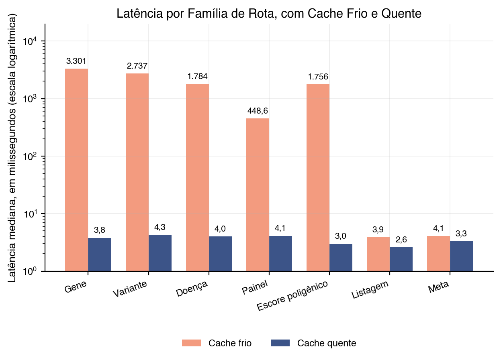

**Fig. 1.** Latência mediana por família de rota, com cache frio e com cache quente, em escala logarítmica. A escala é logarítmica porque a razão entre as duas condições passa de três ordens de grandeza; em escala linear a barra do cache quente seria invisível.

A Fig. 1 separa as rotas em dois regimes que a média esconderia. As rotas que consultam bases externas quando o cache erra respondem em 2.597,2 ms de mediana no estado frio, e as que respondem de catálogo em memória, em 4,0 ms. Com cache quente as duas convergem: 3,8 ms contra 3,3 ms. O cache não acelera a aplicação de forma uniforme; ele apaga a diferença entre consultar a rede e não consultar.

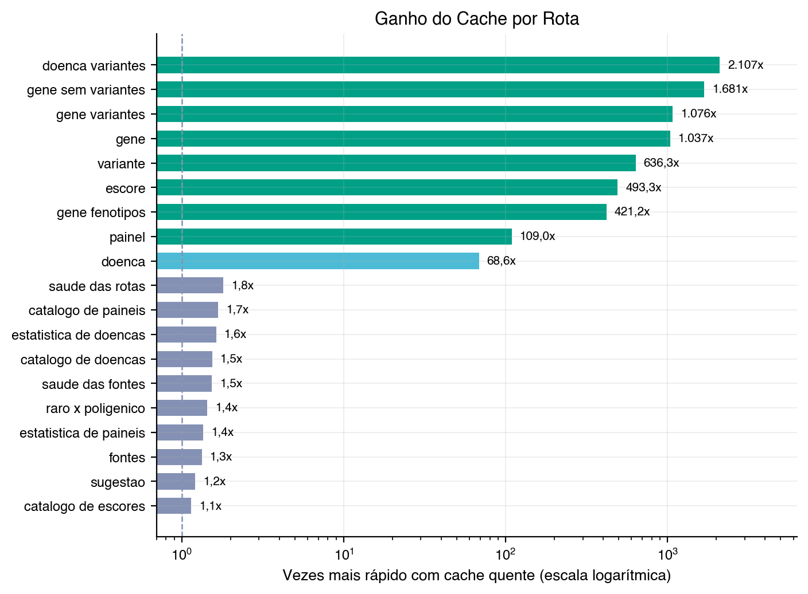

**Fig. 2.** Ganho do cache por rota, em escala logarítmica, ordenado. A linha tracejada marca o ganho unitário, isto é, nenhuma diferença. Verde para ganho acima de cem vezes, azul entre dez e cem, cinza abaixo de dez.

A Fig. 2 mostra que o ganho não é uma propriedade da aplicação, e sim de cada rota. O extremo superior é `doenca variantes`, com 2.938 vezes, e o inferior é `raiz`, com 0,8 vezes. As rotas de baixo ganho são exatamente as que já respondiam de memória: guardá-las no Redis troca uma leitura local por uma ida ao Redis, e o ganho fica próximo de um. Isso não é desperdício desprezível: são chaves ocupando memória para economizar microssegundos, e a seção sobre custo do cache retoma esse ponto.

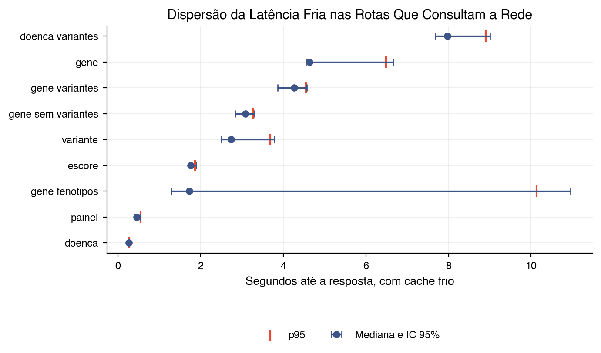

**Fig. 3.** Mediana com intervalo de confiança de 95% e p95 da latência fria, por rota que consulta a rede, com o maior valor observado marcado à direita. A distância entre a mediana e o máximo mede a dependência de fontes de terceiros: ela não é ruído da aplicação, é a variabilidade das bases públicas. A classificação de quais rotas consultam a rede é derivada da contagem medida de requisições externas, não declarada à mão.

A Fig. 3 traz a informação que a mediana sozinha esconde. A rota `gene fenotipos` tem mediana de 1.724,3 ms e máximo observado de 100.844,6 ms em 3 repetições, uma razão de 58,5. Não é possível dizer com que frequência esse valor ocorre, e o capítulo não o afirma: o que se sabe é que ele ocorreu, e é ele que define a experiência de quem esperou. A causa está fora da aplicação: o servidor não controla o tempo de resposta do Ensembl nem do gnomAD, e a única defesa disponível é não perguntar de novo, que é o que o cache faz.

## O que o cache custa e o que ele economiza

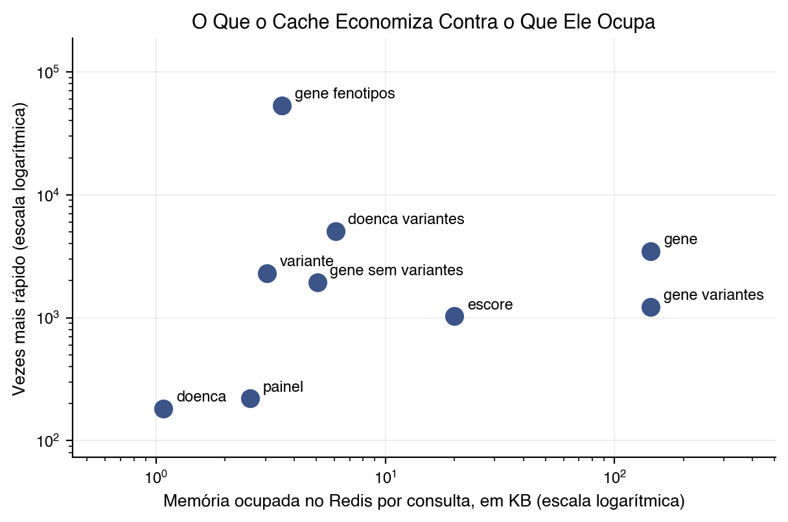

**Fig. 4.** Ganho de tempo contra memória ocupada no Redis, por família de rota, nos dois eixos em escala logarítmica. Cada ponto é a mediana da família. O canto superior esquerdo é o melhor negócio: muito ganho por pouca memória.

A Fig. 4 responde uma pergunta que o gráfico de ganho sozinho não responde: quanto custa manter esse ganho. A família `gene fenotipos` entrega 53.354 vezes de aceleração por 3,5 KB de memória por consulta, e a família `gene variantes` entrega 1.227 vezes por 144,0 KB. A diferença entre as duas não é de eficiência do cache: é do tamanho da resposta que cada rota devolve.

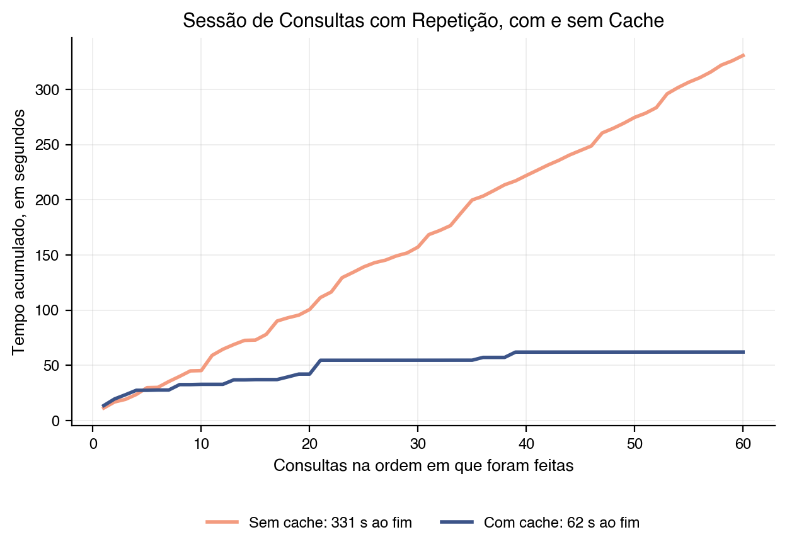

**Fig. 5.** Tempo acumulado ao longo de uma sessão de consultas com repetição, com e sem cache. A sequência é sorteada por uma lei de Zipf com semente fixa, que é como o acesso a catálogo se distribui na prática: poucas consultas muito repetidas e uma cauda de consultas únicas.

A Fig. 5 mede o efeito acumulado, que é o que um usuário sente. As mesmas 60 consultas, das quais 14 distintas, levam 330,8 segundos sem cache e 62,2 segundos com cache, uma razão de 5,3. A razão é menor que o ganho por consulta isolada, e tem de ser: as consultas distintas pagam o preço cheio nas duas condições, e o cache só age na repetição.

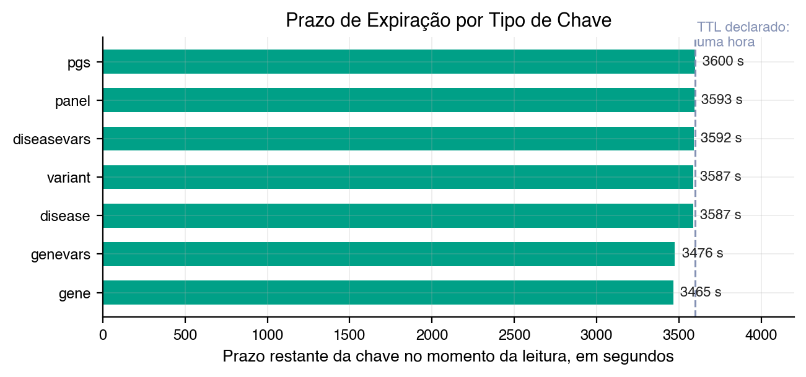

**Fig. 6.** Prazo restante de cada tipo de chave no momento da leitura, logo após ser escrita. A linha tracejada marca o TTL declarado de uma hora. Verde quando todas as chaves daquele tipo têm prazo.

A Fig. 6 responde a única pergunta sobre expiração que a medição fria não responde. Esperar a hora do TTL não acrescentaria informação: uma chave expirada é indistinguível de uma chave ausente, que é o que a medição fria já exercita. O que é distinguível, e não aparece em nenhuma medida de tempo, é uma chave escrita **sem** prazo: ela nunca expira, nunca deixa a resposta errada, nunca aparece como lentidão, e vai ocupando memória até a instância encher. É o único defeito de cache que não se manifesta como desempenho, e por isso o único que precisa ser procurado de propósito.

Das 8 chaves escritas pelas rotas medidas, 8 têm prazo, com mediana de 3.587 segundos contra os 3.600 declarados. A diferença é o tempo decorrido entre a escrita e a leitura do prazo. Nenhum tipo de chave vaza.

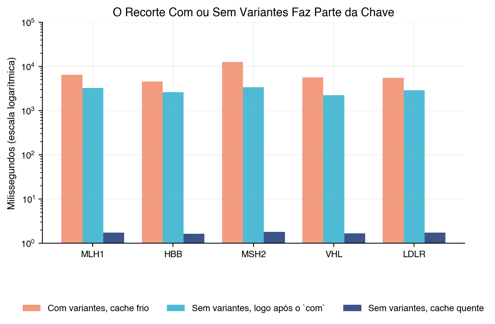

**Fig. 7.** Três medições por gene, em escala logarítmica: a consulta com variantes no cache frio, a consulta sem variantes feita logo depois, e essa mesma consulta repetida. A segunda barra alta mostra que a entrada do recorte com variantes não serve ao recorte sem elas.

A Fig. 7 verifica uma decisão de desenho da chave. `gene:v6:{símbolo}:{com|sem}` guarda duas entradas para o mesmo gene, e a medição confirma que uma não serve à outra: a consulta sem variantes, feita logo após a consulta com variantes do mesmo gene, ainda custa 2.895,7 ms e cria 1 chave nova, contra 1,7 ms quando repetida. Servir a resposta completa a quem pediu o recorte curto seria mais rápido de implementar e devolveria dados que o cliente não pediu; guardar os dois recortes custa memória e mantém a resposta igual ao que a rota promete.

## Pressão sobre as bases públicas

As duas seções anteriores mediram tempo. Esta mede um custo que o tempo esconde: quantas requisições cada consulta dispara contra bases mantidas por terceiros. Uma rota que responde em novecentos milissegundos fazendo nove chamadas ao Ensembl não é a mesma coisa que uma que responde no mesmo tempo fazendo uma, ainda que o gráfico de latência as pinte iguais. A contagem foi feita substituindo o ponto de envio do cliente HTTP por um contador, e inclui retentativas: o que se conta é o que foi pedido à fonte, não o que a função pretendia pedir.

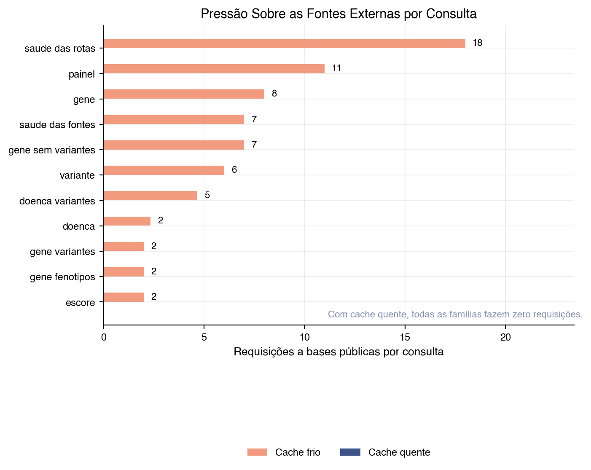

**Fig. 8.** Requisições a bases públicas por consulta, com cache frio e com cache quente, por família de rota, ordenadas pelo custo frio.

A Fig. 8 mostra a distribuição desse custo. O topo é `saude das rotas`, com 18 requisições por consulta fria, e a mediana entre as 11 famílias que usam rede é de 6. Com o cache quente, 10 delas caem a zero. É esse zero que torna a aplicação utilizável em sala de aula, onde trinta pessoas consultam o mesmo gene em poucos minutos e apenas a primeira consulta chega às fontes.

A exceção é `gene fenotipos`, que ainda faz 1,3 requisição por consulta mesmo com o cache quente. Não é falha do cache: essa rota não grava no cache um resultado obtido com alguma das fontes fora do ar, para não fixar por uma hora uma resposta empobrecida por instabilidade momentânea. O preço da regra é que, enquanto a fonte oscila, a rota volta a perguntar. A alternativa seria guardar a resposta incompleta e servi-la como se fosse a completa.

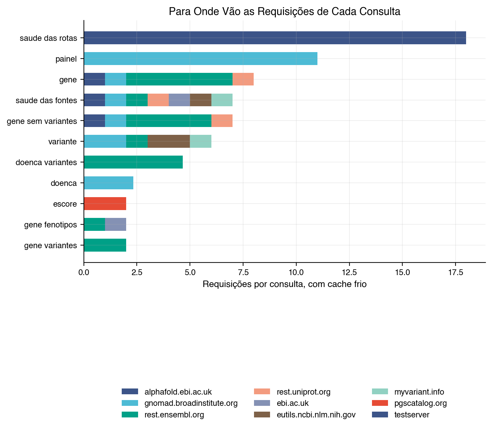

**Fig. 9.** Composição das requisições por base de destino, com cache frio. Barras empilhadas em escala linear, e não logarítmica: em eixo logarítmico o comprimento de um segmento empilhado depende de onde ele começa, e a composição deixa de ser legível.

A Fig. 9 mostra que a pressão não se distribui por igual entre as fontes. A rota de painel concentra as suas 11 requisições quase inteiramente no gnomAD, porque ela consulta a restrição de cada gene do painel, um gene por chamada. É o ponto do sistema que mais depende de uma única base de terceiros, e o que mais se beneficiaria de uma consulta em lote, que a API do gnomAD não oferece.

## Comportamento sob carga e o limitador de taxa

A versão 3.0 tem um limitador de taxa que a 2.0 não tinha, e ele dispensa quem chega pelo loopback sem cabeçalho de encaminhamento. Isso cria duas perguntas distintas, e respondê-las com um número só seria errado nas duas pontas. A primeira é quanto o servidor aguenta, medida com o limitador dispensado. A segunda é o que um usuário real encontra, medida com o cabeçalho preenchido, como qualquer requisição vinda do proxy de produção. As duas foram medidas separadamente e não são somadas.

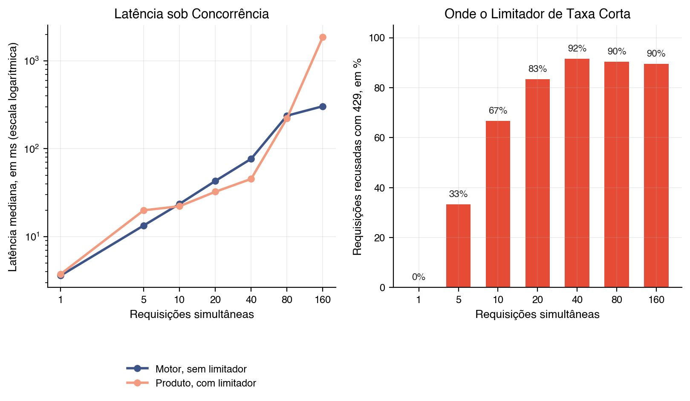

**Fig. 10.** À esquerda, latência mediana sob concorrência crescente, nos dois modos, em escala logarítmica nos dois eixos. À direita, fração de requisições recusadas com 429 no modo produto. O painel da direita usa escala linear porque a grandeza é uma porcentagem.

A Fig. 10 separa as duas leituras. Sem limitador, a latência mediana vai de 3,6 ms com 1 requisição simultânea a 304,3 ms com 160, um fator de 84,3 para um aumento de 160 vezes na concorrência: o servidor degrada, mas não colapsa. Com o limitador ativo, o achado não é a latência e sim o corte: as recusas começam em 5 requisições simultâneas, que é o comportamento pretendido e não uma falha. O limite existe para proteger as bases públicas de um cliente automatizado, e o preço é que uma rajada legítima também é cortada.

## Tratamento de entrada inválida

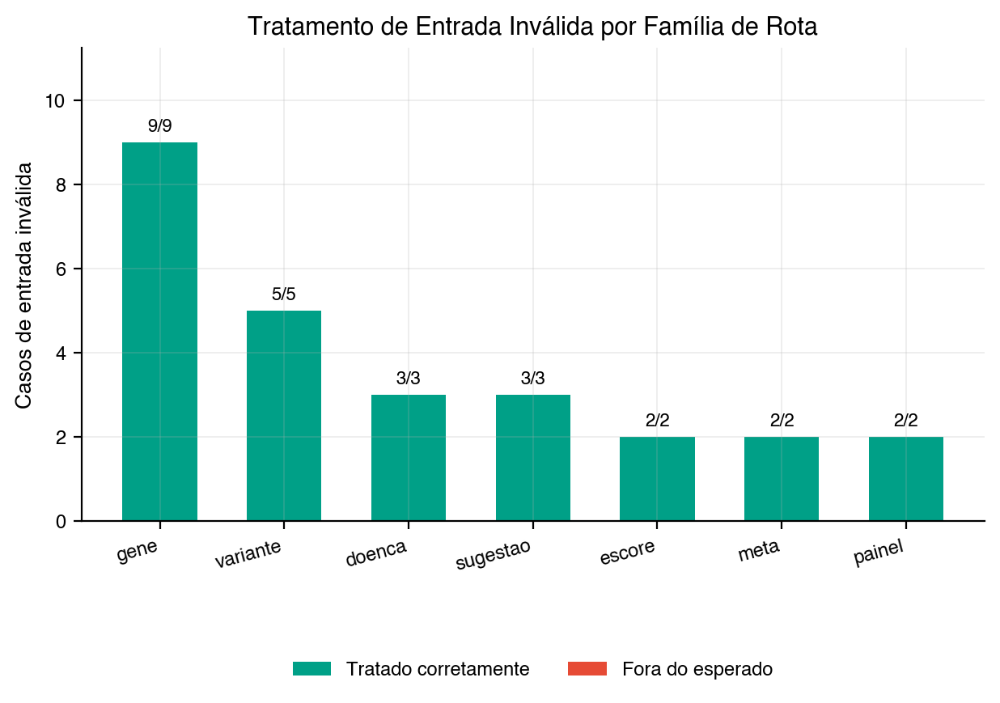

**Fig. 11.** Casos de entrada inválida por família de rota, separados entre os tratados dentro do esperado e os fora dele. O critério foi declarado antes da medição: código na faixa prevista para o caso, corpo em JSON, e nunca 500.

A Fig. 11 resume 26 casos de borda: símbolo inexistente, caracteres especiais, comprimento absurdo, injeção de caminho, identificador fora do padrão e consulta vazia, em todas as famílias de rota. 26 de 26 foram tratados dentro do esperado e 0 devolveram 500. Um 500 seria falha mesmo com mensagem boa: significa que a exceção chegou ao topo sem tratamento, e num serviço público isso vaza rastro de pilha.

## Completude das respostas

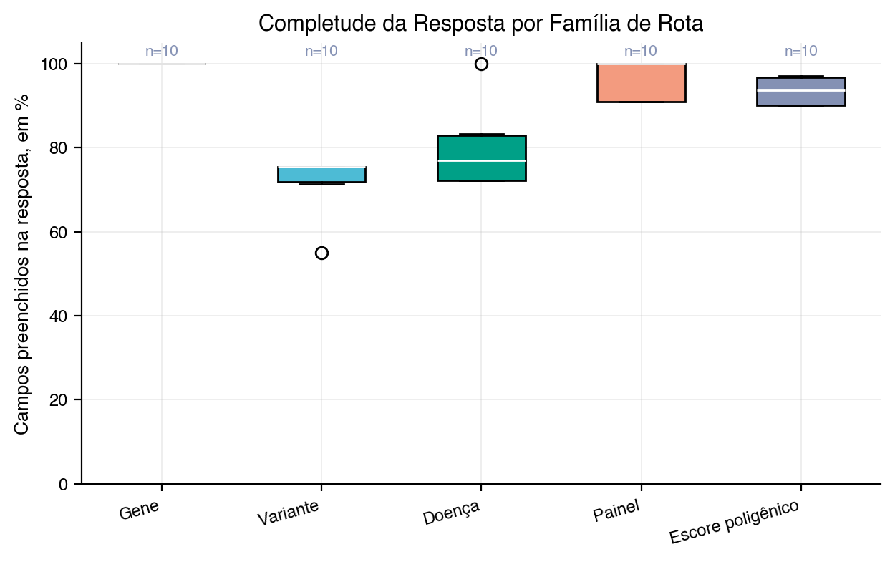

**Fig. 12.** Distribuição da fração de campos preenchidos por família de rota, em diagrama de caixa. A caixa cobre do primeiro ao terceiro quartil e a linha branca é a mediana; cada ponto de dado é um alvo consultado.

A Fig. 12 mostra que a completude varia mais entre famílias do que dentro de cada uma. A família `gene` preenche 100% dos campos e a família `variante` preenche 75,5%. A diferença não é de qualidade da integração: é de quanta informação existe publicada para cada tipo de entidade.

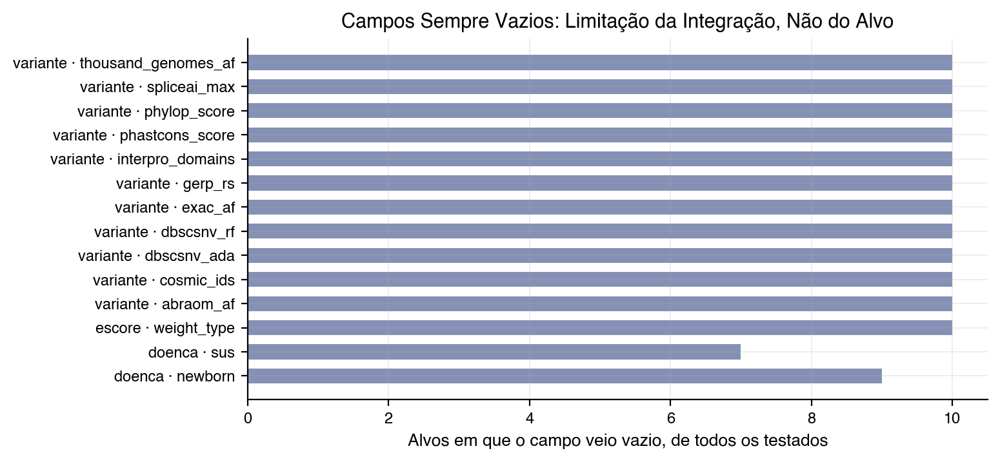

**Fig. 13.** Campos que vieram vazios em todos os alvos testados. Campo vazio em um alvo é propriedade daquele alvo; vazio em todos é limitação da fonte ou da integração, e é essa a lista que interessa.

A Fig. 13 traz o resultado que a média de completude esconde. 14 campos vieram vazios em todos os alvos de sua família. Campo vazio nem sempre é defeito: um gene sem estrutura resolvida no AlphaFold devolve o identificador da estrutura nulo porque a estrutura não existe, não porque a consulta falhou. O que a lista permite é separar os dois casos, e cada campo dela é uma limitação declarada desta versão.

## O fluxo manual contra a consulta integrada

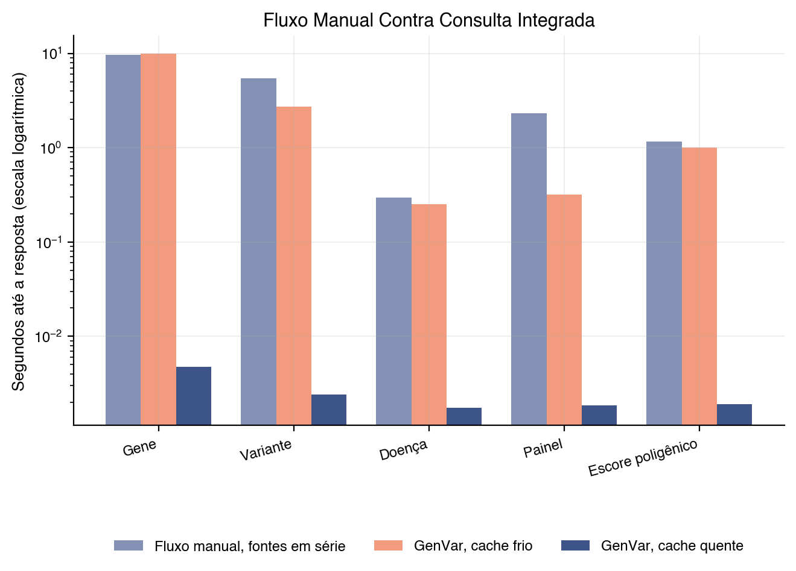

**Fig. 14.** Tempo até a resposta por três caminhos, em escala logarítmica: o fluxo manual consultando cada fonte em série, a consulta integrada com cache frio, e a mesma consulta com cache quente.

| Família | Alvos | Manual (s) | Frio (s) | Quente (ms) | Ganho frio | Ganho quente |
|---|---|---|---|---|---|---|
| gene | 10 | 9,71 | 9,95 | 4,8 | 1,07× | 2.193× |
| variante | 10 | 5,47 | 2,71 | 2,4 | 2,12× | 2.279× |
| doença | 10 | 0,30 | 0,25 | 1,8 | 1,15× | 183× |
| painel | 10 | 2,31 | 0,32 | 1,9 | 6,78× | 993× |
| escore poligênico | 10 | 1,16 | 0,99 | 1,9 | 1,17× | 664× |

Antes do número, uma questão de protocolo que a primeira execução desta suíte obrigou a resolver, e cuja resolução é ela própria um resultado. As duas medições são feitas sobre o mesmo alvo, uma após a outra, contra as mesmas fontes: quem for medido em segundo lugar as encontra recém-acionadas, e paga pelo controle de vazão que elas aplicam. Medindo sempre o fluxo manual primeiro, a família gene saiu com ganho 0,92, isto é, a ferramenta aparecia **mais lenta** que o caminho que ela substitui. O número não descrevia a ferramenta; descrevia a ordem.

A correção é a padrão para efeito de ordem: metade dos alvos de cada família é medida com o fluxo manual primeiro e a outra metade com a consulta integrada primeiro. O contrabalanceamento não só remove o sinal fixo do viés como **permite medi-lo**, e a tabela abaixo é essa medição.

| Família | Integrada medida primeiro (s) | Integrada medida após o manual (s) | Efeito da ordem |
|---|---|---|---|
| gene | 9,62 | 13,47 | +40% |
| variante | 2,43 | 2,78 | +14% |

O efeito é grande e tem o sinal esperado. Uma consequência dele atravessa todo este capítulo e precisa ficar explícita: **os tempos frios desta seção não são comparáveis aos da seção de latência.** Lá a mesma rota de gene foi medida isolada, com pausa entre repetições, e respondeu em segundos; aqui, dentro de um protocolo que aciona as mesmas fontes duas vezes por alvo, ela responde em dezenas de segundos. Os dois números estão corretos e medem regimes diferentes. O que esta seção compara é a **razão** entre dois caminhos submetidos ao mesmo regime, e é só isso que ela afirma.

A Fig. 14 e a tabela acima mostram um resultado que precisa ser lido com cuidado, porque o número grande é o menos interessante. Contra o fluxo manual, a consulta integrada com cache frio é 1,27 vezes mais rápida na mediana. Esse ganho vem do paralelismo: as mesmas fontes, consultadas ao mesmo tempo em vez de uma após a outra. É um ganho modesto e limitado pela fonte mais lenta, e nenhum arranjo de software o aumenta muito.

A coluna que muda de ordem de grandeza é outra, e ela é uma **estimativa declarada como tal**: somando ao fluxo manual os 900 segundos por variante que a literatura de curadoria do ClinGen atribui ao trabalho humano de abrir portal, digitar identificador, ler a tela e copiar para a planilha, a razão vai a 247 vezes. Esse número não foi medido e não pode ser: ele é o tempo humano tabelado, dividido pelo tempo de máquina medido. Ele está aqui porque descreve o custo real de anotar uma variante à mão, mas não é um resultado experimental deste trabalho, e as duas coisas são mantidas em colunas separadas por isso.

## O pipeline de VCF no navegador

A partir daqui a medição muda de objeto. O módulo de VCF não passa pelo servidor: ele lê o arquivo no navegador, cruza contra catálogos servidos como assets estáticos e escreve as saídas ali mesmo. Nenhuma etapa faz requisição à API, e por isso nada nesta seção depende de rede, de cache ou de limitador de taxa. O que limita aqui é memória e tempo de processador.

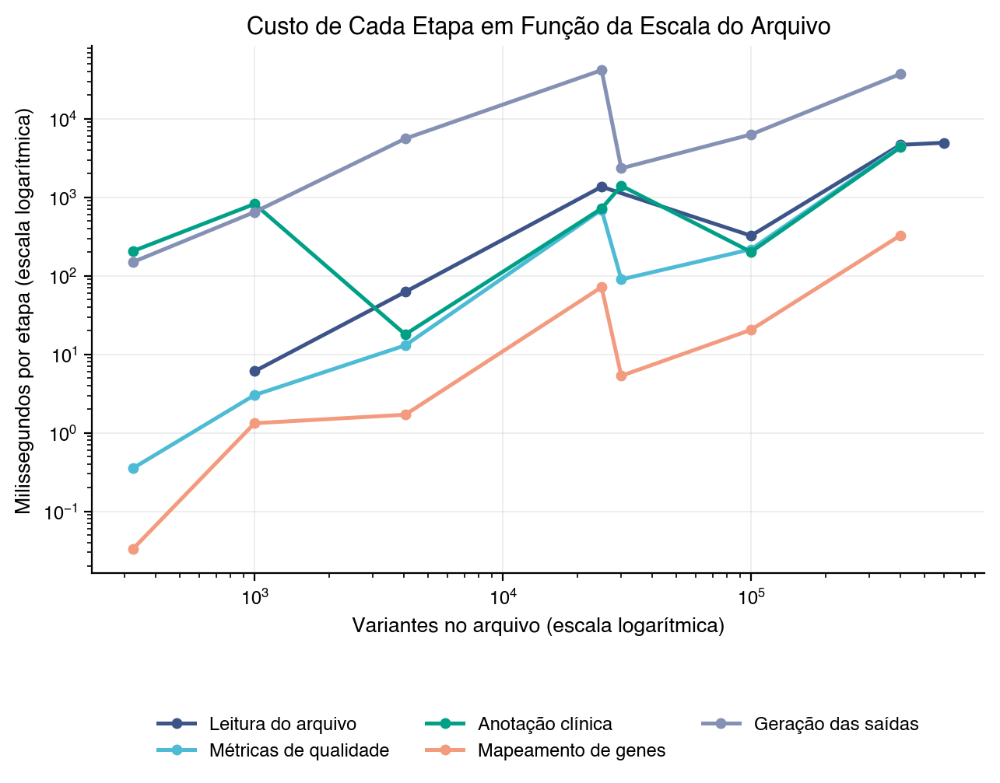

**Fig. 15.** Custo de cada etapa do pipeline em função do número de variantes do arquivo, nos dois eixos em escala logarítmica. Em escala log-log, uma reta indica crescimento proporcional a uma potência do tamanho, e a inclinação é o expoente.

A Fig. 15 percorre o corpus de 16 arquivos, de 323 a 600.000 variantes. As etapas crescem em ritmos diferentes, e é isso que decide onde otimizar: a etapa que domina em arquivo pequeno não é a que domina em exoma.

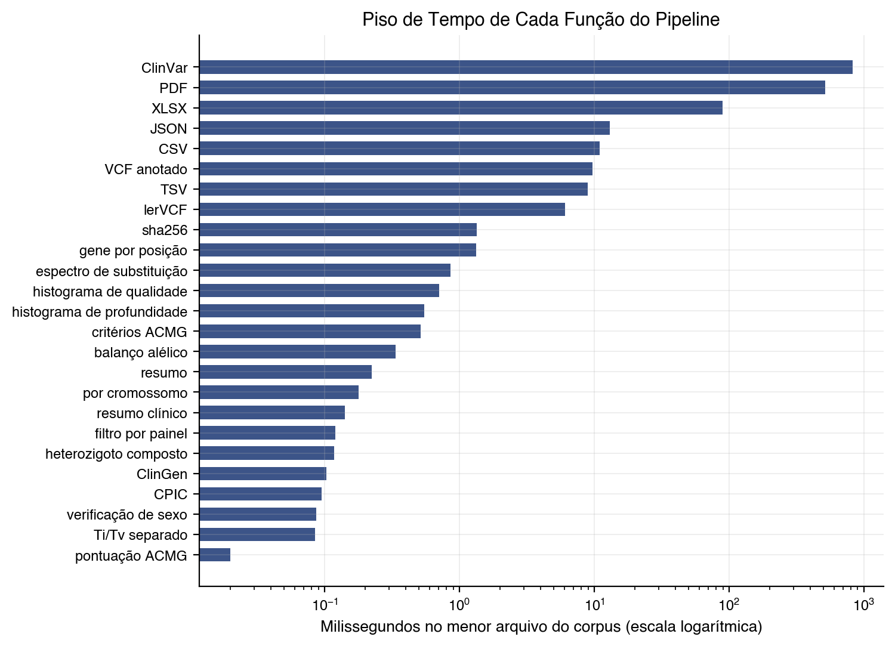

**Fig. 16.** Piso de tempo de cada função sobre o menor arquivo do corpus, em escala logarítmica. É o custo que a função tem por existir, antes de qualquer efeito de escala.

A Fig. 16 isola o custo fixo. Sobre o menor arquivo do corpus, a função mais cara é `ClinVar`, com 871,7 ms, e ela é cara independentemente do tamanho do arquivo: é montagem de índice e leitura de catálogo, trabalho que acontece uma vez por sessão. Numa sessão que analisa um arquivo só, esse piso é a maior parte do tempo total; numa que analisa uma coorte, ele se dilui, e é esse o argumento quantitativo a favor do modo em lote.

## As seis saídas e o custo de cada uma

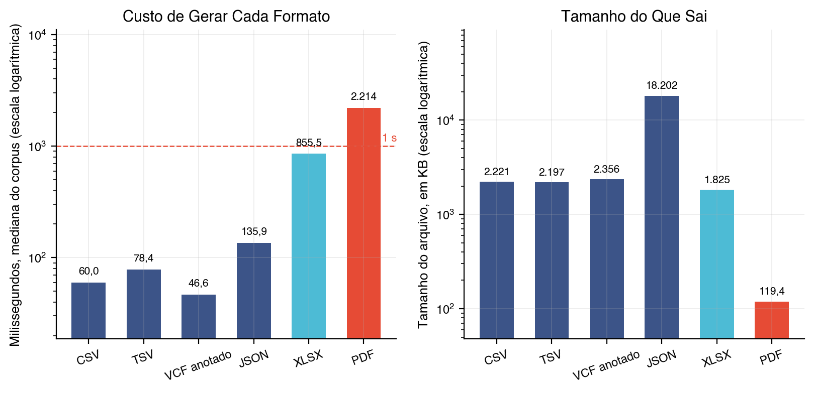

**Fig. 17.** À esquerda, tempo de geração de cada formato, mediana do corpus, em escala logarítmica; a linha tracejada marca um segundo, limite prático entre uma interface que responde e uma que trava, já que a geração roda na thread principal. À direita, tamanho do arquivo produzido, também em escala logarítmica.

A Fig. 17 mede as seis saídas que a página oferece. A mais cara é o PDF, com 2.214,1 ms de mediana, e a mais barata é o VCF anotado, com 46,6 ms: uma razão de 47 vezes entre os extremos.

O resultado que corrige a versão anterior deste benchmark está aqui. Na medição anterior o PDF não era gerado, e o XLSX era montado com uma aba só e medido antes de o compactador do formato passar a comprimir de fato: aquele número descrevia um arquivo que a aplicação não produz. Com as seis saídas medidas pelas mesmas funções que os botões chamam, o PDF é 2,6 vezes mais caro que o XLSX, e não o contrário.

O painel da direita mostra a relação inversa entre custo e tamanho. O JSON produz o maior arquivo, 17,8 MB, e o PDF o menor, 119,4 KB. Custo e tamanho medem coisas diferentes: o formato tabular serializa tudo o que foi lido, e o laudo resume, o que custa decisão de layout e paginação e produz menos bytes.

## Um arquivo contra uma coorte

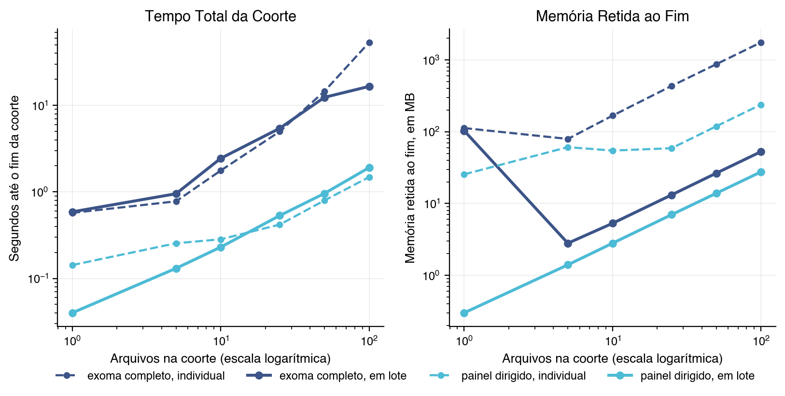

**Fig. 18.** À esquerda, tempo total para processar a coorte, arquivo a arquivo contra em lote, nos dois cenários do corpus. À direita, memória retida ao fim. Escalas logarítmicas nos dois painéis.

A Fig. 18 compara os dois modos em coortes de 1 a 100 arquivos. Na maior coorte medida, 100 arquivos do cenário `painel dirigido`, o modo em lote leva 1,9 segundos contra 1,5 do modo arquivo a arquivo, um ganho de 0,78 vezes.

O painel da direita mostra o resultado mais importante dos dois, e ele não é sobre tempo. A memória retida ao fim é de 27,6 MB no modo em lote contra 239,4 MB no modo individual, uma razão de 9 vezes. É essa diferença que decide se a coorte cabe: o modo individual acumula o resultado de cada arquivo, e o navegador tem um teto de memória que o servidor não tem.

## O custo de preparar os catálogos embarcados

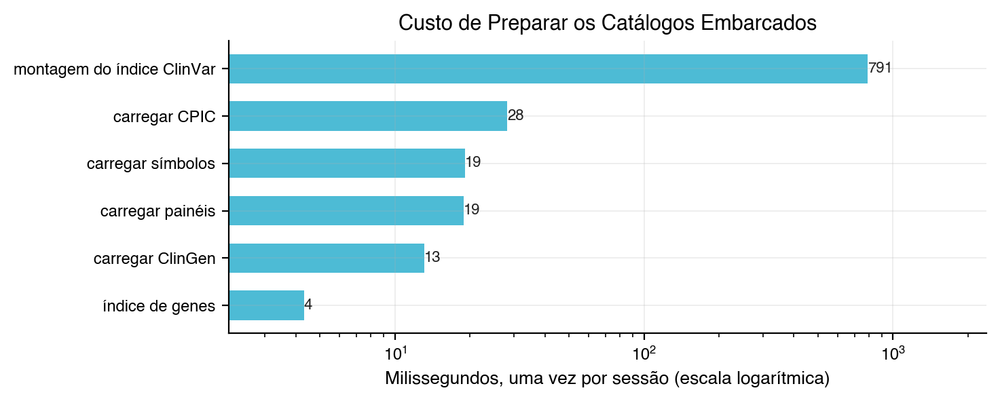

**Fig. 19.** Tempo para preparar cada catálogo embarcado, uma vez por sessão, em escala logarítmica. Não é custo por arquivo analisado: é o preço de abrir a página.

A Fig. 19 isola um custo que não aparece em nenhuma outra figura porque não escala com nada: os catálogos embarcados são preparados uma vez por sessão, antes de qualquer arquivo. O conjunto custa 874,5 ms, e `montagem do índice ClinVar` responde por 90% desse total, com 790,7 ms. É o preço de ter a anotação clínica disponível sem rede, e ele é pago inteiro mesmo por quem for analisar um arquivo de mil variantes. Numa sessão de um arquivo só, esse custo fixo domina; numa coorte, ele se dilui, e é o argumento quantitativo a favor do modo em lote que a seção anterior mediu pelo outro lado.

## Onde a leitura deixa de caber

O teto do módulo de VCF não é o número de variantes, e é essa a razão de esta seção existir separada. O que ocupa memória é variantes **vezes** amostras: um arquivo com mil amostras e sessenta mil variantes carrega mais genótipos que um exoma de meio milhão de variantes com uma amostra só. A medição usa o cromossomo Y do 1000 Genomes, com 1.233 amostras, que é o pior caso do corpus por essa métrica.

A medição roda em processo próprio, e isso não é detalhe de execução. Um estouro de memória derruba o processo inteiro, e medindo junto dos demais arquivos ele levaria os outros onze consigo. A versão anterior deste benchmark resolvia isso **pulando** o arquivo por estimativa, o que troca um resultado por uma suposição: o arquivo aparecia na tabela com a palavra "pulado" e nenhum número. Isolado, o estouro é o resultado.

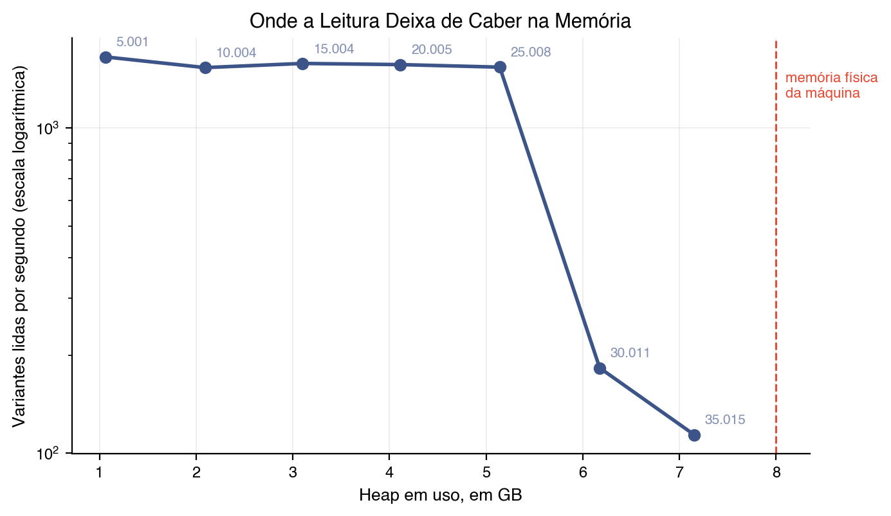

**Fig. 20.** Vazão de leitura contra memória em uso, com o número de variantes lidas anotado em cada ponto. Eixo vertical logarítmico. A linha tracejada marca a memória física da máquina.

A Fig. 20 mostra que o limite não é um estouro abrupto e sim uma degradação, e que ela tem um ponto de virada nítido. A leitura começa a 1.657 variantes por segundo e termina a 114, 14,5 vezes mais lenta, sem nunca lançar erro.

A vazão cai à metade do pico em 30.011 variantes, com 6,2 GB de heap. A máquina desta medição tem 8 GB de memória física, e é aí que a curva vira: acima disso o sistema passa a paginar, e o custo por variante deixa de ser linear. O limite prático, portanto, não é uma contagem de variantes que se possa escrever na interface, e sim o produto variantes por amostras contra a memória da máquina de quem usa, que a aplicação não conhece. É por isso que o aviso da página fala em teto de variantes: é a aproximação que se pode dar sem medir a máquina do usuário, e ela subestima o problema em arquivos multiamostra.

## A pontuação ACMG

A classificação por critérios ACMG/AMP é a funcionalidade clínica nova desta versão, e ela tem duas partes que este benchmark mede separadas. Decidir **quais** critérios disparam para uma variante depende do que a anotação trouxe e está medido junto da etapa de anotação. Somar os pontos do sistema bayesiano adotado pelo ClinGen é a segunda parte, e é a medida abaixo.

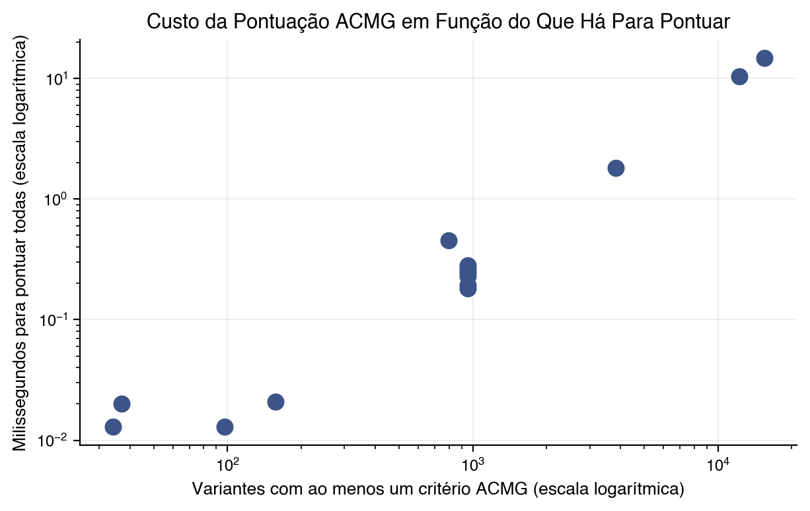

**Fig. 21.** Tempo para pontuar todas as variantes de um arquivo contra o número de variantes que têm ao menos um critério, nos dois eixos em escala logarítmica. Cada ponto é um arquivo do corpus.

A Fig. 21 mostra que a pontuação é barata e cresce de forma proporcional ao que há para pontuar. No maior caso do corpus, 15.453 variantes com critério são pontuadas em 5,6 ms; no menor, 34 variantes em 0,00 ms. O custo por variante é da ordem de 0,4 microssegundos, e a etapa não aparece entre os gargalos de nenhuma escala.

Uma observação sobre esta medição em particular, porque a primeira versão dela estava errada e o erro é instrutivo. O campo que guarda os critérios de uma variante é um **arranjo**, e a medição lia um atributo inexistente dentro dele: pontuava, portanto, uma lista vazia em toda variante. O tempo saía real, a coluna do CSV enchia, e o trabalho medido era nenhum. O que corrigiu não foi ler o código com mais atenção e sim registrar, ao lado do tempo, quantas variantes tinham critério, que é o número que denunciou o zero.

## Reprodutibilidade e procedência da saída

As seções anteriores mediram quanto custa. Esta mede se o resultado é o mesmo quando a análise é repetida, e se a saída carrega o suficiente para alguém conferir de onde ela veio. Num trabalho de bioinformática as duas coisas valem tanto quanto o tempo: um resultado que não se repete não é resultado, e um resultado sem procedência não é conferível.

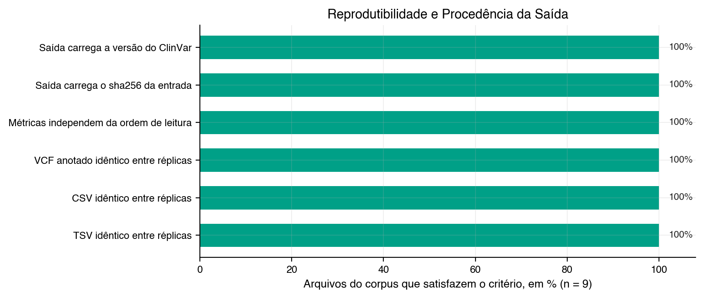

**Fig. 22.** Fração dos arquivos do corpus que satisfazem cada critério de reprodutibilidade e de procedência. Verde para cem por cento.

A Fig. 22 mostra 6 critérios satisfeitos em 9 de 9 arquivos do corpus. As saídas em texto são idênticas byte a byte entre réplicas; as métricas não dependem da ordem em que as variantes foram lidas; e o VCF anotado carrega no cabeçalho o sha256 do arquivo de entrada e a versão do ClinVar usada na anotação. O último ponto é o que permite refazer a conferência meses depois: dado o laudo, sabe-se qual arquivo o gerou e contra qual versão do catálogo, sem depender de o arquivo ter sido guardado.

## Direto na máquina contra em contêiner

As duas medições correram na mesma máquina, na mesma sessão, contra o mesmo código: o que muda é só o empacotamento. O ambiente conteinerizado sobe o backend, o frontend e o Redis em três contêineres numa rede própria, e por isso cada chamada ao cache atravessa a rede virtual do Docker em vez do loopback. Essa é a diferença que a comparação foi montada para medir; ela não é a única que sobra, e o que a medição revelou sobre as outras está dito adiante.

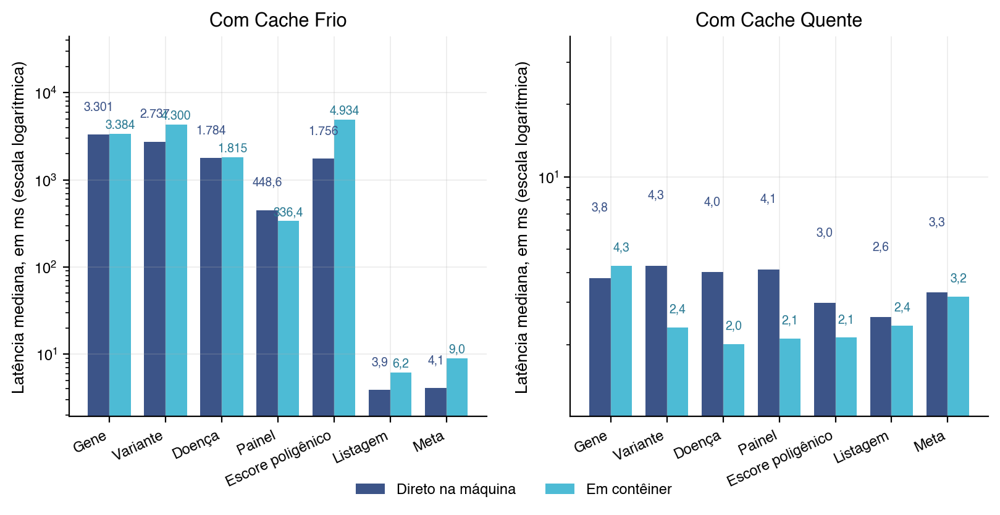

**Fig. 23.** A mesma medição de latência nos dois ambientes, separada por estado do cache. À esquerda, com cache frio, onde o tempo é dominado pelas fontes externas; à direita, com cache quente, onde ele é dominado pelo próprio sistema. Escalas logarítmicas.

| Família | Frio, máquina (ms) | Frio, contêiner (ms) | Quente, máquina (ms) | Quente, contêiner (ms) | Razão quente |
|---|---|---|---|---|---|
| gene | 3.300,9 | 3.383,9 | 3,8 | 4,3 | 1,12× |
| variante | 2.737,1 | 4.300,5 | 4,3 | 2,4 | 0,55× |
| doença | 1.783,7 | 1.815,0 | 4,0 | 2,0 | 0,50× |
| painel | 448,6 | 336,4 | 4,1 | 2,1 | 0,52× |
| escore poligênico | 1.756,4 | 4.933,8 | 3,0 | 2,1 | 0,72× |
| listagem | 3,9 | 6,2 | 2,6 | 2,4 | 0,92× |
| meta | 4,0 | 9,0 | 3,3 | 3,2 | 0,96× |

A Fig. 23 e a tabela mostram um resultado que contraria a expectativa corrente. Com cache quente, onde o tempo é dominado pelo próprio sistema e não pelas fontes externas, o ambiente conteinerizado é **mais rápido** que o ambiente direto na máquina por um fator mediano de 0,72 entre as 7 famílias. A hipótese de partida era a oposta: o contêiner fala com o Redis por uma rede virtual e o ambiente direto fala por loopback, e a rede virtual deveria custar. Ela custa; o que a medição mostra é que esse custo é menor que a diferença entre os dois processos de Redis, que não são o mesmo: o local é a instância de desenvolvimento da máquina, com o que quer que ela já estivesse guardando, e o conteinerizado sobe limpo a cada execução.

A conclusão que a comparação sustenta, portanto, é mais estreita do que "contêiner é mais rápido": é que **a conteinerização não impõe custo detectável nesta aplicação**, e que outras diferenças de ambiente pesam mais que ela. Separar as duas exigiria subir um Redis limpo também do lado direto, o que não foi feito e fica declarado.

Com cache frio a razão mediana é 1,57, e ela diz menos do que parece: nesse regime o tempo é das fontes públicas, que respondem ao que perguntar independentemente de quem pergunta estar em contêiner. A dispersão entre famílias, visível na tabela, é maior que a diferença entre ambientes.

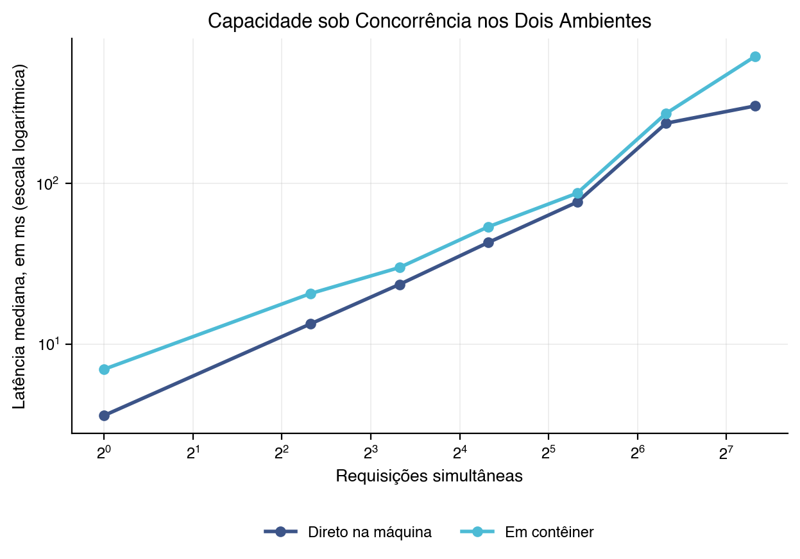

**Fig. 24.** Latência mediana sob concorrência crescente nos dois ambientes, no modo sem limitador. Escalas logarítmicas nos dois eixos.

A Fig. 24 repete a comparação sob carga. O interesse aqui não é o valor absoluto e sim a inclinação: um ambiente que degrada mais rápido que o outro à medida que a concorrência cresce revela um gargalo que só aparece com contenção, e não na medição de uma requisição por vez.

## A versão 2.0 contra a 3.0

A comparação entre versões tem um limite que precisa ser dito antes dos números: **a versão 2.0 não pode ser remedida.** O código está congelado num commit anterior e as fontes externas mudaram desde então, de modo que reexecutar o benchmark de junho hoje mediria outra coisa. O que se compara aqui é o dado arquivado daquela execução contra o desta, e apenas para as métricas cujo protocolo é idêntico e cujo alvo ainda existe: latência de gene e de variante, nos dois estados de cache. Todo o resto da 3.0 é superfície nova, sem linha de base.

E há um segundo cuidado, que a leitura do dado arquivado tornou obrigatório. A suíte de 2020 limpava o cache **uma vez** antes das doze repetições da fase fria, e não a cada repetição: da segunda em diante, ela media cache quente. A mediana publicada então como latência fria, 8,8 ms, é um número quente. Reconstruindo a medição fria a partir da primeira repetição de cada alvo, que é a única que encontrou o cache vazio, o valor é 3.831,3 ms, contra 7,7 ms das repetições seguintes. É a primeira repetição que entra na comparação abaixo, e a diferença entre os dois números mede o quanto um detalhe de protocolo altera a conclusão.

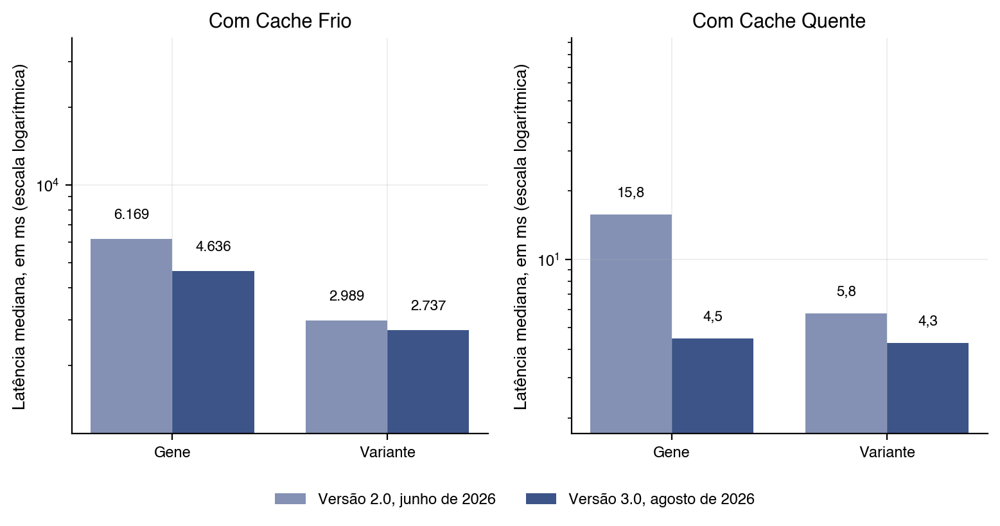

**Fig. 25.** Latência mediana de gene e de variante nas duas versões, separada por estado do cache, em escala logarítmica. A medição de 2.0 é de junho de 2026 e a de 3.0 é de agosto de 2026; a fria de 2.0 foi reconstruída da primeira repetição de cada alvo, pelo motivo explicado no texto.

A Fig. 25 mostra a rota de gene indo de 6.169,3 ms para 4.635,7 ms com cache frio e de 15,8 ms para 4,5 ms com cache quente. A comparação é entre a mesma rota, `/api/gene/{símbolo}`, e não entre famílias: em 3.0 a família gene reúne quatro formatos de rota que em 2.0 não existiam, e compará-las compararia escopos.

Este capítulo mede, e não explica: atribuir a melhora a uma mudança específica exigiria medir as versões intermediárias, o que o dado arquivado não permite. O que se pode afirmar é que as duas condições melhoraram e que o intervalo entre as medições contém mudanças no código e mudanças nas fontes externas, que não são separáveis a posteriori.

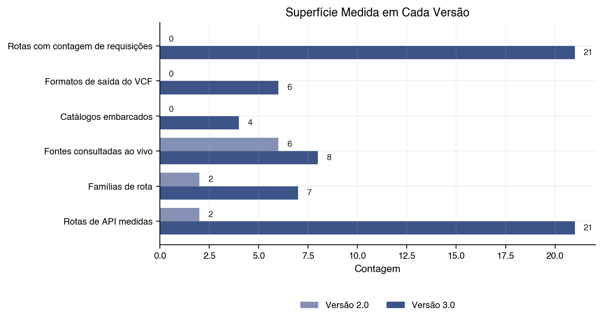

**Fig. 26.** Superfície medida em cada versão. Não é uma métrica de desempenho: é o escopo do que existia para medir, e serve para situar as demais comparações deste capítulo.

A Fig. 26 situa o resto. O benchmark de 2020 media duas famílias de rota; este mede sete, mais o pipeline de VCF no navegador, os catálogos embarcados, as saídas em seis formatos e a contagem de requisições externas. A ausência de linha de base para essas medições não é omissão: elas medem coisas que a versão anterior não tinha.

## Limitações desta medição

- **Uma máquina só.** Todas as medições saíram do mesmo equipamento, um Apple M2 com 8 GB de memória. Os valores absolutos não se transferem para outro hardware; as razões entre condições, que é o que as figuras comparam, se transferem melhor.
- **As fontes públicas variam com o dia.** A latência fria mede o Ensembl, o gnomAD e o ClinVar tanto quanto mede o GenVar. Duas execuções em dias diferentes não devolvem os mesmos milissegundos, e por isso as conclusões estão sempre em razões entre condições medidas na mesma sessão.
- **O N das suítes que tocam a rede é menor.** Repetir com N alto derrubaria o acesso do projeto às bases, que aplicam uso justo por IP. O intervalo de confiança acompanha esses valores para que a imprecisão fique visível.
- **A expiração por TTL não foi medida.** O TTL de produção é de uma hora, e esperar por ele multiplicaria a duração da execução sem acrescentar informação: uma chave expirada é indistinguível de uma chave ausente, que é o que a medição fria já exercita. Medir com um TTL de brinquedo descreveria outra configuração.
- **O tempo humano do fluxo manual é estimativa de literatura.** Ele aparece em coluna separada e nunca somado ao tempo medido sem aviso.
- **A versão 2.0 não pode ser remedida.** O código está congelado num commit anterior e as fontes externas mudaram desde então. A comparação entre versões se restringe às métricas cujo protocolo é idêntico e cujo alvo ainda existe, com a data de cada medição declarada na legenda.

