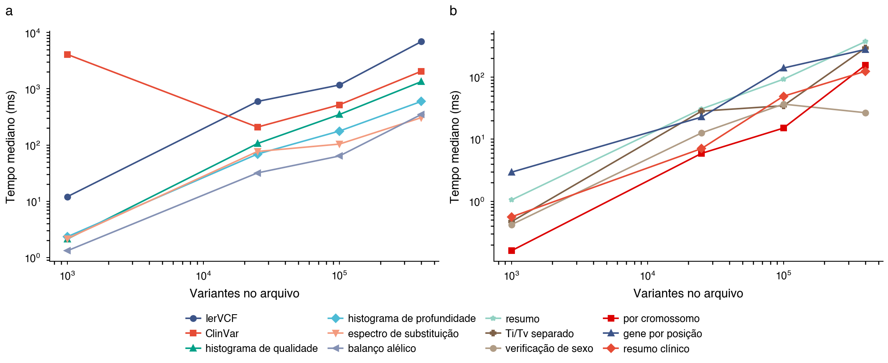
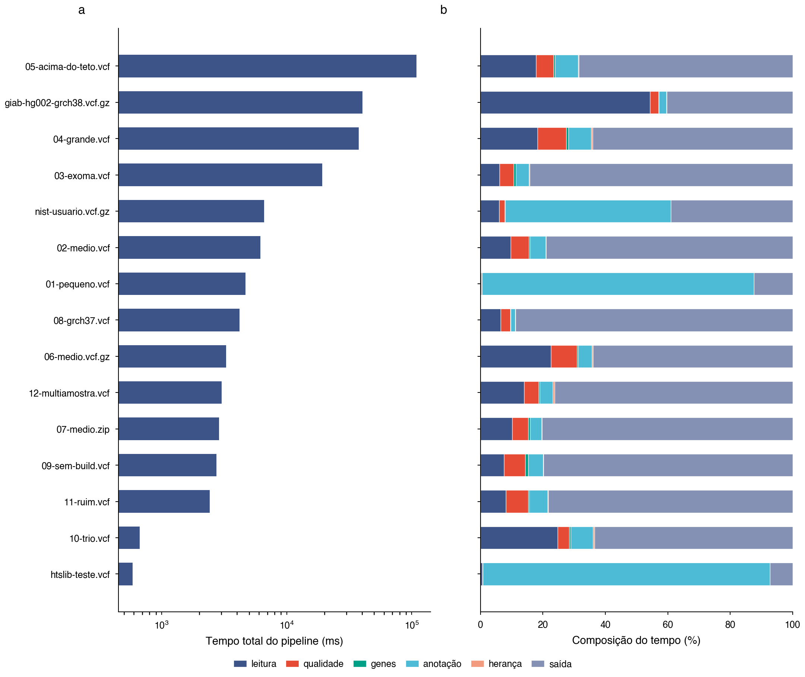
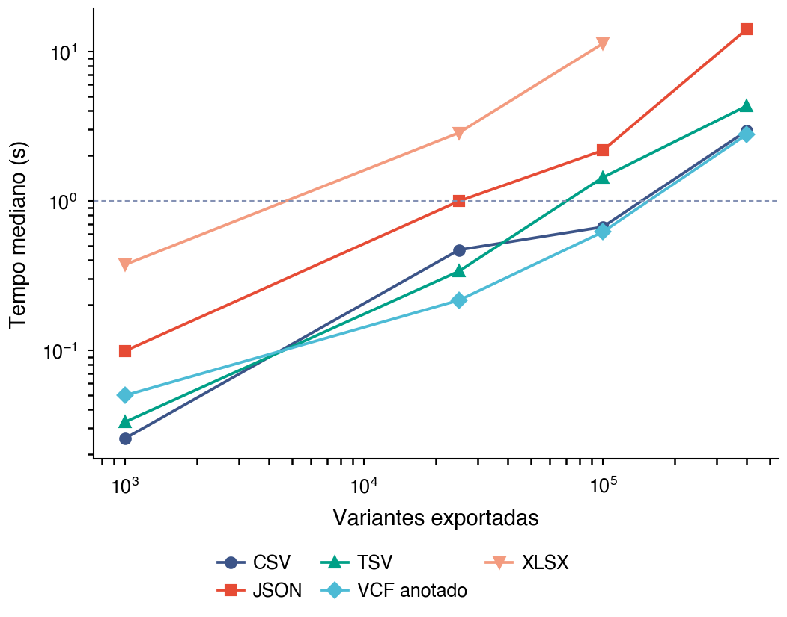
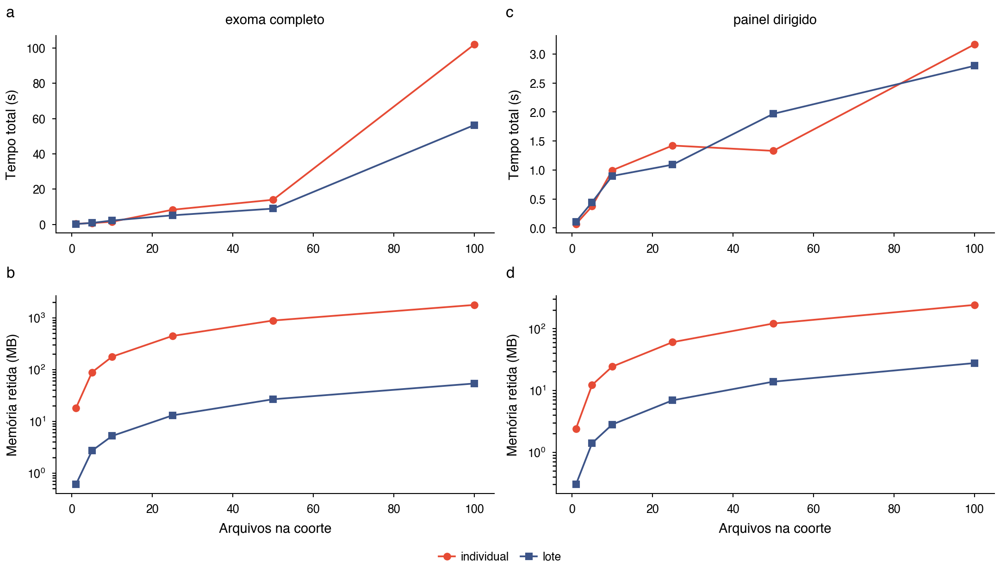
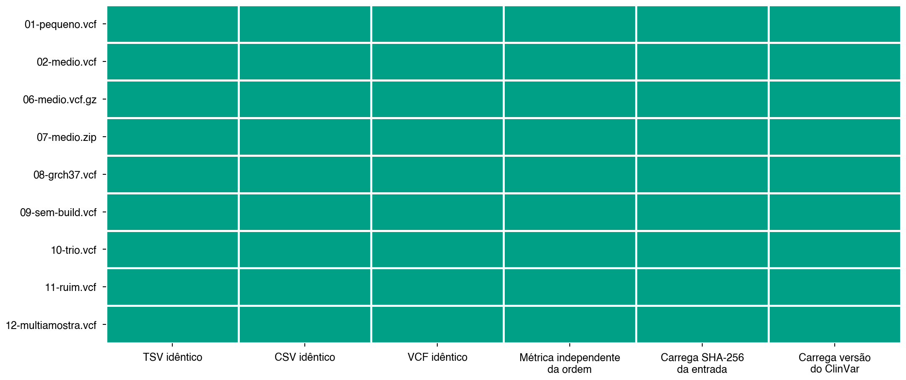
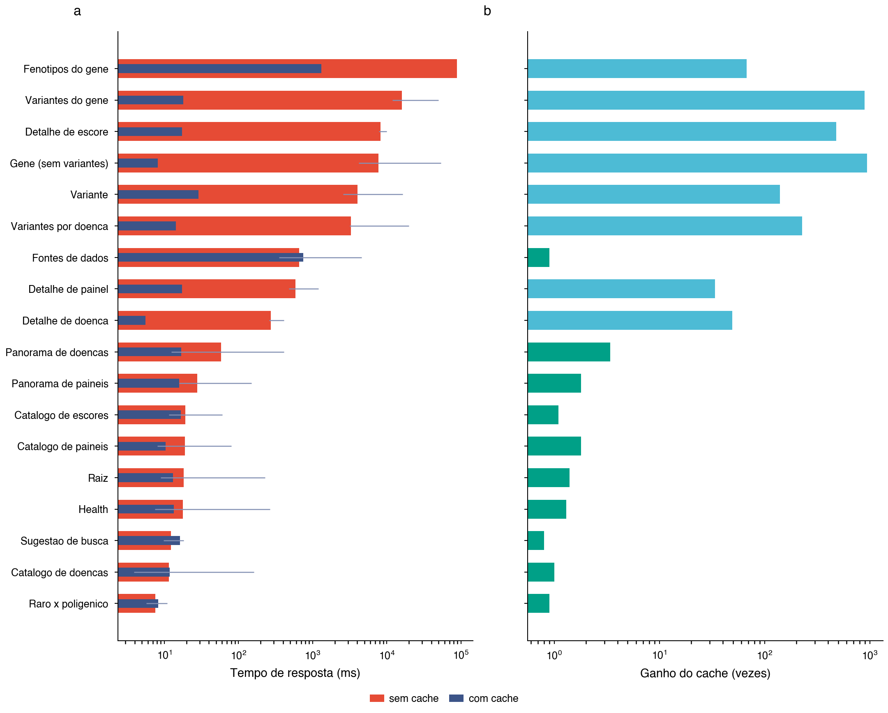
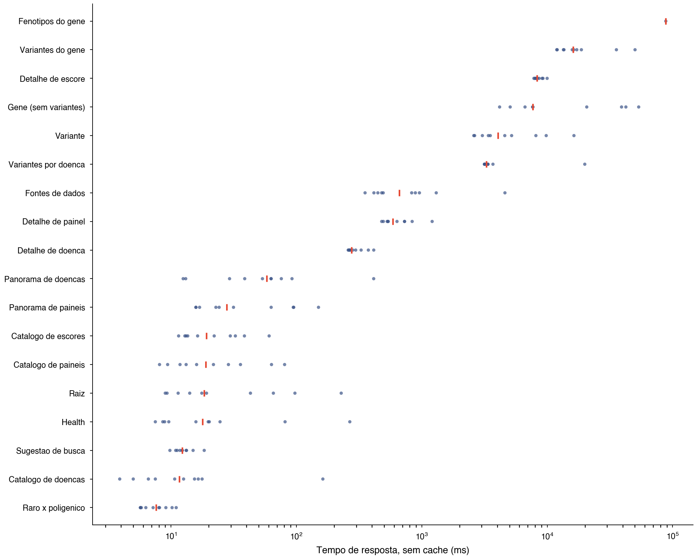
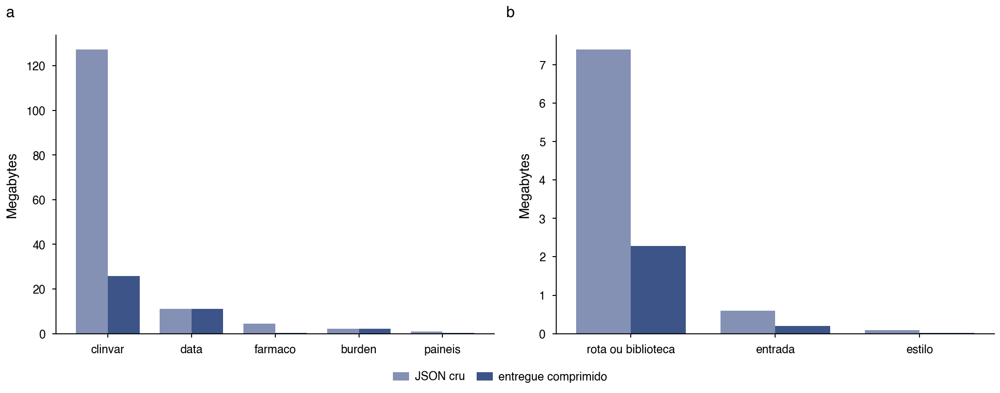
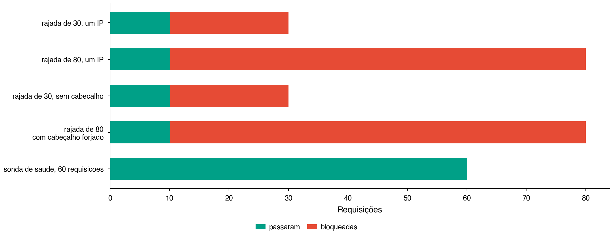
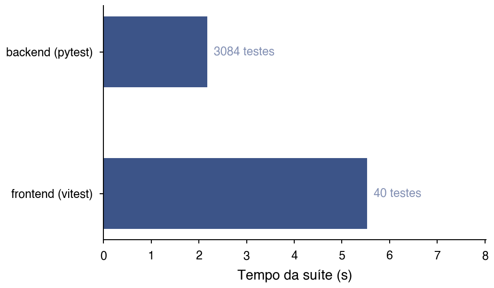

# Benchmarking a browser-resident variant annotation platform

_Relatório técnico em formato de artigo, 28/08/2026. Todos
os valores citados vêm dos CSV em `resultados/`; este arquivo é gerado por
`gerar_artigo.py` e não editado à mão, para não divergir dos dados._

## Abstract

**Motivation.** A interpretação de variantes genéticas exige consultar bases que
publicam por interfaces distintas, e as ferramentas que as consolidam pedem que o
arquivo do paciente seja enviado a um servidor. Um VCF é dado genético de pessoa
identificável: o que não sobe dispensa base legal para tratamento. Isso impõe uma
restrição de engenharia pouco usual, a de executar anotação clínica dentro do
navegador, e a pergunta que fica aberta é se ela é praticável na escala de um
exoma, para a qual não encontramos medição publicada: os benchmarks que
localizamos medem tempo de resposta de servidor.

**Results.** Foram medidas todas as funções do pipeline sobre um corpus de doze
arquivos sintéticos determinísticos e quatro arquivos reais de fontes públicas,
mais as rotas da API com 10 réplicas
por rota. A leitura de 400.000 variantes leva 6.902 ms
e o cruzamento com o ClinVar embarcado 2.050 ms, com
o índice já montado. Em coorte de cem exomas, o processamento em lote retém
54 MB contra 1.766 MB
do caminho arquivo a arquivo, um fator de 33,0.
9 de 9 arquivos satisfazem os seis critérios de
reprodutibilidade. Três limites foram encontrados por medição, um deles um defeito
de estouro de pilha em uso rotineiro.

**Availability.** Código, corpus determinístico e resultados em
`benchmark-v2/`. Os arquivos reais são baixados de repositórios públicos e não
versionados.

## 1 Introduction

Ferramentas de interpretação de variantes consolidam ClinVar, gnomAD, Ensembl e
outras bases numa consulta só, e quase todas o fazem no servidor. Para um VCF, essa
escolha tem consequência jurídica antes de ter consequência técnica: o arquivo
identifica a pessoa de quem veio, e enviá-lo a um terceiro é tratamento de dado
genético.

A alternativa é executar a anotação no navegador. Ela remove a transmissão, e em
troca impõe três restrições que um servidor não tem: a memória é a da aba, o
processamento disputa a thread que pinta a tela, e os catálogos precisam viajar
até o cliente. As três são mensuráveis, e não as encontramos medidas nos
benchmarks de ferramentas comparáveis, que reportam tempo de resposta de API.

Este relatório mede o caminho inteiro: cada função do pipeline em separado, sobre
escalas de mil a 600 mil variantes, com arquivos sintéticos de comportamento
conhecido e com arquivos reais de referência. Mede também o que tempo nenhum
descreve, que é se a mesma entrada devolve o mesmo laudo.

## 2 Materials and Methods

### 2.1 Corpus

| Arquivo | Variantes | MB | Do ClinVar | Papel |
|---|---|---|---|---|
| 01-pequeno.vcf | 1.000 | 0,07 | 80 | piso de tempo |
| 02-medio.vcf | 25.000 | 1,67 | 2.000 | escala de painel |
| 03-exoma.vcf | 100.000 | 6,67 | 8.000 | escala de exoma |
| 04-grande.vcf | 400.000 | 26,67 | 32.000 | teto declarado |
| 05-acima-do-teto.vcf | 600.000 | 39,97 | 38.020 | passando do teto |
| 06-medio.vcf.gz | 25.000 | 0,52 | 2.000 | entrada comprimida |
| 07-medio.zip | 25.000 | 1,67 | 2.000 | entrada em zip |
| 08-grch37.vcf | 25.000 | 1,67 | 2.000 | build antigo, cruzamento por coordenada desligado |
| 09-sem-build.vcf | 25.000 | 1,67 | 2.000 | build nao declarado, presumido |
| 10-trio.vcf | 4.045 | 0,39 | 320 | heranca com numeros plantados |
| 11-ruim.vcf | 25.000 | 1,67 | 2.000 | controle de qualidade |
| 12-multiamostra.vcf | 25.000 | 3,15 | 2.000 | cinco amostras num arquivo |

**Tabela 1.** Corpus sintético. Semente fixa: duas execuções produzem arquivos byte a byte idênticos.

Cada arquivo existe para exercitar um caminho que os outros não alcançam: escala,
entrada comprimida em `.gz` e em `.zip`, GRCh37, build não declarado, trio com os
números de herança plantados no cabeçalho, arquivo com defeitos de rotina e
arquivo com cinco amostras.

**Oito por cento de cada arquivo vem das próprias tabelas do ClinVar embarcado**, e
essa decisão corrige um erro de método da primeira versão. Com posição e rsID
sorteados, o cruzamento casou 16 variantes em 400.000 e divergiu em 58: a suíte
exercitava o ramo "rsID conhecido, alelo não confere" e deixava resumo clínico,
critérios ACMG, filtro por painel e a largura das linhas exportadas medindo o caso
vazio. A fração efetiva é registrada no manifesto, porque prometer 8% e entregar
1% em silêncio é o mesmo erro com outra roupa.

Quatro arquivos reais complementam o corpus: o benchmark GIAB HG002 v4.2.1 em
GRCh38, um exoma GIAB/NIST em GRCh37, o cromossomo Y do 1000 Genomes com 1.233
amostras, e o arquivo de casos de borda do htslib. O corpus sintético controla a
variável; os reais verificam que o controle não construiu um mundo mais fácil que
o real.

### 2.2 Instrumentação

As funções do pipeline são medidas em Node, importando os mesmos módulos ESM que a
página carrega, de modo que o que se mede é o custo do algoritmo sem o ruído de
renderização. O que Node não reproduz está declarado: pintura, congelamento da aba
e teto de memória da guia são do navegador.

Duas condições viajam com cada medida, e as duas por defeito observado. A primeira
é se a anotação clínica estava ativa: com o índice indisponível, o módulo degrada
para camada vazia e todas as etapas seguintes medem o caminho sem achado, com
números melhores e sem sinal de que algo faltou. A segunda é o teto de heap: o
caminho arquivo a arquivo morre por falta de memória antes de terminar cinquenta
exomas com o limite padrão do Node, e as linhas acima disso vêm de execução com
teto ampliado, onde o que se mede é o algoritmo e não o limite da máquina.

Memória é reportada em duas grandezas. O **pico** é amostrado durante a execução e
diz o que a aba precisa aguentar; a **retida** é lida após coleta forçada, com o
resultado ainda referenciado, e diz o que a coorte deixa para trás. A diferença
entre antes e depois, que seria a medida ingênua, foi descartada: com uma
repetição ela produziu 284 MB num caso e 0 MB noutro, e um ganho aparente de
1837 vezes que é ruído de coletor.

A latência da API é medida com dez réplicas por rota, em duas condições. Frio é o
custo de montar a resposta encadeando as fontes, com o cache zerado antes de cada
réplica; quente é uma leitura do Redis. Uma réplica não teria significado: a mesma
chamada ao Ensembl mediu 2,3 s e 43 s em tentativas seguidas. A mediana é o valor
citado, porque média é puxada por um pico da fonte que não representa o caso
típico.

## 3 Results

### 3.1 Custo por função e por escala

**Fig. 1.** Tempo mediano de cada função contra o número de variantes, em escala log-log. (a) funções cujo custo domina o pipeline; (b) funções de custo desprezível na mesma escala. A leitura e o cruzamento com o ClinVar crescem linearmente com o número de variantes; as métricas de qualidade ficam uma ordem de grandeza abaixo em toda a faixa.

| Arquivo | Variantes | Leitura (ms) | p95 (ms) | Variantes/s | Memória (MB) |
|---|---|---|---|---|---|
| 01-pequeno.vcf | 1.000 | 12 | 77 | 82.981 | 1 |
| 02-medio.vcf | 25.000 | 596 | 697 | 41.959 | 18 |
| 06-medio.vcf.gz | 25.000 | 740 | 2.237 | 33.766 | 18 |
| 07-medio.zip | 25.000 | 281 | 362 | 88.854 | 18 |
| 08-grch37.vcf | 25.000 | 273 | 441 | 91.674 | 18 |
| 09-sem-build.vcf | 25.000 | 206 | 421 | 121.226 | 18 |
| 03-exoma.vcf | 100.000 | 1.169 | 1.696 | 85.563 | 71 |
| 04-grande.vcf | 400.000 | 6.902 | 13.767 | 57.953 | 287 |
| 05-acima-do-teto.vcf | 600.000 | 19.433 | 43.214 | 20.583 | 287 |

**Tabela 2.** Leitura do VCF por escala. Réplicas: 3. Teto de heap: 12.480 MB.

### 3.2 Custo fixo de sessão

| Etapa | Tempo (ms) |
|---|---|
| carregar painéis | 45 |
| carregar símbolos | 76 |
| carregar ClinGen | 50 |
| carregar CPIC | 103 |
| índice de genes | 11 |
| montagem do índice ClinVar | 3.948 |

**Tabela 3.** Custo pago uma vez por sessão, e não por arquivo. A montagem do índice é medida com uma réplica: ela acontece uma vez e repeti-la mediria o cache.

A montagem do índice do ClinVar é o maior item, e medi-la junto do primeiro
arquivo produzia uma curva de anotação que **descia** de mil para 25 mil
variantes: o que descia era o custo fixo sendo diluído. A chave do cache é o
conjunto de cromossomos pedido, então um arquivo que cubra conjunto diferente
paga a montagem outra vez. É esse mecanismo que separa os dois cenários de
coorte na seção 3.4.

### 3.3 Pipeline completo e saídas

**Fig. 2.** Pipeline completo por arquivo. (a) tempo total, em escala logarítmica; (b) composição percentual por etapa, em escala linear. As duas perguntas ficam em painéis separados porque barra empilhada em eixo logarítmico desenha comprimentos que dependem de onde cada segmento começa.

**Fig. 3.** Tempo de geração por formato de saída. A linha tracejada marca 1 s, limite prático entre uma interface que responde e uma que trava, já que a geração roda na thread principal. XLSX é uma ordem de grandeza mais caro que as saídas de texto.

### 3.4 Lote contra arquivo a arquivo

**Fig. 7.** Processamento em lote contra arquivo a arquivo, em dois cenários de coorte. (a, c) tempo total; (b, d) memória retida ao fim, em escala logarítmica. A memória retida do caminho individual cresce linearmente com a coorte; a do lote não.

| Cenário | Arquivos | Individual (s) | Lote (s) | Retido ind. (MB) | Retido lote (MB) | Fator |
|---|---|---|---|---|---|---|
| exoma completo | 1 | 0,39 | 0,24 | 18 | 1 | 17,9 |
| exoma completo | 5 | 0,74 | 0,83 | 88 | 3 | 32,4 |
| exoma completo | 10 | 1,50 | 2,21 | 177 | 5 | 33,7 |
| exoma completo | 25 | 8,32 | 5,16 | 444 | 13 | 34,2 |
| exoma completo | 50 | 13,98 | 8,95 | 883 | 27 | 33,2 |
| exoma completo | 100 | 102,01 | 56,33 | 1.766 | 54 | 33,0 |
| painel dirigido | 1 | 0,07 | 0,11 | 2 | 0 | 2,4 |
| painel dirigido | 5 | 0,38 | 0,45 | 12 | 1 | 8,8 |
| painel dirigido | 10 | 1,00 | 0,90 | 24 | 3 | 8,6 |
| painel dirigido | 25 | 1,42 | 1,09 | 60 | 7 | 8,7 |
| painel dirigido | 50 | 1,33 | 1,97 | 120 | 14 | 8,7 |
| painel dirigido | 100 | 3,17 | 2,80 | 241 | 28 | 8,7 |

**Tabela 4.** Coorte processada pelos dois caminhos, em dois cenários. Réplicas: 3. Teto de heap: 12.480 MB, acima do que um navegador oferece: com o teto padrão do Node o caminho individual não termina a coorte de cinquenta.

### 3.5 Reprodutibilidade

**Fig. 4.** Matriz de reprodutibilidade. Cada coluna é um critério binário; verde é satisfeito.

| Arquivo | Variantes | Critérios | SHA-256 da entrada |
|---|---|---|---|
| 01-pequeno.vcf | 1.000 | 6/6 | 6aa02ca6eeeb8eae |
| 02-medio.vcf | 25.000 | 6/6 | 21fa9f4db1fb9a75 |
| 06-medio.vcf.gz | 25.000 | 6/6 | a7c7020848168ca3 |
| 07-medio.zip | 25.000 | 6/6 | e19a8ddf66ce279d |
| 08-grch37.vcf | 25.000 | 6/6 | c672d8453ae884f8 |
| 09-sem-build.vcf | 25.000 | 6/6 | bdf4c9c91abf5d92 |
| 10-trio.vcf | 4.045 | 6/6 | 8dc5f5a33df4c76d |
| 11-ruim.vcf | 25.000 | 6/6 | 009a6cc2d01e7d87 |
| 12-multiamostra.vcf | 25.000 | 6/6 | b107c88335d7cacf |

**Tabela 5.** Seis critérios: TSV, CSV e VCF anotado idênticos entre execuções; métricas invariantes à ordem das linhas; e o artefato carregando o SHA-256 da entrada e a versão da compilação do ClinVar.

### 3.6 Latência da API e efeito do cache

**Fig. 9.** Latência por rota. (a) mediana sem e com cache, com a faixa entre o menor e o maior valor das réplicas; (b) fator de ganho do cache. As rotas que dependem de fonte externa dominam a cauda.

**Fig. 10.** As dez réplicas de cada rota, sem cache. Cada ponto é uma chamada e o traço vermelho é a mediana. É a figura que justifica medir dez vezes: em rota que depende de fonte externa, duas chamadas seguidas ao mesmo endereço diferem por um fator de dez.

| Rota | Tipo | Sem cache (ms) | Com cache (ms) | Ganho |
|---|---|---|---|---|
| Fenotipos do gene | externa | 88.199 | 1.308,7 | 67.4x |
| Variantes do gene | externa | 16.053 | 18,0 | 891.8x |
| Detalhe de escore | externa | 8.297 | 17,3 | 479.6x |
| Gene (sem variantes) | externa | 7.698 | 8,2 | 938.8x |
| Variante | externa | 4.051 | 28,9 | 140.2x |
| Variantes por doenca | externa | 3.275 | 14,4 | 227.5x |
| Fontes de dados | interna | 661 | 746,2 | 0.9x |
| Detalhe de painel | externa | 587 | 17,4 | 33.7x |

**Tabela 6.** As oito rotas mais lentas sem cache, mediana de dez réplicas.

### 3.7 Infraestrutura e proteção do acesso às fontes

**Fig. 11.** (a) catálogos versionados, cru contra o que é entregue comprimido; (b) pacote da aplicação por papel, em disco e comprimido.

**Fig. 12.** Limitador de taxa sob rajada. A barra com cabeçalho forjado é idêntica à de um IP só: forjar o `X-Forwarded-For` a cada requisição não compra nada, porque o elemento confiável é contado a partir do fim da cadeia.

**Fig. 13.** Custo de provar que a aplicação continua correta.

## 4 Discussion

### 4.1 A restrição de memória é a que decide, e não a de tempo

O resultado mais consequente da seção 3.4 não é o tempo. Nos dois cenários de
coorte, o ganho de tempo do processamento em lote é modesto e depende de
circunstância: quando todos os arquivos cobrem os mesmos cromossomos, o índice do
ClinVar é montado uma vez em ambos os caminhos e o lote não acelera nada. O que
não depende de circunstância é a memória retida, que cresce linearmente com a
coorte no caminho arquivo a arquivo e permanece praticamente constante no lote.

A razão é de projeto e não de otimização: cada arquivo é lido, anotado, resumido e
descartado, e o que sobrevive são algumas centenas de linhas por amostra. É a
mesma disciplina de um pipeline de produção que não carrega a coorte inteira em
memória, aplicada ao lugar em que a restrição é mais dura, que é uma aba de
navegador.

Reportar apenas o tempo teria produzido a conclusão oposta e errada, de que o
modo em lote pouco acrescenta.

### 4.2 Medir até quebrar encontra defeito que teste não encontra

Três limites apareceram, e um deles é um defeito de correção em uso rotineiro.

O cálculo de histograma usava `Math.max(...vetor)`. Espalhar um vetor num
argumento consome uma posição de pilha por elemento, e a 400 mil variantes a
chamada morre com estouro de pilha. A suíte de testes não pegava, porque testa
sobre dezenas de variantes; a escala é que revela. O mesmo padrão existia no
gráfico de Manhattan da página de associação, onde o conjunto de pontos também
tem o tamanho do dado.

O segundo limite é conceitual: o teto de leitura conta **variantes** e o que ocupa
memória é variantes vezes amostras. O cromossomo Y do 1000 Genomes tem 1.233
amostras, e as 400.000 variantes que o teto permite seriam 493 milhões de
genótipos. O processo morre antes de terminar de ler. O teto correto seria em
genótipos.

O terceiro é o custo de gerar XLSX, uma ordem de grandeza acima das saídas de
texto e acima do limite de resposta percebida a partir de 25.000 linhas.

### 4.3 Reprodutibilidade é a metade que tempo nenhum mede

Os seis critérios da seção 3.5 respondem a uma pergunta que um fluxo manual com
oito portais abertos não tem como responder: dois analistas chegam a duas
planilhas, o mesmo analista em dois dias chega a duas, e não há artefato que prove
de qual arquivo cada uma saiu. Aqui a saída é byte a byte idêntica entre
execuções, as métricas não dependem da ordem das linhas da entrada, e o artefato
carrega o SHA-256 do arquivo e a versão da compilação do ClinVar.

O critério de invariância à ordem merece nota. Ele não é uma formalidade: uma
contagem que dependa da ordem de iteração é um defeito silencioso, do tipo que só
aparece quando alguém reordena o arquivo por outra razão e os números mudam sem
explicação.

### 4.4 O que a medição corrigiu no próprio método

Três erros de medição foram cometidos e corrigidos durante este trabalho, e vale
registrá-los porque cada um produziu números plausíveis e errados.

O primeiro: as suítes rodaram com o índice do ClinVar indisponível, porque
`fetch` de caminho absoluto não resolve fora de um navegador. A degradação
graciosa que protege o usuário quando o índice não sobe passou a esconder um erro
de medição, e todas as etapas seguintes mediram o caminho sem achado, com números
melhores. A correção foi resolver os caminhos contra o disco e gravar em cada
linha se a anotação estava ativa.

O segundo: o corpus sorteava posição e rsID, e o cruzamento praticamente não
casava. Corrigido plantando variantes reais das próprias tabelas.

O terceiro: as medidas de coorte foram tomadas com teto de heap ampliado e nada
registrava isso, enquanto uma frase vizinha afirmava que cinquenta exomas não
cabem no teto padrão. São condições diferentes apresentadas como um resultado só.
A correção foi gravar o teto vigente em cada linha do CSV.

Os três têm a mesma forma: uma condição que muda o número e não viajava com ele.

### 4.5 A cauda da latência externa é o risco operacional

A Tabela 6 mostra uma distribuição com cauda longa: as rotas internas respondem em
dezenas de milissegundos e as que dependem de fonte externa vão de centenas de
milissegundos a dezenas de segundos. A rota de fenótipos de gene é o extremo, com
mediana de 88 s sem cache, e é onde a Figura 10 mais informa: as réplicas dela se
concentram num valor alto sem dispersão, o que indica saturação e não variação.

O cache muda a ordem de grandeza e não a natureza do problema. Os fatores de ganho
passam de 900 nas rotas de gene, o que é consequência aritmética de comparar
dezenas de segundos com dezenas de milissegundos, e não uma otimização do
caminho caro: a primeira visita de cada alvo continua pagando o preço integral. É
o que justifica a decisão da seção 3.6 de separar a leitura de variantes numa
rota própria, para que a página apareça antes da parte lenta terminar.

### 4.6 Limitações

As medidas de pipeline são feitas em Node e não num navegador, então pintura,
congelamento de aba e o teto de memória real da guia ficam fora. A latência das
fontes externas varia com a hora e a carga delas, e as medianas aqui descrevem
uma janela de medição, não um contrato. O corpus sintético controla a variável ao
preço de não reproduzir a distribuição real de qualidade de chamada de um exoma
clínico; os quatro arquivos reais reduzem, mas não eliminam, essa distância.

## 5 Conclusion

Anotação clínica de VCF dentro do navegador é praticável na escala de um exoma: a
leitura e o cruzamento de 400.000 variantes ficam em poucos segundos, e o custo
que domina o pipeline é a leitura do arquivo, não a anotação. O que limita o
alcance não é tempo, é memória, e o processamento em lote com descarte por arquivo
mantém a memória retida constante enquanto a coorte cresce.

A medição encontrou três limites e um defeito de correção que a suíte de testes
não alcançava, o que sustenta a prática de medir até quebrar em vez de medir
apenas o caso confortável.
