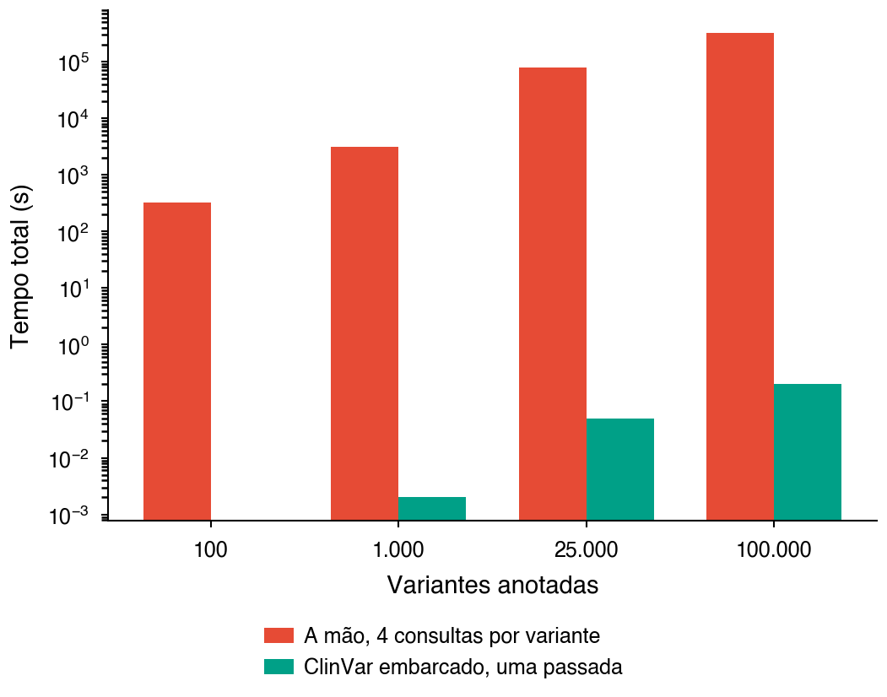
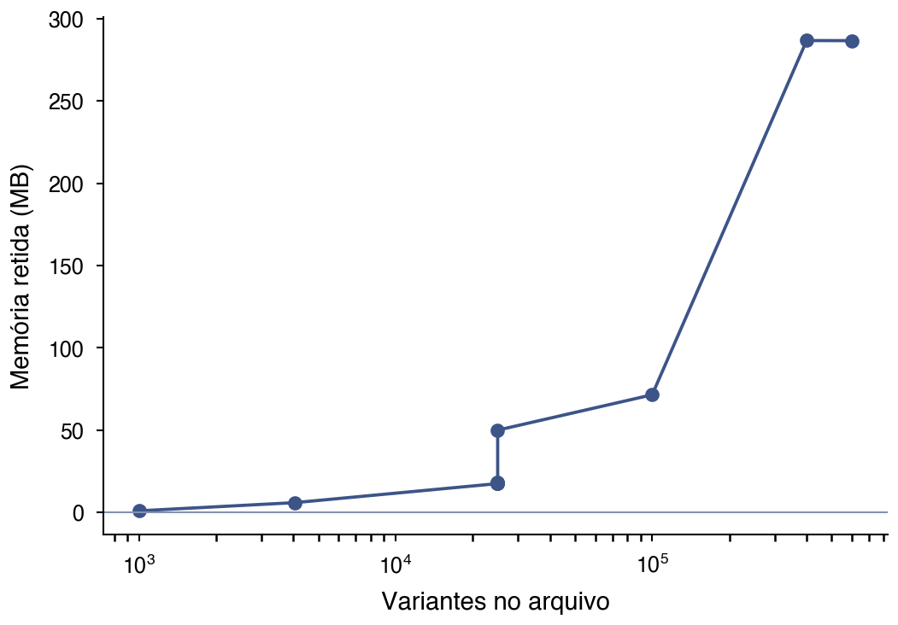

# Relatório do benchmark

Medição de 28/08/2026. Todos os números vêm dos CSV em
`resultados/`; este arquivo é gerado por `gerar_relatorio.py` e não editado à
mão, para não divergir dos dados ao lado.

| Item | Valor |
|---|---|
| Node | v25.8.2 |
| Plataforma | darwin arm64 |
| Repetições por medida, suíte de funções | 2 |
| Teto de heap, suíte de funções | — MB |
| Anotação clínica ativa | sim |
| Medições registradas | 352 |

Cada suíte roda com os seus parâmetros, e eles não são os mesmos: a tabela acima
vale para a suíte de funções. As repetições e o teto de heap das demais aparecem
na seção de cada uma, tirados do próprio CSV.

A anotação ativa não é detalhe de rodapé: com o índice do ClinVar indisponível,
o módulo degrada para camada vazia, e todas as etapas seguintes medem o caminho
sem achado, com números melhores e sem nenhum sinal de que algo faltou. A coluna
`anotacao_ativa` acompanha cada linha do CSV por essa razão.

## Corpus

| Arquivo | Variantes | MB | Do ClinVar | Fração | Papel |
|---|---|---|---|---|---|
| 01-pequeno.vcf | 1.000 | 0,07 | 80 | 8,0% | piso de tempo |
| 02-medio.vcf | 25.000 | 1,67 | 2.000 | 8,0% | escala de painel |
| 03-exoma.vcf | 100.000 | 6,67 | 8.000 | 8,0% | escala de exoma |
| 04-grande.vcf | 400.000 | 26,67 | 32.000 | 8,0% | teto declarado |
| 05-acima-do-teto.vcf | 600.000 | 39,97 | 38.020 | 6,3% | passando do teto |
| 06-medio.vcf.gz | 25.000 | 0,52 | 2.000 | 8,0% | entrada comprimida |
| 07-medio.zip | 25.000 | 1,67 | 2.000 | 8,0% | entrada em zip |
| 08-grch37.vcf | 25.000 | 1,67 | 2.000 | 8,0% | build antigo, cruzamento por coordenada desligado |
| 09-sem-build.vcf | 25.000 | 1,67 | 2.000 | 8,0% | build nao declarado, presumido |
| 10-trio.vcf | 4.045 | 0,39 | 320 | 7,9% | heranca com numeros plantados |
| 11-ruim.vcf | 25.000 | 1,67 | 2.000 | 8,0% | controle de qualidade |
| 12-multiamostra.vcf | 25.000 | 3,15 | 2.000 | 8,0% | cinco amostras num arquivo |

A coluna "do ClinVar" é o piso do que a anotação tem de casar. Uma primeira
versão deste corpus usava posição e rsID sorteados: casou 16 variantes em
400.000 e divergiu em 58, ou seja, exercitava o ramo "rsID conhecido, alelo não
confere" e deixava resumo clínico, critérios ACMG, filtro por painel e a largura
das linhas exportadas medindo o caso vazio.

### Arquivos reais

| Arquivo | Variantes lidas | Build | Leitura | Casadas no ClinVar | Observação |
|---|---|---|---|---|---|
| nist-usuario.vcf.gz | 30.009 | GRCh37 | 222,0 ms | 131 |  |
| htslib-teste.vcf | 323 | GRCh37 | 2,7 ms | 0 |  |
| giab-hg002-grch38.vcf.gz | 400.000 | GRCh38 | 11.220,3 ms | 42 | truncado no teto |
| 1000g-chrY.vcf.gz | não coube | — | — | — | acima do teto de genotipos desta rodada |

## Custo de cada função

**Figura 1. Tempo mediano de cada função contra o número de variantes, em escala log-log. (a) funções cujo custo domina o pipeline; (b) funções de custo desprezível na mesma escala.**

**Figura 2. Pipeline completo por arquivo do corpus. (a) tempo total, em escala logarítmica; (b) composição percentual por etapa, em escala linear. As duas perguntas ficam em painéis separados porque barra empilhada em eixo logarítmico desenha comprimentos que dependem de onde cada segmento começa.**

### Custo fixo, uma vez por sessão

| Etapa | Tempo mediano |
|---|---|
| carregar painéis | 13,2 ms |
| carregar símbolos | 18,7 ms |
| carregar ClinGen | 13,1 ms |
| carregar CPIC | 27,8 ms |
| índice de genes | 3,9 ms |
| montagem do índice ClinVar | 903,6 ms |

A montagem do índice do ClinVar acontece uma vez por conjunto de cromossomos, e
não uma vez por arquivo. Medi-la junto do primeiro arquivo produzia uma curva de
anotação que **descia** de mil para 25 mil variantes, sugerindo que anotar mais
custa menos: o que descia era o custo fixo sendo diluído.

A chave do cache é o conjunto de cromossomos pedido. Um arquivo que cubra um
conjunto diferente do que está em cache paga a montagem de novo, e é por isso
que `01-pequeno.vcf`, `nist-usuario.vcf.gz` e `htslib-teste.vcf` aparecem com
anotação mais cara que arquivos vinte vezes maiores: nenhum deles cobre os 25
cromossomos que o aquecimento carregou.

## Saídas

**Figura 3. Tempo de geração por formato de saída. A linha tracejada marca 1 s, limite prático entre uma interface que responde e uma que trava: a geração roda na thread principal.**

## Reprodutibilidade

Tempo é metade da promessa. A outra é que a mesma entrada devolva o mesmo
resultado, e é a metade que um fluxo manual com oito portais abertos não tem como
sustentar: dois analistas chegam a duas planilhas, o mesmo analista em dois dias
chega a duas, e não há artefato que prove de qual arquivo cada uma saiu.

Seis critérios, todos binários:

| Arquivo | Variantes | Critérios | Reprodutível | SHA-256 da entrada |
|---|---|---|---|---|
| 01-pequeno.vcf | 1.000 | 6/6 | sim | 6aa02ca6eeeb |
| 02-medio.vcf | 25.000 | 6/6 | sim | 21fa9f4db1fb |
| 06-medio.vcf.gz | 25.000 | 6/6 | sim | a7c702084816 |
| 07-medio.zip | 25.000 | 6/6 | sim | e19a8ddf66ce |
| 08-grch37.vcf | 25.000 | 6/6 | sim | c672d8453ae8 |
| 09-sem-build.vcf | 25.000 | 6/6 | sim | bdf4c9c91abf |
| 10-trio.vcf | 4.045 | 6/6 | sim | 8dc5f5a33df4 |
| 11-ruim.vcf | 25.000 | 6/6 | sim | 009a6cc2d01e |
| 12-multiamostra.vcf | 25.000 | 6/6 | sim | b107c88335d7 |

**Figura 4. Matriz de reprodutibilidade. Verde é critério satisfeito.**

Os critérios: TSV, CSV e VCF anotado byte a byte idênticos entre duas execuções;
métricas invariantes à ordem das linhas da entrada, verificada com embaralhamento
determinístico; e o artefato carregando o SHA-256 do arquivo de entrada e a
versão da compilação do ClinVar, sem os quais dois laudos do mesmo paciente em
meses diferentes não são comparáveis.

## Lote contra individual

**Figura 7. Processamento em lote contra arquivo a arquivo, em dois cenários de coorte. (a, c) tempo total; (b, d) memória retida ao fim, em escala logarítmica.**

| Cenário | Arquivos | Individual | Lote | Retido individual | Retido lote | Ganho de memória |
|---|---|---|---|---|---|---|
| exoma completo | 1 | 0,39 s | 0,24 s | 18 MB | 1 MB | 17,9x |
| exoma completo | 5 | 0,74 s | 0,83 s | 88 MB | 3 MB | 32,4x |
| exoma completo | 10 | 1,50 s | 2,21 s | 177 MB | 5 MB | 33,7x |
| exoma completo | 25 | 8,32 s | 5,16 s | 444 MB | 13 MB | 34,2x |
| exoma completo | 50 | 13,98 s | 8,95 s | 883 MB | 27 MB | 33,2x |
| exoma completo | 100 | 102,01 s | 56,33 s | 1.766 MB | 54 MB | 33,0x |
| painel dirigido | 1 | 0,07 s | 0,11 s | 2 MB | 0 MB | 2,4x |
| painel dirigido | 5 | 0,38 s | 0,45 s | 12 MB | 1 MB | 8,8x |
| painel dirigido | 10 | 1,00 s | 0,90 s | 24 MB | 3 MB | 8,6x |
| painel dirigido | 25 | 1,42 s | 1,09 s | 60 MB | 7 MB | 8,7x |
| painel dirigido | 50 | 1,33 s | 1,97 s | 120 MB | 14 MB | 8,7x |
| painel dirigido | 100 | 3,17 s | 2,80 s | 241 MB | 28 MB | 8,7x |

Repetições por ponto: 3. Teto de heap: 12480 MB.

**O teto de heap muda o resultado e por isso viaja com ele.** Com o padrão do
Node, perto de 2 GB, o caminho individual morre antes de terminar a coorte de
50; as linhas acima de 25 arquivos vêm de uma rodada com teto alto, onde o que
se mede é o algoritmo e não o limite da máquina. Um navegador está mais perto do
teto padrão, e é lá que a aba morre.

Dois cenários, e a distinção decide o resultado. Numa coorte em que todos os
arquivos cobrem os mesmos cromossomos, o índice do ClinVar é montado uma vez nos
dois caminhos, e o lote **não ganha tempo**: ganha memória. Numa coorte de
painéis dirigidos, cada arquivo cobre um punhado de cromossomos diferente e paga
a própria montagem, e aí a união de cromossomos do lote vira ganho de tempo
também.

O número que decide se roda no navegador é a memória retida, não o tempo. Ela
cresce linearmente com a coorte no caminho individual e fica praticamente
constante no lote, porque cada arquivo é lido, anotado, resumido e descartado.

## Consulta com cache e sem cache

| Tipo | Alvo | Sem cache | Com cache | Ganho |
|---|---|---|---|---|
| gene | MLH1 | 5,14 s | 4 ms | 1.134x |
| gene | HBB | 3,61 s | 9 ms | 399x |
| gene | MSH2 | 11,96 s | 4 ms | 2.857x |
| gene | VHL | 4,70 s | 5 ms | 947x |
| variante | rs334 | 3,02 s | 2 ms | 1.450x |
| variante | rs1800562 | 2,38 s | 2 ms | 1.080x |
| variante | rs6025 | 2,39 s | 2 ms | 1.122x |
| variante | rs1799853 | 2,65 s | 2 ms | 1.083x |

Chamadas por alvo: 4 sem cache, 10 com cache.

Sem cache, a resposta é montada encadeando Ensembl, gnomAD, ClinVar e MyVariant,
com as dependências entre elas respeitadas. Com cache, é uma leitura do Redis.
O intervalo entre as chamadas a frio não é cortesia: o Ensembl aplica uso justo
em 15 requisições por segundo, e uma varredura saindo daqui bloqueia a origem
para todos os usuários da aplicação de uma vez.

## Ganho de tempo sobre o fluxo manual

| Variantes | A mão | ClinVar embarcado |
|---|---|---|
| 100 | 0,1 h | 0,0 s |
| 1.000 | 0,9 h | 0,0 s |
| 25.000 | 22,1 h | 0,1 s |
| 100.000 | 88,4 h | 0,2 s |

**Figura 5. Tempo total para anotar N variantes por cada caminho, em escala logarítmica.**

**As duas últimas colunas são projeção, não medida nessa escala.** Mede-se o
custo real por variante numa amostra pequena e multiplica-se. Medir 100 mil
variantes a mão levaria dias e bloquearia o acesso do projeto às fontes.

O que a projeção não inclui, e que só aumentaria a diferença: tempo humano de
navegação, erro de transcrição, e o retrabalho de refazer tudo quando alguém
pergunta de qual arquivo aquela planilha saiu.

A API do GenVar não entra nesta projeção de propósito. Ela existe para a
consulta de **uma** variante, e o custo dela por variante está na tabela acima;
ninguém anota cem mil variantes chamando-a um rsID de cada vez. A anotação em
massa é o que o ClinVar embarcado faz, numa passada e sem rede, e é essa a
comparação com o fluxo manual.

## Memória

**Figura 6. Memória retida após a leitura, contra o número de variantes.**

