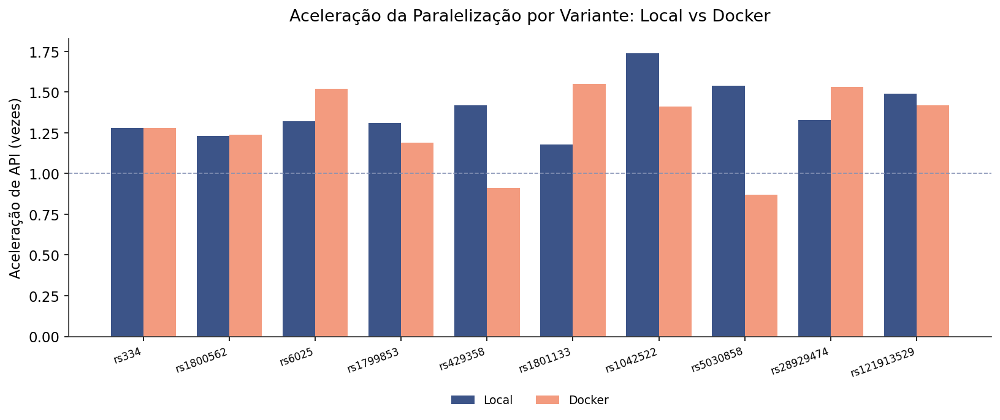
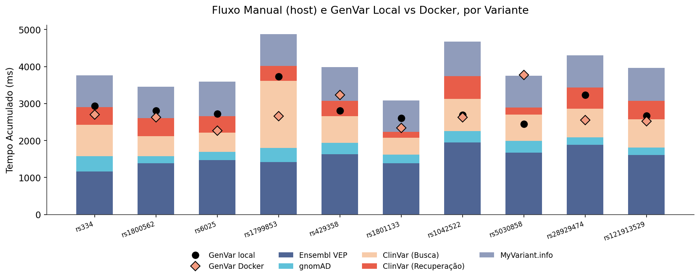
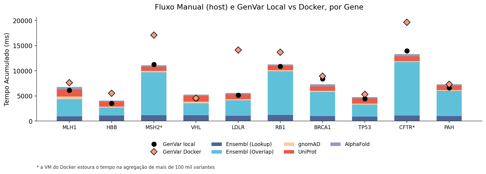
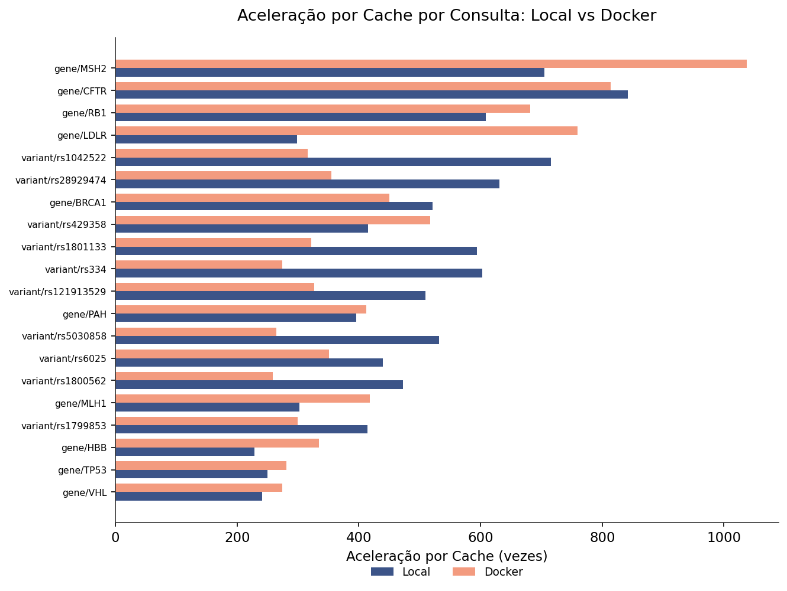
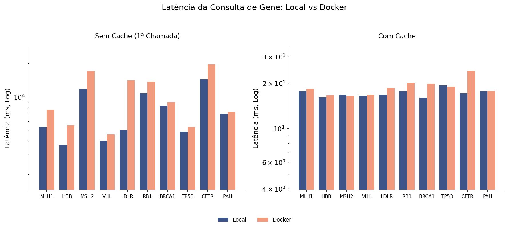
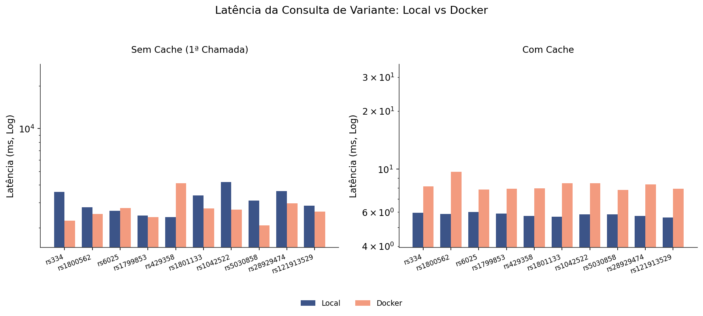
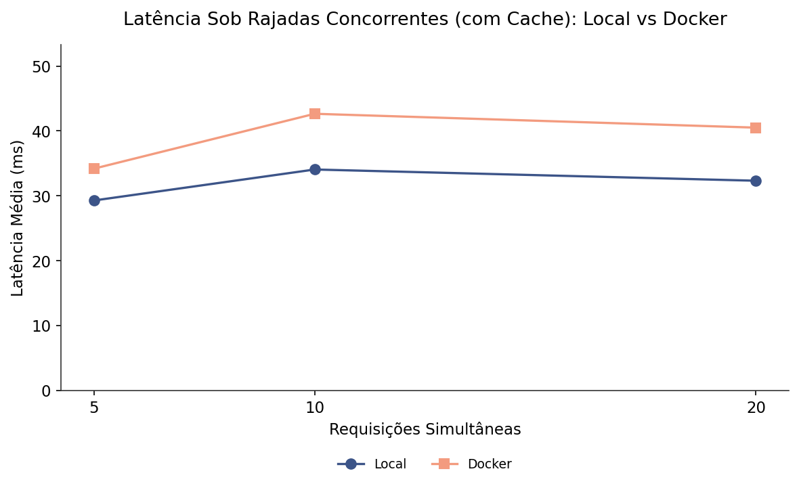
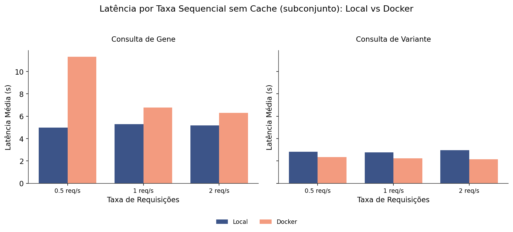
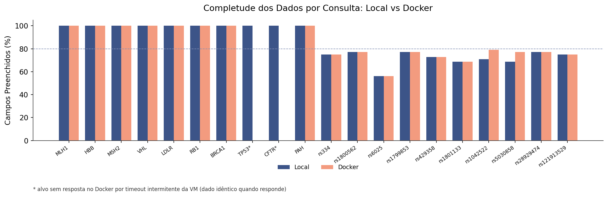

# Resultados Preliminares: desempenho da plataforma e custo da containerização

Rascunho da seção Resultados Preliminares do GenVar Dashboard, com os números medidos em 8 de junho de 2026. O texto reporta, primeiro, o desempenho da plataforma medido no ambiente local (Figuras 1 a 12) e, em seguida, o custo da containerização, confrontando o mesmo experimento nos ambientes local e conteinerizado por Docker Compose (Figuras 13 a 21, objetivo v). Os valores locais vêm de `dados/`, os do Docker de `dados_docker/`, e as figuras estão em `figuras/`. As Figuras 1 a 9 e 13 a 21 são geradas pela bateria de benchmarks; as Figuras 10 a 12 são capturas de tela da interface em execução.

Ambiente de medição: Apple M2, 8 núcleos, 8 GB de memória, macOS 26.5; Python 3.12.11. No ambiente local, backend em `uvicorn` na porta 8000, frontend em Vite na porta 3000 e Redis 7 nativo na porta 6379. No ambiente conteinerizado, os três serviços sobem por Docker Compose (backend `python:3.12-slim`, frontend `node:20-alpine` compilado e servido por `nginx:alpine`, Redis `redis:7-alpine`), com o Docker Desktop hospedando uma máquina virtual Linux. Os tempos incluem as viagens de ida e volta às interfaces de programação de aplicações (Application Programming Interface, API) externas e carregam, portanto, a variância de serviços de terceiros.

## Abordagem de avaliação

Para metrificar e validar o produto de forma objetiva, foi desenvolvido um fluxo automatizado de metrificação (workflow de benchmarks), separado do código da aplicação, que mede de forma reprodutível a latência das consultas, o ganho do cache, o comportamento sob carga concorrente, a completude dos dados, a robustez a entradas inválidas e a consolidação das fontes, e que compara a plataforma com o fluxo manual de consulta e os dois ambientes de execução entre si. Cada medição é gerada por código versionado e parte sempre do mesmo conjunto de alvos.

Esse conjunto é fixo: 10 genes e 10 variantes genéticas de uso frequente na prática e na literatura da genética clínica, escolhidos por cobrirem as fontes integradas e por representarem funções gênicas e classificações clínicas distintas, conforme a justificativa de cada alvo nas Tabelas 1 e 2. Usar sempre os mesmos alvos, validados antes de cada execução por um algoritmo dedicado, garante que as comparações, entre suites, entre o GenVar e o fluxo manual, e entre os ambientes local e conteinerizado, isolem o efeito medido, e não a escolha de exemplos.

As métricas seguem critérios de comparação controlados: linhas de base explícitas (chamada fria contra chamada em cache, fluxo manual contra consulta integrada, ambiente local contra Docker), separação entre o que é atribuível à plataforma e o que depende de serviços de terceiros, escala adequada a cada grandeza nas figuras e relato das ressalvas metodológicas. Os algoritmos do fluxo de metrificação e os de apoio estão reproduzidos nos apêndices, o que torna toda a avaliação reproduzível.

## Estágio de desenvolvimento

O protótipo está funcional nos cinco marcos incrementais previstos. O backend em FastAPI orquestra requisições paralelas às cinco bases públicas primárias (Ensembl, gnomAD, ClinVar, AlphaFold e UniProt) e ao agregador de escores preditivos MyVariant.info, enquanto o frontend em React renderiza as visualizações interativas. O código soma 1.197 linhas no backend (Python) e 3.270 linhas no frontend (JavaScript/JSX), organizadas em 17 componentes React e seis módulos de serviço, um para cada fonte de dados. A interface expõe dois endpoints de dados: consulta por símbolo de gene e consulta por identificador de variante (rs ID).

## Conjunto de teste padronizado (MVP)

Para tornar as comparações reprodutíveis, todas as suites e os dois ambientes usam o mesmo conjunto: 10 genes e 10 variantes. A seleção seguiu dois critérios: cobertura nas fontes integradas (todos os alvos retornam dados completos) e diversidade, tanto de função gênica quanto de classificação clínica. As coordenadas genômicas usam a montagem GRCh38, consistente com o conjunto gnomAD r4 consultado pelo backend. A padronização é garantida por código: o conjunto é definido uma única vez no módulo `suites/_targets.py`, importado por todas as suites. Antes de cada execução, um algoritmo de validação em Python (`01_validar_conjunto_teste.py`) confirma que os vinte alvos retornam dados completos do backend, e um segundo algoritmo (`02_extrair_coordenadas.py`) resolve as coordenadas GRCh38 das variantes. Esses algoritmos estão reproduzidos nos apêndices.

A Tabela 1 reúne os dez genes do conjunto, com a função da proteína, a doença associada e a justificativa de cada escolha.

Tabela 1. Genes do conjunto de teste e a justificativa de cada um.

| Gene | Função da proteína | Doença associada | Papel no conjunto |
|---|---|---|---|
| *MLH1* | Reparo de pareamento incorreto do DNA | Síndrome de Lynch | Gene de reparo bem anotado; prova de conceito da integração |
| *HBB* | Beta-globina | Anemia falciforme, beta-talassemia | Gene curto (cerca de 1,6 kb); testa o limite inferior de escala |
| *MSH2* | Reparo de pareamento incorreto do DNA | Síndrome de Lynch | Alto volume de variantes (cerca de 119 mil) |
| *VHL* | Supressor tumoral | Doença de von Hippel-Lindau | Supressor tumoral de referência |
| *LDLR* | Receptor de LDL | Hipercolesterolemia familiar | Receptor de membrana, fora do escopo de câncer |
| *RB1* | Supressor tumoral | Retinoblastoma | Volume alto de variantes (cerca de 105 mil) |
| *BRCA1* | Reparo de DNA | Câncer de mama e ovário hereditário | Gene de referência em genômica clínica |
| *TP53* | Supressor tumoral | Síndrome de Li-Fraumeni | Gene mais estudado em câncer |
| *CFTR* | Canal de cloreto | Fibrose cística | Maior volume de variantes do conjunto (cerca de 150 mil) |
| *PAH* | Fenilalanina hidroxilase | Fenilcetonúria | Enzima metabólica; amplia a diversidade funcional |

Os genes cobrem desde casos de alto volume de variantes (CFTR, MSH2 e RB1, com mais de 100 mil cada) até um gene curto (HBB), e funções distintas: reparo de DNA, supressão tumoral, receptores de membrana, canais iônicos e enzimas metabólicas. A Tabela 2 faz o mesmo para as dez variantes, escolhidas para cobrir as classificações clínicas (patogênica, benigna, conflitante e resposta a medicamento) e mecanismos de doença distintos.

Tabela 2. Variantes do conjunto de teste e a justificativa de cada uma.

| Variante | Gene | Classificação clínica | Papel no conjunto |
|---|---|---|---|
| rs334 | *HBB* | Patogênica | Variante patogênica clássica (anemia falciforme) |
| rs1800562 | *HFE* | Patogênica | Hemocromatose; classificação composta |
| rs6025 | *F5* | Patogênica | Fator V de Leiden; trombofilia |
| rs1799853 | *CYP2C9* | Resposta a medicamento | Farmacogenética da varfarina |
| rs429358 | *APOE* | Conflitante | Fator de risco para Alzheimer; testa classificação conflitante |
| rs1801133 | *MTHFR* | Benigna | Variante benigna comum (C677T) |
| rs1042522 | *TP53* | Conflitante | Polimorfismo P72R |
| rs5030858 | *PAH* | Patogênica | Fenilcetonúria |
| rs28929474 | *SERPINA1* | Patogênica | Deficiência de alfa-1 antitripsina (Pi-Z) |
| rs121913529 | *KRAS* | Patogênica | Variante somática em câncer (códon 12) |

# Parte I. Desempenho da plataforma

Esta parte reporta o desempenho medido no ambiente local, que isola o comportamento da plataforma da variabilidade de empacotamento.

## Orquestração de APIs e tratamento de exceções (objetivo i)

A consolidação em uma requisição única substitui o fluxo manual de consultar cada base separadamente. Na simulação do fluxo manual (suite `comparison`), a soma sequencial dos tempos das quatro APIs por variante ficou entre 3,08 e 4,88 segundos de tempo de máquina. O endpoint integrado do GenVar, executando as chamadas em paralelo com `asyncio`, respondeu em 2,4 a 3,7 segundos sem cache, aceleração de 1,18 a 1,74 vez sobre a execução sequencial. O ganho da paralelização é limitado pela API mais lenta do conjunto: a anotação do Preditor de Efeito de Variantes (Variant Effect Predictor, VEP) do Ensembl respondeu em 1,17 a 1,95 segundo, dominando o tempo total. Quando a mesma variante é consultada de novo, a resposta vem do cache em poucos milissegundos, de 363 a 860 vezes mais rápida que repetir as chamadas às APIs brutas. A Figura 1 sintetiza essa aceleração por variante, separando o ganho total, que inclui o tempo de leitura humana, do ganho de máquina da execução paralela.

**Figura 1. Aceleração da consulta única do GenVar frente ao fluxo manual, por variante.** Eixo vertical em escala logarítmica. A barra azul-escura (aceleração total) compara o GenVar ao fluxo manual completo, somando o tempo das APIs e a estimativa de 15 minutos de leitura e transcrição humana por variante, entre 242 e 370 vezes. A barra azul-clara (aceleração de API) isola o tempo de máquina: a execução paralela contra a soma sequencial, de 1,18 a 1,74 vez. A linha tracejada marca o valor 1.

A composição desse tempo de máquina aparece na Figura 2, que decompõe o fluxo manual de uma variante por API e marca, sobre cada barra, o tempo do GenVar executando as mesmas chamadas em paralelo. O segmento do Ensembl VEP é o mais longo, e por isso limita o ganho da paralelização: a execução paralela não termina antes da chamada mais lenta do conjunto.

**Figura 2. Composição do tempo no fluxo manual e o tempo do GenVar em paralelo, por variante.** Cada barra empilhada decompõe o tempo de consultar manualmente as APIs de uma variante (Ensembl VEP, gnomAD, busca e recuperação no ClinVar, MyVariant.info). O ponto preto marca o GenVar executando as mesmas chamadas em paralelo. A distância entre o topo da barra e o ponto é o ganho da paralelização; o segmento do Ensembl VEP é a etapa mais lenta e limita o ganho.

O endpoint de gene segue a mesma lógica, com uma diferença: além das chamadas externas, ele agrega no servidor o conjunto completo de variantes do gene. A Figura 3 traz essa decomposição por gene, em que o overlap de variantes do Ensembl domina o tempo e acompanha o número de variantes; o ponto do GenVar fica próximo ou acima do topo da barra justamente por incluir a agregação ausente do somatório manual.

**Figura 3. Composição do tempo no fluxo manual e o tempo do GenVar integrado, por gene.** Leitura análoga à Figura 2 para genes, com o fluxo decomposto em lookup e overlap de variantes no Ensembl, restrição no gnomAD, identificador no UniProt e estrutura no AlphaFold. O segmento de overlap do Ensembl domina e acompanha o número de variantes do gene (maior em MSH2, RB1 e CFTR). O ponto fica próximo ou acima do topo da barra porque o GenVar, além das mesmas chamadas, agrega no servidor todas as variantes do gene para compor a distribuição posicional, trabalho ausente do somatório manual.

O tratamento de entradas inválidas foi medido na suite `errors`, com 14 casos. A validação retorna o código HTTP 422 para formato inválido (caracteres especiais, cadeia longa demais, apenas dígitos, ausência do prefixo `rs`, letras no rs ID) e o código 404 para identificadores bem formados porém inexistentes. Variações de caixa são aceitas. Três casos retornaram código diferente do previsto pelo teste, todos com comportamento defensável de validação. Nenhum caso produziu erro de servidor (5xx). O retorno parcial foi implementado: quando uma fonte está indisponível, a resposta é populada com os dados das demais e indica quais fontes não puderam ser consultadas, sem interromper a requisição.

## Cache em memória com expiração diferenciada (objetivo iii)

A camada de cache em Redis com políticas de tempo de vida (Time To Live, TTL) diferenciadas por tipo de dado produziu o maior ganho de desempenho atribuível à plataforma. Comparando a chamada sem cache (a mais lenta da fase fria) com a média das chamadas em cache, a aceleração ficou entre 229 e 842 vezes. Para genes, a resposta em cache levou 16 a 19 milissegundos contra 3,7 a 14,4 segundos da primeira chamada fria; para variantes, cerca de 6 milissegundos contra 2,4 a 4,2 segundos. A Figura 4 ordena essa aceleração por consulta, do menor ao maior ganho.

**Figura 4. Ganho de desempenho do cache por consulta.** Barras horizontais ordenadas pela aceleração, medida como o tempo da chamada sem cache dividido pela média das chamadas em cache. O ganho vai de 229 vezes (gene HBB) a 842 vezes (gene CFTR).

O tempo frio elevado dos genes decorre de uma decisão de projeto: o endpoint de gene agrega o conjunto completo de variantes da fonte (por exemplo, 119.372 variantes para o gene MSH2) para calcular contagens e a distribuição posicional corretas. O custo dessa completude recai apenas na primeira consulta; o cache amortiza as seguintes. A Figura 5 mostra essa latência por gene, contrastando a primeira chamada, sem cache, com as seguintes, servidas do cache.

**Figura 5. Latência da consulta de gene, sem cache e com cache.** Eixo vertical em escala logarítmica (milissegundos), um par de barras por gene. A barra azul é a primeira chamada, sem cache, que agrega o conjunto completo de variantes do gene a partir das APIs externas e cresce com o número de variantes, de 3,7 segundos no HBB (gene curto) a 14,4 segundos no CFTR (o de maior volume). A barra verde é a média das chamadas seguintes, servidas do cache (16 a 19 milissegundos). A distância entre as duas barras, de até três ordens de grandeza, é o ganho do cache, que recai apenas sobre a primeira consulta.

A consulta de variante tem o mesmo comportamento, em escala menor. A Figura 6 repete a leitura para as variantes: a primeira chamada, mais curta, é dominada pela API externa, e o cache colapsa o tempo para a casa de poucos milissegundos.

**Figura 6. Latência da consulta de variante, sem cache e com cache.** Mesma leitura da Figura 5 para as variantes. A primeira chamada, sem cache, leva de 2,4 a 4,2 segundos e é dominada pela anotação do Ensembl VEP, a API mais lenta do conjunto, que o GenVar não acelera. A partir da segunda consulta, a resposta vem do cache em cerca de 6 milissegundos, praticamente igual para todas as variantes, porque já não há chamada externa.

## Comportamento sob carga (objetivo i, complemento)

A suite `exhaustion` mediu requisições sequenciais frias e rajadas concorrentes. Em rajadas de 5, 10 e 20 requisições simultâneas com dados em cache, todas as respostas voltaram entre 16 e 42 milissegundos, com 100% de sucesso (código 200) e nenhum erro. A Figura 7 mostra a latência média e máxima em cada nível de concorrência, com a contagem de erros.

**Figura 7. Comportamento sob rajadas concorrentes, com cache aquecido.** Eixo horizontal: número de requisições simultâneas (5, 10 e 20). A linha azul é a latência média e a faixa sombreada vai da média até a latência máxima observada. As barras vermelhas contam erros, que permaneceram em zero em todas as rajadas. Mesmo com 20 requisições simultâneas, as respostas ficaram entre 16 e 42 milissegundos, o que sustenta o uso interativo da plataforma sob carga.

A suite também mediu requisições sequenciais frias, sem cache, em três taxas crescentes de chegada. A Figura 8 traz essa latência média por taxa, sobre um subconjunto de três genes e três variantes, isolando o custo das chamadas externas do efeito do cache.

**Figura 8. Latência por taxa de requisições sem cache.** Latência média das consultas em três taxas sequenciais (0,5, 1 e 2 requisições por segundo), sobre um subconjunto de três genes e três variantes, todas sem cache. Os tempos refletem o custo das chamadas às APIs externas e variam pouco entre as taxas, o que indica que a plataforma não degrada ao aumentar o ritmo de requisições frias dentro dessa faixa.

## Consolidação e completude dos dados (objetivo ii)

A suite `completeness` mediu a fração de campos preenchidos por resposta. As consultas de gene retornaram 29 de 29 campos preenchidos (100%) nos dez genes; as de variante preencheram em média 71,9% dos 48 campos (56,2% a 77,1%), com os campos nulos correspondendo a escores preditivos opcionais ausentes na fonte de origem, não a falhas de agregação. A Figura 9 mostra a fração de campos preenchidos em cada um dos vinte alvos.

**Figura 9. Completude dos dados por consulta.** Fração de campos preenchidos em cada resposta. As dez consultas de gene preencheram 100% dos 29 campos; as de variante, de 56% a 77% dos 48 campos. A linha tracejada marca 80%.

A suite `payload` comparou o número de campos do GenVar com o de cada fonte individual, por variante. A contagem bruta de campos não é uma medida adequada de valor informacional: o MyVariant.info devolve até 431 campos brutos aninhados por variante, com duplicações por transcrito, e por isso foi excluído da comparação; seus escores continuam integrados pela plataforma. O GenVar consolida três bases primárias (Ensembl VEP, gnomAD, ClinVar) e o agregador MyVariant.info em 31 a 41 campos normalizados, de um esquema de 48 campos no total, numa resposta única. O valor está na normalização de escores heterogêneos e na consolidação em uma vista, não na maximização da contagem de campos.

## Visualizações interativas (objetivo ii)

O frontend implementa as modalidades de visualização previstas: projeção geográfica das frequências alélicas por população do gnomAD, gráfico de barras das frequências em escala logarítmica, gráfico radar dos escores de patogenicidade, distribuição posicional das variantes ao longo do gene, ideograma cromossômico, painel de mudança molecular (referência contra variante, no DNA e na proteína) e renderização tridimensional interativa da estrutura do AlphaFold via biblioteca NGL. Cada tela de gene reúne quatro bases primárias (Ensembl, gnomAD, UniProt e AlphaFold) e cada tela de variante reúne três bases primárias (Ensembl, gnomAD e ClinVar) mais o agregador de escores MyVariant.info, em uma vista única. A Figura 10 mostra a página inicial, ponto de entrada para as duas modalidades de consulta.

**Figura 10. Página inicial.** A tela inicial traz dois campos de busca lado a lado, um por símbolo de gene (nomenclatura HGNC) e outro por identificador de variante (rs ID do dbSNP), cada um com exemplos clicáveis de acesso rápido. Abaixo dos campos, a lista das cinco fontes públicas integradas (Ensembl, gnomAD, ClinVar, AlphaFold e UniProt) e, no rodapé, a identificação do projeto. A página é o ponto de entrada único para as duas modalidades de consulta da plataforma.

A consulta de gene reúne todas essas modalidades em uma página. A Figura 11 mostra a página do gene TP53, com os metadados, o resumo de variantes por classificação clínica, o ideograma do cromossomo, a distribuição posicional, as métricas de restrição e a estrutura proteica tridimensional do AlphaFold.

**Figura 11. Página de gene (TP53).** Metadados do gene, resumo de variantes por classificação clínica (significância do ClinVar, presente na resposta do Ensembl), ideograma do cromossomo, distribuição posicional das variantes, métricas de restrição do gnomAD, estrutura proteica predita do AlphaFold em renderização tridimensional e as tabelas de variantes patogênicas e de significado incerto.

A consulta de variante tem layout próprio, centrado na interpretação clínica. A Figura 12 mostra a página da variante rs334, com a classificação do ClinVar, o painel de mudança molecular no DNA e na proteína, o radar de patogenicidade, os escores preditivos e a distribuição geográfica das frequências.

**Figura 12. Página de variante (rs334).** Classificação clínica do ClinVar, painel de mudança molecular (referência contra variante, no DNA e na proteína), predições de patogenicidade em gráfico radar, detalhes dos escores preditivos, distribuição geográfica das frequências alélicas e frequências por população do gnomAD.

## Testes automatizados (objetivo iv)

A bateria reúne 26 testes automatizados sob pytest, em duas frentes: 14 testes unitários, com objetos simulados (mocks) das APIs, que validam a camada de parsing e normalização dos seis módulos de serviço; e 12 testes de integração, que exercitam o caminho completo contra as APIs ao vivo. Os testes unitários cobrem a transformação das respostas de cada fonte no esquema interno da plataforma, com cobertura na camada de parsing chegando a 92% no ClinVar, 88% no UniProt e 83% no AlphaFold. A camada de roteamento e orquestração é validada de ponta a ponta pela bateria de benchmarks, que exercita os dois endpoints sobre o conjunto padrão de 10 genes e 10 variantes.

# Parte II. Custo da containerização (objetivo v)

A solução é dividida em três serviços orquestrados por Docker Compose: backend, frontend e Redis. O frontend usa build em múltiplos estágios (`node:20-alpine` para compilar e `nginx:alpine` para servir), reduzindo a imagem final ao conteúdo estático. O Redis (`redis:7-alpine`) tem verificação de saúde a cada 5 segundos. O backend parte da imagem `python:3.12-slim`. O versionamento usa Git em repositório público no GitHub, e a implantação é configurada para a plataforma Render pelo arquivo `render.yaml`.

Para medir o preço de conteinerizar, cada experimento foi repetido com os serviços rodando em Docker Compose e confrontado com o ambiente local. As Figuras 13 a 21 mostram a mesma métrica nos dois ambientes (Local em azul-marinho, Docker em salmão). A leitura geral: o custo é pequeno e atribuível nas partes que dependem da plataforma, e some onde o tempo é dominado por API externa.

## Leitura das escalas nas figuras comparativas

Em todas as figuras desta parte, as barras Local e Docker de um mesmo alvo ficam sempre no mesmo eixo, de modo que a comparação entre os dois ambientes é direta, alvo a alvo. Onde a figura tem dois painéis lado a lado, a escala do eixo y segue duas regras, para que a comparação visual não seja enganosa. Quando os dois painéis medem a mesma grandeza para categorias diferentes, eles compartilham o mesmo eixo y: é o caso da Figura 20, em que o painel de gene e o de variante usam a mesma escala em segundos, o que deixa ver que a consulta de variante é várias vezes mais rápida que a de gene, e não apenas proporcionalmente menor dentro de um eixo próprio. Quando os dois painéis medem grandezas separadas por cerca de mil vezes, como a latência sem cache (segundos) e com cache (milissegundos), compartilhar um único eixo tornaria as barras com cache invisíveis; por isso cada fase mantém a sua própria escala, mas o intervalo de cada fase é fixado igual entre a figura de gene (Figura 17) e a de variante (Figura 18). Assim, o painel sem cache da Figura 17 e o da Figura 18 estão na mesma escala, e o mesmo vale para os painéis com cache, o que permite comparar gene contra variante por fase sem suprimir a leitura do cache. As demais figuras comparativas têm um único eixo por gráfico, com Local e Docker lado a lado.

## Aceleração e composição do tempo

O ganho de máquina da paralelização é o primeiro ponto a confrontar entre ambientes, por ser o mais sensível à velocidade do backend. A Figura 13 traz essa aceleração por variante, lado a lado, nos dois cenários.

**Figura 13. Aceleração da paralelização por variante, local vs Docker.** Razão entre a soma sequencial das chamadas manuais e a execução paralela do GenVar, por variante, nos dois ambientes (Local em azul-marinho, Docker em salmão). A linha tracejada marca o valor 1, sem ganho. A aceleração de máquina é da mesma ordem nos dois ambientes (1,18 a 1,74 vez no local; 0,87 a 1,55 vez no Docker), o que confirma que o ganho da paralelização vem da plataforma e não depende da containerização. O ganho é modesto porque a API mais lenta do conjunto limita a execução paralela.

A composição do tempo mostra onde está esse custo. A Figura 14 mantém o fluxo manual de variante, medido no host e idêntico nos dois cenários, e sobrepõe dois pontos do GenVar, um por ambiente; a distância entre os pontos é o sobrecusto do container sobre a chamada integrada.

**Figura 14. Composição do fluxo manual e tempo do GenVar local vs Docker, por variante.** As barras empilhadas (fluxo manual) rodam no host e são as mesmas nos dois cenários. O ponto preto marca o GenVar local e o losango salmão, o conteinerizado. A pequena distância entre os dois pontos é o custo do container sobre a chamada integrada de variante.

Para genes, esse sobrecusto cresce com o volume de variantes a agregar. A Figura 15 traz a mesma leitura por gene: o ponto do Docker se afasta do local nos genes de maior agregação, chegando a ultrapassar o topo da barra do fluxo manual nos mais pesados.

**Figura 15. Composição do fluxo manual e tempo do GenVar local vs Docker, por gene.** Para genes de maior volume o losango (Docker) sobe acima do topo da barra: a máquina virtual do Docker processa a agregação de mais de 100 mil variantes mais devagar. O asterisco marca os dois genes de maior volume (MSH2 e CFTR), em que esse efeito é pronunciado; nesta figura os dados ainda retornam, apenas mais devagar. O asterisco da Figura 21, sobre a completude, tem outro significado: marca os genes que não retornaram por timeout.

## Cache e latência

O cache é a parte da plataforma mais exposta ao ambiente, por depender do acesso ao Redis, que no Docker passa pela rede do container. A Figura 16 compara a aceleração por cache nos dois ambientes, por consulta.

**Figura 16. Aceleração por cache por consulta, local vs Docker.** Barras horizontais ordenadas pela média da aceleração nos dois ambientes (229 a 842 vezes no local; 258 a 1038 vezes no Docker). A aceleração maior no Docker decorre de a primeira chamada ser mais lenta na máquina virtual, não de a resposta em cache ser mais rápida.

A latência completa, sem e com cache, detalha esse efeito por gene. A Figura 17 confronta os dois ambientes: na fase sem cache, o overhead do Docker cresce com o volume de variantes; na fase com cache, a diferença se reduz a poucos milissegundos.

**Figura 17. Latência da consulta de gene, sem cache e com cache, local vs Docker.** Dois painéis em escala logarítmica, com o mesmo eixo da Figura 18 para permitir a comparação gene contra variante. Sem cache, a primeira chamada vai de 3,7 a 14,4 segundos no local e de 4,6 a 19,6 segundos no Docker, com a diferença crescendo nos genes de maior volume. Com cache, a resposta fica em 16 a 19 milissegundos no local e 16 a 24 milissegundos no Docker.

Para variantes, dominadas pela API externa, o quadro muda. A Figura 18 mostra que a fase sem cache se equivale nos dois ambientes, e o custo do container aparece apenas na resposta em cache, que sobe de cerca de 6 para 8 a 10 milissegundos.

**Figura 18. Latência da consulta de variante, sem cache e com cache, local vs Docker.** Mesma leitura e mesmo eixo da Figura 17. Sem cache, a primeira chamada (2 a 4 segundos) é dominada pela API externa e fica praticamente igual nos dois ambientes. Com cache, a resposta passa de cerca de 6 milissegundos no local para 8 a 10 milissegundos no Docker, refletindo o acesso ao Redis pela rede do container.

## Carga e completude

Sob carga concorrente, o custo do container se mantém constante, sem crescer com o número de requisições. A Figura 19 confronta a latência média por nível de concorrência nos dois ambientes.

**Figura 19. Latência sob rajadas concorrentes, com cache, local vs Docker.** Latência média por número de requisições simultâneas (5, 10 e 20), Local em azul-marinho e Docker em salmão. As duas curvas ficam próximas e estáveis, sem subir com a carga; o Docker mantém uma diferença quase constante de cerca de 5 a 8 milissegundos, o custo de servir a partir do container, que não cresce ao aumentar o número de requisições simultâneas.

A latência por taxa sequencial separa o efeito por tipo de consulta. A Figura 20 mostra que o Docker pesa nos genes, pela agregação na máquina virtual, e se equivale nas variantes, dominadas pela API externa.

**Figura 20. Latência por taxa sequencial sem cache, local vs Docker.** Dois painéis, gene e variante, que compartilham o mesmo eixo y para que a comparação entre eles seja direta: a consulta de variante (cerca de 2 a 3 segundos) é várias vezes mais rápida que a de gene (cerca de 4 a 11 segundos). Para genes, o Docker fica mais lento, pela agregação na máquina virtual; para variantes, dominadas pela API externa, os dois ambientes se equivalem.

A completude, por fim, não depende do ambiente. A Figura 21 mostra valores praticamente iguais entre local e Docker, com a única ressalva dos timeouts intermitentes nos genes de maior volume no Docker, marcados com asterisco.

**Figura 21. Completude dos dados por consulta, local vs Docker.** Os valores são praticamente iguais nos dois ambientes: a containerização não altera a completude. As pequenas diferenças nas variantes (média de 71,9% no local contra 73,5% no Docker) vêm da variância das fontes, ou seja, de quais escores o MyVariant.info devolve no momento da consulta, e não do ambiente. O asterisco marca os genes que não retornaram no Docker nesta execução por timeout intermitente da máquina virtual (TP53 e CFTR); o conjunto que estoura o tempo varia entre execuções, e em outra rodada foi o MSH2. Diferente do asterisco da Figura 15, aqui ele indica ausência de dado, não apenas lentidão.

## Fatores do custo da containerização

A diferença entre os dois ambientes é explicada, em ordem de peso, pela máquina virtual Linux do Docker Desktop no macOS, em que todo ciclo de CPU cruza a camada de virtualização, o que pesa no trabalho de agregar grandes conjuntos de variantes; pelo limite de núcleos e memória dessa máquina virtual, inferior ao do host; pelo acesso ao Redis pela rede do container, em vez do loopback nativo, que adiciona uma fração de milissegundo por operação de cache; e pelo encaminhamento de porta entre o host e o container. Parte desses fatores vem da configuração de desenvolvimento do compose (montagem do código por volume e recarregamento automático do uvicorn), e não da containerização em si: uma imagem de produção, com o código copiado e sem recarregamento, ficaria mais próxima do desempenho nativo.

## Síntese dos resultados quantitativos

A Tabela 3 consolida as métricas medidas nos dois ambientes, lado a lado, com a fonte de dados de cada valor. Ela reúne os resultados detalhados nas Figuras 1 a 21 e serve de referência rápida para a comparação entre o ambiente local e o conteinerizado.

Tabela 3. Síntese das métricas quantitativas nos ambientes local e conteinerizado.

| Métrica | Local | Docker | Fonte |
|---|---|---|---|
| Aceleração por cache | 229x a 842x | 258x a 1038x | `latency_stats.csv` |
| Resposta em cache, gene | 16 a 19 ms | 16 a 24 ms | `latency_stats.csv` |
| Resposta em cache, variante | cerca de 6 ms | 8 a 10 ms | `latency_stats.csv` |
| Tempo frio, gene (sem cache) | 3,7 a 14,4 s | 4,6 a 19,6 s | `latency_stats.csv` |
| Tempo frio, variante (sem cache) | 2,4 a 4,2 s | 2,1 a 4,1 s | `latency_stats.csv` |
| Concorrência (rajadas 5-20) | 100%, 16 a 42 ms | 100%, 21 a 53 ms | `exhaustion.csv` |
| Aceleração paralelo vs sequencial, variante | 1,18x a 1,74x | 0,87x a 1,55x | `comparison.csv` |
| Completude, gene | 100% (29/29) | 100% nos que responderam (TP53 e CFTR deram timeout) | `completeness.csv` |
| Completude, variante | 71,9% média | 73,5% média (variância das fontes) | `completeness.csv` |
| Robustez a entradas inválidas | 11/14, 0 erros 5xx | 11/14, 0 erros 5xx | `errors.csv` |
| Testes automatizados | 26 (14 unitários, 12 integração) | mesma bateria | pytest |

## Discussão dos resultados

Os números separam o que a plataforma entrega do que depende de serviços de terceiros. A latência da primeira consulta é determinada pelas APIs externas: para variantes, o Ensembl VEP domina o tempo total; para genes, a etapa de overlap de variantes do Ensembl chega a mais de 10 segundos nos genes de maior volume. A plataforma não acelera essas chamadas. O ganho atribuível ao GenVar aparece em duas frentes: a consolidação das fontes em uma única requisição e o cache, que é o maior ganho de desempenho da plataforma, de 229 a 842 vezes sobre a primeira chamada. A completude e a robustez confirmam a maturidade do protótipo: gene 100%, variante 71,9% em média, e nenhum erro de servidor diante de 14 entradas inválidas.

A comparação entre ambientes mostra que conteinerizar custa pouco e de forma previsível. A resposta em cache e a latência sob carga sobem alguns milissegundos, atribuíveis ao acesso ao Redis pela rede do container e ao encaminhamento de porta. O tempo frio de variante, dominado por API externa, não muda. O único ponto pronunciado é a primeira chamada fria de gene de alto volume, em que a máquina virtual do Docker, com CPU e memória limitadas, agrega mais de 100 mil variantes mais devagar e, nos genes mais pesados (MSH2, CFTR), chega a estourar o tempo de forma intermitente. Como parte desse custo vem da configuração de desenvolvimento, uma imagem de produção tende a reduzi-lo.

## Ressalva metodológica

Na suite de latência, o Redis é esvaziado uma vez no início da fase fria e cada alvo é consultado 12 vezes; apenas uma consulta de cada alvo é genuinamente sem cache, e as demais leem do cache. Por isso, o tempo frio reportado vem da consulta mais lenta da fase fria de cada alvo (`latency_stats.csv`, coluna `max`), e não da média da fase fria, que mistura uma chamada fria com onze quentes e a subestima. Esse cálculo está no algoritmo `03_aceleracao_cache.py`, reproduzido nos apêndices. A simulação do fluxo manual roda sempre no host, nos dois cenários; por isso, nas Figuras 2, 3, 14 e 15, as barras empilhadas são únicas e só os pontos GenVar diferem por ambiente.

## Reprodutibilidade e algoritmos

Todas as medições são produzidas por código versionado e podem ser reproduzidas a partir dos mesmos alvos, nos dois ambientes. A bateria é orquestrada pelo algoritmo `run_benchmarks.py`, que executa as seis suites de medição (`latency`, `comparison`, `exhaustion`, `errors`, `completeness` e `payload`) sobre o conjunto padrão definido em `suites/_targets.py` e grava os resultados em arquivos CSV; a partir desses arquivos, `plot_results.py` gera as figuras de ambiente único e `05_plot_comparativo_docker.py` gera as figuras comparativas local vs Docker. Três algoritmos auxiliares sustentam a padronização: `01_validar_conjunto_teste.py`, `02_extrair_coordenadas.py` e `03_aceleracao_cache.py`. Os algoritmos citados estão reproduzidos nos apêndices, com comentários descritivos em português.

## Limitações

O conjunto de teste é um MVP de 10 genes e 10 variantes, escolhido por cobertura e diversidade, e não uma amostra estatística das bases. As medições vêm de uma única máquina (Apple M2, 8 GB) e carregam a variância das APIs de terceiros, observada na dispersão dos tempos frios; a simulação manual do fluxo de gene, em particular, sofre limitação de taxa do Ensembl ao repetir consultas a genes grandes, o que a torna ruidosa, e por isso o desempenho do backend de gene é reportado pela suite de latência, e não por ela. A aceleração total sobre o fluxo manual completo incorpora uma estimativa de 900 segundos de leitura e transcrição humana por consulta, parâmetro documentado na suite; para genes esse valor é uma extrapolação conservadora, pois a referência de curadoria do ClinGen é por variante. O custo da containerização medido reflete o compose de desenvolvimento no Docker Desktop, com montagem por volume e recarregamento automático; uma imagem de produção tende a reduzir esse custo. Por fim, na máquina virtual do Docker, a agregação dos genes de maior volume é mais lenta, o que aparece como o asterisco da Figura 15 em MSH2 e CFTR, com os dados ainda retornando. Essa lentidão às vezes ultrapassa o tempo limite: nesta execução, TP53 e CFTR não retornaram na medição de completude (asterisco da Figura 21), enquanto em outra execução foi o MSH2. Quais genes excedem o tempo varia entre execuções; o CFTR, o de maior volume, é o mais afetado.

## Conclusão

Do ponto de vista de engenharia de software, o trabalho entregou um protótipo funcional nos cinco marcos previstos, com uma arquitetura em camadas conteinerizada. O backend em FastAPI orquestra de forma assíncrona as chamadas a fontes heterogêneas, com protocolos distintos (REST, GraphQL e as E-utilities do NCBI), normaliza as respostas em um esquema único e trata falhas parciais sem interromper a requisição; uma camada de cache em Redis aplica expiração diferenciada por tipo de dado; e o frontend em React entrega as visualizações interativas. A integração de cinco bases públicas e de um agregador de escores em uma única resposta, com retorno parcial e cache, foi o principal desafio de engenharia, resolvido com execução paralela via `asyncio` e agregação no servidor, e empacotado em três serviços por Docker Compose.

A validação do produto não se apoiou em afirmações qualitativas, mas em um fluxo automatizado de metrificação sobre o conjunto de teste padronizado, no escopo de um produto mínimo viável (Minimum Viable Product, MVP) de 10 genes e 10 variantes. Esse fluxo mediu, de forma reprodutível e segundo critérios de comparação controlados, a latência das consultas, o ganho do cache (229 a 842 vezes), o comportamento sob carga concorrente, a completude dos dados, a robustez a entradas inválidas e o custo da containerização, separando sempre o que é atribuível à plataforma do que depende de serviços de terceiros. A definição do conjunto MVP e a comparação entre os ambientes local e conteinerizado deram base quantitativa às conclusões, em lugar de impressões, e tornam a avaliação reproduzível por terceiros a partir do código e dos algoritmos dos apêndices.

Os resultados indicam que o GenVar, embora seja um protótipo, já reúne as condições para apoiar o trabalho de profissionais habilitados em genética clínica, como médicos geneticistas, biomédicos e demais profissionais que atuam em aconselhamento genético. A plataforma substitui a consulta manual a cinco bases públicas e a um agregador de escores por uma única requisição, e entrega o resultado de forma rápida (resposta em cache na casa dos milissegundos), visual (mapa de frequências por população, gráfico de patogenicidade, distribuição posicional das variantes, ideograma do cromossomo e estrutura tridimensional da proteína) e didática (classificações clínicas e mudanças moleculares apresentadas em linguagem direta), reunindo numa só tela o que, no fluxo manual, exigiria abrir e correlacionar várias fontes.

O ganho não está em decidir pelo profissional, e sim em reduzir o tempo e o esforço de reunir e correlacionar a informação dispersa, deixando a interpretação e a decisão clínica a cargo de quem é habilitado. Mesmo no estágio atual, a completude dos dados (100% para genes e em média 71,9% para variantes), a estabilidade sob carga e a containerização funcional mostram que a ferramenta é utilizável em um cenário real de consulta. As limitações apontadas, isto é, o conjunto de teste reduzido, a dependência da disponibilidade das APIs de terceiros e o custo de agregar genes de alto volume, delimitam o uso, mas não impedem que o GenVar cumpra o papel de plataforma de busca e visualização integrada como apoio à prática clínica em genética.
