# Resultados Preliminares (rascunho para o TCC)

Rascunho da seção Resultados Preliminares do GenVar Dashboard, com os números medidos em 8 de junho de 2026. Texto entregue nesta pasta; o arquivo do TCC não foi alterado. Os valores vêm dos arquivos em `dados/` e as figuras estão em `figuras/`. As Figuras 1 a 9 são geradas pela bateria de benchmarks; as Figuras 10 a 12 são capturas de tela da interface em execução.

Ambiente de medição: Apple M2, 8 núcleos, 8 GB de memória, macOS 26.5; Python 3.12.11 no backend e na bateria de testes; backend em localhost porta 8000 e Redis 7 em localhost porta 6379. Os tempos incluem as viagens de ida e volta às interfaces de programação de aplicações (Application Programming Interface, API) externas e carregam, portanto, a variância de serviços de terceiros.

## Estágio de desenvolvimento

O protótipo está funcional nos cinco marcos incrementais previstos. O backend em FastAPI orquestra requisições paralelas às cinco bases públicas primárias (Ensembl, gnomAD, ClinVar, AlphaFold e UniProt) e ao agregador de escores preditivos MyVariant.info, enquanto o frontend em React renderiza as visualizações interativas. O código soma 1.197 linhas no backend (Python) e 3.270 linhas no frontend (JavaScript/JSX), organizadas em 17 componentes React e seis módulos de serviço, um para cada fonte de dados (as cinco bases primárias e o agregador MyVariant.info). A interface expõe dois endpoints de dados: consulta por símbolo de gene e consulta por identificador de variante (rs ID).

## Conjunto de teste padronizado (MVP)

Para tornar as comparações reprodutíveis, todas as suites usam o mesmo conjunto: 10 genes e 10 variantes. A seleção seguiu dois critérios: cobertura nas fontes integradas (todos os alvos retornam dados completos) e diversidade, tanto de função gênica quanto de classificação clínica. As coordenadas genômicas usam a montagem GRCh38, consistente com o conjunto gnomAD r4 consultado pelo backend. A padronização é garantida por código: o conjunto é definido uma única vez no módulo `suites/_targets.py`, importado por todas as suites, de modo que cada medição usa exatamente os mesmos alvos. Antes de cada execução, um algoritmo de validação em Python (`01_validar_conjunto_teste.py`) confirma que os vinte alvos retornam dados completos do backend, e um segundo algoritmo (`02_extrair_coordenadas.py`) resolve as coordenadas GRCh38 das variantes usadas na simulação de consulta manual ao gnomAD. Esses algoritmos estão reproduzidos nos apêndices.

A Tabela 1 justifica a escolha dos genes e a Tabela 2, a das variantes.

Tabela 1. Genes do conjunto de teste e a justificativa de cada um.

| Gene | Função da proteína | Doença associada | Papel no conjunto |
|---|---|---|---|
| *MLH1* | Reparo de pareamento incorreto do DNA | Síndrome de Lynch | Gene de reparo bem anotado; prova de conceito da integração |
| *HBB* | Beta-globina | Anemia falciforme, beta-talassemia | Gene curto (cerca de 1,6 kb); testa o limite inferior de escala |
| *MSH2* | Reparo de pareamento incorreto do DNA | Síndrome de Lynch | Alto volume de variantes (cerca de 119 mil) |
| *VHL* | Supressor tumoral | Doença de von Hippel-Lindau | Supressor tumoral de referência |
| *LDLR* | Receptor de LDL | Hipercolesterolemia familiar | Receptor de membrana, fora do escopo de câncer |
| *RB1* | Supressor tumoral | Retinoblastoma | Volume alto de variantes (cerca de 105 mil) |
| *BRCA1* | Reparo de DNA | Câncer de mama e ovário hereditário | Gene de referência em genômica clínica |
| *TP53* | Supressor tumoral | Síndrome de Li-Fraumeni | Gene mais estudado em câncer |
| *CFTR* | Canal de cloreto | Fibrose cística | Maior volume de variantes do conjunto (cerca de 150 mil) |
| *PAH* | Fenilalanina hidroxilase | Fenilcetonúria | Enzima metabólica; amplia a diversidade funcional |

Tabela 2. Variantes do conjunto de teste e a justificativa de cada uma.

| Variante | Gene | Classificação clínica | Papel no conjunto |
|---|---|---|---|
| rs334 | *HBB* | Patogênica | Variante patogênica clássica (anemia falciforme) |
| rs1800562 | *HFE* | Patogênica | Hemocromatose; classificação composta |
| rs6025 | *F5* | Patogênica | Fator V de Leiden; trombofilia |
| rs1799853 | *CYP2C9* | Resposta a medicamento | Farmacogenética da varfarina |
| rs429358 | *APOE* | Conflitante | Fator de risco para Alzheimer; testa classificação conflitante |
| rs1801133 | *MTHFR* | Benigna | Variante benigna comum (C677T) |
| rs1042522 | *TP53* | Conflitante | Polimorfismo P72R |
| rs5030858 | *PAH* | Patogênica | Fenilcetonúria |
| rs28929474 | *SERPINA1* | Patogênica | Deficiência de alfa-1 antitripsina (Pi-Z) |
| rs121913529 | *KRAS* | Patogênica | Variante somática em câncer (códon 12) |

## Orquestração de APIs e tratamento de exceções (objetivo i)

A consolidação em uma requisição única substitui o fluxo manual de consultar cada base separadamente. Na simulação do fluxo manual (suite `comparison`), a soma sequencial dos tempos das quatro APIs por variante ficou entre 3,08 e 4,88 segundos de tempo de máquina. O endpoint integrado do GenVar, executando as chamadas em paralelo com `asyncio`, respondeu em 2,4 a 3,7 segundos sem cache, aceleração de 1,18 a 1,74 vez sobre a execução sequencial. O ganho da paralelização é limitado pela API mais lenta do conjunto: a anotação do Preditor de Efeito de Variantes (Variant Effect Predictor, VEP) do Ensembl respondeu em 1,17 a 1,95 segundo, dominando o tempo total, enquanto gnomAD (0,19 a 0,42 s), ClinVar (0,46 a 1,81 s de busca mais 0,16 a 0,62 s de recuperação) e MyVariant.info (0,85 a 0,93 s) executam sob essa janela.

Quando a mesma variante é consultada novamente, a resposta vem do cache em 4,4 a 8,5 milissegundos, de 363 a 860 vezes mais rápida que repetir as chamadas às APIs brutas.

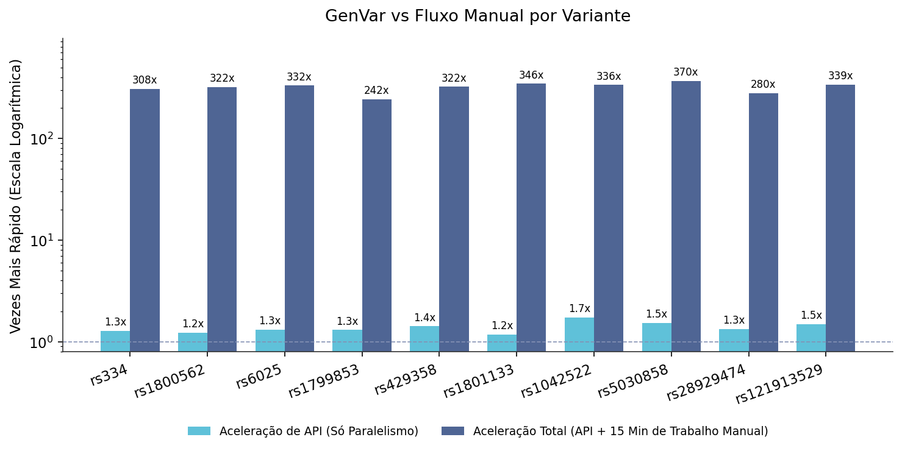

**Figura 1. Aceleração da consulta única do GenVar frente ao fluxo manual, por variante.** O eixo horizontal lista as dez variantes do conjunto; o vertical, em escala logarítmica, mostra quantas vezes o GenVar é mais rápido. A barra azul-escura (aceleração total) compara o GenVar ao fluxo manual completo, somando o tempo das APIs e a estimativa de 15 minutos de leitura e transcrição humana por variante, e fica entre 242 e 370 vezes. A barra azul-clara (aceleração de API) isola o tempo de máquina: a execução paralela do GenVar contra a soma sequencial das chamadas, de 1,18 a 1,74 vez. A linha tracejada marca o valor 1, sem ganho.

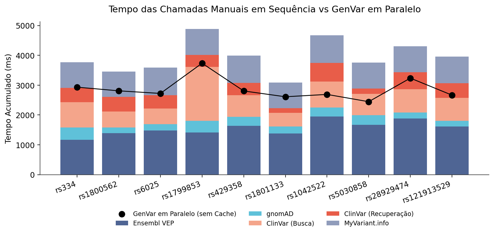

**Figura 2. Composição do tempo no fluxo manual sequencial e o tempo do GenVar em paralelo, por variante.** Cada barra empilhada decompõe o tempo de máquina de consultar manualmente as APIs de uma variante: Ensembl VEP, gnomAD, busca e recuperação no ClinVar e MyVariant.info. O ponto preto sobre cada barra marca o tempo do GenVar executando as mesmas chamadas em paralelo. A distância entre o topo da barra e o ponto é o ganho da paralelização; o tamanho do segmento do Ensembl VEP mostra que essa é a etapa mais lenta e limita o ganho.

A mesma comparação foi medida para os dez genes do conjunto, com a diferença de que o endpoint de gene executa um trabalho que o somatório manual das APIs não faz: além de consultar Ensembl, gnomAD, UniProt e AlphaFold, ele agrega o conjunto completo de variantes do gene (dezenas de milhares) para calcular contagens e a distribuição posicional. A soma sequencial das consultas manuais ficou entre 4,1 e 13,3 segundos de tempo de máquina, dominada pela etapa de overlap de variantes do Ensembl (1,6 a 10,6 segundos, função do número de variantes do gene). A consulta integrada do GenVar respondeu em 3,6 a 14,0 segundos sem cache, com aceleração de API entre 0,87 e 1,19 vez, próxima de 1. O paralelismo rende pouco aqui porque a etapa de overlap domina o tempo e a agregação das variantes ocorre no servidor depois dela; o ganho do lado gene não está na execução paralela sem cache, mas na integração das quatro bases (Ensembl, gnomAD, UniProt e AlphaFold) em uma chamada, na distribuição posicional que o fluxo manual não produz, no cache (Figura 4) e na comparação com o fluxo manual completo, de 65 a 254 vezes incluindo a leitura humana.

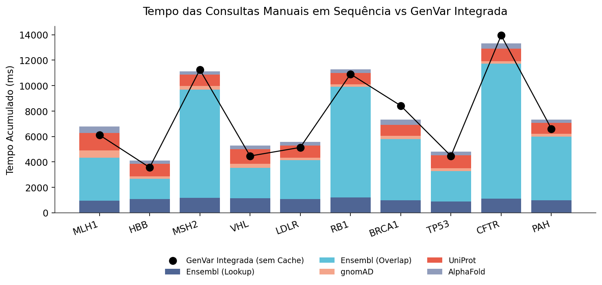

**Figura 3. Composição do tempo no fluxo manual sequencial e o tempo do GenVar integrado, por gene.** Cada barra empilhada decompõe o tempo de máquina de consultar manualmente as APIs de um gene: lookup e overlap de variantes no Ensembl, restrição no gnomAD, identificador no UniProt e estrutura no AlphaFold. O ponto preto marca o tempo do GenVar integrado, sem cache. O segmento de overlap do Ensembl (azul-claro) domina e acompanha o número de variantes do gene (maior em MSH2, RB1 e CFTR). O ponto fica próximo ou acima do topo da barra porque o GenVar, além das mesmas chamadas, agrega no servidor todas as variantes do gene para compor a distribuição posicional, trabalho ausente do somatório manual.

O tratamento de entradas inválidas foi medido na suite `errors`, com 14 casos. A validação retorna o código HTTP 422 para formato inválido (caracteres especiais, cadeia longa demais, apenas dígitos, ausência do prefixo `rs`, letras no rs ID) e o código 404 para identificadores bem formados porém inexistentes (`FAKEGENE123`, `rs0`). Variações de caixa são aceitas: `mlh1` e `mLh1` retornam 200. Três casos retornaram código diferente do previsto pelo teste, todos com comportamento defensável: `ACTB_MOUSE` foi rejeitado como formato HGNC inválido (422) por conter sublinhado; `RS334` em maiúsculas foi aceito (200); e um rs ID com 20 dígitos passou na validação de formato e retornou 404 por não existir. Nenhum caso produziu erro de servidor (5xx).

O retorno parcial foi implementado: quando uma fonte está indisponível, a resposta é populada com os dados das demais e indica quais fontes não puderam ser consultadas, sem interromper a requisição.

## Cache em memória com expiração diferenciada (objetivo iii)

A camada de cache em Redis com políticas de tempo de vida (Time To Live, TTL) diferenciadas por tipo de dado produziu o maior ganho de desempenho atribuível à plataforma. Comparando a chamada sem cache (a mais lenta da fase fria, que corresponde à única consulta efetivamente sem cache de cada alvo) com a média das chamadas em cache, a aceleração ficou entre 229 e 842 vezes. Para genes, a resposta em cache levou 16 a 19 milissegundos contra 3,7 a 14,4 segundos da primeira chamada fria; para variantes, cerca de 6 milissegundos contra 2,4 a 4,2 segundos.

O tempo frio elevado dos genes decorre de uma decisão de projeto: o endpoint de gene agrega o conjunto completo de variantes da fonte (por exemplo, 119.372 variantes para o gene MSH2) para calcular contagens e a distribuição posicional corretas, em vez de uma amostra do início do gene. O custo dessa completude recai apenas na primeira consulta; o cache amortiza as consultas seguintes.

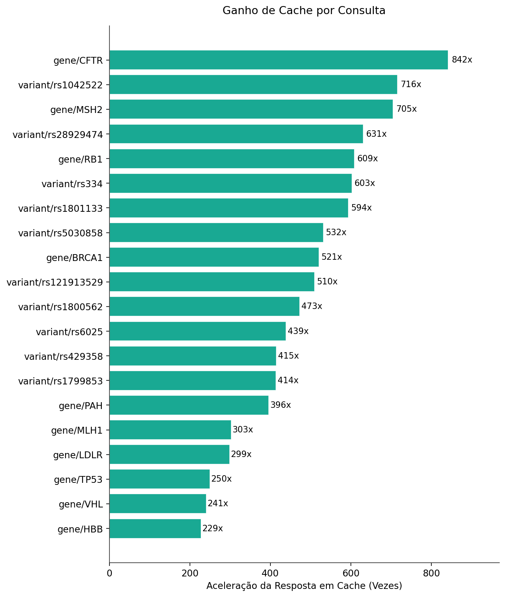

**Figura 4. Ganho de desempenho do cache por consulta.** Barras horizontais ordenadas pela aceleração, medida como o tempo da chamada sem cache (a mais lenta da fase fria) dividido pela média das chamadas em cache. O ganho vai de 229 vezes (gene HBB) a 842 vezes (gene CFTR).

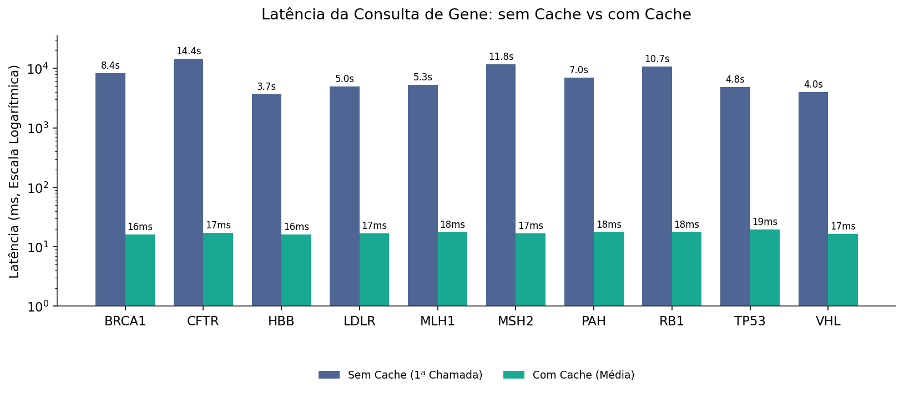

**Figura 5. Latência da consulta de gene, sem cache e com cache.** Eixo vertical em escala logarítmica (milissegundos). A barra azul é a primeira chamada, sem cache, que agrega o conjunto completo de variantes do gene a partir das APIs externas (3,7 a 14,4 segundos). A barra verde é a média das chamadas seguintes, servidas do cache (16 a 19 milissegundos).

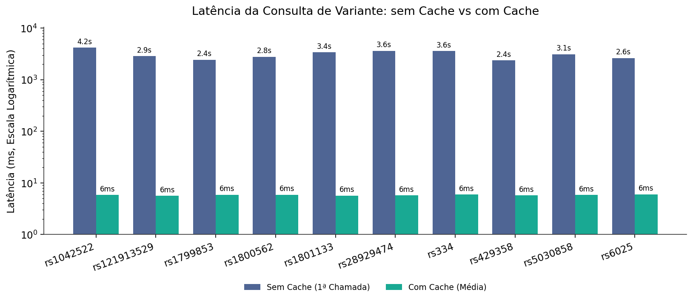

**Figura 6. Latência da consulta de variante, sem cache e com cache.** Mesma leitura da Figura 5 para as variantes: a primeira chamada leva de 2,4 a 4,2 segundos e as chamadas em cache, cerca de 6 milissegundos.

## Comportamento sob carga (objetivo i, complemento)

A suite `exhaustion` mediu requisições sequenciais frias e rajadas concorrentes. Em rajadas de 5, 10 e 20 requisições simultâneas com dados em cache, todas as respostas voltaram entre 16 e 42 milissegundos, com 100% de sucesso (código 200) e nenhum erro. A fase sequencial fria usou um subconjunto de três genes e três variantes, em três taxas de requisição (0,5, 1 e 2 por segundo), com latência entre 4,0 e 6,7 segundos para genes e entre 2,6 e 3,4 segundos para variantes. Esse subconjunto não inclui os genes de maior volume; o tempo frio máximo do conjunto completo (14,4 segundos, gene CFTR) é o reportado pela suite de latência (Figura 5).

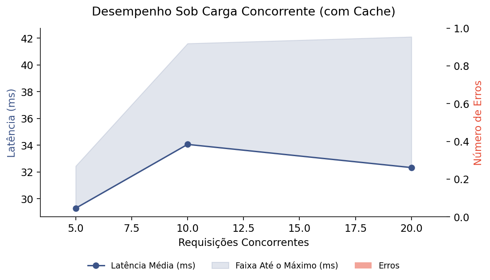

**Figura 7. Comportamento sob rajadas concorrentes, com cache aquecido.** O eixo horizontal é o número de requisições simultâneas (5, 10 e 20); a linha azul é a latência média e a faixa sombreada vai até a latência máxima. As barras vermelhas contam erros, que permaneceram em zero. Mesmo com 20 requisições simultâneas, as respostas ficaram entre 16 e 42 milissegundos.

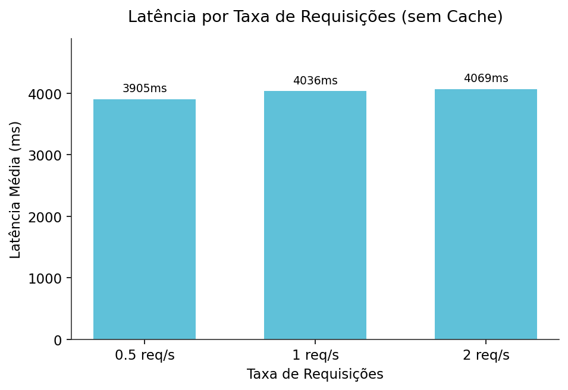

**Figura 8. Latência por taxa de requisições sem cache.** Latência média das consultas em três taxas sequenciais (0,5, 1 e 2 requisições por segundo), sobre um subconjunto de três genes e três variantes, todas sem cache, refletindo o custo das chamadas às APIs externas.

## Consolidação e completude dos dados (objetivo ii)

A suite `completeness` mediu a fração de campos preenchidos por resposta. As consultas de gene retornaram 29 de 29 campos preenchidos (100%) nos dez genes do conjunto. As consultas de variante preencheram em média 71,9% dos 48 campos (56,2% a 77,1%); os campos nulos correspondem a escores preditivos opcionais ausentes para algumas variantes nas bases de origem, não a falhas de agregação.

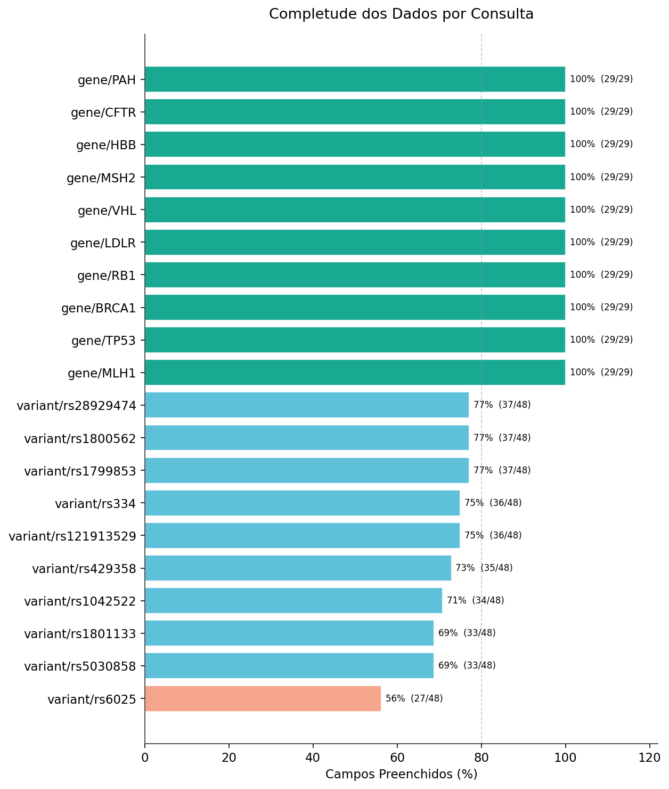

**Figura 9. Completude dos dados por consulta.** Fração de campos preenchidos em cada resposta. As dez consultas de gene preencheram 100% dos 29 campos; as dez consultas de variante preencheram de 56% a 77% dos 48 campos, com os campos vazios correspondendo a escores preditivos opcionais ausentes na fonte de origem. A linha tracejada marca 80%.

A suite `payload` comparou o número de campos do GenVar com o de cada fonte individual, por variante. A contagem bruta de campos não é uma medida adequada de valor informacional: o MyVariant.info devolve até 431 campos brutos aninhados por variante, com duplicações por transcrito, e por isso foi excluído da comparação; seus escores de patogenicidade continuam integrados pela plataforma. Entre as fontes com contagem normalizada comparável, o ClinVar retorna de 57 a 63 campos, o Ensembl VEP de 36 a 39 e o gnomAD até 17, cada um restrito ao seu domínio. O GenVar consolida três bases primárias (Ensembl VEP, gnomAD, ClinVar) e o agregador MyVariant.info em 31 a 41 campos normalizados, de um esquema de 48 campos no total, numa resposta única que substitui de três a quatro consultas separadas. O valor da plataforma está na normalização de escores heterogêneos e na consolidação em uma vista, não na maximização da contagem de campos. Essa comparação é reportada apenas em texto, sem figura: a contagem bruta de campos por fonte não traduz valor informacional e induziria leitura equivocada.

## Visualizações interativas (objetivo ii)

O frontend implementa as modalidades de visualização previstas: projeção geográfica das frequências alélicas por população do gnomAD, gráfico de barras das frequências em escala logarítmica, gráfico radar dos escores de patogenicidade, distribuição posicional das variantes classificadas ao longo do gene, ideograma cromossômico, painel de mudança molecular (referência contra variante, no DNA e na proteína) e renderização tridimensional interativa da estrutura do AlphaFold via biblioteca NGL. Cada tela de gene reúne quatro bases primárias (Ensembl, gnomAD, UniProt e AlphaFold) e cada tela de variante reúne três bases primárias (Ensembl, gnomAD e ClinVar) mais o agregador de escores MyVariant.info, em uma vista única.

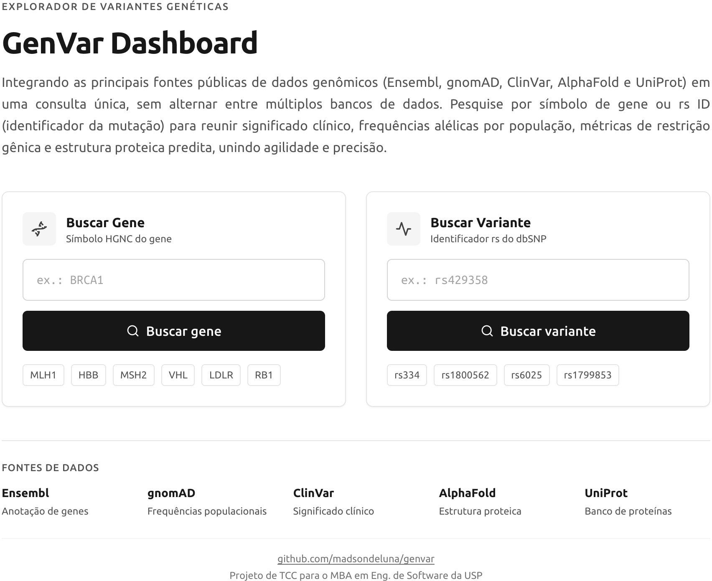

**Figura 10. Página inicial.** Busca por símbolo de gene e por identificador de variante (rs ID), com exemplos de acesso rápido e a lista das cinco fontes públicas integradas (Ensembl, gnomAD, ClinVar, AlphaFold e UniProt).

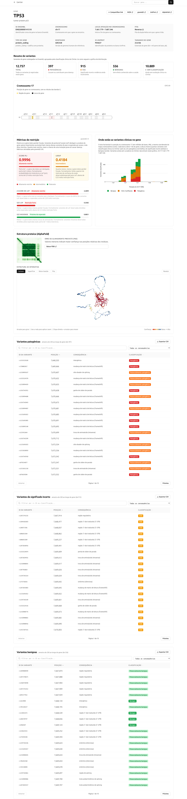

**Figura 11. Página de gene (TP53).** Metadados do gene, resumo de variantes por classificação clínica (significância do ClinVar, presente na resposta do Ensembl), ideograma do cromossomo, distribuição posicional das variantes ao longo do gene, métricas de restrição do gnomAD, estrutura proteica predita do AlphaFold em renderização tridimensional e as tabelas de variantes patogênicas e de significado incerto.

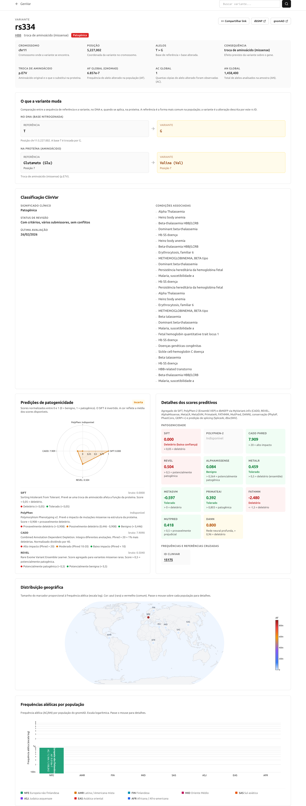

**Figura 12. Página de variante (rs334).** Classificação clínica do ClinVar, painel de mudança molecular (referência contra variante, no DNA e na proteína), predições de patogenicidade em gráfico radar, detalhes dos escores preditivos, distribuição geográfica das frequências alélicas e frequências por população do gnomAD.

## Testes automatizados (objetivo iv)

A bateria reúne 26 testes automatizados sob pytest, em duas frentes: 14 testes unitários, com objetos simulados (mocks) das APIs, que validam a camada de parsing e normalização dos seis módulos de serviço; e 12 testes de integração, que exercitam o caminho completo contra as APIs ao vivo. Os testes unitários cobrem a transformação das respostas de cada fonte no esquema interno da plataforma, com cobertura na camada de parsing chegando a 92% no ClinVar, 88% no UniProt e 83% no AlphaFold. A camada de roteamento e orquestração é validada de ponta a ponta pela bateria de benchmarks, que exercita os dois endpoints sobre o conjunto padrão de 10 genes e 10 variantes.

## Containerização (objetivo v)

A solução é dividida em três serviços orquestrados por Docker Compose: backend, frontend e Redis. O frontend usa build em múltiplos estágios (imagem node:20-alpine para compilar e nginx:alpine para servir), reduzindo a imagem final ao conteúdo estático. O Redis (imagem redis:7-alpine) tem verificação de saúde (healthcheck) a cada 5 segundos e volume nomeado para persistência. O backend parte da imagem python:3.12-slim. O versionamento usa Git em repositório público no GitHub, e a implantação é configurada para a plataforma Render pelo arquivo `render.yaml`.

## Síntese dos resultados quantitativos

| Métrica | Valor medido | Fonte |
|---|---|---|
| Aceleração por cache (frio real / quente) | 229x a 842x | `latency_stats.csv` |
| Resposta em cache, gene | 16 a 19 ms | `latency_stats.csv` |
| Resposta em cache, variante | cerca de 6 ms | `latency_stats.csv` |
| Tempo frio, gene (chamada sem cache) | 3,7 a 14,4 s | `latency_stats.csv` |
| Aceleração paralelo vs sequencial (API), variante | 1,18x a 1,74x | `comparison.csv` |
| Aceleração paralelo vs sequencial (API), gene | 0,87x a 1,19x | `comparison_gene.csv` |
| Total vs fluxo manual completo, variante | 242x a 370x | `comparison.csv` |
| Total vs fluxo manual completo, gene | 65x a 254x | `comparison_gene.csv` |
| Cache vs APIs brutas sequenciais | 363x a 860x | `comparison.csv` |
| Concorrência (rajadas 5-20), sucesso | 100%, 16 a 42 ms | `exhaustion.csv` |
| Completude, gene | 100% (29/29 campos) | `completeness.csv` |
| Completude, variante | 71,9% média | `completeness.csv` |
| Consolidação de fontes, variante | 3 bases + MyVariant.info em 31 a 41 campos normalizados | `payload.csv` |
| Robustez a entradas inválidas | 11/14 conforme o esperado, 0 erros 5xx | `errors.csv` |
| Testes automatizados | 26 (14 unitários, 12 integração) | pytest |

## Discussão dos resultados

Os números medidos separam o que a plataforma entrega do que depende de serviços de terceiros. A latência da primeira consulta é determinada pelas APIs externas: para variantes, o Ensembl VEP responde em 1,17 a 1,95 segundo e domina o tempo total; para genes, a etapa de overlap de variantes do Ensembl chega a 10,6 segundos nos genes de maior volume (CFTR, MSH2, RB1). A plataforma não acelera essas chamadas. O ganho atribuível ao GenVar aparece em duas frentes: a consolidação das fontes em uma única requisição e o cache.

A consolidação em uma chamada substitui a sequência de consultas manuais que um pesquisador faria base a base. Para variantes, a execução paralela rende de 1,18 a 1,74 vez sobre a soma sequencial, limitada pela API mais lenta do conjunto. Para genes, a aceleração de máquina fica próxima de 1 (0,87 a 1,19 vez): o paralelismo tem pouco a ganhar porque a etapa de overlap domina o tempo e a agregação das variantes ocorre no servidor depois dela. O valor do endpoint de gene, portanto, não está na execução paralela, e sim em três pontos que o fluxo manual não reproduz: a integração das quatro bases primárias em uma resposta única, a distribuição posicional calculada sobre o conjunto completo de variantes do gene (dezenas de milhares, até 150 mil em CFTR) e o cache.

O cache é o maior ganho de desempenho da plataforma, de 229 a 842 vezes sobre a primeira chamada. A política de tempo de vida diferenciada por tipo de dado faz a segunda consulta a um gene cair de até 14,4 segundos para 16 a 19 milissegundos, e a de uma variante de até 4,2 segundos para cerca de 6 milissegundos. Esse comportamento sustenta o uso interativo: sob rajadas de até 20 requisições simultâneas com dados em cache, a plataforma manteve 100% de sucesso e latência de 16 a 42 milissegundos, sem erros.

A completude e a robustez confirmam a maturidade do protótipo. As consultas de gene preencheram 100% dos campos; as de variante, 71,9% em média, com os campos vazios correspondendo a escores preditivos opcionais ausentes na fonte de origem, e não a falhas de agregação. As 14 entradas inválidas ou limítrofes foram tratadas sem nenhum erro de servidor (código 5xx), com os três casos divergentes do esperado mostrando comportamento defensável de validação. Sobre a consolidação de dados, a contagem bruta de campos não traduz valor informacional: o MyVariant.info devolve centenas de campos brutos aninhados que o GenVar normaliza, junto às demais fontes, em 31 a 41 campos de esquema único por variante. O valor está na normalização e na vista única, não no número de campos.

## Ressalva metodológica

Na suite de latência, o Redis é esvaziado uma vez no início da fase fria e cada alvo é consultado 12 vezes; apenas uma consulta de cada alvo é genuinamente sem cache, e as demais leem do cache. Por isso, o tempo frio reportado vem da consulta mais lenta da fase fria de cada alvo (`latency_stats.csv`, coluna `max`), e não da média da fase fria, que mistura uma chamada fria com onze quentes e a subestima. A mesma distinção vale para a aceleração por cache: ela compara essa chamada fria genuína com a média das chamadas em cache, não a média da fase fria com a quente. Esse cálculo está no algoritmo `03_aceleracao_cache.py`, reproduzido nos apêndices.

## Reprodutibilidade e algoritmos

Todas as medições são produzidas por código versionado e podem ser reproduzidas a partir dos mesmos alvos. A bateria é orquestrada pelo algoritmo `run_benchmarks.py`, que executa as seis suites de medição (`latency`, `comparison`, `exhaustion`, `errors`, `completeness` e `payload`) sobre o conjunto padrão definido em `suites/_targets.py` e grava os resultados em arquivos CSV; a partir desses arquivos, `plot_results.py` deriva as figuras. Três algoritmos auxiliares sustentam a padronização: `01_validar_conjunto_teste.py` confere a completude dos vinte alvos antes de medir; `02_extrair_coordenadas.py` resolve as coordenadas GRCh38 das variantes; e `03_aceleracao_cache.py` calcula o fator de aceleração por cache, tomando a chamada mais lenta da fase fria como linha de base sem cache. Os algoritmos citados estão reproduzidos nos apêndices, com comentários descritivos em português.

## Limitações

O conjunto de teste é um MVP de 10 genes e 10 variantes, escolhido por cobertura e diversidade, e não uma amostra estatística das bases. As medições vêm de uma única máquina (Apple M2, 8 GB) e carregam a variância das APIs de terceiros, observada na dispersão dos tempos frios. A aceleração total sobre o fluxo manual completo (242 a 370 vezes para variantes, 65 a 254 vezes para genes) incorpora uma estimativa de 900 segundos de leitura e transcrição humana por consulta; para genes esse valor é uma extrapolação conservadora, pois a referência de curadoria do ClinGen é por variante. O tempo frio elevado dos genes é uma consequência direta da decisão de agregar o conjunto completo de variantes; o cache amortiza esse custo a partir da segunda consulta, mas a primeira chamada a um gene de alto volume permanece na faixa de segundos.
